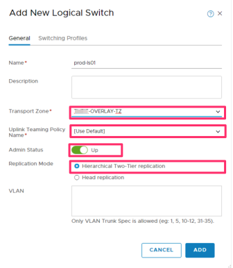
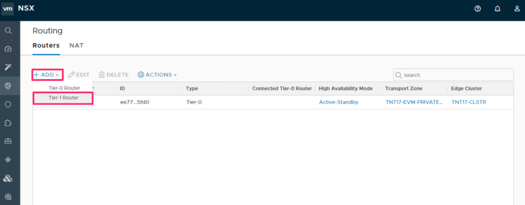
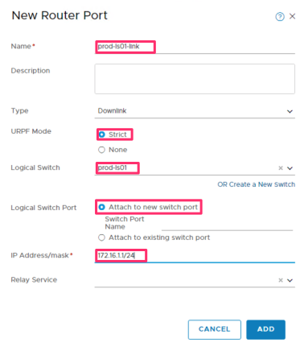
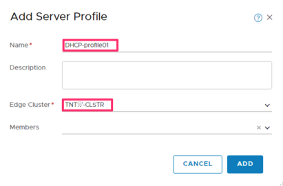
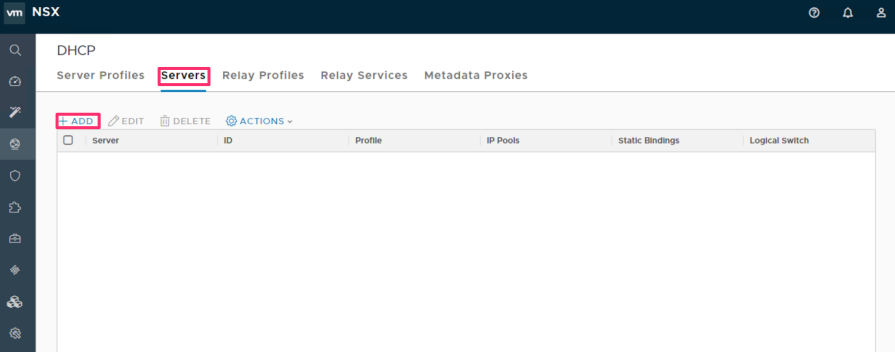
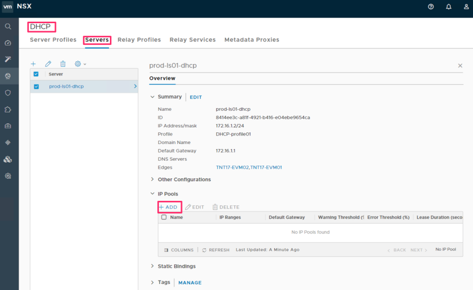
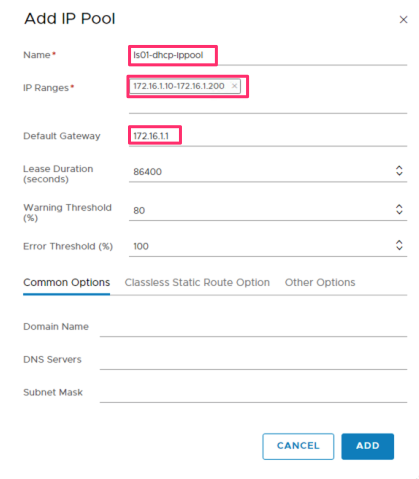

# Tutorial: Create an NSX-T network on an Azure VMware Solution by Virtustream private cloud

AVS by Virtustream private clouds provide Azure-based environments to run VMware workload virtual machines (VMs). With AVS by Virtustream, you can quickly create networks to deploy or migrate VMs. In this tutorial, part four of seven, an NSX-T T1 router and logical switch with DHCP services are deployed in a private cloud. Using NSX-T Manager, you learn how to:

> [!div class="checklist"]
> * Create a logical switch
> * Create a T1 router
> * Add the logical switch to a port on the router
> * Add DHCP services to the logical switch

## Prerequisites

In previous tutorials, a private cloud was deployed in Azure, access to vCenter and NSX-T manager was established, and a VM template was uploaded to vCenter. If you haven't performed these steps and want to follow along step-by-step, start at [Tutorial 1 – Create a private cloud][tutorials-create-private-cloud].

This tutorial requires that you have access to vCenter and NSX-T Manager in your private cloud. If you need to establish access, see [Tutorial 3 -- Access private cloud][tutorial-access-private-cloud].

Ensure that you have the IP address and admin credentials for the NSX-T Manager. These were provided when the private cloud was deployed and are accessible under the private cloud resource overview Admin details in the Portal.

Using a browser, navigate to the IP address of the NSX-T Manager and sign in as the "admin" user.

On the NSX-T manager home page, ensure it matches this initial configuration on first access after a private cloud is provisioned:

## Create a logical switch

Select **Networking > Switching**.

Select **+ ADD** and in the form enter a name for the logical switch.
Select the **TNTXX-OVRLAY-TZ** Transport Zone.
Select **Use Default**.
Enter an Uplink Teaming Policy Name.
Select Admin Status of **Up**.
Select **Hierarchical Two-Tier replication**.

Select the **ADD** button to show results.

## Create a T1 router

Select **Networking > Routers**.

Select **+ ADD**, and then select **Tier-1 Router**.
Enter a **Name** and select **Non-preemptive** Failover Mode.

> [!NOTE]
> There is only a single Tier-0 Router and a single Edge Cluster to select.

Select **ADD**.

## Add the Logical Switch to a port on the T1 router

Select **Networking > Routers** and then choose the T1 router that was just created.

> [!WARNING]
> Never select or edit the T0 router.

Select **Configuration > Router Ports**"**.
Select **+ ADD**.

Complete the form with a new name for the router port, the **Logical Switch** name created in a previous section, an **IP address/mask** in CIDR notation, and the following selections for **Type**, **URPF Mode**, and **Logical Switch Port**.

Select **ADD**.

## Add DHCP service to the logical switch

Select **Networking > DHCP > Server Profiles**.
Select **+ ADD**.
Enter a **Name** and select the **Edge Cluster** on the form.

Select **ADD**.

Use this profile to create a DHCP server for the logical switch.

Select **Networking > DHCP > Servers**.
Select **+ ADD** to add a DHCP server. Enter a name and other details on the form.

Select "+ ADD", choose Tier-1 Router, and then enter a name and other details in the form (what's shown are examples):

Select **ADD**.

Select the new DHCP server in **DHCP > Servers**.
Select **IP Pools > + ADD**.
Enter the required information in the form.

Select **ADD**.

Select **Actions (the gear icon) > Attach to Logical Switch**.

Select the new **Logical Switch** from the pulldown list.
Select **ATTACH**.

With DHCP services enabled on the NSX-T logical switch, virtual machines deployed on the network can now receive a default gateway and an IP address.

## Next steps

[Deploy a virtual machine on the NSX-T logical switch network.][tutorials-deploy-vm]

<!-- LINKS - external-->

<!-- LINKS - internal -->
[tutorials-deploy-vm]: ./tutorials-deploy-vm.md