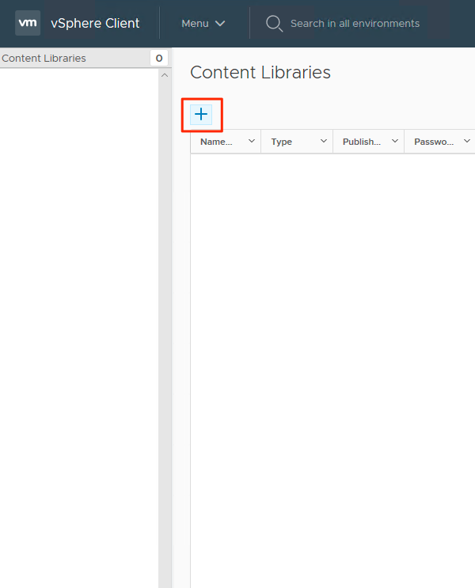

# Tutorial: Deploy a VM in an Azure VMware Solution by Virtustream (AVSV) private cloud

In this tutorial, you create a virtual machine (VM) and attach it to an NSX-T logical switch network segment.

You learn how to:
> [!div class="checklist"]
> * Create a content library
> * Upload an ISO to the content library
> * Build a VM using an ISO the Content Library

## Prerequisties

An NSX-T logical switch segment created in a [previous tutorial](tutorials-create-t1-ls.md) is required to complete this tutorial.

## Create Content Library

1. Using the HTML5 interface, sign on to your private cloud vCenter instance. (HTML5 Interface)
    1. https://IPAddressofyourVCSA/ui
1. Select **Menu > Content Libraries**
    *  
1. Select **+** to create a new content library.
    *  
1. Specify a name and confirm the IP address of the vCenter server. Select **NEXT**.
    *  
1. Select **Local content library > NEXT**.
    *  
1. Select the datastore that will store your content library, then select **NEXT**.
    *   
1. Review and verify the content library settings, select **FINISH**.
    *   

## Upload an ISO image to the content library

1. Sign on to vCenter in your private cloud with the HTML5 interface.
1. Select **Menu > Content Libraries**
1. Select the content library you will use for a new ISO.
1. Select **Actions... > Import Item**
1. Define a URL you'd like to download an ISO from or select "Local File" to upload from your local system.
    1. Optional, define a custom item name and notes.
1. Select **Import**.
1. To verify that your ISO uploaded, check recent tasks or the **Other Types** tab.
    1. A successfully uploaded ISO will be listed for **Other Types**

## Deploy a VM to a private cloud cluster
1. Sign on to vCenter in your private cloud with the HTML5 interface.
1. Select **Menu > Hosts and Clusters**
1. Expand the tree in left panel and select a cluster.
1. Select **Actions > New Virtual Machine...**
1. Use the wizard up to step 7, modifying settings as desired.
1. In step 7, select **New CD/DVD Drive > Client Device > Content Library ISO File**
1. Select the **ISO > OK**
1. Check the **Connect...** box so the ISO is mounted at power on time.
1. Select **New Network > Select dropdown > Browse...**
1. Select the **logical switch (segment) > OK**
1. Modify any other hardware settings as desired.
1. Select **Next**.
1. Verify the settings in step 8, select **Finish**.

## Next steps

The next step is to [create additional NSX-T networks](tutorials-create-t1-ls.md).

<!-- LINKS - external-->

<!-- LINKS - internal -->
