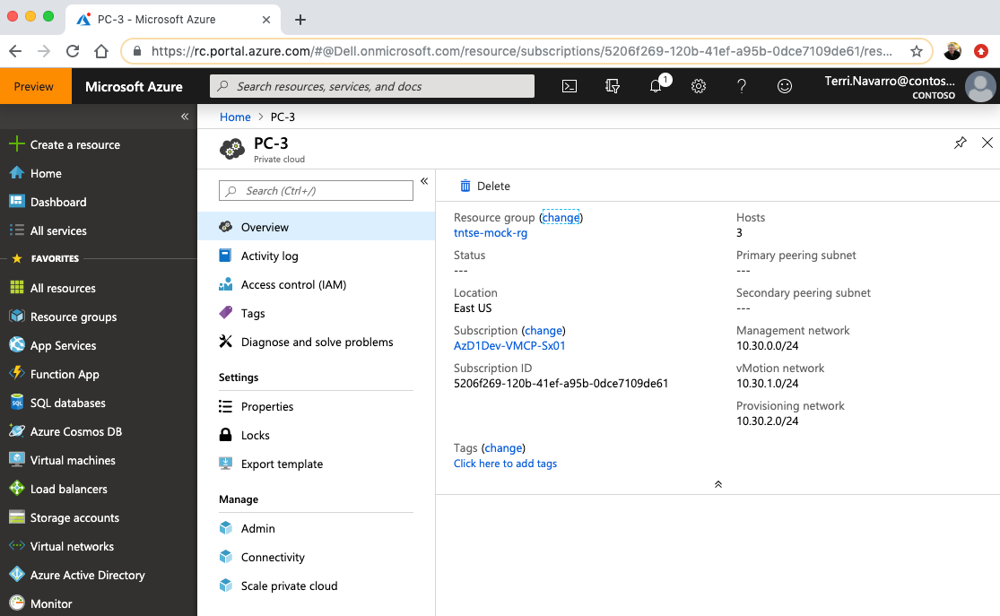
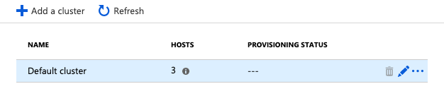
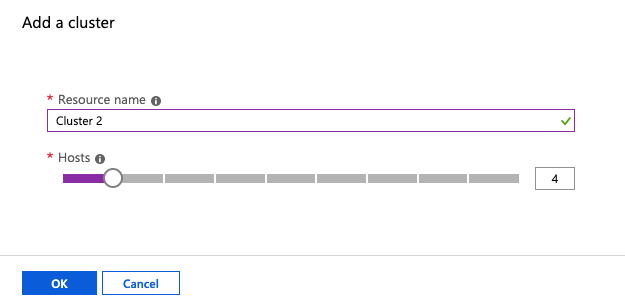
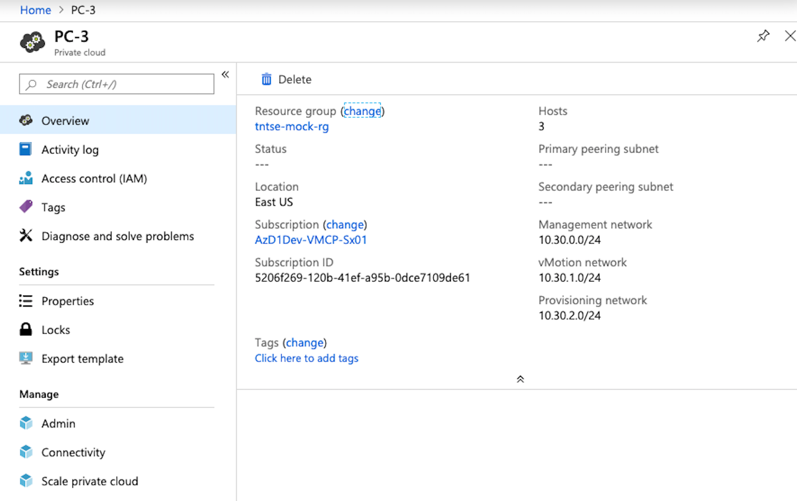
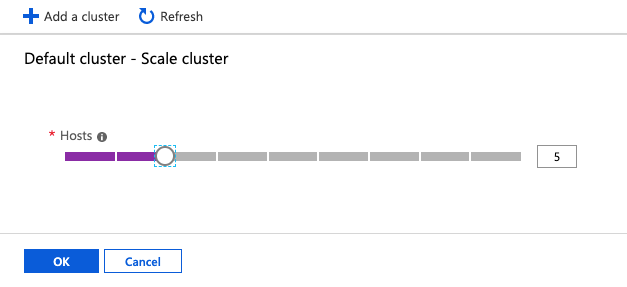

# Tutorial: scale an Azure VMware Solution by Virtustream private cloud

You can scale the number of clusters and the number of hosts in a private cloud. The cluster and host limits in a private cloud are provided in [the private cloud concept article](concepts-private-clouds-clusters.md).

In this tutorial, you use the Azure portal to:

> [!div class="checklist"]
> * Add a cluster to an existing private cloud
> * Add hosts to an existing cluster

## Prerequisites

You need a private cloud to complete this tutorial. If you haven't yet created a private cloud, use the [create a private cloud tutorial](tutorials-create-private-cloud.md) to create a private cloud.

## Scale a private cloud

On the overview page of an existing private cloud, select **Scale private cloud**.

Select **Add a cluster**.

In the **Add cluster** form, enter a name, and use the slider to select the number of hosts. Select **OK**.

The deployment of the new cluster will begin.

## Scale a cluster in a private cloud 

On the overview page of an existing private cloud, select **Scale private cloud**.

In the **Add cluster** form, enter a name, and use the slider to select the number of hosts. Select **OK**.

The addition of hosts to the cluster will begin.

## Next steps

If you require another AVS by Virtustream private cloud, [create another private cloud](tutorials-create-private-cloud.md).

<!-- LINKS - external-->

<!-- LINKS - internal -->
