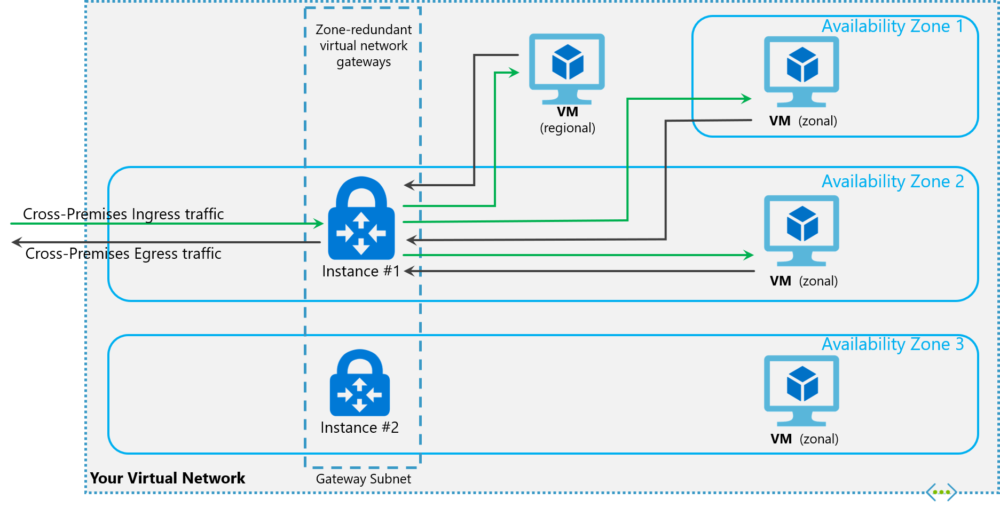
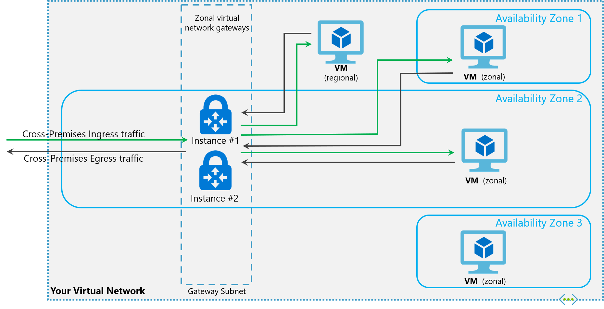

# About zone-redundant virtual network gateways in Azure Availability Zones

You can deploy VPN and ExpressRoute gateways in [Azure Availability Zones](../availability-zones/az-overview.md). This brings resiliency, scalability, and higher availability to virtual network gateways. Deploying gateways in Azure Availability Zones physically and logically separates gateways within a region, while protecting your on-premises network connectivity to Azure from zone-level failures.

### Zone-redundant gateways

To automatically deploy your virtual network gateways across availability zones, you can use zone-redundant virtual network gateways. With zone-redundant gateways, you can benefit from zone-resiliency to access your mission-critical, scalable services on Azure.

 
 

### Zonal gateways

To deploy gateways in a specific zone, you can use zonal gateways. When you deploy a zonal gateway, all instances of the gateway are deployed in the same Availability Zone.

 
 

## Gateway SKUs

Zone-redundant and zonal gateways are available as new gateway SKUs. We have added new virtual network gateway SKUs in Azure AZ regions. These SKUs are similar to the corresponding existing SKUs for ExpressRoute and VPN Gateway, except that they are specific to zone-redundant and zonal gateways.

The new gateway SKUs are:

### VPN Gateway

* VpnGw1AZ
* VpnGw2AZ
* VpnGw3AZ

### ExpressRoute

* ErGw1AZ
* ErGw2AZ
* ErGw3AZ

## Public IP SKUs

Zone-redundant gateways and zonal gateways both rely on the Azure public IP resource *Standard* SKU. The configuration of the Azure public IP resource determines whether the gateway that you deploy is zone-redundant, or zonal. If you create a public IP resource with a *Basic* SKU, the gateway will not have any zone redundancy, and the gateway resources will be regional.

### Zone-redundant gateways

When you create a public IP address using the **Standard** public IP SKU without specifying a zone, the behavior differs depending on whether the gateway is a VPN gateway, or an ExpressRoute gateway. 

* For a VPN gateway, the two gateway instances will be deployed in any 2 out of these three zones to provide zone-redundancy. 
* For an ExpressRoute gateway, since there can be more than two instances, the gateway can span across all the three zones.

### Zonal gateways

When you create a public IP address using the **Standard** public IP SKU and specify the Zone (1, 2, or 3), all the gateway instances will be deployed in the same zone.

### Regional gateways

When you create a public IP address using the **Basic** public IP SKU, the gateway is deployed as a regional gateway and does not have any zone-redundancy built into the gateway.

## FAQ

### What will change when I deploy these new SKUs?

From your perspective, you can deploy your gateways with zone-redundancy. This means that all instances of the gateways will be deployed across Azure Availability Zones, and each Availability Zone is a different fault and update domain. This makes your gateways more reliable, available, and resilient to zone failures.

### Can I use the Azure portal?

Yes, you can use the Azure portal to deploy the new SKUs. However, you will see these new SKUs only in those Azure regions that have Azure Availability Zones.

### What regions are available for me to use the new SKUs?

The new SKUs are available in Azure regions that have Azure Availability Zones - Central US, France Central, and West Europe regions. Going forward, we will make the Zone-Redundant Gateways available to you in other Azure Public Regions.

### Can I change/migrate/upgrade my existing virtual network gateways to zone-redundant or zonal gateways?

Migrating your existing virtual network gateways to zone-redundant or zonal gateways is currently not supported. You can, however, delete your existing gateway and re-create a zone-redundant or zonal gateway.

### Can I deploy both VPN and Express Route gateways in same virtual network?

Co-existence of both VPN and Express Route gateways in the same virtual network is supported. However, you should reserve a /27 IP address range for the gateway subnet.

## Next Steps

[Create a zone-redundant virtual network gateway](create-zone-redundant-vnet-gateway.md)