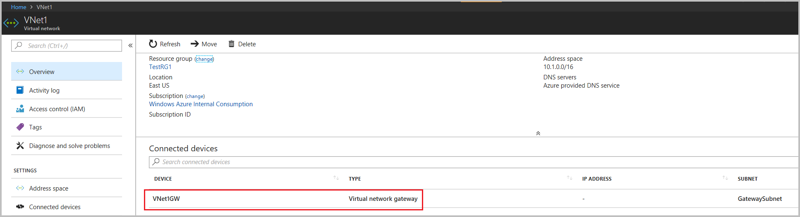
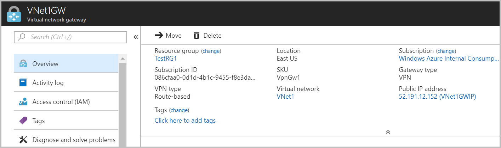

# Create a route-based VPN gateway using the Azure portal

This article helps you quickly create a route-based Azure VPN gateway using the Azure portal.  A VPN gateway is used when creating a VPN connection to your on-premises network. You can also use a VPN gateway to connect VNets. 

The steps in this article will create a VNet, a subnet, a gateway subnet, and a route-based VPN gateway (virtual network gateway). Once the gateway creation has completed, you can then create connections. These steps require an Azure subscription. If you don't have an Azure subscription, create a [free account](https://azure.microsoft.com/free/?WT.mc_id=A261C142F) before you begin.

## Create a virtual network

[!INCLUDE [Basic Point-to-Site VNet](../../includes/vpn-gateway-basic-vnet-rm-portal-include.md)]

## Configure and create the gateway

In this step, you create the virtual network gateway for your VNet. Creating a gateway can often take 45 minutes or more, depending on the selected gateway SKU.

[!INCLUDE [About gateway subnets](../../includes/vpn-gateway-about-gwsubnet-portal-include.md)]

[!INCLUDE [Create a gateway](../../includes/vpn-gateway-add-gw-rm-portal-include.md)]

>[!NOTE]
>The Basic gateway SKU does not support IKEv2 or RADIUS authentication. If you plan on having Mac clients connect to your virtual network, do not use the Basic SKU.

[!INCLUDE [NSG warning](../../includes/vpn-gateway-no-nsg-include.md)]

## View the VPN gateway

1. After the gateway is created, navigate to VNet1 in the portal. The VPN gateway appears on the Overview page as a connected device.

   

2. In the device list, click **VNet1GW** to view more information.

   

## Next steps

Once the gateway has finished creating, you can create a connection between your virtual network and another VNet. Or, create a connection between your virtual network and an on-premises location.

> [!div class="nextstepaction"]
> [Create a site-to-site connection](vpn-gateway-howto-site-to-site-resource-manager-portal.md)  
> [Create a point-to-site connection](vpn-gateway-howto-point-to-site-resource-manager-portal.md)  
> [Create a connection to another VNet](vpn-gateway-howto-vnet-vnet-resource-manager-portal.md)
