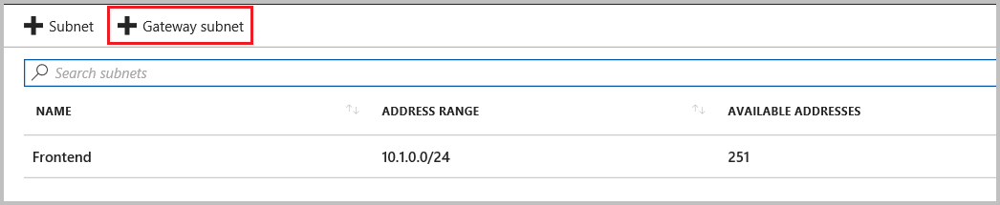
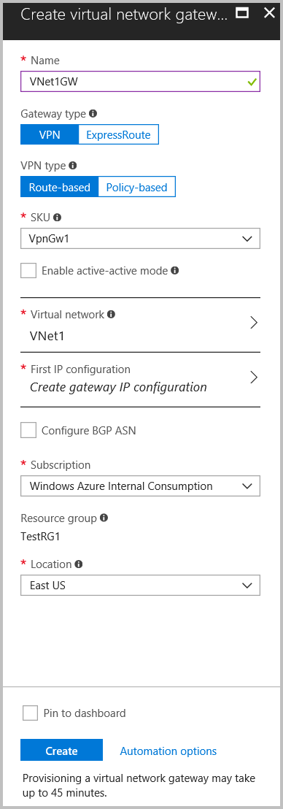
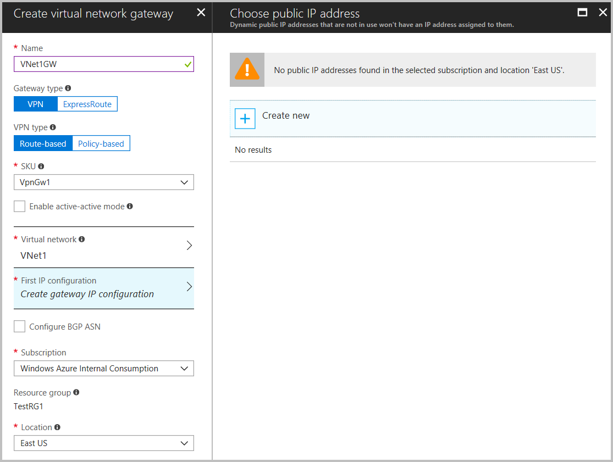

# Create a route-based VPN gateway using the Azure portal

This article helps you quickly create a route-based Azure VPN gateway using the Azure portal.  A VPN gateway is used when creating a VPN connection to your on-premises network. You can also use a VPN gateway to connect VNets. 

The steps in this article will create a VNet, a subnet, a gateway subnet, and a route-based VPN gateway (virtual network gateway). Once the gateway creation has completed, you can then create connections. These steps require an Azure subscription. If you don't have an Azure subscription, create a [free account](https://azure.microsoft.com/free/?WT.mc_id=A261C142F) before you begin.

## Create a virtual network

1. From a browser, navigate to the [Azure portal](http://portal.azure.com) and sign in with your Azure account.
2. Click **Create a resource**. In the **Search the marketplace** field, type 'virtual network'. Locate **Virtual network** from the returned list and click to open the **Virtual Network** page.
3. Near the bottom of the Virtual Network page, from the **Select a deployment model** list, verify that **Resource Manager** is selected from the dropdown, and then click **Create**. This opens the **Create virtual network** page.
4. On the **Create virtual network** page, configure the VNet settings. When you fill in the fields, the red exclamation mark becomes a green check mark when the characters entered in the field are valid. Use the following values:

  - **Name**: TestVNet1
  - **Address space**: 10.1.0.0/16
  - **Subscription**: Verify that the subscription listed is the one you want to use. You can change subscriptions by using the drop-down.
  - **Resource group**: TestRG1
  - **Location**: East US
  - **Subnet**: Frontend
  - **Address range**: 10.1.0.0/24

  
5. After entering the values, select **Pin to dashboard** to make it easy to find your VNet on the dashboard, and then click **Create**. After clicking **Create**, you see a tile on your dashboard that reflects the progress of your VNet. The tile changes as the VNet is being created.

## Add a gateway subnet

The gateway subnet contains the reserved IP addresses that the virtual network gateway services use. Create a gateway subnet.

1. In the portal, navigate to the virtual network for which you want to create a virtual network gateway.
2. On your virtual network page, click **Subnets** to expand **VNet1 - Subnets** page.
3. Click **+Gateway subnet** at the top to open the **Add subnet** page.

  
4. The **Name** for your subnet is automatically filled in with the required value 'GatewaySubnet'. Adjust the auto-filled **Address range** values to match the following values:

  **Address range (CIDR block)**: 10.1.255.0/27

  
5. To create the gateway subnet, click **OK** at the bottom of the page.

## Configure gateway settings

1. On the left side of the portal page, click **+ Create a resource** and type 'Virtual Network Gateway' in the search box, then press **Enter**. In **Results**, locate and click **Virtual network gateway**.
2. At the bottom of the 'Virtual network gateway' page, click **Create** to open the **Create virtual network gateway** page.
3. On the **Create virtual network gateway** page, specify the values for your virtual network gateway.

  - **Name**: Vnet1GW
  - **Gateway type**: VPN 
  - **VPN type**: Route-based
  - **SKU**: VpnGw1
  - **Location**: East US
  - **Virtual network**: Click **Virtual network/Choose a virtual network** to open the **Choose a virtual network** page. Select **VNet1**.

  

## Create a public IP address

A VPN gateway must have a dynamically allocated public IP address. When you create a connection to a VPN gateway, this is the IP address that your on-premises device connects to.

1. Select **First IP configuration Create gateway IP configuration** to request a public IP address.

  
2. On the **Choose public IP page**, click **+ Create new** to open the **Create public IP address** page.
3. Configure the settings with the following values:

  - **Name**: **VNet1GWIP**
  - **SKU**: **Basic**

  
4. Click **OK** at the bottom of this page to save your changes.

## Create the VPN gateway

1. Verify the settings on the **Create virtual network gateway** page. Adjust values if necessary.

  
2. Click **Create** at the bottom of the page.

After you click **Create**, the settings are validated and the **Deploying Virtual network gateway** tile appears on the dashboard. A VPN gateway can take up to 45 minutes. You may need to refresh your portal page to see the completed status.

## View the VPN gateway

1. After the gateway is created, navigate to VNet1 in the portal. The VPN gateway appears on the Overview page as a connected device.

  

2. In the device list, click **VNet1GW** to view more information.

  

## Next steps

Once the gateway has finished creating, you can create a connection between your virtual network and another VNet. Or, create a connection between your virtual network and an on-premises location.

> [!div class="nextstepaction"]
> [Create a site-to-site connection](vpn-gateway-howto-site-to-site-resource-manager-portal.md)  
> [Create a point-to-site connection](vpn-gateway-howto-point-to-site-resource-manager-portal.md)  
> [Create a connection to another VNet](vpn-gateway-howto-vnet-vnet-resource-manager-portal.md)
