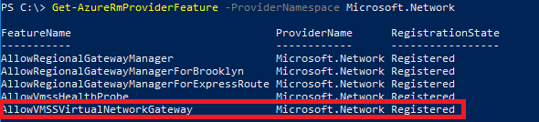

# Create a zone-redundant virtual network gateway in Azure Availability Zones - Preview

You can deploy VPN and ExpressRoute gateways in [Azure Availability Zones](../availability-zones/az-overview.md). This brings resiliency, scalability, and higher availability to virtual network gateways. Deploying gateways in Azure Availability Zones physically and logically separates gateways within a region, while protecting your on-premises network connectivity to Azure from zone-level failures.

Zonal and zone-redundant gateways have fundamental performance improvements over regular virtual network gateways. Additionally, creating a zone-redundant or zonal virtual network gateway is faster than creating other gateways. Rather than taking 45 minutes, create times take approximately 15 minutes for an ExpressRoute gateway, and 19 minutes for a VPN gateway.

### <a name="zrgw"></a>Zone-redundant gateways

To automatically deploy your virtual network gateways across availability zones, you can use zone-redundant virtual network gateways. With zone-redundant gateways, you can harness the 99.99% uptime SLA at GA to access your mission-critical, scalable services on Azure.

<br>
<br>


### <a name="zgw"></a>Zonal gateways

To deploy gateways in a specific zone, you use zonal gateways. When you deploy a zonal gateway, both instances of the gateway are deployed in the same Availability Zone.

<br>
<br>


## <a name="gwskus"></a>Gateway SKUs

Zone-redundant and zonal gateways must use the new gateway SKUs. Once you [self-enroll in the Preview](#enroll), you will see the new virtual network gateway SKUs in all of the Azure AZ regions. These SKUs are similar to the corresponding SKUs for ExpressRoute and VPN Gateway, except that they are specific to zone-redundant and zonal gateways.

The new gateway SKUs are:

### VPN Gateway

* VpnGw1AZ
* VpnGw2AZ
* VpnGw3AZ

### ExpressRoute

* ErGw1AZ
* ErGw2AZ
* ErGw3AZ

## <a name="pipskus"></a>Public IP SKUs

Zone-redundant gateways and zonal gateways both rely on the Azure public IP resource *Standard* SKU. The configuration of the Azure public IP resource determines whether the gateway that you deploy is zone-redundant, or zonal. If you create a public IP resource with a *Basic* SKU, the gateway will not have any zone redundancy, and the gateway resources will be regional.

### <a name="pipzrg"></a>Zone-redundant gateways

When you create a public IP address using the **Standard** public IP SKU without specifying a zone, the behavior differs depending on whether the gateway is a VPN gateway, or an ExpressRoute gateway. 

* For a VPN gateway, the two gateway instances will be deployed in any 2 out of these three zones to provide zone-redundancy. 
* For an ExpressRoute gateway, since there can be more than two instances, the gateway can span across all the three zones.

### <a name="pipzg"></a>Zonal gateways

When you create a public IP address using the **Standard** public IP SKU and specify the Zone (1, 2, or 3), all the gateway instances will be deployed in the same zone.

### <a name="piprg"></a>Regional gateways

When you create a public IP address using the **Basic** public IP SKU, the gateway is deployed as a regional gateway and does not have any zone-redundancy built into the gateway.

## Before you begin

You can use either PowerShell installed locally on your computer, or the Azure Cloud Shell. If you choose to install and use the PowerShell locally, this feature requires the latest version of the PowerShell module.

[!INCLUDE [Cloud shell](../../includes/vpn-gateway-cloud-shell-powershell.md)]

### To use PowerShell locally

If you are using PowerShell locally on your computer, rather than using Cloud Shell, you must install PowerShell module 6.1.1 or higher. To check the version of PowerShell that you have installed, use the following command:

```azurepowershell
Get-Module AzureRM -ListAvailable | Select-Object -Property Name,Version,Path
```

If you need to upgrade, see [Install Azure PowerShell module](/powershell/azure/install-azurerm-ps).

[!INCLUDE [PowerShell login](../../includes/vpn-gateway-ps-login-include.md)]

## <a name="enroll"></a>1. Enroll in the Preview

Before you can configure a zone-redundant or zonal gateway, you must first self-enroll your subscription in the Preview. Once your subscription has been provisioned, you will start to see the new gateway SKUs in all of the Azure AZ regions. 

Make sure that you are signed into your Azure account and are using the subscription that you want to whitelist for this Preview. Use the following example to enroll:

```azurepowershell-interactive
Register-AzureRmProviderFeature -FeatureName AllowVMSSVirtualNetworkGateway -ProviderNamespace Microsoft.Network
Register-AzureRmResourceProvider -ProviderNamespace Microsoft.Network
```

Use the following command to verify that the 'AllowVMSSVirtualNetworkGateway' feature is registered with your subscription:

```azurepowershell-interactive
Get-AzureRmProviderFeature -ProviderNamespace Microsoft.Network
```

The result will look similar to this example:



## <a name="variables"></a>2. Declare your variables

The values used for the example steps are listed below. Additionally, some of the examples use declared variables within the steps. If you are using these steps in your own environment, be sure to replace these values with your own. When specifying location, verify that the region you specify is supported. For more information, see the [FAQ](#faq).

```azurepowershell-interactive
$RG1         = "TestRG1"
$VNet1       = "VNet1"
$Location1   = "CentralUS"
$FESubnet1   = "FrontEnd"
$BESubnet1   = "Backend"
$GwSubnet1   = "GatewaySubnet"
$VNet1Prefix = "10.1.0.0/16"
$FEPrefix1   = "10.1.0.0/24"
$BEPrefix1   = "10.1.1.0/24"
$GwPrefix1   = "10.1.255.0/27"
$Gw1         = "VNet1GW"
$GwIP1       = "VNet1GWIP"
$GwIPConf1   = "gwipconf1"
```

## <a name="configure"></a>3. Create the virtual network

Create a resource group.

```azurepowershell-interactive
New-AzureRmResourceGroup -ResourceGroupName $RG1 -Location $Location1
```

Create a virtual network.

```azurepowershell-interactive
$fesub1 = New-AzureRmVirtualNetworkSubnetConfig -Name $FESubnet1 -AddressPrefix $FEPrefix1
$besub1 = New-AzureRmVirtualNetworkSubnetConfig -Name $BESubnet1 -AddressPrefix $BEPrefix1
$vnet = New-AzureRmVirtualNetwork -Name $VNet1 -ResourceGroupName $RG1 -Location $Location1 -AddressPrefix $VNet1Prefix -Subnet $fesub1,$besub1
```

## <a name="gwsub"></a>4. Add the gateway subnet

The gateway subnet contains the reserved IP addresses that the virtual network gateway services use. Use the following examples to add and set a gateway subnet:

Add the gateway subnet.

```azurepowershell-interactive
$getvnet = Get-AzureRmVirtualNetwork -ResourceGroupName $RG1 -Name VNet1
Add-AzureRmVirtualNetworkSubnetConfig -Name 'GatewaySubnet' -AddressPrefix 10.1.255.0/27 -VirtualNetwork $getvnet
```

Set the gateway subnet configuration for the virtual network.

```azurepowershell-interactive
$getvnet | Set-AzureRmVirtualNetwork
```
## <a name="publicip"></a>5. Request a public IP address
 
In this step, choose the instructions that apply to the gateway that you want to create. The selection of zones for deploying the gateways depends on the zones specified for the public IP address.

### <a name="ipzoneredundant"></a>For zone-redundant gateways

Request a public IP address with a **Standard** PublicIpaddress SKU and do not specify any zone. In this case, the Standard public IP address created will be a zone-redundant public IP.   

```azurepowershell-interactive
$pip1 = New-AzureRmPublicIpAddress -ResourceGroup $RG1 -Location $Location1 -Name $GwIP1 -AllocationMethod Static -Sku Standard
```

### <a name="ipzonalgw"></a>For zonal gateways

Request a public IP address with a **Standard** PublicIpaddress SKU. Specify the zone (1, 2 or 3). All gateway instances will be deployed in this zone.

```azurepowershell-interactive
$pip1 = New-AzureRmPublicIpAddress -ResourceGroup $RG1 -Location $Location1 -Name $GwIP1 -AllocationMethod Static -Sku Standard -Zone 1
```

### <a name="ipregionalgw"></a>For regional gateways

Request a public IP address with a **Basic** PublicIpaddress SKU. In this case, the gateway is deployed as a regional gateway and does not have any zone-redundancy built into the gateway. The gateway instances are created in any zones, respectively.

```azurepowershell-interactive
$pip1 = New-AzureRmPublicIpAddress -ResourceGroup $RG1 -Location $Location1 -Name $GwIP1 -AllocationMethod Dynamic -Sku Basic
```
## <a name="gwipconfig"></a>6. Create the IP configuration

```azurepowershell-interactive
$getvnet = Get-AzureRmVirtualNetwork -ResourceGroupName $RG1 -Name $VNet1
$subnet = Get-AzureRmVirtualNetworkSubnetConfig -Name $GwSubnet1 -VirtualNetwork $getvnet
$gwipconf1 = New-AzureRmVirtualNetworkGatewayIpConfig -Name $GwIPConf1 -Subnet $subnet -PublicIpAddress $pip1
```

## <a name="gwconfig"></a>7. Create the gateway

Create the virtual network gateway.

### For ExpressRoute

```azurepowershell-interactive
New-AzureRmVirtualNetworkGateway -ResourceGroup $RG1 -Location $Location1 -Name $Gw1 -IpConfigurations $GwIPConf1 -GatewayType ExpressRoute
```

### For VPN Gateway

```azurepowershell-interactive
New-AzureRmVirtualNetworkGateway -ResourceGroup $RG1 -Location $Location1 -Name $Gw1 -IpConfigurations $GwIPConf1 -GatewayType Vpn -VpnType RouteBased
```

## <a name="feedback"></a>How to provide feedback

We would appreciate your feedback. Send an email to aznetworkgateways@microsoft.com to report any issues or provide feedback (positive or negative) for the zone-redundant and zonal VPN and Express Route gateways. Include your company name in “[ ]” in the subject line. Also include your subscription ID if you are reporting an issue.

## <a name="faq"></a>FAQ

### How do I sign up for the Preview?

You can [self-enroll](#enroll) using the PowerShell commands in this article.

### What will change when I enroll?

From your perspective, during Preview, you can deploy your gateways with zone-redundancy. This means that all instances of the gateways will be deployed across Azure Availability Zones, and each Availability Zone is a different fault and update domain. This makes your gateways more reliable, available, and resilient to zone failures.

### Can I use the Azure portal?

Yes, you can use the Azure portal for the Preview. However, you still need to enroll using PowerShell or you won't be able to use the portal during Preview.

### What regions are available for the Preview?

Zone-redundant and zonal gateways are available in production/Azure Public regions.

### Will I be billed for participating in this Preview?

You will not be billed for your gateways during Preview. However, there is no SLA attached with your deployment. We are very interested in hearing your feedback.

> [!NOTE]
> For ExpressRoute gateways, the gateway is not billed/charged. However, the circuit itself (not the gateway) will be billed.

### What regions are available for me to try this in?

The public preview is available in Central US and France Central regions (Azure regions that have Availability Zones generally available). Going forward, we will make the Zone-Redundant Gateways available to you in other Azure Public Regions.

### Can I change my existing virtual network gateways to zone-redundant or zonal gateways?

Migrating your existing virtual network gateways to zone-redundant or zonal gateways is currently not supported. You can, however, delete your existing gateway and re-create a zone-redundant or zonal gateway.

### Can I deploy both VPN and Express Route gateways in same virtual network?

Co-existence of both VPN and Express Route gateways in the same virtual network is supported during the Public Preview. However, be aware of the following requirements and limitations:

* Reserve a /27 IP address range for the gateway subnet.
* Zone-redundant/zonal Express Route gateways can only co-exist with zone-redundant/zonal VPN gateways.
* Deploy the zone-redundant/zonal Express Route gateway before deploying the zone-redundant/zonal VPN gateway.
* A zone-redundant/zonal Express Route gateway can be connected to, at most, 4 circuits.

## Next steps

We would appreciate your feedback. Send an email to aznetworkgateways@microsoft.com to report any issues or provide feedback (positive or negative) for the zone-redundant and zonal VPN and Express Route gateways. Include your company name in “[ ]” in the subject line. Also include your subscription ID if you are reporting an issue.
