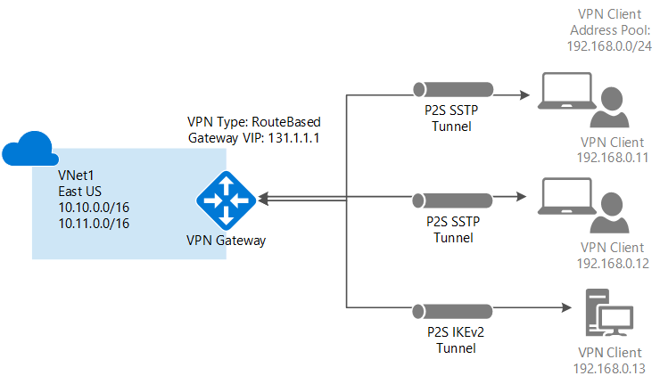
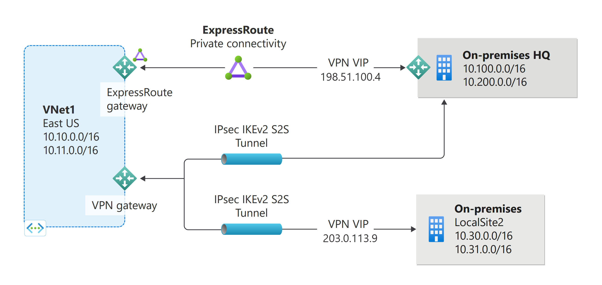

# VPN Gateway design

It's important to know that there are different configurations available for VPN gateway connections. You need to determine which configuration best fits your needs. In the sections below, you can view design information and topology diagrams about the following VPN gateway connections. Use the diagrams and descriptions to help select the connection topology to match your requirements. The diagrams show the main baseline topologies, but it's possible to build more complex configurations using the diagrams as guidelines.

## Site-to-Site and Multi-Site (IPsec/IKE VPN tunnel)

### Site-to-Site

A Site-to-Site (S2S) VPN gateway connection is a connection over IPsec/IKE (IKEv1 or IKEv2) VPN tunnel. S2S connections can be used for cross-premises and hybrid configurations. A S2S connection requires a VPN device located on-premises that has a public IP address assigned to it. For information about selecting a VPN device, see the [VPN Gateway FAQ - VPN devices](vpn-gateway-vpn-faq.md#s2s).

### Multi-Site

This type of connection is a variation of the Site-to-Site connection. You create more than one VPN connection from your virtual network gateway, typically connecting to multiple on-premises sites. When working with multiple connections, you must use a RouteBased VPN type (known as a dynamic gateway when working with classic VNets). Because each virtual network can only have one VPN gateway, all connections through the gateway share the available bandwidth. This type of connection is often called a "multi-site" connection.

### Deployment models and methods for Site-to-Site and Multi-Site

[!INCLUDE [site-to-site and multi-site table](../../includes/vpn-gateway-table-site-to-site-include.md)]

## Point-to-Site VPN

A Point-to-Site (P2S) VPN gateway connection lets you create a secure connection to your virtual network from an individual client computer. A P2S connection is established by starting it from the client computer. This solution is useful for telecommuters who want to connect to Azure VNets from a remote location, such as from home or a conference. P2S VPN is also a useful solution to use instead of S2S VPN when you have only a few clients that need to connect to a VNet.

Unlike S2S connections, P2S connections do not require an on-premises public-facing IP address or a VPN device. P2S connections can be used with S2S connections through the same VPN gateway, as long as all the configuration requirements for both connections are compatible. For more information about Point-to-Site connections, see [About Point-to-Site VPN](point-to-site-about.md).

### Deployment models and methods for P2S

[!INCLUDE [vpn-gateway-table-site-to-site](../../includes/vpn-gateway-table-point-to-site-include.md)]

## VNet-to-VNet connections (IPsec/IKE VPN tunnel)

Connecting a virtual network to another virtual network (VNet-to-VNet) is similar to connecting a VNet to an on-premises site location. Both connectivity types use a VPN gateway to provide a secure tunnel using IPsec/IKE. You can even combine VNet-to-VNet communication with multi-site connection configurations. This lets you establish network topologies that combine cross-premises connectivity with inter-virtual network connectivity.

The VNets you connect can be:

* in the same or different regions
* in the same or different subscriptions 
* in the same or different deployment models

### Connections between deployment models

Azure currently has two deployment models: classic and Resource Manager. If you have been using Azure for some time, you probably have Azure VMs and instance roles running in a classic VNet. Your newer VMs and role instances may be running in a VNet created in Resource Manager. You can create a connection between the VNets to allow the resources in one VNet to communicate directly with resources in another.

### VNet peering

You may be able to use VNet peering to create your connection, as long as your virtual network meets certain requirements. VNet peering does not use a virtual network gateway. For more information, see [VNet peering](../virtual-network/virtual-network-peering-overview.md).

### Deployment models and methods for VNet-to-VNet

[!INCLUDE [vpn-gateway-table-vnet-to-vnet](../../includes/vpn-gateway-table-vnet-to-vnet-include.md)]

## ExpressRoute (private connection)

ExpressRoute lets you extend your on-premises networks into the Microsoft cloud over a private connection facilitated by a connectivity provider. With ExpressRoute, you can establish connections to Microsoft cloud services, such as Microsoft Azure, Office 365, and CRM Online. Connectivity can be from an any-to-any (IP VPN) network, a point-to-point Ethernet network, or a virtual cross-connection through a connectivity provider at a colocation facility.

ExpressRoute connections do not go over the public Internet. This allows ExpressRoute connections to offer more reliability, faster speeds, lower latencies, and higher security than typical connections over the Internet.

An ExpressRoute connection uses a virtual network gateway as part of its required configuration. In an ExpressRoute connection, the virtual network gateway is configured with the gateway type 'ExpressRoute', rather than 'Vpn'. While traffic that travels over an ExpressRoute circuit is not encrypted by default, it is possible create a solution that allows you to send encrypted traffic over an ExpressRoute circuit. For more information about ExpressRoute, see the [ExpressRoute technical overview](../expressroute/expressroute-introduction.md).

## Site-to-Site and ExpressRoute coexisting connections

ExpressRoute is a direct, private connection from your WAN (not over the public Internet) to Microsoft Services, including Azure. Site-to-Site VPN traffic travels encrypted over the public Internet. Being able to configure Site-to-Site VPN and ExpressRoute connections for the same virtual network has several advantages.

You can configure a Site-to-Site VPN as a secure failover path for ExpressRoute, or use Site-to-Site VPNs to connect to sites that are not part of your network, but that are connected through ExpressRoute. Notice that this configuration requires two virtual network gateways for the same virtual network, one using the gateway type 'Vpn', and the other using the gateway type 'ExpressRoute'.

### Deployment models and methods for S2S and ExpressRoute coexist

[!INCLUDE [vpn-gateway-table-coexist](../../includes/vpn-gateway-table-coexist-include.md)]

## Highly available connections

For planning and design for highly available connections, see [Highly available connections](vpn-gateway-highlyavailable.md).

## Next steps

* View the [VPN Gateway FAQ](vpn-gateway-vpn-faq.md) for additional information.

* Learn more about [VPN Gateway configuration settings](vpn-gateway-about-vpn-gateway-settings.md).

* For VPN Gateway BGP considerations, see [About BGP](vpn-gateway-bgp-overview.md).

* View the [Subscription and service limits](../azure-resource-manager/management/azure-subscription-service-limits.md#networking-limits).

* Learn about some of the other key [networking capabilities](../networking/networking-overview.md) of Azure.
