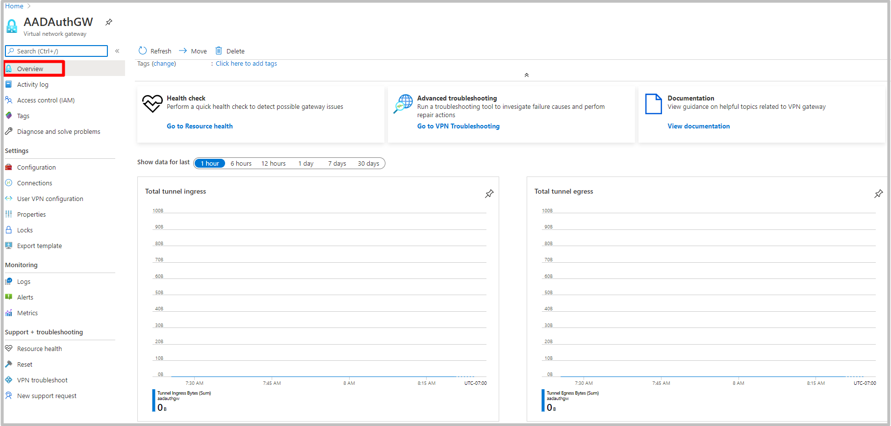

# Monitoring VPN Gateway

You can monitor Azure VPN gateways using Azure Monitor. This article discusses metrics that are available through the portal. Metrics are lightweight and can support near real-time scenarios, making them useful for alerting and fast issue detection.

|**Metric**   | **Unit** | **Granularity** | **Description** | 
|---       | ---        | ---       | ---            | ---       |
|**AverageBandwidth**| Bytes/s  | 5 minutes| Average combined bandwidth utilization of all site-to-site connections on the gateway.     |
|**P2SBandwidth**| Bytes/s  | 1 minute  | Average combined bandwidth utilization of all point-to-site connections on the gateway.    |
|**P2SConnectionCount**| Count  | 1 minute  | Count of point-to-site connections on the gateway.   |
|**TunnelAverageBandwidth** | Bytes/s    | 5 minutes  | Average bandwidth utilization of tunnels created on the gateway. |
|**TunnelEgressBytes** | Bytes | 5 minutes | Outgoing traffic on tunnels created on the gateway.   |
|**TunnelEgressPackets** | Count | 5 minutes | Count of outgoing packets on tunnels created on the gateway.   |
|**TunnelEgressPacketDropTSMismatch** | Count | 5 minutes | Count of outgoing packets dropped on tunnels caused by traffic-selector mismatch. |
|**TunnelIngressBytes** | Bytes | 5 minutes | Incoming traffic on tunnels created on the gateway.   |
|**TunnelIngressPackets** | Count | 5 minutes | Count of incoming packets on tunnels created on the gateway.   |
|**TunnelIngressPacketDropTSMismatch** | Count | 5 minutes | Count of incoming packets dropped on tunnels caused by traffic-selector mismatch. |

## The following steps help you locate and view metrics:

1. Navigate to the virtual network gateway resource in the Portal
2. Select **Overview** to see the Total tunnel ingress and egress metrics.

   

3. To view any of the other metrics listed above. Click on the **Metrics** section under your virtual network gateway resource and select the metric from the drop down list.

   

## Next steps

To configure alerts on tunnel metrics, see [Set up alerts on VPN Gateway metrics](vpn-gateway-howto-setup-alerts-virtual-network-gateway-metric.md).

To configure alerts on tunnel resource logs, see [Set up alerts on VPN Gateway resource logs](vpn-gateway-howto-setup-alerts-virtual-network-gateway-log.md).
