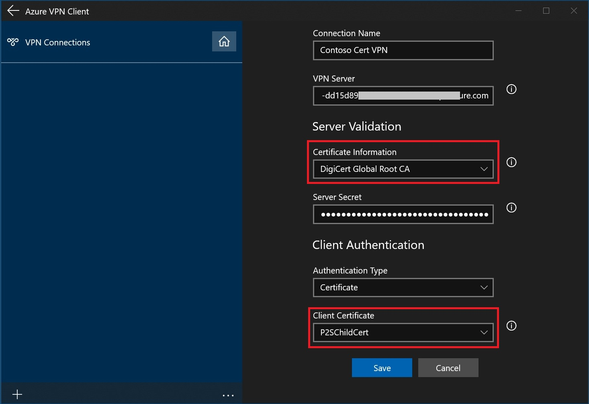
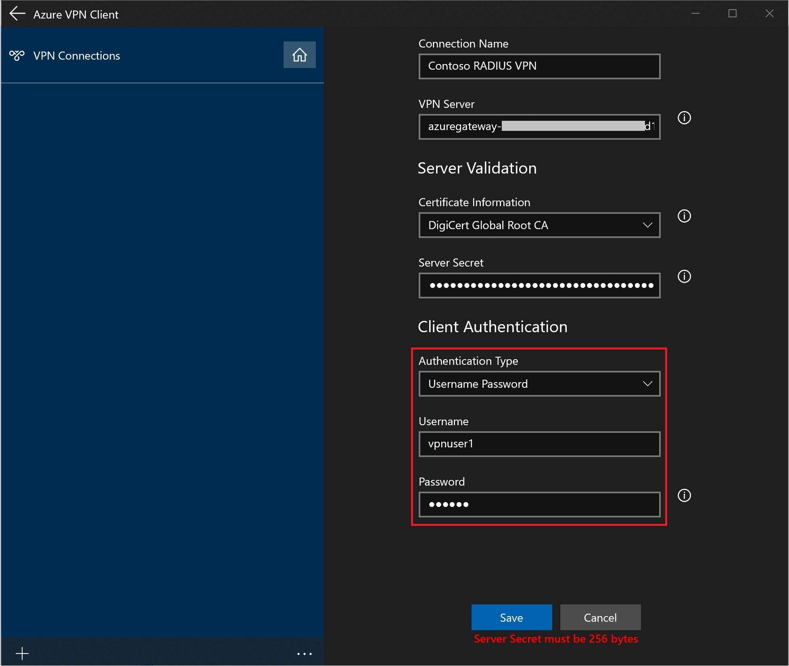
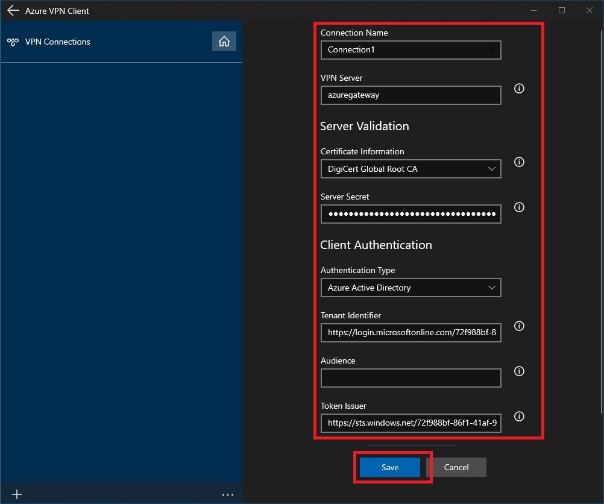
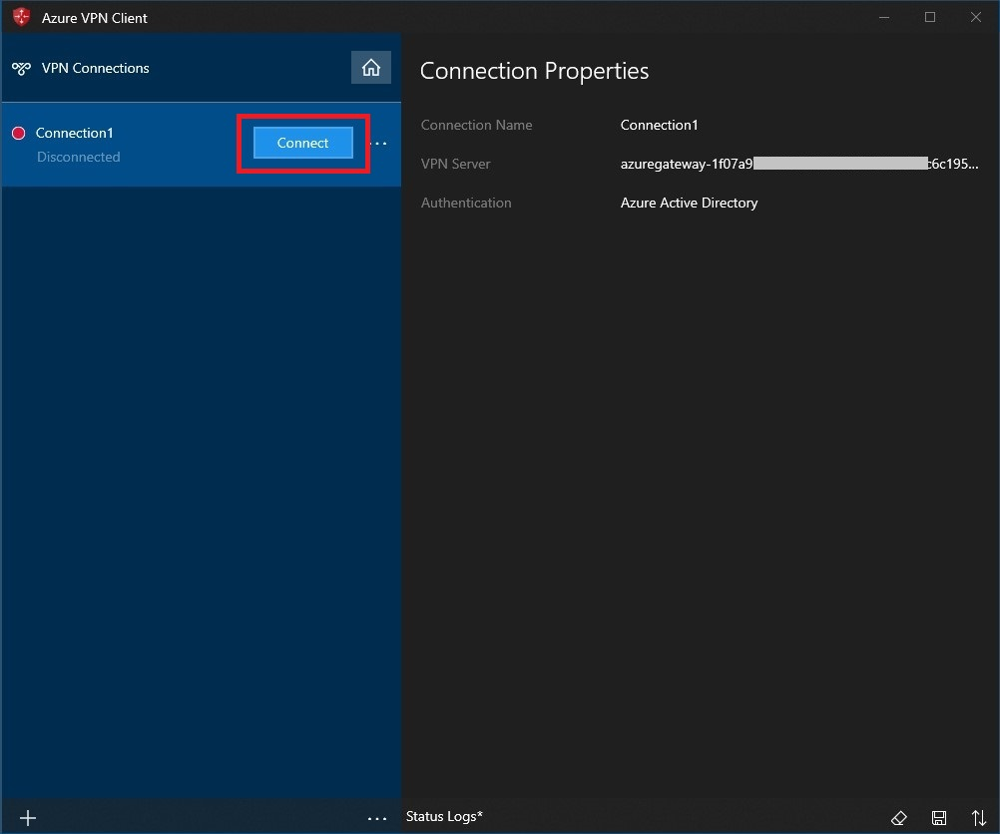
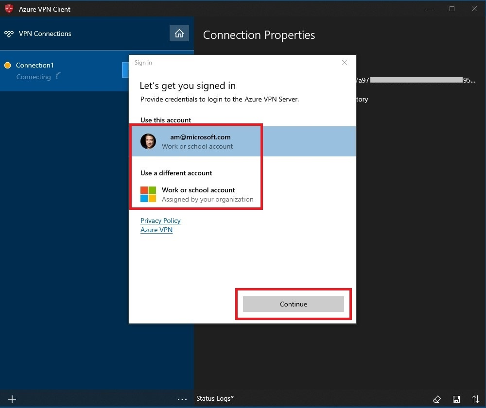
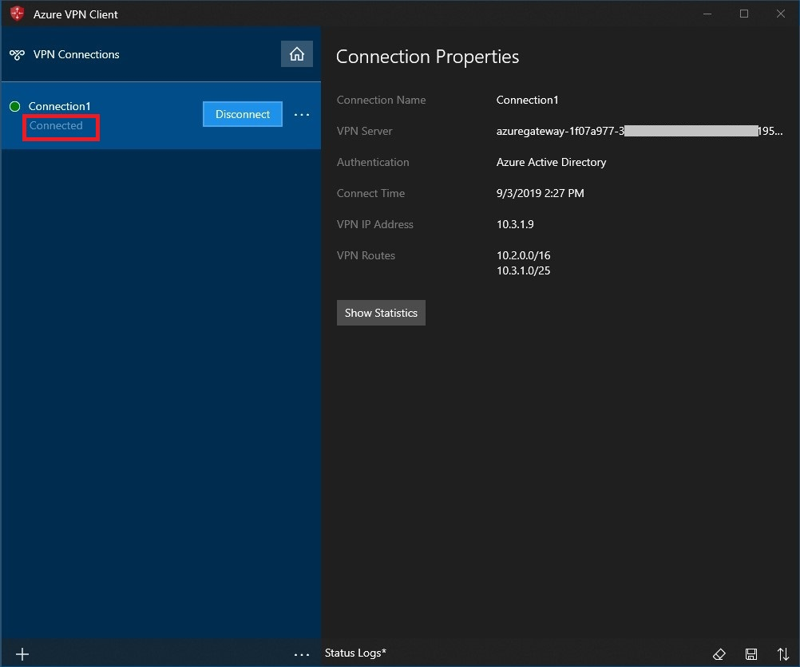

# Azure Active Directory authentication: Configure a VPN client for P2S OpenVPN protocol connections

This article helps you configure a VPN client to connect to a virtual network using Point-to-Site VPN and Azure Active Directory authentication. Before you can connect and authenticate using Azure AD, you must first configure your Azure AD tenant. For more information, see [Configure an Azure AD tenant](openvpn-azure-ad-tenant.md). For more information about Point-to-Site, see [About Point-to-Site VPN](point-to-site-about.md).

[!INCLUDE [OpenVPN note](../../includes/vpn-gateway-openvpn-auth-include.md)]

## <a name="profile"></a>Working with client profiles

For every computer that wants to connect to the VNet via the VPN client, you need to download the Azure VPN Client for the computer, and also configure a VPN client profile. If you want to configure multiple computers, you can create a client profile on one computer, export it, and then import it to other computers.

### To download the Azure VPN client

1. Download the [Azure VPN Client](https://go.microsoft.com/fwlink/?linkid=2117554) to the computer.
1. Verify that the Azure VPN Client has permission to run in the background. To check and enable permissions, navigate to **Start -> Settings -> Privacy -> Background Apps**.

   * Under **Background Apps**, make sure **Let apps run in the background** is turned **On**.
   * Under **Choose which apps can run in the background**, turn settings for **Azure VPN Client** to **On**.

     

### <a name="cert"></a>To create a certificate-based client profile

When working with a certificate-based profile, make sure that the appropriate certificates are installed on the client computer. For more information about certificates, see [Install client certificates](point-to-site-how-to-vpn-client-install-azure-cert.md).



### <a name="radius"></a>To create a RADIUS client profile


  
> [!NOTE]
> The Server Secret can be exported in the P2S VPN client profile.  Instructions on how to export a client profile can be found [here](about-vpn-profile-download.md).
>

### <a name="export"></a>To export and distribute a client profile

Once you have a working profile and need to distribute it to other users, you can export it using the following steps:

1. Highlight the VPN client profile that you want to export, select the **...**, then select **Export**.

    

2. Select the location that you want to save this profile to, leave the file name as is, then select **Save** to save the xml file.

    

### <a name="import"></a>To import a client profile

1. On the page, select **Import**.

    

2. Browse to the profile xml file and select it. With the file selected, select **Open**.

    

3. Specify the name of the profile and select **Save**.

    

4. Select **Connect** to connect to the VPN.

    

5. Once connected, the icon will turn green and say **Connected**.

    

### <a name="delete"></a>To delete a client profile

1. Select the ellipses next to the client profile that you want to delete. Then, select **Remove**.

    

2. Select **Remove** to delete.

    

## <a name="connection"></a>Create a connection

1. On the page, select **+**, then **+ Add**.

    

2. Fill out the connection information. If you are unsure of the values, contact your administrator. After filling out the values, select **Save**.

    

3. Select **Connect** to connect to the VPN.

    

4. Select the proper credentials, then select **Continue**.

    

5. Once successfully connected, the icon will turn green and say **Connected**.

    

### <a name="autoconnect"></a>To connect automatically

These steps help you configure your connection to connect automatically with Always-on.

1. On the home page for your VPN client, select **VPN Settings**.

    

2. Select **Yes** on the switch apps dialogue box.

    

3. Make sure the connection that you want to set is not already connected, then highlight the profile and check the **Connect automatically** check box.

    

4. Select **Connect** to initiate the VPN connection.

    

## <a name="diagnose"></a>Diagnose connection issues

1. To diagnose connection issues, you can use the **Diagnose** tool. Select the **...** next to the VPN connection that you want to diagnose to reveal the menu. Then select **Diagnose**.

    

2. On the **Connection Properties** page, select **Run Diagnosis**.

    

3. Sign in with your credentials.

    

4. View the diagnosis results.

    

## FAQ

### Is the Azure VPN Client supported with Windows FIPS mode?

Yes, with the [KB4577063](https://support.microsoft.com/help/4577063/windows-10-update-kb4577063) hotfix.

### How do I add DNS suffixes to the VPN client?

You can modify the downloaded profile XML file and add the **\<dnssuffixes>\<dnssufix> \</dnssufix>\</dnssuffixes>** tags.

```
<azvpnprofile>
<clientconfig>

    <dnssuffixes>
          <dnssuffix>.mycorp.com</dnssuffix>
          <dnssuffix>.xyz.com</dnssuffix>
          <dnssuffix>.etc.net</dnssuffix>
    </dnssuffixes>
    
</clientconfig>
</azvpnprofile>
```

### How do I add custom DNS servers to the VPN client?

You can modify the downloaded profile XML file and add the **\<dnsservers>\<dnsserver> \</dnsserver>\</dnsservers>** tags.

```
<azvpnprofile>
<clientconfig>

	<dnsservers>
		<dnsserver>x.x.x.x</dnsserver>
        <dnsserver>y.y.y.y</dnsserver>
	</dnsservers>
    
</clientconfig>
</azvpnprofile>
```

> [!NOTE]
> The OpenVPN Azure AD client utilizes DNS Name Resolution Policy Table (NRPT) entries, which means DNS servers will not be listed under the output of `ipconfig /all`. To confirm your in-use DNS settings, please consult [Get-DnsClientNrptPolicy](/powershell/module/dnsclient/get-dnsclientnrptpolicy) in PowerShell.
>

### <a name="split"></a>Can I configure split tunneling for the VPN client?

Split tunneling is configured by default for the VPN client.

### <a name="forced-tunnel"></a>How do I direct all traffic to the VPN tunnel (forced tunneling)?

You can configure forced tunneling using two different methods; either by advertising custom routes, or by modifying the profile XML file.    

> [!NOTE]
> Internet connectivity is not provided through the VPN gateway. As a result, all traffic bound for the Internet is dropped.
>

* **Advertise custom routes:** You can advertise custom routes 0.0.0.0/1 and 128.0.0.0/1. For more information, see [Advertise custom routes for P2S VPN clients](vpn-gateway-p2s-advertise-custom-routes.md).

* **Profile XML:** You can modify the downloaded profile XML file to add the **\<includeroutes>\<route>\<destination>\<mask> \</destination>\</mask>\</route>\</includeroutes>** tags.


    ```
    <azvpnprofile>
    <clientconfig>
          
    	<includeroutes>
    		<route>
    			<destination>0.0.0.0</destination><mask>1</mask>
    		</route>
    		<route>
    			<destination>128.0.0.0</destination><mask>1</mask>
    		</route>
    	</includeroutes>
           
    </clientconfig>
    </azvpnprofile>
    ```


### How do I add custom routes to the VPN client?

You can modify the downloaded profile XML file and add the **\<includeroutes>\<route>\<destination>\<mask> \</destination>\</mask>\</route>\</includeroutes>** tags.

```
<azvpnprofile>
<clientconfig>

	<includeroutes>
		<route>
			<destination>x.x.x.x</destination><mask>24</mask>
		</route>
	</includeroutes>
    
</clientconfig>
</azvpnprofile>
```

### How do I block (exclude) routes from the VPN client?

You can modify the downloaded profile XML file and add the **\<excluderoutes>\<route>\<destination>\<mask> \</destination>\</mask>\</route>\</excluderoutes>** tags.

```
<azvpnprofile>
<clientconfig>

	<excluderoutes>
		<route>
			<destination>x.x.x.x</destination><mask>24</mask>
		</route>
	</excluderoutes>
    
</clientconfig>
</azvpnprofile>
```

### Can I import the profile from a command-line prompt?

You can import the profile from a command-line prompt by placing the downloaded **azurevpnconfig.xml** file in the **%userprofile%\AppData\Local\Packages\Microsoft.AzureVpn_8wekyb3d8bbwe\LocalState** folder and running the following command:

```
azurevpn -i azurevpnconfig.xml 
```
To force the import, use the **-f** switch.


## Next steps

For more information, see [Create an Azure Active Directory tenant for P2S Open VPN connections that use Azure AD authentication](openvpn-azure-ad-tenant.md).