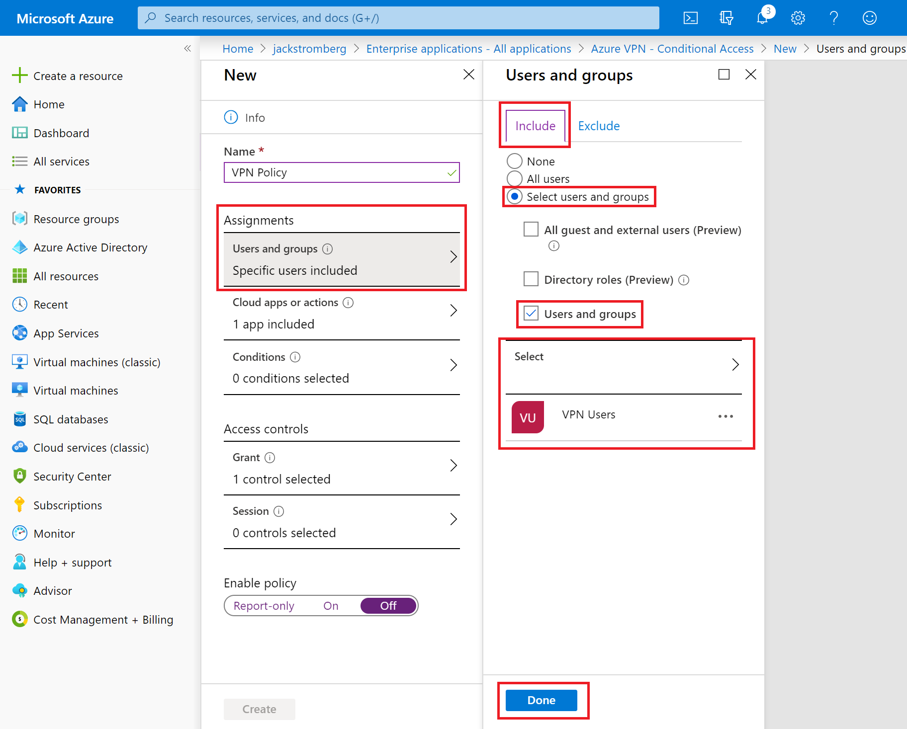
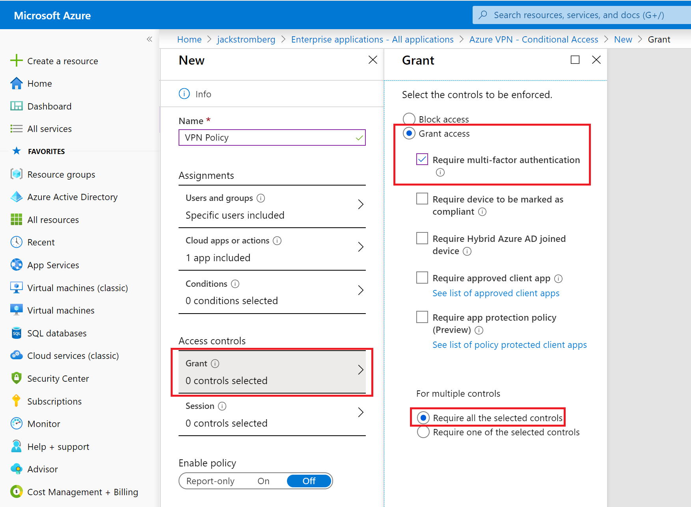
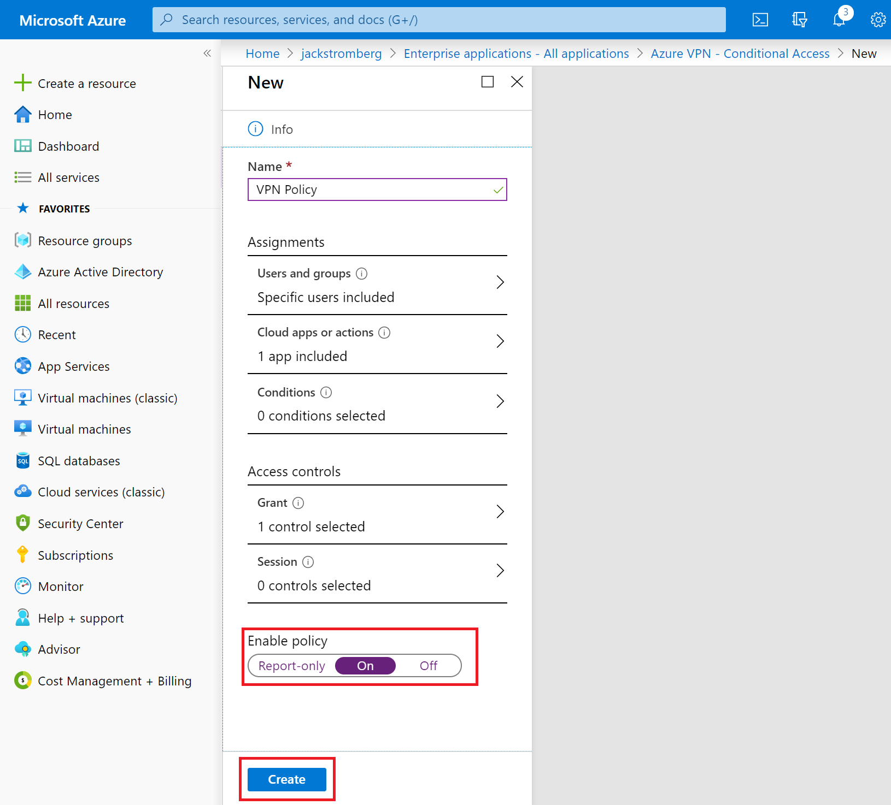

# Enable Azure Multi-Factor Authentication (MFA) for VPN users

If you want users to be prompted for a second factor of authentication before granting access, you can configure Azure Multi-Factor Authentication (MFA) on a per user basis or leverage Multi-Factor Authentication (MFA) via [Conditional Access](../active-directory/conditional-access/overview.md) for more fine-grained control. Configuring Multi-Factor Authentication per user can be enabled at no-additional cost, however when enabling MFA per user, the user will be prompted for second factor authentication against all applications tied to the Azure AD tenant. Conditional Access will allow finer grain control over how a second factor should be promoted and can allow assignment of MFA to only VPN and not other applications tied to the Azure AD tenant.

## Enable authentication

1. Navigate to **Azure Active Directory  -> Enterprise applications -> All applications**.
2. On the **Enterprise applications - All applications** page, select **Azure VPN**.

   

##  Configure sign-in settings

On the **Azure VPN - Properties** page, configure sign-in settings.

1. Set **Enabled for users to sign-in?** to **Yes**. This allows all users in the AD tenant to connect to the VPN successfully.
2. Set **User assignment required?** to **Yes** if you want to limit sign-in to only users that have permissions to the Azure VPN.
3. Save your changes.

   

## Option 1 - Enable Multi-Factor Authentication (MFA) via Conditional Access

Conditional Access allows for fine-grained access control on a per-application basis.  Please note that to leverage Conditional Access, you should have Azure AD Premium 1 or greater licensing applied to the users that will be subject to the Conditional Access rules.

1. On the **Enterprise applications - All applications** page, select **Azure VPN**, select **Conditional Access**, and click **New policy**.
2. Under Users and groups, on the *Include* tab check **Select users and groups**, check **Users and groups**, and select a group or set of users that should be subject for MFA.  Click **Done**.

3. Under **Grant**, check **Grant access**, check **Require multi-factor authentication**, check **Require all the selected controls**, and click the **Select** button.

4. Check **On** under **Enable policy** and click the **Create** button.

## Option 2 - Enable Multi-Factor Authentication (MFA) per User

[!INCLUDE [MFA steps](../../includes/vpn-gateway-vwan-openvpn-azure-ad-mfa.md)]

## Next steps

To connect to your virtual network, you must create and configure a VPN client profile. See [Configure a VPN client for P2S VPN connections](openvpn-azure-ad-client.md).
