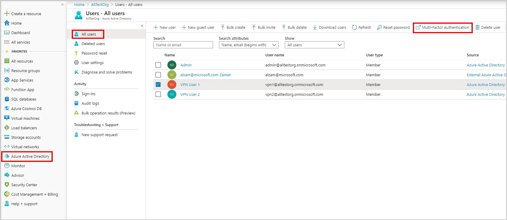
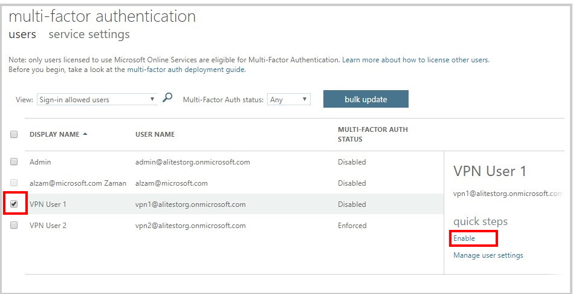

# Enable Multi-Factor Authentication (MFA) for VPN users

You can enable MFA for users in your Azure AD tenant so that users are prompted for a second factor authentication before access is granted.

> [!Prerequisite]
> You have configured an Azure AD tenant as described in the "Configure a tenant" document.
>

### 1. Login to the Azure portal and navigate to **Azure Active Directory** , **All users** and click on **Multi-Factor Authentication**

   

### 2. Select the user(s) that you want to enable MFA for and click **enable**

   

### 3. Navigate to **Azure Active Directory** , **Enterprise applications**, **All applications**  and click on **Azure VPN**

   

### 4. Make sure the **Enabled for users to sign-in?** is set to yes. If you want just the users that have permissions to the Azure VPN to be able to login then Set **User assignment required?** to yes as well otherwise all users in the AD tenant will be able to connect to VPN successfully.

   

## Next steps

In order to connect to your virtual network, you must create and configure a VPN client profile. See [Configure a VPN client for P2S VPN connections](openvpn-azure-ad-client.md).
