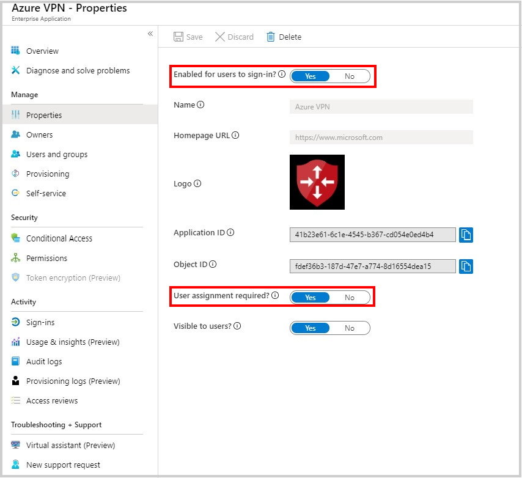

# Enable Azure Multi-Factor Authentication (MFA) for VPN users

If you want users to be prompted for a second factor of authentication before granting access, you can configure Azure Multi-Factor Authentication (MFA) for your Azure AD tenant. The steps in this article help you enable a requirement for two-step verification.

## Prerequisite

The prerequisite for this configuration is a configured Azure AD tenant using the steps in [Configure a tenant](openvpn-azure-ad-tenant.md).

[!INCLUDE [MFA steps](../../includes/vpn-gateway-vwan-openvpn-azure-ad-mfa.md)]

##  Configure sign-in settings

On the **Azure VPN - Properties** page, configure sign-in settings.

1. Set **Enabled for users to sign-in?** to **Yes**. This allows all users in the AD tenant to connect to the VPN successfully.
2. Set **User assignment required?** to **Yes** if you want to limit sign-in to only users that have permissions to the Azure VPN.
3. Save your changes.

   

## Next steps

To connect to your virtual network, you must create and configure a VPN client profile. See [Configure a VPN client for P2S VPN connections](openvpn-azure-ad-client.md).
