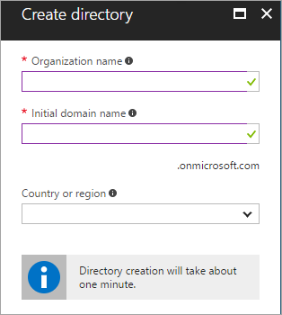
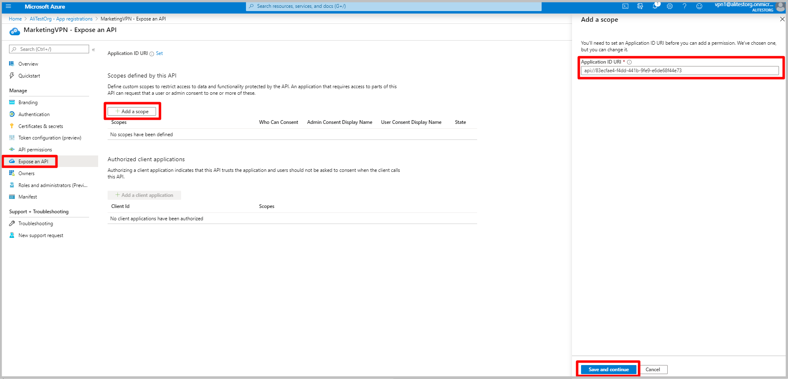
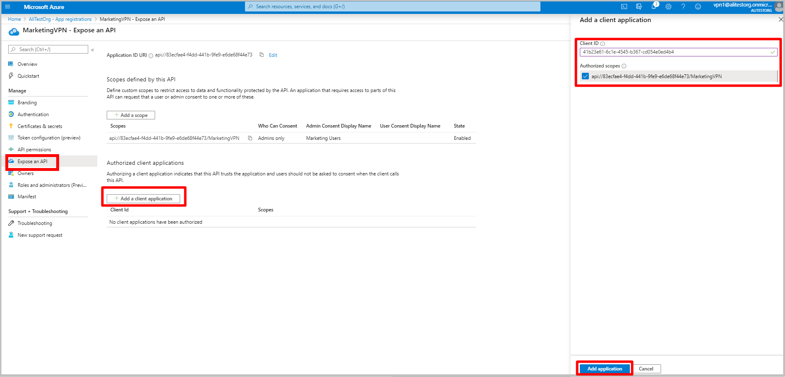
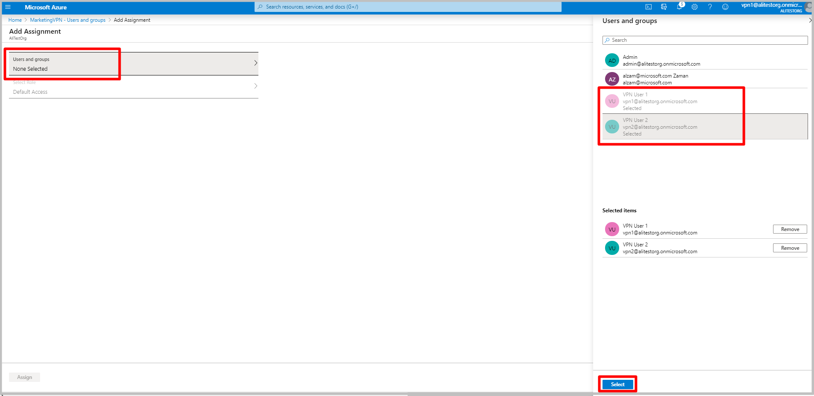

# Create an Azure Active Directory tenant for P2S OpenVPN protocol connections

When connecting to your VNet, you can use certificate-based authentication or RADIUS authentication. However, when you use the Open VPN protocol, you can also use Azure Active Directory authentication. If you want different set of users to be able to connect to different VPN gateways, you can register multiple apps in AD and link them to different VPN gateways. This article helps you set up an Azure AD tenant for P2S OpenVPN authentication and create and register multiple apps in Azure AD for allowing different access for different users and groups.

> [!NOTE]
> Azure AD authentication is supported only for OpenVPN® protocol connections.
>

## <a name="tenant"></a>1. Create the Azure AD tenant

Create an Azure AD tenant using the steps in the [Create a new tenant](../active-directory/fundamentals/active-directory-access-create-new-tenant.md) article:

* Organizational name
* Initial domain name

Example:

   

## <a name="users"></a>2. Create Azure AD tenant users

Next, create two user accounts. Create one Global Admin account and one master user account. The master user account is used as your master embedding account (service account). When you create an Azure AD tenant user account, you adjust the Directory role for the type of user that you want to create.

Use the steps in [this article](../active-directory/fundamentals/add-users-azure-active-directory.md) to create at least two users for your Azure AD tenant. Be sure to change the **Directory Role** to create the account types:

* Global Admin
* User

## <a name="enable-authentication"></a>3. Register Azure VPN Client in Azure AD tenant

1. Locate the Directory ID of the directory that you want to use for authentication. It is listed in the properties section of the Active Directory page.

    

2. Copy the Directory ID.

3. Sign in to the Azure portal as a user that is assigned the **Global administrator** role.

4. Next, give admin consent. Copy and paste the URL that pertains to your deployment location in the address bar of your browser:

    Public

    ```
    https://login.microsoftonline.com/common/oauth2/authorize?client_id=41b23e61-6c1e-4545-b367-cd054e0ed4b4&response_type=code&redirect_uri=https://portal.azure.com&nonce=1234&prompt=admin_consent
    ````

    Azure Government

    ```
    https://login-us.microsoftonline.com/common/oauth2/authorize?client_id=51bb15d4-3a4f-4ebf-9dca-40096fe32426&response_type=code&redirect_uri=https://portal.azure.us&nonce=1234&prompt=admin_consent
    ````

    Microsoft Cloud Germany

    ```
    https://login-us.microsoftonline.de/common/oauth2/authorize?client_id=538ee9e6-310a-468d-afef-ea97365856a9&response_type=code&redirect_uri=https://portal.microsoftazure.de&nonce=1234&prompt=admin_consent
    ````

    Azure China 21Vianet

    ```
    https://https://login.chinacloudapi.cn/common/oauth2/authorize?client_id=49f817b6-84ae-4cc0-928c-73f27289b3aa&response_type=code&redirect_uri=https://portal.azure.cn&nonce=1234&prompt=admin_consent
    ```

5. Select the **Global Admin** account if prompted.

    

6. Select **Accept** when prompted.

    

7. Under your Azure AD, in **Enterprise applications**, you will see **Azure VPN** listed.

    

## <a name="enable-authentication"></a>4. Register additional applications for various users/groups

1. Under your Azure Active Directory, click on **App registrations** and then **+ New registration**

    

2. In the **Register an application** blade enter the **Name** and select the desired **Supported account types** and click **Register**

    

3. Once the new app has been registered, click on **Expose an API** under the app blade

4. Click on **+ Add a scope**
5. Leave the default **Application ID URI** and click **Save and continue**

    
6. Fill in the required fields and ensure that **State** is **Enabled**. Click **Add scope**

    
7. Click on **Expose an API** then **+ Add a client application**.  For **Client ID**, enter the following values depending on the cloud:
	- 	Enter **41b23e61-6c1e-4545-b367-cd054e0ed4b4** for Azure **Public**
	- 	Enter **51bb15d4-3a4f-4ebf-9dca-40096fe32426** for Azure **Government**
	- 	Enter **538ee9e6-310a-468d-afef-ea97365856a9** for Azure **Germany**
	- 	Enter **49f817b6-84ae-4cc0-928c-73f27289b3aa** for Azure **China 21Vianet**


8. Click **Add application**

    
9. Copy the **Application (client) ID** from the **Overview** page. You will need it to configure your VPN gateway(s)

    

10. Repeat the steps in this section (4) to create as many applications that are needed for your security requirement. Each application will be associated to a VPN gateway and can have a different set of users. Only one application can be associated to a gateway.

## <a name="enable-authentication"></a>5. Assign users to your applications

1. Under Azure AD, **Enterprise applications**, select the newly registered application and click on **Properties**. Ensure that **User assignment required?** is set to **yes**. Click **Save**

    

2. On the app page, click on **Users and groups** and then **Add user**

    
3. Under **Add Assignment**, click **Users and groups**. Select the users that you want to be able to access this VPN application. Click **Select**

    

## <a name="enable-authentication"></a>6. Enable Azure AD authentication on the VPN gateway

1. Enable Azure AD authentication on the VPN gateway by running the following commands, being sure to modify the command to reflect your own environment:

    ```azurepowershell-interactive
    $gw = Get-AzVirtualNetworkGateway -Name <name of VPN gateway> -ResourceGroupName <Resource group>
    Set-AzVirtualNetworkGateway -VirtualNetworkGateway $gw -VpnClientRootCertificates @()
    Set-AzVirtualNetworkGateway -VirtualNetworkGateway $gw -AadTenantUri "https://login.microsoftonline.com/<your Directory ID>" -AadAudienceId "application ID from previous section" -AadIssuerUri "https://sts.windows.net/<your Directory ID>/" -VpnClientAddressPool 192.168.0.0/24
    ```
> [!NOTE]
> Do not use the Azure VPN client's application ID in the commands above as it will grant all users access to the VPN gateway. Use the ID of the application(s) you registered.

2. Create and download the profile by running the following commands. Change the -ResourcGroupName and -Name values to match your own.

    ```azurepowershell-interactive
    $profile = New-AzVpnClientConfiguration -Name <name of VPN gateway> -ResourceGroupName <Resource group> -AuthenticationMethod "EapTls"
    $PROFILE.VpnProfileSASUrl
    ```

3. After running the commands, you see a result similar to the one below. Copy the result URL to your browser to download the profile zip file.

    

4. Extract the downloaded zip file.

5. Browse to the unzipped “AzureVPN” folder.

6. Make a note of the location of the “azurevpnconfig.xml” file. The azurevpnconfig.xml contains the setting for the VPN connection and can be imported directly into the Azure VPN Client application. You can also distribute this file to all the users that need to connect via e-mail or other means. The user will need valid Azure AD credentials to connect successfully.

## Next steps

In order to connect to your virtual network, you must create and configure a VPN client profile. See [Configure a VPN client for P2S VPN connections](openvpn-azure-ad-client.md).
