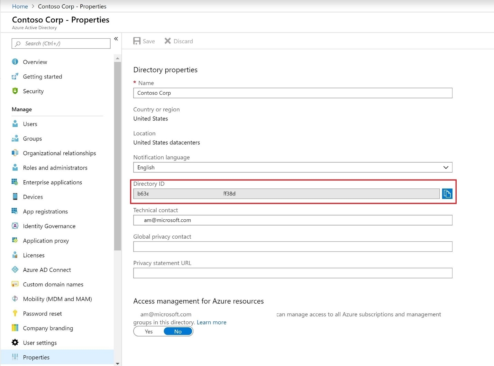
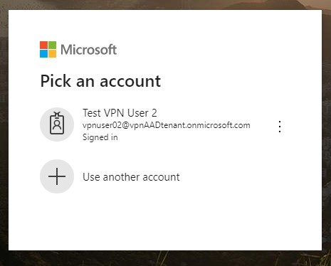
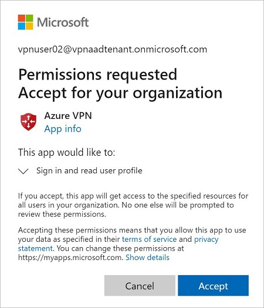

# Create an Azure Active Directory tenant for P2S Open VPN connections that use Azure AD authentication

When connecting to your VNet, you can use certificate-based authentication or RADIUS authentication. However, when you use the Open VPN protocol, you can also use Azure Active Directory authentication. This article helps you set up an Azure AD tenant for P2S Open VPN authentication.

## <a name="tenant"></a>1. Create the Azure AD tenant

Create an Azure AD tenant using the steps in the [Create a new tenant](../active-directory/fundamentals/active-directory-access-create-new-tenant.md) article:

* Organizational name
* Initial domain name

Example:

   

## <a name="users"></a>2. Create Azure AD tenant users

Next, create two user accounts. Create one Global Admin account and one master user account. The master user account is used as your master embedding account (service account). When you create an Azure AD tenant user account, you adjust the Directory role for the type of user that you want to create.

Use the steps in [this article](../active-directory/fundamentals/add-users-azure-active-directory.md) to create at least two users for your Azure AD tenant. Be sure to change the **Directory Role** to create the account types:

* Global Admin
* User

## <a name="enable-authentication"></a>3. Enable Azure AD authentication on the VPN gateway

1. Locate the Directory ID of the directory that you want to use for authentication. It is listed in the properties section of the Active Directory page.

    

2. Copy the Directory ID.

3. Sign in to the Azure portal as a user that is assigned the **Global administrator** role.

4. Next, give admin consent. Copy and paste the URL that pertains to your deployment location in the address bar of your browser:

    Public

    ```
    https://login.microsoftonline.com/common/oauth2/authorize?client_id=41b23e61-6c1e-4545-b367-cd054e0ed4b4&response_type=code&redirect_uri=https://portal.azure.com&nonce=1234&prompt=admin_consent
    ````

    Azure Government

    ```
    https://login-us.microsoftonline.com/common/oauth2/authorize?client_id=51bb15d4-3a4f-4ebf-9dca-40096fe32426&response_type=code&redirect_uri=https://portal.azure.us&nonce=1234&prompt=admin_consent
    ````

    Microsoft Cloud Germany

    ```
    https://login-us.microsoftonline.de/common/oauth2/authorize?client_id=538ee9e6-310a-468d-afef-ea97365856a9&response_type=code&redirect_uri=https://portal.microsoftazure.de&nonce=1234&prompt=admin_consent
    ````

    Azure China 21Vianet

    ```
    https://https://login.chinacloudapi.cn/common/oauth2/authorize?client_id=49f817b6-84ae-4cc0-928c-73f27289b3aa&response_type=code&redirect_uri=https://portal.azure.cn&nonce=1234&prompt=admin_consent
    ```

5. Select the **Global Admin** account if prompted.

    

6. Select **Accept** when prompted.

    

7. Under your Azure AD, in **Enterprise applications**, you see **Azure VPN** listed.

    

8. Enable Azure AD authentication on the VPN gateway by running the following commands, being sure to modify the command to reflect your own environment:

    ```azurepowershell-interactive
    $gw = Get-AzVirtualNetworkGateway -Name <name of VPN gateway> -ResourceGroupName <Resource group>
    Set-AzVirtualNetworkGateway -VirtualNetworkGateway $gw -AadTenantUri "https://login.microsoftonline.com/<your Directory ID>" -AadAudienceId "41b23e61-6c1e-4545-b367-cd054e0ed4b4" -AadIssuerUri "https://sts.windows.net/<your Directory ID>/"
    ```

9. Create and download the profile by running the following commands. Change the -ResourcGroupName and -Name values to match your own.

    ```azurepowershell-interactive
    $profile = New-AzVpnClientConfiguration -ResourceGroupName AADAuth -Name AADauthGW -AuthenticationMethod "EapTls"
    $PROFILE.VpnProfileSASUrl
    ```

10. After running the commands, you see a result similar to the one below. Copy the result URL to your browser to download the profile zip file.

    

11. Extract the downloaded zip file.

12. Browse to the unzipped “AzureVPN” folder.

13. Make a note of the location of the “azurevpnconfig.xml” file. The azurevpnconfig.xml contains the setting for the VPN connection and can be imported directly into the Azure VPN Client application. You can also distribute this file to all the users that need to connect via e-mail or other means. The user will need valid Azure AD credentials to connect successfully.

## Next steps

In order to connect to your virtual network, you must create and configure a VPN client profile. See [Configure a VPN client for P2S VPN connections](openvpn-azure-ad-client.md).
