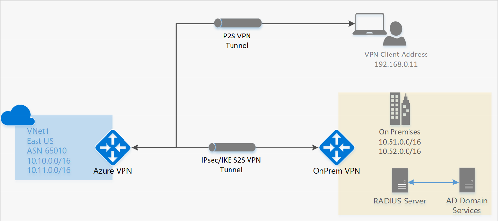

# About Point-to-Site VPN

A Point-to-Site (P2S) VPN gateway connection lets you create a secure connection to your virtual network from an individual client computer. A P2S connection is established by starting it from the client computer. This solution is useful for telecommuters who want to connect to Azure VNets from a remote location, such as from home or a conference. P2S VPN is also a useful solution to use instead of S2S VPN when you have only a few clients that need to connect to a VNet. This article applies to the [Resource Manager deployment model](../azure-resource-manager/management/deployment-models.md).

## What protocol does P2S use?

Point-to-site VPN can use one of the following protocols:

* **OpenVPN® Protocol**, an SSL/TLS based VPN protocol. A TLS VPN solution can penetrate firewalls, since most firewalls open TCP port 443 outbound, which TLS uses. OpenVPN can be used to connect from Android, iOS (versions 11.0 and above), Windows, Linux, and Mac devices (macOS versions 10.13 and above).

* **Secure Socket Tunneling Protocol (SSTP)**, a proprietary TLS-based VPN protocol. A TLS VPN solution can penetrate firewalls, since most firewalls open TCP port 443 outbound, which TLS uses. SSTP is only supported on Windows devices. Azure supports all versions of Windows that have SSTP and support TLS 1.2 (Windows 8.1 and later).

* **IKEv2 VPN**, a standards-based IPsec VPN solution. IKEv2 VPN can be used to connect from Mac devices (macOS versions 10.11 and above).

> [!NOTE]
> IKEv2 and OpenVPN for P2S are available for the [Resource Manager deployment model](../azure-resource-manager/management/deployment-models.md) only. They aren't available for the classic deployment model.
>

## How are P2S VPN clients authenticated?

Before Azure accepts a P2S VPN connection, the user has to be authenticated first. There are two mechanisms that Azure offers to authenticate a connecting user.

### Certificate authentication

When using the native Azure certificate authentication, a client certificate that is present on the device is used to authenticate the connecting user. Client certificates are generated from a trusted root certificate and then installed on each client computer. You can use a root certificate that was generated using an Enterprise solution, or you can generate a self-signed certificate.

The validation of the client certificate is performed by the VPN gateway and happens during establishment of the P2S VPN connection. The root certificate is required for the validation and must be uploaded to Azure.

### Azure Active Directory authentication

Azure AD  authentication allows users to connect to Azure using their Azure Active Directory credentials. Native Azure AD authentication is only supported for OpenVPN protocol and also requires the use of the [Azure VPN Client](https://go.microsoft.com/fwlink/?linkid=2117554). The supported client operation systems are Windows 10 or later and macOS.

With native Azure AD authentication, you can use Azure AD's conditional access and multifactor authentication (MFA) features for VPN.

At a high level, you need to perform the following steps to configure Azure AD authentication:

1. [Configure an Azure AD tenant](openvpn-azure-ad-tenant.md)

2. [Enable Azure AD authentication on the gateway](openvpn-azure-ad-tenant.md#enable-authentication)

3. Download the latest version of the Azure VPN Client install files using one of the following links:
   
   * Install using Client Install files: [https://aka.ms/azvpnclientdownload](https://aka.ms/azvpnclientdownload).
   * Install directly, when signed in on a client computer: [Microsoft Store](https://go.microsoft.com/fwlink/?linkid=2117554).

### Active Directory (AD) Domain Server

AD Domain authentication allows users to connect to Azure using their organization domain credentials. It requires a RADIUS server that integrates with the AD server. Organizations can also use their existing RADIUS deployment.

The RADIUS server could be deployed on-premises or in your Azure VNet. During authentication, the Azure VPN Gateway acts as a pass through and forwards authentication messages back and forth between the RADIUS server and the connecting device. So Gateway reachability to the RADIUS server is important. If the RADIUS server is present on-premises, then a VPN S2S connection from Azure to the on-premises site is required for reachability.

The RADIUS server can also integrate with AD certificate services. This lets you use the RADIUS server and your enterprise certificate deployment for P2S certificate authentication as an alternative to the Azure certificate authentication. The advantage is that you don’t need to upload root certificates and revoked certificates to Azure.

A RADIUS server can also integrate with other external identity systems. This opens up plenty of authentication options for P2S VPN, including multi-factor options.

## What are the client configuration requirements?

The client configuration requirements vary, based on the VPN client that you use, the authentication type, and the protocol. The following table shows the available clients and the corresponding articles for each configuration.

[!INCLUDE [All client articles](../../includes/vpn-gateway-vpn-client-install-articles.md)]

>[!IMPORTANT]
>[!INCLUDE [TLS](../../includes/vpn-gateway-tls-change.md)]

## Which gateway SKUs support P2S VPN?

The following table shows gateway SKUs by tunnel, connection, and throughput. For additional tables and more information regarding this table, see the Gateway SKUs section of the [VPN Gateway settings](vpn-gateway-about-vpn-gateway-settings.md#gwsku) article.

[!INCLUDE [aggregate throughput sku](../../includes/vpn-gateway-table-gwtype-aggtput-include.md)]

> [!NOTE]
> The Basic SKU has limitations and does not support IKEv2, IPv6, or RADIUS authentication. See the [VPN Gateway settings](vpn-gateway-about-vpn-gateway-settings.md#gwsku) article for more information.
>

## What IKE/IPsec policies are configured on VPN gateways for P2S?

**IKEv2**

| **Cipher** | **Integrity** | **PRF** | **DH Group** |
|--|--|--|--|
| GCM_AES256 | GCM_AES256 | SHA384 | GROUP_24 |
| GCM_AES256 | GCM_AES256 | SHA384 | GROUP_14 |
| GCM_AES256 | GCM_AES256 | SHA384 | GROUP_ECP384 |
| GCM_AES256 | GCM_AES256 | SHA384 | GROUP_ECP256 |
| GCM_AES256 | GCM_AES256 | SHA256 | GROUP_24 |
| GCM_AES256 | GCM_AES256 | SHA256 | GROUP_14 |
| GCM_AES256 | GCM_AES256 | SHA256 | GROUP_ECP384 |
| GCM_AES256 | GCM_AES256 | SHA256 | GROUP_ECP256 |
| AES256 | SHA384 | SHA384 | GROUP_24 |
| AES256 | SHA384 | SHA384 | GROUP_14 |
| AES256 | SHA384 | SHA384 | GROUP_ECP384 |
| AES256 | SHA384 | SHA384 | GROUP_ECP256 |
| AES256 | SHA256 | SHA256 | GROUP_24 |
| AES256 | SHA256 | SHA256 | GROUP_14 |
| AES256 | SHA256 | SHA256 | GROUP_ECP384 |
| AES256 | SHA256 | SHA256 | GROUP_ECP256 |
| AES256 | SHA256 | SHA256 | GROUP_2 |

**IPsec**

| **Cipher** | **Integrity** | **PFS Group** |
|--|--|--|
| GCM_AES256 | GCM_AES256 | GROUP_NONE |
| GCM_AES256 | GCM_AES256 | GROUP_24 |
| GCM_AES256 | GCM_AES256 | GROUP_14 |
| GCM_AES256 | GCM_AES256 | GROUP_ECP384 |
| GCM_AES256 | GCM_AES256 | GROUP_ECP256 |
| AES256 | SHA256 | GROUP_NONE |
| AES256 | SHA256 | GROUP_24 |
| AES256 | SHA256 | GROUP_14 |
| AES256 | SHA256 | GROUP_ECP384 |
| AES256 | SHA256 | GROUP_ECP256 |
| AES256 | SHA1 | GROUP_NONE |

## What TLS policies are configured on VPN gateways for P2S?
**TLS**

|**Policies** |
|---| 
|TLS_ECDHE_ECDSA_WITH_AES_128_GCM_SHA256 |
|TLS_ECDHE_ECDSA_WITH_AES_256_GCM_SHA384 |
|TLS_ECDHE_RSA_WITH_AES_128_GCM_SHA256 |
|TLS_ECDHE_RSA_WITH_AES_256_GCM_SHA384 |
|TLS_ECDHE_ECDSA_WITH_AES_128_CBC_SHA256 |
|TLS_ECDHE_ECDSA_WITH_AES_256_CBC_SHA384 |
|TLS_ECDHE_RSA_WITH_AES_128_CBC_SHA256 |
|TLS_ECDHE_RSA_WITH_AES_256_CBC_SHA384 |
|TLS_RSA_WITH_AES_128_GCM_SHA256 |
|TLS_RSA_WITH_AES_256_GCM_SHA384 |
|TLS_RSA_WITH_AES_128_CBC_SHA256 |
|TLS_RSA_WITH_AES_256_CBC_SHA256 |

## How do I configure a P2S connection?

A P2S configuration requires quite a few specific steps. The following articles contain the steps to walk you through common P2S configuration steps.

* [Certificate authentication](vpn-gateway-howto-point-to-site-resource-manager-portal.md)

* [RADIUS authentication](point-to-site-how-to-radius-ps.md)

* [Configure OpenVPN](vpn-gateway-howto-openvpn.md)

### To remove the configuration of a P2S connection

You can remove the configuration of a connection by using PowerShell or CLI. For examples, see the [FAQ](vpn-gateway-vpn-faq.md#removeconfig).

## How does P2S routing work?

See the following articles:

* [About Point-to-Site VPN routing](vpn-gateway-about-point-to-site-routing.md)

* [How to advertise custom routes](vpn-gateway-p2s-advertise-custom-routes.md)

## FAQs

There are multiple FAQ sections for P2S, based on authentication.

* [FAQ - Certificate authentication](vpn-gateway-vpn-faq.md#P2S)

* [FAQ - RADIUS authentication](vpn-gateway-vpn-faq.md#P2SRADIUS)
 
## Next Steps

* [Configure a P2S connection - Azure certificate authentication](vpn-gateway-howto-point-to-site-rm-ps.md)
* [Configure a P2S connection - RADIUS authentication](point-to-site-how-to-radius-ps.md)

**"OpenVPN" is a trademark of OpenVPN Inc.**
