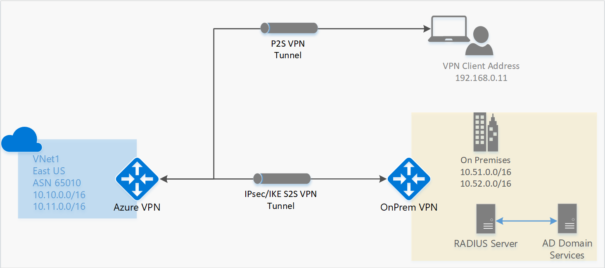
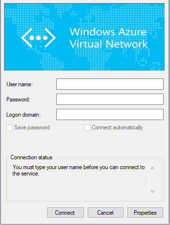
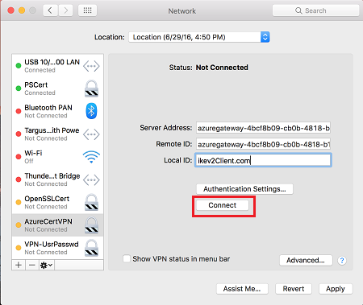

# Configure a Point-to-Site connection to a VNet using RADIUS authentication: PowerShell

This article shows you how to create a VNet with a Point-to-Site connection that uses RADIUS authentication. This configuration is only available for the Resource Manager deployment model.

A Point-to-Site (P2S) VPN gateway lets you create a secure connection to your virtual network from an individual client computer. Point-to-Site VPN connections are useful when you want to connect to your VNet from a remote location, such as when you are telecommuting from home or a conference. A P2S VPN is also a useful solution to use instead of a Site-to-Site VPN when you have only a few clients that need to connect to a VNet.

A P2S VPN connection is started from Windows and Mac devices. Connecting clients can use the following authentication methods: 

* RADIUS server
* VPN Gateway native certificate authentication

This article helps you configure a P2S configuration with authentication using RADIUS server. If you want to authenticate using generated certificates and VPN gateway native certificate authentication instead, see [Configure a Point-to-Site connection to a VNet using VPN gateway native certificate authentication](vpn-gateway-howto-point-to-site-rm-ps.md).


Point-to-Site connections do not require a VPN device or a public-facing IP address. P2S creates the VPN connection over either SSTP (Secure Socket Tunneling Protocol), or IKEv2.

* SSTP is an SSL-based VPN tunnel that is supported only on Windows client platforms. It can penetrate firewalls, which makes it an ideal option to connect to Azure from anywhere. On the server side, we support SSTP versions 1.0, 1.1, and 1.2. The client decides which version to use. For Windows 8.1 and above, SSTP uses 1.2 by default.

* IKEv2 VPN, a standards-based IPsec VPN solution. IKEv2 VPN can be used to connect from Mac devices (OSX versions 10.11 and above).

P2S connections require the following:

* A RouteBased VPN gateway. 
* A RADIUS server to handle user authentication. The RADIUS server can be deployed on-premises, or in the Azure VNet.
* A VPN client configuration package for the Windows devices that will connect to the VNet. A VPN client configuration package provides the settings required for a VPN client to connect over P2S.

[!INCLUDE [updated-for-az](../../includes/updated-for-az.md)]

## <a name="aboutad"></a>About Active Directory (AD) Domain Authentication for P2S VPNs

AD Domain authentication allows users to sign in to Azure using their organization domain credentials. It requires a RADIUS server that integrates with the AD server. Organizations can also leverage their existing RADIUS deployment.
 
The RADIUS server can reside on-premises, or in your Azure VNet. During authentication, the VPN gateway acts as a pass-through and forwards authentication messages back and forth between the RADIUS server and the connecting device. It's important for the VPN gateway to be able to reach the RADIUS server. If the RADIUS server is located on-premises, then a VPN Site-to-Site connection from Azure to the on-premises site is required.

Apart from Active Directory, a RADIUS server can also integrate with other external identity systems. This opens up plenty of authentication options for Point-to-Site VPNs, including MFA options. Check your RADIUS server vendor documentation to get the list of identity systems it integrates with.



> [!IMPORTANT]
>Only a VPN Site-to-Site connection can be used for connecting to a RADIUS server on-premises. An ExpressRoute connection cannot be used.
>
>

## <a name="before"></a>Before beginning

Verify that you have an Azure subscription. If you don't already have an Azure subscription, you can activate your [MSDN subscriber benefits](https://azure.microsoft.com/pricing/member-offers/msdn-benefits-details) or sign up for a [free account](https://azure.microsoft.com/pricing/free-trial).

[!INCLUDE [powershell](../../includes/vpn-gateway-cloud-shell-powershell-about.md)]

### <a name="example"></a>Example values

You can use the example values to create a test environment, or refer to these values to better understand the examples in this article. You can either use the steps as a walk-through and use the values without changing them, or change them to reflect your environment.

* **Name: VNet1**
* **Address space: 192.168.0.0/16** and **10.254.0.0/16**<br>For this example, we use more than one address space to illustrate that this configuration works with multiple address spaces. However, multiple address spaces are not required for this configuration.
* **Subnet name: FrontEnd**
  * **Subnet address range: 192.168.1.0/24**
* **Subnet name: BackEnd**
  * **Subnet address range: 10.254.1.0/24**
* **Subnet name: GatewaySubnet**<br>The Subnet name *GatewaySubnet* is mandatory for the VPN gateway to work.
  * **GatewaySubnet address range: 192.168.200.0/24** 
* **VPN client address pool: 172.16.201.0/24**<br>VPN clients that connect to the VNet using this Point-to-Site connection receive an IP address from the VPN client address pool.
* **Subscription:** If you have more than one subscription, verify that you are using the correct one.
* **Resource Group: TestRG**
* **Location: East US**
* **DNS Server: IP address** of the DNS server that you want to use for name resolution for your VNet. (optional)
* **GW Name: Vnet1GW**
* **Public IP name: VNet1GWPIP**
* **VpnType: RouteBased**


## <a name="signin"></a>Sign in and set variables

[!INCLUDE [sign in](../../includes/vpn-gateway-cloud-shell-ps-login.md)]

### Declare variables

Declare the variables that you want to use. Use the following sample, substituting the values for your own when necessary. If you close your PowerShell/Cloud Shell session at any point during the exercise, just copy and paste the values again to re-declare the variables.

  ```azurepowershell-interactive
  $VNetName  = "VNet1"
  $FESubName = "FrontEnd"
  $BESubName = "Backend"
  $GWSubName = "GatewaySubnet"
  $VNetPrefix1 = "192.168.0.0/16"
  $VNetPrefix2 = "10.254.0.0/16"
  $FESubPrefix = "192.168.1.0/24"
  $BESubPrefix = "10.254.1.0/24"
  $GWSubPrefix = "192.168.200.0/26"
  $VPNClientAddressPool = "172.16.201.0/24"
  $RG = "TestRG"
  $Location = "East US"
  $GWName = "VNet1GW"
  $GWIPName = "VNet1GWPIP"
  $GWIPconfName = "gwipconf"
  ```

## 1. <a name="vnet"></a>Create the resource group, VNet, and Public IP address

The following steps create a resource group and a virtual network in the resource group with three subnets. When substituting values, it's important that you always name your gateway subnet specifically 'GatewaySubnet'. If you name it something else, your gateway creation fails;

1. Create a resource group.

   ```azurepowershell-interactive
   New-AzResourceGroup -Name "TestRG" -Location "East US"
   ```
2. Create the subnet configurations for the virtual network, naming them *FrontEnd*, *BackEnd*, and *GatewaySubnet*. These prefixes must be part of the VNet address space that you declared.

   ```azurepowershell-interactive
   $fesub = New-AzVirtualNetworkSubnetConfig -Name "FrontEnd" -AddressPrefix "192.168.1.0/24"  
   $besub = New-AzVirtualNetworkSubnetConfig -Name "Backend" -AddressPrefix "10.254.1.0/24"  
   $gwsub = New-AzVirtualNetworkSubnetConfig -Name "GatewaySubnet" -AddressPrefix "192.168.200.0/24"
   ```
3. Create the virtual network.

   In this example, the -DnsServer server parameter is optional. Specifying a value does not create a new DNS server. The DNS server IP address that you specify should be a DNS server that can resolve the names for the resources you are connecting to from your VNet. For this example, we used a private IP address, but it is likely that this is not the IP address of your DNS server. Be sure to use your own values. The value you specify is used by the resources that you deploy to the VNet, not by the P2S connection.

   ```azurepowershell-interactive
   New-AzVirtualNetwork -Name "VNet1" -ResourceGroupName "TestRG" -Location "East US" -AddressPrefix "192.168.0.0/16","10.254.0.0/16" -Subnet $fesub, $besub, $gwsub -DnsServer 10.2.1.3
   ```
4. A VPN gateway must have a Public IP address. You first request the IP address resource, and then refer to it when creating your virtual network gateway. The IP address is dynamically assigned to the resource when the VPN gateway is created. VPN Gateway currently only supports *Dynamic* Public IP address allocation. You cannot request a Static Public IP address assignment. However, this does not mean that the IP address changes after it has been assigned to your VPN gateway. The only time the Public IP address changes is when the gateway is deleted and re-created. It doesn't change across resizing, resetting, or other internal maintenance/upgrades of your VPN gateway.

   Specify the variables to request a dynamically assigned Public IP address.

   ```azurepowershell-interactive
   $vnet = Get-AzVirtualNetwork -Name "VNet1" -ResourceGroupName "TestRG"  
   $subnet = Get-AzVirtualNetworkSubnetConfig -Name "GatewaySubnet" -VirtualNetwork $vnet 
   $pip = New-AzPublicIpAddress -Name "VNet1GWPIP" -ResourceGroupName "TestRG" -Location "East US" -AllocationMethod Dynamic 
   $ipconf = New-AzVirtualNetworkGatewayIpConfig -Name "gwipconf" -Subnet $subnet -PublicIpAddress $pip
   ```

## 2. <a name="radius"></a>Set up your RADIUS server

Before creating and configuring the virtual network gateway, your RADIUS server should be configured correctly for authentication.

1. If you don’t have a RADIUS server deployed, deploy one. For deployment steps, refer to the setup guide provided by your RADIUS vendor.  
2. Configure the VPN gateway as a RADIUS client on the RADIUS. When adding this RADIUS client, specify the virtual network GatewaySubnet that you created. 
3. Once the RADIUS server is set up, get the RADIUS server's IP address and the shared secret that RADIUS clients should use to talk to the RADIUS server. If the RADIUS server is in the Azure VNet, use the CA IP of the RADIUS server VM.

The [Network Policy Server (NPS)](https://docs.microsoft.com/windows-server/networking/technologies/nps/nps-top) article provides guidance about configuring a Windows RADIUS server (NPS) for AD domain authentication.

## 3. <a name="creategw"></a>Create the VPN gateway

Configure and create the VPN gateway for your VNet.

* The -GatewayType must be 'Vpn' and the -VpnType must be 'RouteBased'.
* A VPN gateway can take up to 45 minutes to complete, depending on the [gateway SKU](vpn-gateway-about-vpn-gateway-settings.md#gwsku) you select.

```azurepowershell-interactive
New-AzVirtualNetworkGateway -Name $GWName -ResourceGroupName $RG `
-Location $Location -IpConfigurations $ipconf -GatewayType Vpn `
-VpnType RouteBased -EnableBgp $false -GatewaySku VpnGw1
```

## 4. <a name="addradius"></a>Add the RADIUS server and client address pool
 
* The -RadiusServer can be specified by name or by IP address. If you specify the name and the server resides on-premises, then the VPN gateway may not be able to resolve the name. If that’s the case, then it's better to specify the IP address of the server. 
* The -RadiusSecret should match what is configured on your RADIUS server.
* The -VpnClientAddressPool is the range from which the connecting VPN clients receive an IP address. Use a private IP address range that does not overlap with the on-premises location that you will connect from, or with the VNet that you want to connect to. Ensure that you have a large enough address pool configured.  

1. Create a secure string for the RADIUS secret.

   ```azurepowershell-interactive
   $Secure_Secret=Read-Host -AsSecureString -Prompt "RadiusSecret"
   ```

2. You are prompted to enter the RADIUS secret. The characters that you enter will not be displayed and instead will be replaced by the "*" character.

   ```azurepowershell-interactive
   RadiusSecret:***
   ```
3. Add the VPN client address pool and the RADIUS server information.

   For SSTP configurations:

    ```azurepowershell-interactive
    $Gateway = Get-AzVirtualNetworkGateway -ResourceGroupName $RG -Name $GWName
    Set-AzVirtualNetworkGateway -VirtualNetworkGateway $Gateway `
    -VpnClientAddressPool "172.16.201.0/24" -VpnClientProtocol "SSTP" `
    -RadiusServerAddress "10.51.0.15" -RadiusServerSecret $Secure_Secret
    ```

   For IKEv2 configurations:

    ```azurepowershell-interactive
    $Gateway = Get-AzVirtualNetworkGateway -ResourceGroupName $RG -Name $GWName
    Set-AzVirtualNetworkGateway -VirtualNetworkGateway $Gateway `
    -VpnClientAddressPool "172.16.201.0/24" -VpnClientProtocol "IKEv2" `
    -RadiusServerAddress "10.51.0.15" -RadiusServerSecret $Secure_Secret
    ```

   For SSTP + IKEv2

    ```azurepowershell-interactive
    $Gateway = Get-AzVirtualNetworkGateway -ResourceGroupName $RG -Name $GWName
    Set-AzVirtualNetworkGateway -VirtualNetworkGateway $Gateway `
    -VpnClientAddressPool "172.16.201.0/24" -VpnClientProtocol @( "SSTP", "IkeV2" ) `
    -RadiusServerAddress "10.51.0.15" -RadiusServerSecret $Secure_Secret
    ```

## 5. <a name="vpnclient"></a>Download the VPN client configuration package and set up the VPN client

The VPN client configuration lets devices connect to a VNet over a P2S connection. To generate a VPN client configuration package and set up the VPN client, see [Create a VPN Client Configuration for RADIUS authentication](point-to-site-vpn-client-configuration-radius.md).

## <a name="connect"></a>6. Connect to Azure

### To connect from a Windows VPN client

1. To connect to your VNet, on the client computer, navigate to VPN connections and locate the VPN connection that you created. It is named the same name as your virtual network. Enter your domain credentials and click 'Connect'. A pop-up message requesting elevated rights appears. Accept it and enter the credentials.

   
2. Your connection is established.

   

### Connect from a Mac VPN client

From the Network dialog box, locate the client profile that you want to use, then click **Connect**.

  

## <a name="verify"></a>To verify your connection

1. To verify that your VPN connection is active, open an elevated command prompt, and run *ipconfig/all*.
2. View the results. Notice that the IP address you received is one of the addresses within the Point-to-Site VPN Client Address Pool that you specified in your configuration. The results are similar to this example:

   ```
   PPP adapter VNet1:
      Connection-specific DNS Suffix .:
      Description.....................: VNet1
      Physical Address................:
      DHCP Enabled....................: No
      Autoconfiguration Enabled.......: Yes
      IPv4 Address....................: 172.16.201.3(Preferred)
      Subnet Mask.....................: 255.255.255.255
      Default Gateway.................:
      NetBIOS over Tcpip..............: Enabled
   ```

To troubleshoot a P2S connection, see [Troubleshooting Azure point-to-site connections](vpn-gateway-troubleshoot-vpn-point-to-site-connection-problems.md).

## <a name="connectVM"></a>To connect to a virtual machine

[!INCLUDE [Connect to a VM](../../includes/vpn-gateway-connect-vm-p2s-include.md)]

## <a name="faq"></a>FAQ

This FAQ applies to P2S using RADIUS authentication

[!INCLUDE [Point-to-Site RADIUS FAQ](../../includes/vpn-gateway-faq-p2s-radius-include.md)]

## Next steps

Once your connection is complete, you can add virtual machines to your virtual networks. For more information, see [Virtual Machines](https://docs.microsoft.com/azure/). To understand more about networking and virtual machines, see [Azure and Linux VM network overview](../virtual-machines/linux/azure-vm-network-overview.md).
