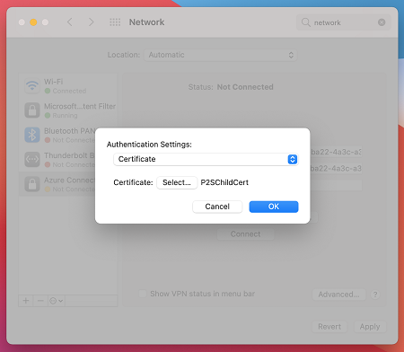
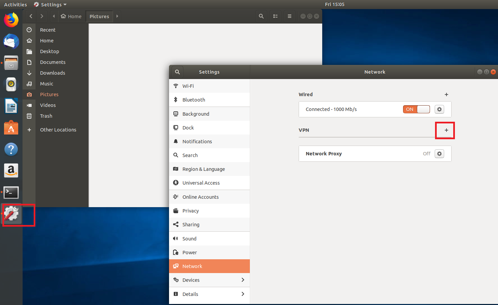
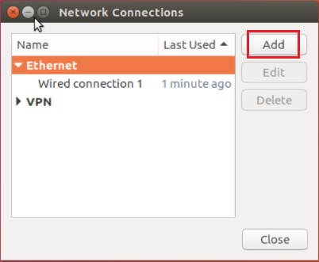
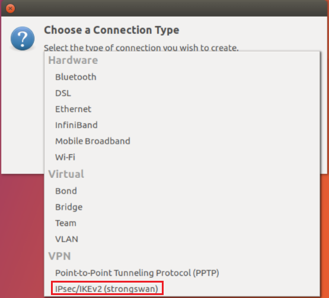
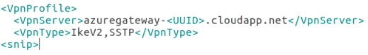
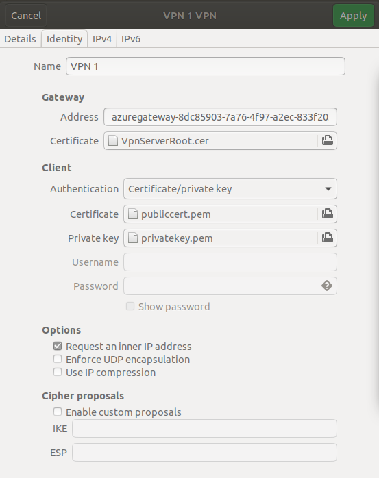

# Create and install VPN client configuration files for native Azure certificate authentication P2S configurations

VPN client configuration files are contained in a zip file. Configuration files provide the settings required for a native Windows, Mac IKEv2 VPN, or Linux clients to connect to a VNet over Point-to-Site connections that use native Azure certificate authentication. For more information about Point-to-Site connections, see [About Point-to-Site VPN](point-to-site-about.md).

>[!IMPORTANT]
>[!INCLUDE [TLS](../../includes/vpn-gateway-tls-change.md)]
>

>[!NOTE]
>Client configuration files are specific to the VPN configuration for the VNet. If there are any changes to the Point-to-Site VPN configuration after you generate the VPN client configuration files, such as the VPN protocol type or authentication type, be sure to generate new VPN client configuration files for your user devices.
>
>

## <a name="generate"></a>Generate VPN client configuration files

Before you begin, make sure that all connecting users have a valid certificate installed on the user's device. For more information about installing a client certificate, see [Install a client certificate](point-to-site-how-to-vpn-client-install-azure-cert.md).

You can generate client configuration files using PowerShell, or by using the Azure portal. Either method returns the same zip file. Unzip the file to view the following folders:

  * **WindowsAmd64** and **WindowsX86**, which contain the Windows 32-bit and 64-bit installer packages, respectively. The **WindowsAmd64** installer package is for all supported 64-bit Windows clients, not just Amd.
  * **Generic**, which contains general information used to create your own VPN client configuration. The Generic folder is provided if IKEv2 or SSTP+IKEv2 was configured on the gateway. If only SSTP is configured, then the Generic folder is not present.

### <a name="zipportal"></a>Generate files using the Azure portal

1. In the Azure portal, navigate to the virtual network gateway for the virtual network that you want to connect to.
2. On the virtual network gateway page, click **Point-to-site configuration**.
3. At the top of the Point-to-site configuration page, click **Download VPN client**. It takes a few minutes for the client configuration package to generate.
4. Your browser indicates that a client configuration zip file is available. It is named the same name as your gateway. Unzip the file to view the folders.

### <a name="zipps"></a>Generate files using PowerShell

1. When generating VPN client configuration files, the value for '-AuthenticationMethod' is 'EapTls'. Generate the VPN client configuration files using the following command:

  ```powershell
  $profile=New-AzureRmVpnClientConfiguration -ResourceGroupName "TestRG" -Name "VNet1GW" -AuthenticationMethod "EapTls"

  $profile.VPNProfileSASUrl
  ```
2. Copy the URL to your browser to download the zip file, then unzip the file to view the folders.

## <a name="installwin"></a>Windows

You can use the same VPN client configuration package on each Windows client computer, as long as the version matches the architecture for the client. For the list of client operating systems that are supported, see the Point-to-Site section of the [VPN Gateway FAQ](vpn-gateway-vpn-faq.md#P2S).

>[!NOTE]
>You must have Administrator rights on the Windows client computer from which you want to connect.
>
>

Use the following steps to configure the native Windows VPN client for certificate authentication:

1. Select the VPN client configuration files that correspond to the architecture of the Windows computer. For a 64-bit processor architecture, choose the 'VpnClientSetupAmd64' installer package. For a 32-bit processor architecture, choose the 'VpnClientSetupX86' installer package. 
2. Double-click the package to install it. If you see a SmartScreen popup, click **More info**, then **Run anyway**.
3. On the client computer, navigate to **Network Settings** and click **VPN**. The VPN connection shows the name of the virtual network that it connects to. 
4. Before you attempt to connect, verify that you have installed a client certificate on the client computer. A client certificate is required for authentication when using the native Azure certificate authentication type. For more information about generating certificates, see [Generate Certificates](vpn-gateway-howto-point-to-site-resource-manager-portal.md#generatecert). For information about how to install a client certificate, see [Install a client certificate](point-to-site-how-to-vpn-client-install-azure-cert.md).

## <a name="installmac"></a>Mac (OS X)

 You have to manually configure the native IKEv2 VPN client on every Mac that will connect to Azure. Azure does not provide mobileconfig file for native Azure certificate authentication. The **Generic** contains all of the information that you need for configuration. If you don't see the Generic folder in your download, it's likely that IKEv2 was not selected as a tunnel type. Once IKEv2 is selected, generate the zip file again to retrieve the Generic folder.<br>The Generic folder contains the following files:

* **VpnSettings.xml**, which contains important settings like server address and tunnel type. 
* **VpnServerRoot.cer**, which contains the root certificate required to validate the Azure VPN Gateway during P2S connection setup.

Use the following steps to configure the native VPN client on Mac for certificate authentication. You have to complete these steps on every Mac that will connect to Azure:

1. Import the **VpnServerRoot** root certificate to your Mac. This can be done by copying the file over to your Mac and double-clicking on it.  
Click **Add** to import.

  
  
    >[!NOTE]
    >Double-clicking on the certificate may not display the **Add** dialog, but the certificate is installed in the correct store. You can check for the certificate in the login keychain under the certificates category.
    >
  
2. Verify that you have installed a client certificate that was issued by the root certificate that you uploaded to Azure when you configured you P2S settings. This is different from the VPNServerRoot that you installed in the previous step. The client certificate is used for authentication and is required. For more information about generating certificates, see [Generate Certificates](vpn-gateway-howto-point-to-site-resource-manager-portal.md#generatecert). For information about how to install a client certificate, see [Install a client certificate](point-to-site-how-to-vpn-client-install-azure-cert.md).
3. Open the **Network** dialog under **Network Preferences** and click **'+'** to create a new VPN client connection profile for a P2S connection to the Azure VNet.

  The **Interface** value is 'VPN' and **VPN Type** value is 'IKEv2'. Specify a name for the profile in the **Service Name** field, then click **Create** to create the VPN client connection profile.

  
4. In the **Generic** folder, from the **VpnSettings.xml** file, copy the **VpnServer** tag value. Paste this value in the **Server Address** and **Remote ID** fields of the profile.

  
5. Click **Authentication Settings** and select **Certificate**. 

  
6. Click **Select…** to choose the client certificate that you want to use for authentication. This is the certificate that you installed in Step 2.

  
7. **Choose An Identity** displays a list of certificates for you to choose from. Select the proper certificate, then click **Continue**.

  
8. In the **Local ID** field, specify the name of the certificate (from Step 6). In this example, it is "ikev2Client.com". Then, click **Apply** button to save the changes.

  
9. On the **Network** dialog, click **Apply** to save all changes. Then, click **Connect** to start the P2S connection to the Azure VNet.

## <a name="linuxgui"></a>Linux (strongSwan GUI)

### Extract the key and certificate

For strongSwan, you need to extract the key and the cert from the client certificate (.pfx file) and save them to individual .pem files.
Follow the steps below:

1. Download and install OpenSSL from [OpenSSL](https://www.openssl.org/source/).
2. Open a command-line window and change to the directory where you installed OpenSSL, for example, 'c:\OpenSLL-Win64\bin\'.
3. Run the following command to extract the private key and save it to a new file called 'privatekey.pem' from your client certificate:

  ```
  C:\ OpenSLL-Win64\bin> openssl pkcs12 -in clientcert.pfx -nocerts -out privatekey.pem -nodes
  ```
4.  Now run the following command to extract the public cert and save it to a new file:

  ```
  C:\ OpenSLL-Win64\bin> openssl pkcs12 -in clientcert.pfx -nokeys -out publiccert.pem -nodes
  ```

### <a name="install"></a>Install and configure

The following instructions were created through strongSwan 5.5.1 on Ubuntu 17.0.4. Ubuntu 16.0.10 does not support strongSwan GUI. If you want to use Ubuntu 16.0.10, you will have to use the [command line](#linuxinstallcli). The examples below may not match screens that you see, depending on your version of Linux and strongSwan.

1. Open the **Terminal** to install **strongSwan** and its Network Manager by running the command in the example. If you receive an error that's related to *libcharon-extra-plugins*, replace it with 'strongswan-plugin-eap-mschapv2'.

  ```
  sudo apt-get install strongswan libcharon-extra-plugins moreutils iptables-persistent network-manager-strongswan
  ```
2. Select the **Network Manager** icon (up-arrow/down-arrow), then select **Edit Connections**.

  
3. Click the **Add** button to create a new connection.

  
4. Select **IPsec/IKEv2 (strongswan)** from the drop-down menu, and then click **Create**. You can rename your connection in this step.

  
5. Open the **VpnSettings.xml** file from the **Generic** folder contained in the downloaded client configuration files. Find the tag called **VpnServer** and copy the name, beginning with 'azuregateway' and ending with '.cloudapp.net'.

  
6. Paste this name into the **Address** field of your new VPN connection in the **Gateway** section. Next, select the folder icon at the end of the **Certificate** field, browse to the **Generic** folder, and select the **VpnServerRoot** file.
7. In the **Client** section of the connection, for **Authentication**, select **Certificate/private key**. For **Certificate** and **Private key**, choose the certificate and the private key that were created earlier. In **Options**, select **Request an inner IP address**. Then, click **Add**.

  
8. Click the **Network Manager** icon (up-arrow/down-arrow) and hover over **VPN Connections**. You see the VPN connection that you created. Click to initiate the connection.

## <a name="linuxinstallcli"></a>Linux (strongSwan CLI)

### Install strongSwan

You can use the following CLI commands, or use the strongSwan steps in the [GUI](#install) to install strongSwan.

1. `apt-get install strongswan-ikev2 strongswan-plugin-eap-tls`
2. `apt-get install libstrongswan-standard-plugins`

### Install and configure

1. Download the VPNClient package from Azure portal.
2. Extract the File.
3. From the **Generic** folder, copy or move the VpnServerRoot.cer to /etc/ipsec.d/cacerts.
4. From the **Generic** folder, copy or move cp client.p12 to /etc/ipsec.d/private/.
5. Open VpnSettings.xml file and copy the <VpnServer> value. You will use this value in the next step.
6. Adjust the values in the example below, then add the example to the /etc/ipsec.conf configuration.
  
  ```
  conn azure
  keyexchange=ikev2
  type=tunnel
  leftfirewall=yes
  left=%any
  leftauth=eap-tls
  leftid=%client # use the DNS alternative name prefixed with the %
  right= Enter the VPN Server value here# Azure VPN gateway address
  rightid=%Enter the VPN Server value here# Azure VPN gateway address, prefixed with %
  rightsubnet=0.0.0.0/0
  leftsourceip=%config
  auto=add
  ```
6. Add the following to */etc/ipsec.secrets*.

  ```
  : P12 client.p12 'password' # key filename inside /etc/ipsec.d/private directory
  ```

7. Run the following commands:

  ```
  # ipsec restart
  # ipsec up azure
  ```

## Next steps

Return to the article to [complete your P2S configuration](vpn-gateway-howto-point-to-site-rm-ps.md).

To troubleshoot P2S connections, see the following articles:

  * [Troubleshooting Azure point-to-site connections](vpn-gateway-troubleshoot-vpn-point-to-site-connection-problems.md)
  * [Troubleshoot VPN connections from Mac OS X VPN clients](vpn-gateway-troubleshoot-point-to-site-osx-ikev2.md)
