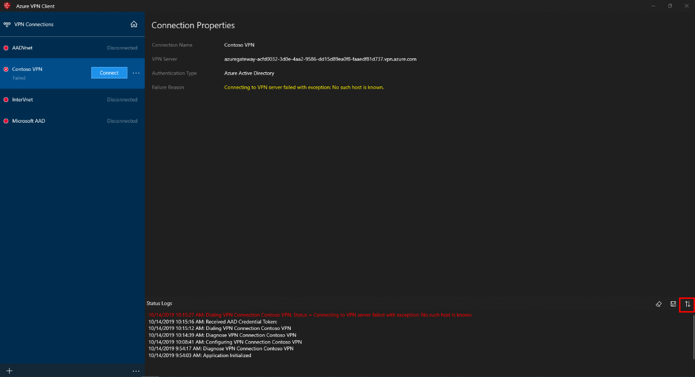
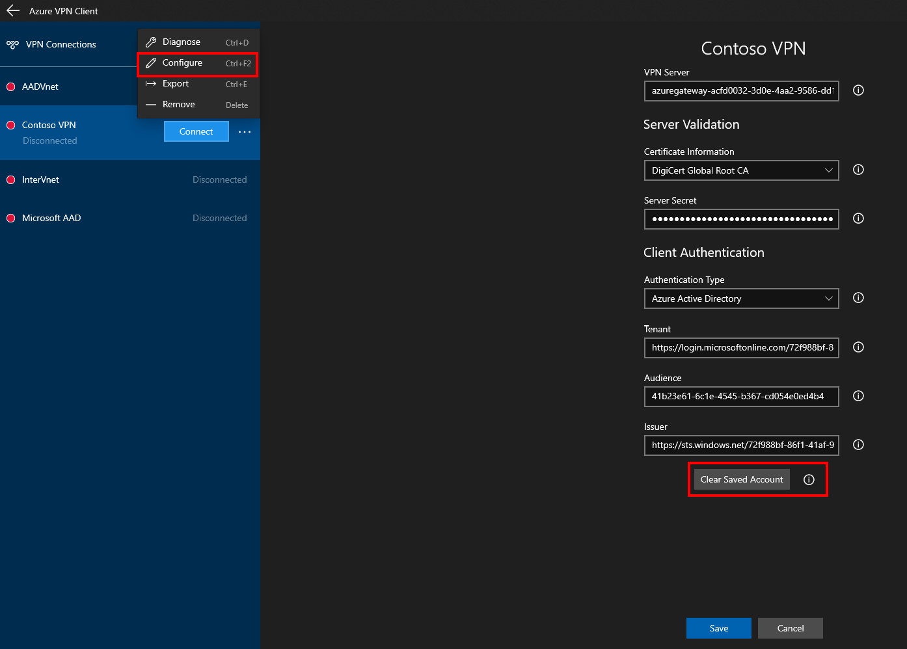
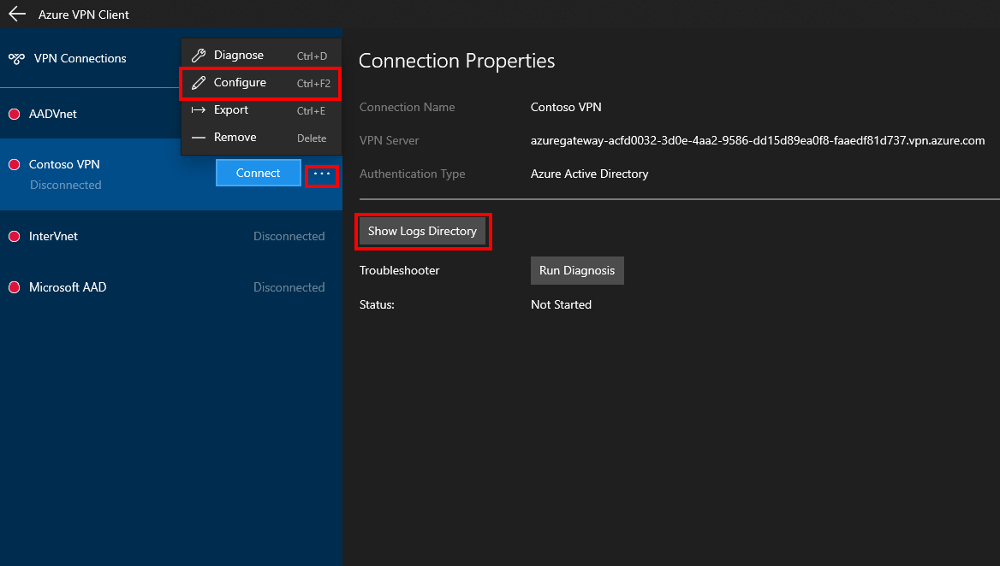
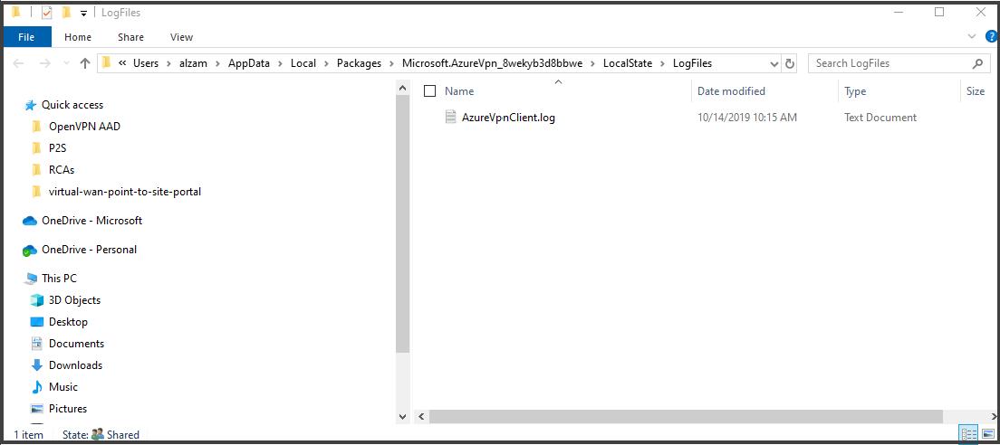

# Troubleshoot a Microsoft Entra authentication VPN client

This article helps you troubleshoot a VPN client to connect to a virtual network using Point-to-Site VPN and Microsoft Entra authentication.

## View Status Log

View the status log for error messages.

1. Click the arrows icon at the bottom-right corner of the client window to show the **Status Logs**.
2. Check the logs for errors that may indicate the problem.
3. Error messages are displayed in red.

## Clear sign-in information

Clear the sign-in information.

1. Select the … next to the profile that you want to troubleshoot. Select **Configure -> Clear Saved Account**.
2. Select **Save**.
3. Try to connect.
4. If the connection still fails, continue to the next section.

## Run diagnostics

Run diagnostics on the VPN client.

1. Click the **…** next to the profile that you want to run diagnostics on. Select **Diagnose -> Run Diagnosis**.
2. The client will run a series of tests and display the result of the test

   * Internet Access – Checks to see if the client has Internet connectivity
   * Client Credentials – Check to see if the Microsoft Entra authentication endpoint is reachable
   * Server Resolvable – Contacts the DNS server to resolve the IP address of the configured VPN server
   * Server Reachable – Checks to see if the VPN server is responding or not
3. If any of the tests fail, contact your network administrator to resolve the issue.
4. The next section shows you how to collect the logs, if needed.

## Collect client log files

Collect the VPN client log files. The log files can be sent to support/administrator via a method of your choosing. For example, e-mail.

1. Click the “…” next to the profile that you want to run diagnostics on. Select **Diagnose -> Show Logs Directory**.

   
2. Windows Explorer opens to the folder that contains the log files.

   

## Next steps

For more information, see [Create a Microsoft Entra tenant for P2S Open VPN connections that use Microsoft Entra authentication](openvpn-azure-ad-tenant.md).
