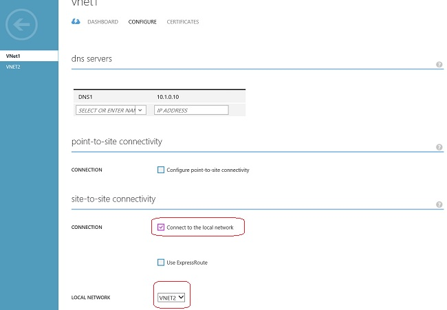

<properties
   pageTitle="Configure a VNet-to-VNet connection | Microsoft Azure"
   description="How to connect Azure virtual networks together in the same or different subscriptions or regions using PowerShell and the Azure Classic Portal. This article applies to VNets create using the classic deployment model."
   services="vpn-gateway"
   documentationCenter="na"
   authors="cherylmc"
   manager="carmonm"
   editor=""
   tags="azure-service-management"/>

<tags
   ms.service="vpn-gateway"
   ms.devlang="na"
   ms.topic="article"
   ms.tgt_pltfrm="na"
   ms.workload="infrastructure-services"
   ms.date="05/02/2016"
   ms.author="cherylmc"/>

# Configure a VNet-to-VNet connection for the classic deployment model

> [AZURE.SELECTOR]
- [Azure Classic Portal](virtual-networks-configure-vnet-to-vnet-connection.md)
- [PowerShell - Azure Resource Manager](vpn-gateway-vnet-vnet-rm-ps.md)

This article will walk you through the steps to create and connect virtual networks together using the classic deployment model (also known as Service Management). The steps below use a combination of the Azure classic portal and PowerShell.

**About Azure deployment models**

[AZURE.INCLUDE [vpn-gateway-clasic-rm](../../includes/vpn-gateway-classic-rm-include.md)]

**Deployment models and tools for VNet-to-VNet**

A VNet-to-VNet connection can be configured in both deployment models and by using several different tools. See the table below for more information. We update this table as new articles, new deployment models, and additional tools become available for this configuration. When an article is available, we link directly to it from the table.

[AZURE.INCLUDE [vpn-gateway-table-vnet-to-vnet](../../includes/vpn-gateway-table-vnet-to-vnet-include.md)]

## About VNet-to-VNet connections

Connecting a virtual network to another virtual network (VNet-to-VNet) is very similar to connecting a virtual network to an on-premises site location. Both connectivity types use a VPN gateway to provide a secure tunnel using IPsec/IKE. The VNets you connect can be in different subscriptions and different regions. You can even combine VNet to VNet communication with multi-site configurations. This lets you establish network topologies that combine cross-premises connectivity with inter-virtual network connectivity, as shown in the diagram below:

### Why connect virtual networks?

You may want to connect virtual networks for the following reasons:

- **Cross region geo-redundancy and geo-presence**
	- You can set up your own geo-replication or synchronization with secure connectivity without going over internet-facing endpoints.
	- With Azure Load Balancer and Microsoft or third-party clustering technology, you can setup highly available workload with geo-redundancy across multiple Azure regions. One important example is to setup SQL Always On with Availability Groups spreading across multiple Azure regions.

- **Regional multi-tier applications with strong isolation boundary**
	- Within the same region, you can setup multi-tier applications with multiple virtual networks connected together with strong isolation and secure inter-tier communication.

- **Cross subscription, inter-organization communication in Azure**
	- If you have multiple Azure subscriptions, you can connect workloads from different subscriptions together securely between virtual networks.
	- For enterprises or service providers, you can enable cross organization communication with secure VPN technology within Azure.

### VNet-to-VNet FAQ

- The virtual networks can be in the same or different subscriptions.

- The virtual networks can be in the same or different Azure regions (locations).

- A cloud service or a load balancing endpoint CANNOT span across virtual networks, even if they are connected together.

- Connecting multiple virtual networks together doesn't require any on-premises VPN gateways, unless cross-premises connectivity is required.

- VNet-to-VNet supports connecting Azure Virtual Networks. It does not support connecting virtual machines or cloud services NOT in a virtual network.

- VNet-to-VNet requires Azure VPN gateways with dynamic routing VPNs. Azure static routing VPN gateways are not supported.

- Virtual network connectivity can be used simultaneously with multi-site VPNs, with a maximum of 10 VPN tunnels for a virtual network VPN gateway connecting to ether other virtual networks or on-premises sites.

- The address spaces of the virtual networks and on-premises local network sites must not overlap. Overlapping address spaces will cause the creation of virtual networks or uploading netcfg configuration files to fail.

- Redundant tunnels between a pair of virtual networks are not supported.

- All VPN tunnels of the virtual network, including P2S VPNs, share the available bandwidth on the Azure VPN gateway and the same VPN gateway uptime SLA in Azure.

- VNet-to-VNet traffic travels across the Azure backbone.

## Configuring a VNet-to-VNet connection

In this procedure, we’ll walk you through connecting two virtual networks, VNet1 and VNet2. You’ll need to be comfortable with networking in order to substitute the IP address ranges that are compatible with your network design requirements. From an Azure virtual network, connecting to another Azure virtual network is the same as connecting to an on premises network via site-to-site (S2S) VPN.

This procedure primarily uses the Azure classic portal, however, you must use Microsoft Azure PowerShell cmdlets to connect the VPN gateways.

## Step 1 - Plan your IP address ranges

It’s important to decide the ranges that you’ll use to configure your network configuration file (netcfg). From the perspective of VNet1, VNet2 is just another VPN connection that’s defined in the Azure platform. And from VNet2, VNet1 is just another VPN connection. They’ll both be identifying each other as a local network site. Keep in mind that you must make sure that none of your VNet ranges or local network ranges overlap in any way.

Table 1 shows an example of how to define your VNets. Use the ranges below as a guideline only. Write down the ranges that you’ll be using for your virtual networks. You’ll need this information for later steps.

**Table 1**

|Virtual Network  |Virtual Network Site Definition |Local Network Site Definition|
|:----------------|:-------------------------------|:----------------------------|
|VNet1            |VNet1 (10.1.0.0/16)             |VNet2 (10.2.0.0/16)          |
|VNet2            |VNet2 (10.2.0.0/16)             |VNet1 (10.1.0.0/16)          |

## Step 2 - Create your virtual networks

For the purposes of this tutorial, we’ll create two virtual networks, VNet1 and VNet2. Substitute your own values when creating your VNets. For the purposes of this tutorial, we’ll use the following values for the VNets:

VNet1: Address Space = 10.1.0.0/16; Region=US West

VNet2: Address Space = 10.2.0.0/16; Region=Japan East

1. Log in to the [Azure classic portal](https://manage.windowsazure.com). Note that these steps do not use the newer Azure Portal.

2. In the lower left-hand corner of the screen, click **New**. In the navigation pane, click **Network Services**, and then click **Virtual Network**. Click **Custom Create** to begin the configuration wizard.

**On the Virtual Network Details page**, enter the information below.

  

  - **Name** - Name your virtual network. For example, VNet1.
  - **Location** – When you create a virtual network, you associate it with an Azure location (region). For example, if you want your VMs that are deployed to your virtual network to be physically located in West US, select that location. You can’t change the location associated with your virtual network after you create it.

**On the DNS Servers and VPN Connectivity page**, enter the following information, and then click the next arrow on the lower right.

    

- **DNS Servers** - Enter the DNS server name and IP address, or select a previously registered DNS server from the dropdown. This setting does not create a DNS server, it allows you to specify the DNS servers that you want to use for name resolution for this virtual network. If you want to have name resolution between your virtual networks, you’ll have to configure your own DNS server, rather than using the name resolution that is provided by Azure.

  - Don’t select any of the checkboxes. Just click the arrow on the lower right to move to the next screen.

**On the Virtual Network Address Spaces page**, specify the address range that you want to use for your virtual network. These are the dynamic IP addresses (DIPS) that will be assigned to the VMs and other role instances that you deploy to this virtual network. It’s especially important to select a range that does not overlap with any of the ranges that are used for your on-premises network. You’ll need to coordinate with your network administrator, who may need to carve out a range of IP addresses from your on-premises network address space for you to use for your virtual network.

  

  **Enter the following information**, and then click the checkmark on the lower right to configure your network.

  - **Address Space** - including Starting IP and Address Count. Verify that the address spaces you specify don’t overlap any of the address spaces that you have on your on-premises network. For this example, we’ll use 10.1.0.0/16 for VNet1.
  - **Add subnet** - including Starting IP and Address Count. Additional subnets are not required, but you may want to create a separate subnet for VMs that will have static DIPS. Or you might want to have your VMs in a subnet that is separate from your other role instances.

**Click the checkmark** on the lower right of the page and your virtual network will begin to create. When it completes, you will see *Created* listed under *Status* on the *Networks* page in the Azure classic portal.

## Step 3 - Create another virtual network

Next, repeat the preceding steps to create another virtual network. In this exercise, you'll later connect these two virtual networks. Note that it's very important not to have duplicate or overlapping address spaces. For the purposes of this tutorial, use these values: 

- **VNet2**
- **Address Space** = 10.2.0.0/16
- **Region** = Japan East

## Step 4 - Add local networks

When you create a VNet-to-VNet configuration, you need to configure each VNet to identify each other as a local network site. In this procedure, you’ll configure each VNet as a local network. If you already have previously configured VNets, this is how you would add them as local networks in the Azure classic portal.

1. In the lower left-hand corner of the screen, click **New**. In the navigation pane, click **Network Services**, and then click **Virtual Network**. Click **Add Local Network**

2. On the **Specify your local network details** page, for **Name**, enter the name of a virtual network that you want to use in your VNet-to-VNet configuration. For this example, we’ll use VNet 1, as we’ll be pointing VNet2 to this virtual network for our configuration.

  For VPN Device IP Address, use any IP address. Typically, you’d use the actual external IP address for a VPN device. For VNet-to-VNet configurations, you will use the Gateway IP address. But, given that you’ve not created the gateway yet, we use the IP address that you specify here as a placeholder. You will then go back into these settings and configure them with the corresponding gateway IP addresses once Azure generates it.

3. On the **Specify the address page**, you will put in the actual IP address range and address count for VNet1. This must correspond exactly to the range that you specified earlier for VNet1.

4. After configuring VNet1 as a local network, go back and configure VNet2 using the values that correspond to that VNet.

5. Now you’ll point each VNet to the other as a local network. In the Azure classic portal, go to the **Configure** page for VNet1. Under **site-to-site connectivity**, select **Connect to the local network**, then select **VNET2** as the local network.

    

6. In the **virtual network address spaces** section on the same page, click **add gateway subnet**, then click the **save** icon at the bottom of the page to save your configuration.

7. Repeat the step for VNet2 to specify VNet1 as a local network.

## Step 5 - Create the dynamic routing gateways for each VNet

Now that you have each VNet configured, you’ll configure your VNet gateways.

1. On the **Networks** page, verify that the status column for your virtual network is **Created**.

2. In the **Name** column, click the name of your virtual network.

3. On the **Dashboard** page, notice that this VNet doesn’t have a gateway configured yet. You’ll see this status change as you go through the steps to configure your gateway.

4. At the bottom of the page, click **Create Gateway**.

  You must select **Dynamic Routing**. When the system prompts you to confirm that you want the gateway created, click Yes.

    

5. When your gateway is creating, notice the gateway graphic on the page changes to yellow and says Creating Gateway. It typically takes about 15 minutes for the gateway to create.

6. Repeat the same steps for your other VNet, being sure to select **Dynamic Gateway**. You don’t need the first VNet gateway to complete before you begin to create the gateway for your other VNet.

7. When the gateway status changes to Connecting, the IP address for each gateway will be visible in the Dashboard. Write down the IP address that corresponds to each VNet, taking care not to mix them up. These are the IP addresses that will be used when you edit your placeholder IP addresses for the VPN Device in **Local Networks**.

## Step 6 - Edit the local network

1. On the **Local Networks** page, click the name of the Local Network name that you want to edit, then click **Edit** at the bottom of the page. For **VPN Device IP address**, input the IP address of the gateway that corresponds to the VNet. For example, for VNet1, put in the gateway IP address assigned to VNet1. Then click the arrow at the bottom of the page.

2. On the **Specify the address space** page, click the checkmark on the lower right without making any changes.

## Step 7 - Connect the VPN gateways

When all of the previous steps have been completed, you’ll set the IPsec/IKE pre-shared keys to be the same. You can do this either using a REST API, or PowerShell cmdlet. If you use PowerShell, verify that you have the [latest version](https://azure.microsoft.com/downloads/) of the Microsoft Azure PowerShell cmdlets. The examples below use PowerShell cmdlets to set the key value to A1b2C3D4. Note that both use the same key value. Edit the examples below to reflect your own values.

For VNet1

	Set-AzureVNetGatewayKey -VNetName VNet1 -LocalNetworkSiteName VNet2 -SharedKey A1b2C3D4

For VNet2

	Set-AzureVNetGatewayKey -VNetName VNet2 -LocalNetworkSiteName VNet1 -SharedKey A1b2C3D4

Wait for the connections to initialize. Once the gateway has initialized, the gateway will look like the graphic below and your virtual networks are connected.

  

[AZURE.INCLUDE [vpn-gateway-no-nsg-include](../../includes/vpn-gateway-no-nsg-include.md)] 

## Next steps

Once your connection is complete, you can add virtual machines to your virtual networks. See the [Virtual Machines documentation](https://azure.microsoft.com/documentation/services/virtual-machines/) for more information.

[1]: ../hdinsight-hbase-geo-replication-configure-vnets.md
[2]: http://channel9.msdn.com/Series/Getting-started-with-Windows-Azure-HDInsight-Service/Configure-the-VPN-connectivity-between-two-Azure-virtual-networks
 
