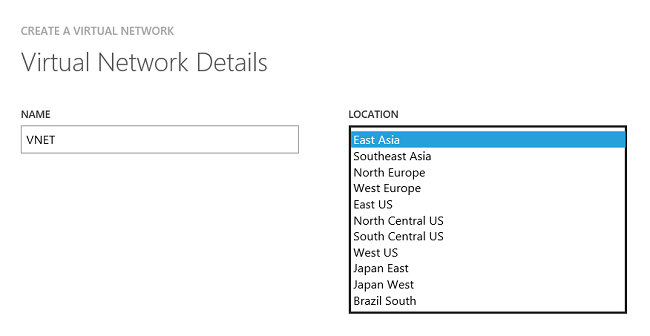
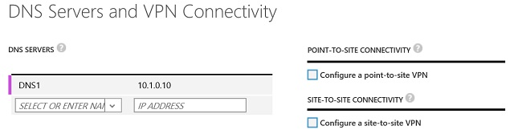
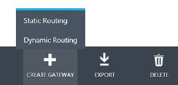

<properties
   pageTitle="Configure a VNet-to-VNet connection for the classic deployment model| Microsoft Azure"
   description="How to connect Azure virtual networks together using PowerShell and the Azure classic portal."
   services="vpn-gateway"
   documentationCenter="na"
   authors="cherylmc"
   manager="carmonm"
   editor=""
   tags="azure-service-management"/>

<tags
   ms.service="vpn-gateway"
   ms.devlang="na"
   ms.topic="article"
   ms.tgt_pltfrm="na"
   ms.workload="infrastructure-services"
   ms.date="08/02/2016"
   ms.author="cherylmc"/>

# Configure a VNet-to-VNet connection for the classic deployment model

> [AZURE.SELECTOR]
- [Azure Classic Portal](virtual-networks-configure-vnet-to-vnet-connection.md)
- [PowerShell - Azure Resource Manager](vpn-gateway-vnet-vnet-rm-ps.md)

This article will walk you through the steps to create and connect virtual networks together using the classic deployment model (also known as Service Management). The steps below use the Azure classic portal to create the VNets and gateways and PowerShell to configure the VNet-to-VNet connection. You cannot configure the VNet-to-VNet connection in the portal.

**About Azure deployment models**

[AZURE.INCLUDE [vpn-gateway-clasic-rm](../../includes/vpn-gateway-classic-rm-include.md)]

**Deployment models and tools for VNet-to-VNet**

A VNet-to-VNet connection can be configured in both deployment models and by using several different tools. See the table below for more information. We update this table as new articles, new deployment models, and additional tools become available for this configuration. When an article is available, we link directly to it from the table.

[AZURE.INCLUDE [vpn-gateway-table-vnet-to-vnet](../../includes/vpn-gateway-table-vnet-to-vnet-include.md)]

## About VNet-to-VNet connections

Connecting a virtual network to another virtual network (VNet-to-VNet) is very similar to connecting a virtual network to an on-premises site location. Both connectivity types use a VPN gateway to provide a secure tunnel using IPsec/IKE. 

The VNets you connect can be in different subscriptions and different regions. You can combine VNet to VNet communication with multi-site configurations. This lets you establish network topologies that combine cross-premises connectivity with inter-virtual network connectivity, as shown in the diagram below:

### Why connect virtual networks?

You may want to connect virtual networks for the following reasons:

- **Cross region geo-redundancy and geo-presence**
	- You can set up your own geo-replication or synchronization with secure connectivity without going over Internet-facing endpoints.
	- With Azure Load Balancer and Microsoft or third-party clustering technology, you can set up highly available workload with geo-redundancy across multiple Azure regions. One important example is to setup SQL Always On with Availability Groups spreading across multiple Azure regions.

- **Regional multi-tier applications with strong isolation boundary**
	- Within the same region, you can setup multi-tier applications with multiple virtual networks connected together with strong isolation and secure inter-tier communication.

- **Cross subscription, inter-organization communication in Azure**
	- If you have multiple Azure subscriptions, you can connect workloads from different subscriptions together securely between virtual networks.
	- For enterprises or service providers, you can enable cross-organization communication with secure VPN technology within Azure.

### VNet-to-VNet FAQ for classic VNets

- The virtual networks can be in the same or different subscriptions.

- The virtual networks can be in the same or different Azure regions (locations).

- A cloud service or a load balancing endpoint can't span across virtual networks, even if they are connected together.

- Connecting multiple virtual networks together doesn't require any VPN devices unless cross-premises connectivity is required.

- VNet-to-VNet supports connecting Azure Virtual Networks. It does not support connecting virtual machines or cloud services that are not deployed to a virtual network.

- VNet-to-VNet requires dynamic routing gateways. Azure static routing gateways are not supported.

- Virtual network connectivity can be used simultaneously with multi-site VPNs, with a maximum of 10 VPN tunnels for a virtual network VPN gateway connecting to either other virtual networks, or on-premises sites.

- The address spaces of the virtual networks and on-premises local network sites must not overlap. Overlapping address spaces will cause the creation of virtual networks or uploading netcfg configuration files to fail.

- Redundant tunnels between a pair of virtual networks are not supported.

- All VPN tunnels of the virtual network, including P2S VPNs, share the available bandwidth on the Azure VPN gateway and the same VPN gateway uptime SLA in Azure.

- VNet-to-VNet traffic travels across the Azure backbone.

## Step 1 - Plan your IP address ranges

It’s important to decide the ranges that you’ll use to configure your virtual networks. Keep in mind that for this configuration, you must make sure that none of your VNet ranges overlap with each other, or with any of the local networks that they connect to.

The table below shows an example of how to define your VNets. Use the ranges below as a guideline only. Write down the ranges that you’ll be using for your virtual networks. You’ll need this information for later steps.

**Example settings**

|Virtual Network  |Address Space               |Region      |Connects to local network site|
|:----------------|:---------------------------|:-----------|:-----------------------------|
|VNet1            |VNet1 (10.1.0.0/16)         |US West     |VNet2Local (10.2.0.0/16)      |
|VNet2            |VNet2 (10.2.0.0/16)         |Japan East  |VNet1Local (10.1.0.0/16)      |
  
## Step 2 - Create VNet1

In the examples below, we’ll create two virtual networks, VNet1 and VNet2. When using any of the examples, be sure to substitute your own values.

1. Log in to the [Azure classic portal](https://manage.windowsazure.com). Note that these steps do not use the newer Azure Portal.

2. In the lower left-hand corner of the screen, click **New** > **Network Services** > **Virtual Network** > **Custom Create** to begin the configuration wizard.

### Virtual Network Details

On the Virtual Network Details page, enter the information below.

  

  - **Name** - Name your virtual network. For example, VNet1.
  - **Location** – When you create a virtual network, you associate it with an Azure location (region). For example, if you want your VMs that are deployed to your virtual network to be physically located in West US, select that location. You can’t change the location associated with your virtual network after you create it.

### DNS Servers and VPN Connectivity

On the DNS Servers and VPN Connectivity page, enter the following information, and then click the next arrow on the lower right.

    

- **DNS Servers** - Enter the DNS server name and IP address, or select a previously registered DNS server from the dropdown. This setting does not create a DNS server; it allows you to specify the DNS servers that you want to use for name resolution for this virtual network. If you want to have name resolution between your virtual networks, you’ll have to configure your own DNS server, rather than using the name resolution that is provided by Azure.

- Don’t select any of the checkboxes for P2S or S2S connectivity. Just click the arrow on the lower right to move to the next screen.

### Virtual Network Address Spaces

On the Virtual Network Address Spaces page, specify the address range that you want to use for your virtual network. These are the dynamic IP addresses (DIPS) that will be assigned to the VMs and other role instances that you deploy to this virtual network. 

It’s especially important to select a range that does not overlap with any of the ranges that are used for your on-premises network. You’ll need to coordinate with your network administrator, who may need to carve out a range of IP addresses from your on-premises network address space for you to use for your virtual network.

  

  - **Address Space** - including Starting IP and Address Count. Verify that the address spaces you specify don’t overlap with any of the address spaces that you have on your on-premises network. For this example, we’ll use 10.1.0.0/16 for VNet1.
  - **Add subnet** - including Starting IP and Address Count. Additional subnets are not required, but you may want to create a separate subnet for VMs that will have static DIPS. Or you might want to have your VMs in a subnet that is separate from your other role instances.
 
**Click the checkmark** on the lower right of the page and your virtual network will begin to create. When it completes, you will see "Created" listed under Status on the Networks page.

## Step 3 - Create VNet2

Next, repeat the preceding steps to create another virtual network. You'll later connect these two virtual networks. Note that it's very important not to have duplicate or overlapping address spaces. You can refer to the [example settings](#step1) in Step 1.

## Step 4 - Add the local network sites

When you create a VNet-to-VNet configuration, you need to configure local network sites, which are shown in the **Local Networks** page of the portal. Azure uses the settings specified in each local network site to determine how to route traffic between the VNets. You determine the name you want to use to refer to each local network site. It's best to use something descriptive, as you will select the value from a dropdown list.

For example, in this exercise, VNet1 will connect to a local network site that you create named "VNet2Local". The settings for VNet2Local will contain the address prefixes for VNet2, as well as a public IP address for the VNet2 gateway. VNet2 will connect to a local network site you create named "VNet1Local" that contains the address prefixes for VNet1 and the public IP address for the VNet1 gateway.

### Add the local network site VNet1Local

1. In the lower left-hand corner of the screen, click **New** > **Network Services** > **Virtual Network** > **Add Local Network**.

2. On the **Specify your local network details** page, for **Name**, enter a name that you want to use to represent the network that you want to connect to. In this example, you can use "VNet1Local" to refer to the IP address ranges and gateway for VNet1.

3. For **VPN Device IP address (optional)**, specify any valid public IP address. Typically, you’d use the actual external IP address for a VPN device. For VNet-to-VNet configurations, you will use the public IP address that is assigned to the gateway for your VNet. But, given that you’ve not yet created the gateway, specify any valid public IP address as a placeholder. Don't leave this blank - it's not optional for this configuration. You will then go back into these settings and configure them with the corresponding gateway IP addresses once Azure generates it. Click the arrow to advance to the next screen.

4. On the **Specify the address page**, you will put in the actual IP address range and address count for VNet1. This must correspond exactly to the range that is configured for VNet1. Azure will use the IP address range that you specify to route the traffic intended for VNet1. Click the checkmark to create the local network.

### Add the local network site VNet2Local

Use the steps above to create the local network site "VNet2Local". You can refer to the values in the [example settings](#step1) in Step 1, if necessary.

### Configure each VNet to point to a local network

Each VNet must point to the respective local network that you want to route traffic to. 

#### For VNet1

1. Navigate to the **Configure** page for virtual network **VNet1**. 
2. Under site-to-site connectivity, select "Connect to the local network", and then select **VNet2Local** as the local network from the dropdown. 
3. Save your settings.

#### For VNet2

1. Navigate to the **Configure** page for virtual network **VNet2**. 
2. Under site-to-site connectivity, select "Connect to the local network", then select **VNet1Local** from the dropdown as the local network. 
3. Save your settings.

## Step 5 - Configure a gateway for each VNet

Configure a Dynamic Routing gateway for each virtual network. This configuration does not support Static Routing gateways.

1. On the **Networks** page, verify that the status column for your virtual network is **Created**.

2. In the **Name** column, click the name of your virtual network. For this example, we'll use VNet1.

3. On the **Dashboard** page, notice that this VNet doesn’t have a gateway configured yet. You’ll see this status change as you go through the steps to configure your gateway.

4. At the bottom of the page, click **Create Gateway** and **Dynamic Routing**. When the system prompts you to confirm that you want the gateway created, click Yes.

  	  

5. When your gateway is creating, notice the gateway graphic on the page changes to yellow and says "Creating Gateway". It typically takes about 30 minutes for the gateway to create.

6. Repeat the same steps for VNet2. You don’t need the first VNet gateway to complete before you begin to create the gateway for your other VNet.

7. When the gateway status changes to "Connecting", the public IP address for each gateway will be visible in the Dashboard. Write down the IP address that corresponds to each VNet, taking care not to mix them up. These are the IP addresses that will be used when you edit your placeholder IP addresses for the VPN Device for each local network.

## Step 6 - Edit the local network

1. On the **Local Networks** page, click the name of the Local Network name that you want to edit, then click **Edit** at the bottom of the page. For **VPN Device IP address**, input the IP address of the gateway that corresponds to the VNet. For example, for VNet1Local, put in the gateway IP address assigned to VNet1. Then click the arrow at the bottom of the page.

2. On the **Specify the address space** page, click the checkmark on the lower right without making any changes.

## Step 7 - Create the VPN connection

When all of the previous steps have been completed, you’ll set the IPsec/IKE pre-shared keys. We'll do this using PowerShell. See [How to install and configure Azure PowerShell](../powershell-install-configure.md) for more information about installing the Azure PowerShell cmdlets. Make sure to download the latest version of the Service Management (SM) cmdlets. 

1. Open Windows PowerShell and login.

		Add-AzureAccount

2. Create the connections. In the examples below, note that the shared key is exactly the same. The shared key must always match.

	VNet1 to VNet2 connection

		Set-AzureVNetGatewayKey -VNetName VNet1 -LocalNetworkSiteName VNet2Local -SharedKey A1b2C3D4

	VNet2 to VNet1 connection

		Set-AzureVNetGatewayKey -VNetName VNet2 -LocalNetworkSiteName VNet1Local -SharedKey A1b2C3D4

3. Wait for the connections to initialize. Once the gateway has initialized, the gateway will look like the graphic below and your virtual networks are connected.

	  

	[AZURE.INCLUDE [vpn-gateway-no-nsg-include](../../includes/vpn-gateway-no-nsg-include.md)] 

## Next steps

Once your connection is complete, you can add virtual machines to your virtual networks. See the [Virtual Machines documentation](https://azure.microsoft.com/documentation/services/virtual-machines/) for more information.

[1]: ../hdinsight-hbase-geo-replication-configure-vnets.md
[2]: http://channel9.msdn.com/Series/Getting-started-with-Windows-Azure-HDInsight-Service/Configure-the-VPN-connectivity-between-two-Azure-virtual-networks
 
