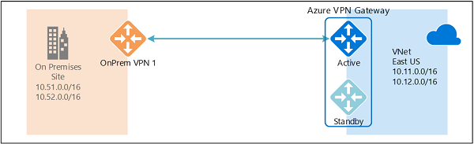

# Sample configuration: Cisco ASA device (IKEv2/no BGP)
This article provides sample configurations for connecting Cisco Adaptive Security Appliance (ASA) devices to Azure VPN gateways. The example applies to Cisco ASA devices that are running IKEv2 without the Border Gateway Protocol (BGP). 

## Device at a glance

|                        |                                   |
| ---                    | ---                               |
| Device vendor          | Cisco                             |
| Device model           | ASA                               |
| Target version         | 8.4 and later                     |
| Tested model           | ASA 5505                          |
| Tested version         | 9.2                               |
| IKE version            | IKEv2                             |
| BGP                    | No                                |
| Azure VPN gateway type | Route-based VPN gateway           |
|                        |                                   |

> [!NOTE]
> The sample configuration connects a Cisco ASA device to an Azure **route-based** VPN gateway. The connection uses a custom IPsec/IKE policy with the **UsePolicyBasedTrafficSelectors** option, as described in [this article](vpn-gateway-connect-multiple-policybased-rm-ps.md).
>
> The sample requires that ASA devices use the **IKEv2** policy with access-list-based configurations, not VTI-based. Consult your VPN device vendor specifications to verify that the IKEv2 policy is supported on your on-premises VPN devices.


## VPN device requirements
Azure VPN gateways use the standard IPsec/IKE protocol suites to establish Site-to-Site (S2S) VPN tunnels. For the detailed IPsec/IKE protocol parameters and default cryptographic algorithms for Azure VPN gateways, see [About VPN devices](vpn-gateway-about-vpn-devices.md).

> [!NOTE]
> You can optionally specify an exact combination of cryptographic algorithms and key strengths for a specific connection, as described in [About cryptographic requirements](vpn-gateway-about-compliance-crypto.md). If you specify an exact combination of algorithms and key strengths, be sure to use the corresponding specifications on your VPN devices.

## Single VPN tunnel
This configuration consists of a single S2S VPN tunnel between an Azure VPN gateway and an on-premises VPN device. You can optionally configure the BGP across the VPN tunnel.



For step-by-step instructions to build the Azure configurations, see [Single VPN tunnel setup](vpn-gateway-3rdparty-device-config-overview.md#singletunnel).

### Virtual network and VPN gateway information
This section lists the parameters for the sample.

| **Parameter**                | **Value**                    |
| ---                          | ---                          |
| Virtual network address prefixes        | 10.11.0.0/16<br>10.12.0.0/16 |
| Azure VPN gateway IP         | Azure_Gateway_Public_IP      |
| On-premises address prefixes | 10.51.0.0/16<br>10.52.0.0/16 |
| On-premises VPN device IP    | OnPrem_Device_Public_IP     |
| * Virtual network BGP ASN                | 65010                        |
| * Azure BGP peer IP           | 10.12.255.30                 |
| * On-premises BGP ASN         | 65050                        |
| * On-premises BGP peer IP     | 10.52.255.254                |
|                              |                              |

\* Optional parameter for BGP only.

### IPsec/IKE policy and parameters
The following table lists the IPsec/IKE algorithms and parameters that are used in the sample. Consult your VPN device specifications to verify the algorithms that are supported for your VPN device models and firmware versions.

| **IPsec/IKEv2**  | **Value**                            |
| ---              | ---                                  |
| IKEv2 Encryption | AES256                               |
| IKEv2 Integrity  | SHA384                               |
| DH Group         | DHGroup24                            |
| * IPsec Encryption | AES256                               |
| * IPsec Integrity  | SHA1                                 |
| PFS Group        | PFS24                                |
| QM SA Lifetime   | 7,200 seconds                         |
| Traffic Selector | UsePolicyBasedTrafficSelectors $True |
| Pre-Shared Key   | PreSharedKey                         |
|                  |                                      |

\* On some devices, IPsec Integrity must be a null value when the IPsec Encryption algorithm is AES-GCM.

### ASA device support

* Support for IKEv2 requires ASA version 8.4 and later.

* Support for DH Group and PFS Group beyond Group 5 requires ASA version 9.x.

* Support for IPsec Encryption with AES-GCM and IPsec Integrity with SHA-256, SHA-384, or SHA-512, requires ASA version 9.x. This support requirement applies to newer ASA devices. At the time of publication, ASA models 5505, 5510, 5520, 5540, 5550, and 5580 do not support these algorithms. Consult your VPN device specifications to verify the algorithms that are supported for your VPN device models and firmware versions.


### Sample device configuration
The script provides a sample that is based on the configuration and parameters that are described in the previous sections. The S2S VPN tunnel configuration consists of the following parts:

1. Interfaces and routes
2. Access lists
3. IKE policy and parameters (phase 1 or main mode)
4. IPsec policy and parameters (phase 2 or quick mode)
5. Other parameters, such as TCP MSS clamping

> [!IMPORTANT]
> Complete the following steps before you use the sample script. Replace the placeholder values in the script with the device settings for your configuration.

* Specify the interface configuration for both inside and outside interfaces.
* Identify the routes for your inside/private and outside/public networks.
* Ensure all names and policy numbers are unique on your device.
* Ensure that the cryptographic algorithms are supported on your device.
* Replace the following **placeholder values** with actual values for your configuration:
  - Outside interface name: **outside**
  - **Azure_Gateway_Public_IP**
  - **OnPrem_Device_Public_IP**
  - IKE: **Pre_Shared_Key**
  - Virtual network and local network gateway names: **VNetName** and **LNGName**
  - Virtual network and on-premises network address **prefixes**
  - Proper **netmasks**

#### Sample script

```
! Sample ASA configuration for connecting to Azure VPN gateway
!
! Tested hardware: ASA 5505
! Tested version:  ASA version 9.2(4)
!
! Replace the following place holders with your actual values:
!   - Interface names - default are "outside" and "inside"
!   - <Azure_Gateway_Public_IP>
!   - <OnPrem_Device_Public_IP>
!   - <Pre_Shared_Key>
!   - <VNetName>*
!   - <LNGName>* ==> LocalNetworkGateway - the Azure resource that represents the
!     on-premises network, specifies network prefixes, device public IP, BGP info, etc.
!   - <PrivateIPAddress> ==> Replace it with a private IP address if applicable
!   - <Netmask> ==> Replace it with appropriate netmasks
!   - <Nexthop> ==> Replace it with the actual nexthop IP address
!
! (*) Must be unique names in the device configuration
!
! ==> Interface & route configurations
!
!     > <OnPrem_Device_Public_IP> address on the outside interface or vlan
!     > <PrivateIPAddress> on the inside interface or vlan; e.g., 10.51.0.1/24
!     > Route to connect to <Azure_Gateway_Public_IP> address
!
!     > Example:
!
!       interface Ethernet0/0
!        switchport access vlan 2
!       exit
!
!       interface vlan 1
!        nameif inside
!        security-level 100
!        ip address <PrivateIPAddress> <Netmask>
!       exit
!
!       interface vlan 2
!        nameif outside
!        security-level 0
!        ip address <OnPrem_Device_Public_IP> <Netmask>
!       exit
!
!       route outside 0.0.0.0 0.0.0.0 <NextHop IP> 1
!
! ==> Access lists
!
!     > Most firewall devices deny all traffic by default. Create access lists to
!       (1) Allow S2S VPN tunnels between the ASA and the Azure gateway public IP address
!       (2) Construct traffic selectors as part of IPsec policy or proposal
!
access-list outside_access_in extended permit ip host <Azure_Gateway_Public_IP> host <OnPrem_Device_Public_IP>
!
!     > Object group that consists of all VNet prefixes (e.g., 10.11.0.0/16 &
!       10.12.0.0/16)
!
object-group network Azure-<VNetName>
 description Azure virtual network <VNetName> prefixes
 network-object 10.11.0.0 255.255.0.0
 network-object 10.12.0.0 255.255.0.0
exit
!
!     > Object group that corresponding to the <LNGName> prefixes.
!       E.g., 10.51.0.0/16 and 10.52.0.0/16. Note that LNG = "local network gateway".
!       In Azure network resource, a local network gateway defines the on-premises
!       network properties (address prefixes, VPN device IP, BGP ASN, etc.)
!
object-group network <LNGName>
 description On-Premises network <LNGName> prefixes
 network-object 10.51.0.0 255.255.0.0
 network-object 10.52.0.0 255.255.0.0
exit
!
!     > Specify the access-list between the Azure VNet and your on-premises network.
!       This access list defines the IPsec SA traffic selectors.
!
access-list Azure-<VNetName>-acl extended permit ip object-group <LNGName> object-group Azure-<VNetName>
!
!     > No NAT required between the on-premises network and Azure VNet
!
nat (inside,outside) source static <LNGName> <LNGName> destination static Azure-<VNetName> Azure-<VNetName>
!
! ==> IKEv2 configuration
!
!     > General IKEv2 configuration - enable IKEv2 for VPN
!
group-policy DfltGrpPolicy attributes
 vpn-tunnel-protocol ikev1 ikev2
exit
!
crypto isakmp identity address
crypto ikev2 enable outside
!
!     > Define IKEv2 Phase 1/Main Mode policy
!       - Make sure the policy number is not used
!       - integrity and prf must be the same
!       - DH group 14 and above require ASA version 9.x.
!
crypto ikev2 policy 1
 encryption       aes-256
 integrity        sha384
 prf              sha384
 group            24
 lifetime seconds 86400
exit
!
!     > Set connection type and pre-shared key
!
tunnel-group <Azure_Gateway_Public_IP> type ipsec-l2l
tunnel-group <Azure_Gateway_Public_IP> ipsec-attributes
 ikev2 remote-authentication pre-shared-key <Pre_Shared_Key> 
 ikev2 local-authentication  pre-shared-key <Pre_Shared_Key> 
exit
!
! ==> IPsec configuration
!
!     > IKEv2 Phase 2/Quick Mode proposal
!       - AES-GCM and SHA-2 requires ASA version 9.x on newer ASA models. ASA
!         5505, 5510, 5520, 5540, 5550, 5580 are not supported.
!       - ESP integrity must be null if AES-GCM is configured as ESP encryption
!
crypto ipsec ikev2 ipsec-proposal AES-256
 protocol esp encryption aes-256
 protocol esp integrity  sha-1
exit
!
!     > Set access list & traffic selectors, PFS, IPsec proposal, SA lifetime
!       - This sample uses "Azure-<VNetName>-map" as the crypto map name
!       - ASA supports only one crypto map per interface, if you already have
!         an existing crypto map assigned to your outside interface, you must use
!         the same crypto map name, but with a different sequence number for
!         this policy
!       - "match address" policy uses the access-list "Azure-<VNetName>-acl" defined 
!         previously
!       - "ipsec-proposal" uses the proposal "AES-256" defined previously 
!       - PFS groups 14 and beyond requires ASA version 9.x.
!
crypto map Azure-<VNetName>-map 1 match address Azure-<VNetName>-acl
crypto map Azure-<VNetName>-map 1 set pfs group24
crypto map Azure-<VNetName>-map 1 set peer <Azure_Gateway_Public_IP>
crypto map Azure-<VNetName>-map 1 set ikev2 ipsec-proposal AES-256
crypto map Azure-<VNetName>-map 1 set security-association lifetime seconds 7200
crypto map Azure-<VNetName>-map interface outside
!
! ==> Set TCP MSS to 1350
!
sysopt connection tcpmss 1350
!
```

## Simple debugging commands

Use the following ASA commands for debugging purposes:

* Show the IPsec or IKE security association (SA):
    ```
    show crypto ipsec sa
    show crypto ikev2 sa
    ```

* Enter debug mode:
    ```
    debug crypto ikev2 platform <level>
    debug crypto ikev2 protocol <level>
    ```
    The `debug` commands can generate significant output on the console.

* Show the current configurations on the device:
    ```
    show run
    ```
    Use `show` subcommands to list specific parts of the device configuration, for example:
    ```
    show run crypto
    show run access-list
    show run tunnel-group
    ```

## Next steps
To configure active-active cross-premises and VNet-to-VNet connections, see [Configure active-active VPN gateways](vpn-gateway-activeactive-rm-powershell.md).
