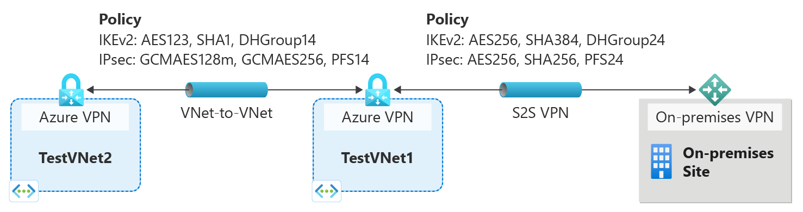

# About cryptographic requirements and Azure VPN gateways

This article discusses how you can configure Azure VPN gateways to satisfy your cryptographic requirements for both cross-premises S2S VPN tunnels and VNet-to-VNet connections within Azure.

## About IKEv1 and IKEv2 for Azure VPN connections

Traditionally we allowed IKEv1 connections for Basic SKUs only and allowed IKEv2 connections for all VPN gateway SKUs other than Basic SKUs. The Basic SKUs allow only 1 connection and along with other limitations such as performance, customers using legacy devices that support only IKEv1 protocols were having limited experience. In order to enhance the experience of customers using IKEv1 protocols, we are now allowing IKEv1 connections for all of the VPN gateway SKUs, except Basic SKU. For more information, see [VPN Gateway SKUs](https://docs.microsoft.com/azure/vpn-gateway/vpn-gateway-about-vpn-gateway-settings#gwsku).

When IKEv1 and IKEv2 connections are applied to the same VPN gateway, the transit between these two connections is auto-enabled.

## About IPsec and IKE policy parameters for Azure VPN gateways

IPsec and IKE protocol standard supports a wide range of cryptographic algorithms in various combinations. If you do not request a specific combination of cryptographic algorithms and parameters, Azure VPN gateways use a set of default proposals. The default policy sets were chosen to maximize interoperability with a wide range of third-party VPN devices in default configurations. As a result, the policies and the number of proposals cannot cover all possible combinations of available cryptographic algorithms and key strengths.

The default policy set for Azure VPN gateway is listed in the article: [About VPN devices and IPsec/IKE parameters for Site-to-Site VPN Gateway connections](vpn-gateway-about-vpn-devices.md).

## Cryptographic requirements

For communications that require specific cryptographic algorithms or parameters, typically due to compliance or security requirements, you can now configure their Azure VPN gateways to use a custom IPsec/IKE policy with specific cryptographic algorithms and key strengths, rather than the Azure default policy sets.

For example, the IKEv2 main mode policies for Azure VPN gateways utilize only Diffie-Hellman Group 2 (1024 bits), whereas you may need to specify stronger groups to be used in IKE, such as Group 14 (2048-bit), Group 24 (2048-bit MODP Group), or ECP (elliptic curve groups) 256 or 384 bit (Group 19 and Group 20, respectively). Similar requirements apply to IPsec quick mode policies as well.

## Custom IPsec/IKE policy with Azure VPN gateways

Azure VPN gateways now support per-connection, custom IPsec/IKE policy. For a Site-to-Site or VNet-to-VNet connection, you can choose a specific combination of cryptographic algorithms for IPsec and IKE with the desired key strength, as shown in the following example:

You can create an IPsec/IKE policy and apply to a new or existing connection.

### Workflow

1. Create the virtual networks, VPN gateways, or local network gateways for your connectivity topology as described in other how-to documents
2. Create an IPsec/IKE policy
3. You can apply the policy when you create a S2S or VNet-to-VNet connection
4. If the connection is already created, you can apply or update the policy to an existing connection

## IPsec/IKE policy FAQ

[!INCLUDE [vpn-gateway-ipsecikepolicy-faq-include](../../includes/vpn-gateway-faq-ipsecikepolicy-include.md)]

## Next steps

See [Configure IPsec/IKE policy](vpn-gateway-ipsecikepolicy-rm-powershell.md) for step-by-step instructions on configuring custom IPsec/IKE policy on a connection.

See also [Connect multiple policy-based VPN devices](vpn-gateway-connect-multiple-policybased-rm-ps.md) to learn more about the UsePolicyBasedTrafficSelectors option.
