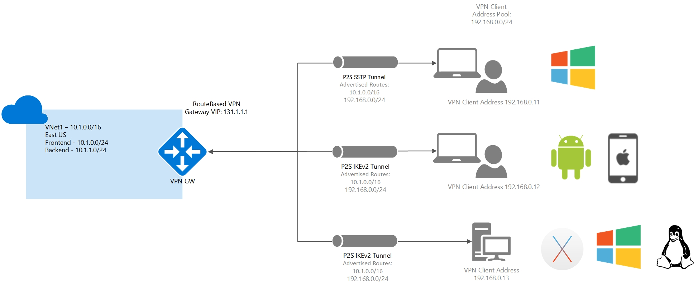
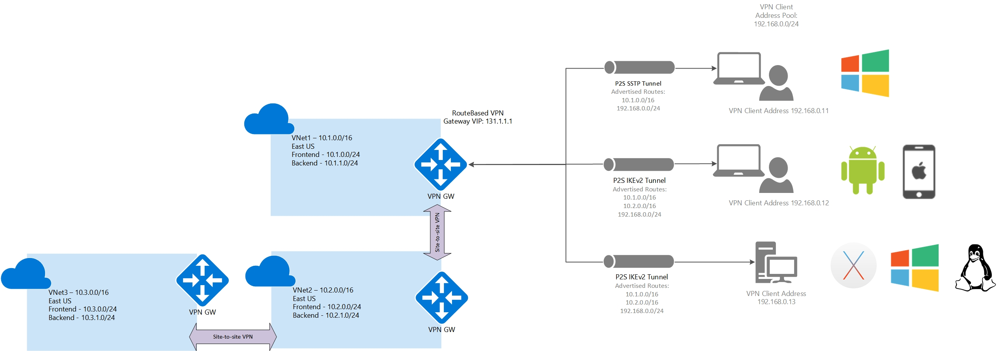
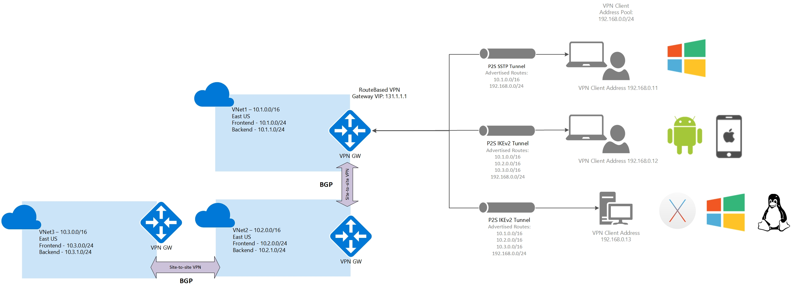
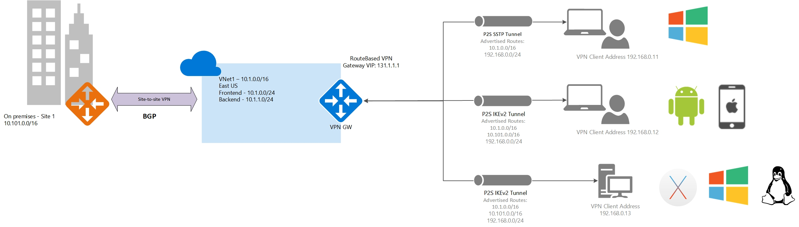
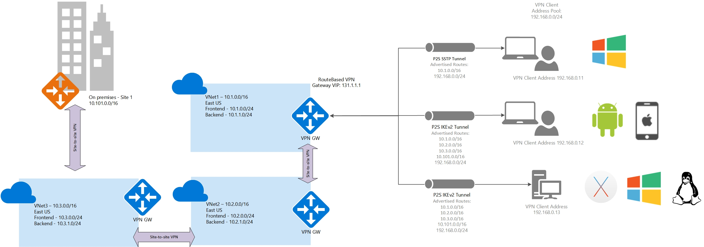
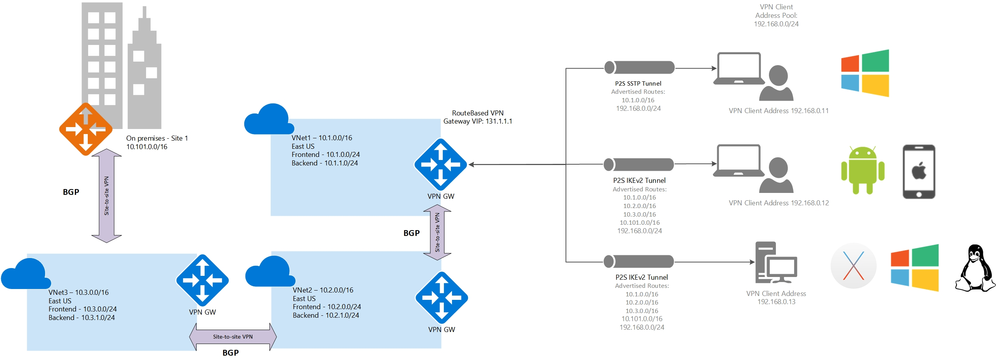

# About Point-to-Site VPN routing

This article helps you understand how Azure Point-to-Site VPN routing behaves. P2S VPN routing behavior is dependent on the client OS, the protocol used for the VPN connection, and how the virtual networks (VNets) are connected to each other.

Azure currently supports two protocols for remote access, IKEv2 and SSTP. IKEv2 is supported on many client operating systems including Windows, Linux, MacOS, Android, and iOS. SSTP is only supported on Windows. If you make a change to the topology of your network and have Windows VPN clients, the VPN client package for Windows clients must be downloaded and installed again in order for the changes to be applied to the client.

> [!NOTE]
> This article applies to IKEv2 only.
>

## About the diagrams

There are a number of different diagrams in this article. Each section shows a different topology or configuration. For the purposes of this article, Site-to-Site (S2S) and VNet-to-VNet connections function the same way, as both are IPsec tunnels. All VPN gateways in this article are route-based.

## One isolated VNet

The Point-to-Site VPN gateway connection in this example is for a VNet that is not connected or peered with any other virtual network (VNet1). In this example, clients can access VNet1.

### Address space

* VNet1: 10.1.0.0/16

### Routes added

* Routes added to Windows clients: 10.1.0.0/16, 192.168.0.0/24

* Routes added to non-Windows clients: 10.1.0.0/16, 192.168.0.0/24

### Access

* Windows clients can access VNet1

* Non-Windows clients can access VNet1

## Multiple peered VNets

In this example, the Point-to-Site VPN gateway connection is for VNet1. VNet1 is peered with VNet2. VNet 2 is peered with VNet3. VNet1 is peered with VNet4. There is no direct peering between VNet1 and VNet3. VNet1 has “Allow gateway transit” and VNet2 and VNet4 have “Use remote gateways” enabled.

Clients using Windows can access directly peered VNets, but the VPN client must be downloaded again if any changes are made to VNet peering or the network topology. Non-Windows clients can access directly peered VNets. Access is not transitive and is limited to only directly peered VNets.

### Address space:

* VNet1: 10.1.0.0/16

* VNet2: 10.2.0.0/16

* VNet3: 10.3.0.0/16

* VNet4: 10.4.0.0/16

### Routes added

* Routes added to Windows clients: 10.1.0.0/16, 10.2.0.0/16, 10.4.0.0/16, 192.168.0.0/24

* Routes added to non-Windows clients: 10.1.0.0/16, 10.2.0.0/16, 10.4.0.0/16, 192.168.0.0/24

### Access

* Windows clients can access VNet1, VNet2, and VNet4, but the VPN client must be downloaded again for any topology changes to take effect.

* Non-Windows clients can access VNet1, VNet2, and VNet4

## Multiple VNets connected using an S2S VPN

In this example, the Point-to-Site VPN gateway connection is for VNet1. VNet1 is connected to VNet2 using a Site-to-Site VPN connection. VNet2 is connected to VNet3 using a Site-to-Site VPN connection. There is no direct peering or Site-to-Site VPN connection between VNet1 and VNet3. All Site-to-Site connections are not running BGP for routing.

Clients using Windows, or another supported OS, can only access VNet1. To access additional VNets, BGP must be used.

### Address space

* VNet1: 10.1.0.0/16

* VNet2: 10.2.0.0/16

* VNet3: 10.3.0.0/16

### Routes added

* Routes added to Windows clients: 10.1.0.0/16, 192.168.0.0/24

* Routes added to Non-Windows clients: 10.1.0.0/16, 10.2.0.0/16, 192.168.0.0/24

### Access

* Windows clients can only access VNet1

* Non-Windows clients can access VNet1 only

## Multiple VNets connected using an S2S VPN (BGP)

In this example, the Point-to-Site VPN gateway connection is for VNet1. VNet1 is connected to VNet2 using a Site-to-Site VPN connection. VNet2 is connected to VNet3 using a Site-to-Site VPN connection. There is no direct peering or Site-to-Site VPN connection between VNet1 and VNet3. All Site-to-Site connections are running BGP for routing.

Clients using Windows, or another supported OS, can access all VNets that are connected using a Site-to-Site VPN connection, but routes to connected VNets have to be manually added to the Windows clients.

### Address space

* VNet1: 10.1.0.0/16

* VNet2: 10.2.0.0/16

* VNet3: 10.3.0.0/16

### Routes added

* Routes added to Windows clients: 10.1.0.0/16

* Routes added to Non-Windows clients: 10.1.0.0/16, 10.2.0.0/16, 10.3.0.0/16, 192.168.0.0/24

### Access

* Windows clients can access VNet1, VNet2, and VNet3, but routes to VNet2 and VNet3 will have to be manually added.

* Non-Windows clients can access VNet1, VNet2, and VNet3

## One VNet and a branch office

In this example, the Point-to-Site VPN gateway connection is for VNet1. VNet1 is not connected/ peered with any other virtual network, but is connected to an on-premises site through a Site-to-Site VPN connection that is not running BGP.

Windows and non-Windows clients can only access VNet1.

### Address space

* VNet1: 10.1.0.0/16

* Site1: 10.101.0.0/16

### Routes added

* Routes added to Windows clients: 10.1.0.0/16, 192.168.0.0/24

* Routes added to Non-Windows clients: 10.1.0.0/16, 192.168.0.0/24

### Access

* Windows clients can access only VNet1

* Non-Windows clients can access VNet1 only

## One VNet and a branch office (BGP)

In this example, the Point-to-Site VPN gateway connection is for VNet1. VNet1 is not connected or peered with any other virtual network, but is connected to an on-premises site (Site1) through a Site-to-Site VPN connection running BGP.

Windows clients can access the VNet and the branch office (Site1), but the routes to Site1 must be manually added to the client. Non-Windows clients can access the VNet as well as the on-premises branch office.

### Address space

* VNet1: 10.1.0.0/16

* Site1: 10.101.0.0/16

### Routes added

* Routes added to Windows clients: 10.1.0.0/16, 192.168.0.0/24

* Routes added to Non-Windows clients: 10.1.0.0/16, 10.101.0.0/16, 192.168.0.0/24

### Access

* Windows clients can access VNet1 and Site1, but routes to Site1 will have to be manually added.

* Non-Windows clients can access VNet1 and Site1.

## Multiple VNets connected using S2S and a branch office

In this example, the Point-to-Site VPN gateway connection is for VNet1. VNet1 is connected to VNet2 using a Site-to-Site VPN connection. VNet2 is connected to VNet3 using a Site-to-Site VPN connection. There is no direct peering or Site-to-Site VPN tunnel between the VNet1 and VNet3 networks. VNet3 is connected to a branch office (Site1) using a Site-to-Site VPN connection. All VPN connections are not running BGP.

All clients can access VNet1 only.

### Address space

* VNet1: 10.1.0.0/16

* VNet2: 10.2.0.0/16

* VNet3: 10.3.0.0/16

* Site1: 10.101.0.0/16

### Routes added

* Routes added to Windows clients: 10.1.0.0/16, 192.168.0.0/24

* Routes added to Non-Windows clients: 10.1.0.0/16, 10.2.0.0/16, 10.3.0.0/16, 10.101.0.0/16, 192.168.0.0/24

### Access

* The Windows clients can access VNet1 only

* Non-Windows clients can access VNet1 only

## Multiple VNets connected using S2S and a branch office (BGP)

In this example, the Point-to-Site VPN gateway connection is for VNet1. VNet1 is connected to VNet2 using a Site-to-Site VPN connection. VNet2 is connected to VNet3 using a Site-to-Site VPN connection. There is no direct peering or Site-to-Site VPN tunnel between the VNet1 and VNet3 networks. VNet3 is connected to a branch office (Site1) using a Site-to-Site VPN connection. All VPN connections are running BGP.

Clients using Windows can access VNets and sites that are connected using a Site-to-Site VPN connection, but the routes to VNet2, VNet3 and Site1 must be manually added to the client. Non-Windows clients can access VNets and sites that are connected using a Site-to-Site VPN connection without any manual intervention. The access is transitive, and clients can access resources in all connected VNets and sites (on-premises).

### Address space

* VNet1: 10.1.0.0/16

* VNet2: 10.2.0.0/16

* VNet3: 10.3.0.0/16

* Site1: 10.101.0.0/16

### Routes added

* Routes added to Windows clients: 10.1.0.0/16, 192.168.0.0/24

* Routes added to Non-Windows clients: 10.1.0.0/16, 10.2.0.0/16, 10.3.0.0/16, 10.101.0.0/16, 192.168.0.0/24

### Access

* The Windows clients can access VNet1, VNet2, VNet3, and Site1, but routes to VNet2, VNet3 and Site1 must be manually added to the client.

* Non-Windows clients can access VNet1, Vnet2, VNet3, and Site1.

## Next steps

See [Create a P2S VPN using the Azure portal](vpn-gateway-howto-point-to-site-resource-manager-portal.md) to begin creating your P2S VPN.
