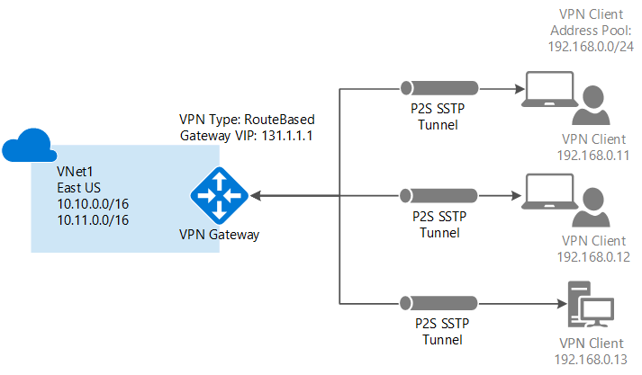

# About VPN Gateway
A VPN gateway is a type of virtual network gateway that sends encrypted traffic across a public connection to an on-premises location. You can also use VPN gateways to send encrypted traffic between Azure virtual networks over the Microsoft network. To send encrypted network traffic between your Azure virtual network and your on-premises site, you must create a VPN gateway for your virtual network.

Each virtual network can have only one VPN gateway, however, you can create multiple connections to the same VPN gateway. An example of this is a Multi-Site connection configuration. When you create multiple connections to the same VPN gateway, all VPN tunnels, including Point-to-Site VPNs, share the bandwidth that is available for the gateway.

### What is a virtual network gateway?

A virtual network gateway is composed of two or more virtual machines that are deployed to a specific subnet called the GatewaySubnet. The VMs that are located in the GatewaySubnet are created when you create the virtual network gateway. Virtual network gateway VMs are configured to contain routing tables and gateway services specific to the gateway. You can't directly configure the VMs that are part of the virtual network gateway and you should never deploy additional resources to the GatewaySubnet.

When you create a virtual network gateway using the gateway type 'Vpn', it creates a specific type of virtual network gateway that encrypts traffic; a VPN gateway. The Gateway SKU that you select when you create your virtual network gateway determines the VMs that are created and configured in the GatewaySubnet.

## Gateway SKUs

[!INCLUDE [vpn-gateway-gwsku-include](../../includes/vpn-gateway-gwsku-include.md)]

## Configuring a VPN Gateway
A VPN gateway connection relies on multiple resources that are configured with specific settings. Most of the resources can be configured separately, although they must be configured in a certain order in some cases.

###Settings
The settings that you chose for each resource are critical to creating a successful connection. For information about individual resources and settings for VPN Gateway, see [About VPN Gateway settings](vpn-gateway-about-vpn-gateway-settings.md). You'll find information to help you understand gateway types, VPN types, connection types, gateway subnets, local network gateways, and various other resource settings that you may want to consider.

###Deployment tools
You can start out creating and configuring resources using one configuration tool, such as the Azure portal. You can then later decide to switch to another tool, such as PowerShell, to configure additional resources, or modify existing resources when applicable. Currently, you can't configure every resource and resource setting in the Azure portal. The instructions in the articles for each connection topology specify when a specific configuration tool is needed. 

###Deployment model
When you configure a VPN gateway, the steps you take depend on the deployment model that you used to create your virtual network. For example, if you created your VNet using the classic deployment model, you use the guidelines and instructions for the classic deployment model to create and configure your VPN gateway settings. For more information about deployment models, see [Understanding Resource Manager and classic deployment models](../azure-resource-manager/resource-manager-deployment-model.md).

## Connection topology diagrams
It's important to know that there are different configurations available for VPN gateway connections. You need to determine which configuration best fits your needs. In the sections below, you can view information and topology diagrams about the following VPN gateway connections:
The following sections contain tables which list:

* Available deployment model
* Available configuration tools
* Links that take you directly to an article, if available

Use the diagrams and descriptions to help select the connection topology to match your requirements. The diagrams show the main baseline topologies, but it's possible to build more complex configurations using the diagrams as a guideline.

## Site-to-Site and Multi-Site (IPsec/IKE VPN tunnel)
### Site-to-Site
A Site-to-Site (S2S) VPN gateway connection is a connection over IPsec/IKE (IKEv1 or IKEv2) VPN tunnel. This type of connection requires a VPN device located on-premises that has a public IP address assigned to it and is not located behind a NAT. S2S connections can be used for cross-premises and hybrid configurations.   

### Multi-Site
This type of connection is a variation of the Site-to-Site connection. You create more than one VPN connection from your virtual network gateway, typically connecting to multiple on-premises sites. When working with multiple connections, you must use a RouteBased VPN type (known as a dynamic gateway when working with classic VNets). Because each virtual network can only have one VPN gateway, all connections through the gateway share the available bandwidth. This is often called a "multi-site" connection.

### Deployment models and methods for Site-to-Site and Multi-Site
[!INCLUDE [vpn-gateway-table-site-to-site](../../includes/vpn-gateway-table-site-to-site-include.md)]

## Point-to-Site (VPN over SSTP)
A Point-to-Site (P2S) VPN gateway connection allows you to create a secure connection to your virtual network from an individual client computer. P2S is a VPN connection over SSTP (Secure Socket Tunneling Protocol). P2S connections do not require a VPN device or a public-facing IP address to work. You establish the VPN connection by starting it from the client computer. This solution is useful when you want to connect to your VNet from a remote location, such as from home or a conference, or when you only have a few clients that need to connect to a VNet. P2S connections can be used with S2S connections through the same VPN gateway, as long as all the configuration requirements for both connections are compatible.

### Deployment models and methods for Point-to-Site
[!INCLUDE [vpn-gateway-table-point-to-site](../../includes/vpn-gateway-table-point-to-site-include.md)]

## VNet-to-VNet connections (IPsec/IKE VPN tunnel)
Connecting a virtual network to another virtual network (VNet-to-VNet) is similar to connecting a VNet to an on-premises site location. Both connectivity types use a VPN gateway to provide a secure tunnel using IPsec/IKE. You can even combine VNet-to-VNet communication with multi-site connection configurations. This lets you establish network topologies that combine cross-premises connectivity with inter-virtual network connectivity.

The VNets you connect can be:

* in the same or different regions
* in the same or different subscriptions 
* in the same or different deployment models

###Connections between deployment models
Azure currently has two deployment models: classic and Resource Manager. If you have been using Azure for some time, you probably have Azure VMs and instance roles running in a classic VNet. Your newer VMs and role instances may be running in a VNet created in Resource Manager. You can create a connection between the VNets to allow the resources in one VNet to communicate directly with resources in another.

###VNet peering
You may be able to use VNet peering to create your connection, as long as your virtual network meets certain requirements. VNet peering does not use a virtual network gateway. For more information, see [VNet peering](../virtual-network/virtual-network-peering-overview.md).

###Deployment models and methods for VNet-to-VNet
[!INCLUDE [vpn-gateway-table-vnet-to-vnet](../../includes/vpn-gateway-table-vnet-to-vnet-include.md)]

## ExpressRoute (dedicated private connection)
Microsoft Azure ExpressRoute lets you extend your on-premises networks into the Microsoft cloud over a dedicated private connection facilitated by a connectivity provider. With ExpressRoute, you can establish connections to Microsoft cloud services, such as Microsoft Azure, Office 365, and CRM Online. Connectivity can be from an any-to-any (IP VPN) network, a point-to-point Ethernet network, or a virtual cross-connection through a connectivity provider at a co-location facility.

ExpressRoute connections do not go over the public Internet. This allows ExpressRoute connections to offer more reliability, faster speeds, lower latencies, and higher security than typical connections over the Internet.

An ExpressRoute connection does not use a VPN gateway, although it does use a virtual network gateway as part of its required configuration. In an ExpressRoute connection, the virtual network gateway is configured with the gateway type 'ExpressRoute', rather than 'Vpn'. For more information about ExpressRoute, see the [ExpressRoute technical overview](../expressroute/expressroute-introduction.md).

## Site-to-Site and ExpressRoute coexisting connections
ExpressRoute is a direct, dedicated connection from your WAN (not over the public Internet) to Microsoft Services, including Azure. Site-to-Site VPN traffic travels encrypted over the public Internet. Being able to configure Site-to-Site VPN and ExpressRoute connections for the same virtual network has several advantages.

You can configure a Site-to-Site VPN as a secure failover path for ExpressRoute, or use Site-to-Site VPNs to connect to sites that are not part of your network, but that are connected through ExpressRoute. Notice that this configuration requires two virtual network gateways for the same virtual network, one using the gateway type 'Vpn', and the other using the gateway type 'ExpressRoute'.

### Deployment models and methods for S2S and ExpressRoute
[!INCLUDE [vpn-gateway-table-coexist](../../includes/vpn-gateway-table-coexist-include.md)]

## Pricing
[!INCLUDE [vpn-gateway-about-pricing-include](../../includes/vpn-gateway-about-pricing-include.md)]

For more information about gateway SKUs for VPN Gateway, see [Gateway SKUs](vpn-gateway-about-vpn-gateway-settings.md#gwsku).

## FAQ

For frequently asked questions about VPN gateway, see the [VPN Gateway FAQ](vpn-gateway-vpn-faq.md).

## Next steps
- Plan your VPN gateway configuration. See [VPN Gateway Planning and Design](vpn-gateway-plan-design.md).
- View the [VPN Gateway FAQ](vpn-gateway-vpn-faq.md) for additional information.
- View the [Subscription and service limits](../azure-subscription-service-limits.md#networking-limits).