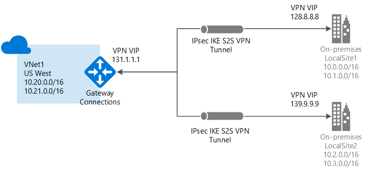
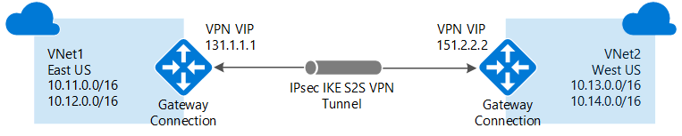
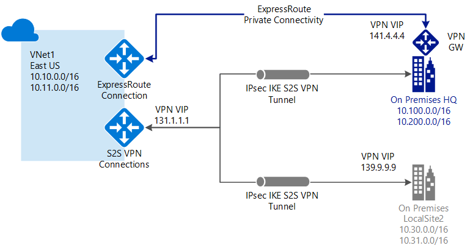

<properties 
   pageTitle="About VPN Gateway| Microsoft Azure"
   description="Learn about VPN Gateway connections for Azure Virtual Networks."
   services="vpn-gateway"
   documentationCenter="na"
   authors="cherylmc"
   manager="carmonm"
   editor=""
   tags="azure-resource-manager,azure-service-management"/>
<tags 
   ms.service="vpn-gateway"
   ms.devlang="na"
   ms.topic="get-started-article"
   ms.tgt_pltfrm="na"
   ms.workload="infrastructure-services"
   ms.date="09/21/2016"
   ms.author="cherylmc" />

# About VPN Gateway

A virtual network gateway is used to send network traffic between Azure virtual networks and on-premises locations and also between virtual networks within Azure (VNet-to-VNet). When you configure a VPN gateway, you must create and configure a virtual network gateway and a virtual network gateway connection.

In the Resource Manager deployment model, when you create a virtual network gateway resource, you specify several settings. One of the required settings is '-GatewayType'. There are two virtual network gateway types: Vpn and ExpressRoute. 

When network traffic is sent on a dedicated private connection, you use the gateway type 'ExpressRoute'. This is also referred to as an ExpressRoute gateway. When network traffic is sent encrypted across a public connection, you use the gateway type 'Vpn'. This is referred to as a VPN gateway. Site-to-Site, Point-to-Site, and VNet-to-VNet connections all use a VPN gateway.

Each virtual network can have only one virtual network gateway per gateway type. For example, you can have one virtual network gateway that uses -GatewayType ExpressRoute, and one that uses -GatewayType Vpn. This article focuses primarily on VPN Gateway. For more information about ExpressRoute, see the [ExpressRoute Technical Overview](../expressroute/expressroute-introduction.md).

## Pricing

[AZURE.INCLUDE [vpn-gateway-about-pricing-include](../../includes/vpn-gateway-about-pricing-include.md)] 

## Gateway SKUs

[AZURE.INCLUDE [vpn-gateway-gwsku-include](../../includes/vpn-gateway-gwsku-include.md)] 

The following table shows the gateway types and the estimated aggregate throughput. This table applies to both the Resource Manager and classic deployment models.

[AZURE.INCLUDE [vpn-gateway-table-gwtype-aggthroughput](../../includes/vpn-gateway-table-gwtype-aggtput-include.md)] 

## Configuring a VPN Gateway

When you configure a VPN gateway, the instructions you use depend on the deployment model that you used to create your virtual network. For example, if you created your VNet using the classic deployment model, you use the guidelines and instructions for the classic deployment model to create and configure your VPN gateway settings. For more information about deployment models, see [Understanding Resource Manager and classic deployment models](../resource-manager-deployment-model.md).

A VPN gateway connection relies on multiple resources that are configured with specific settings. Most of the resources can be configured separately, although they must be configured in a certain order in some cases. You can start out creating and configuring resources using one configuration tool, such as the Azure portal. You can then later decide to switch to another tool, such as PowerShell, to configure additional resources, or to modify existing resources when applicable. Currently, you can't configure every resource and resource setting in the Azure portal. The instructions in the articles for each connection topology specify when a specific configuration tool is needed. For information about individual resources and settings for VPN Gateway, see [About VPN Gateway settings](vpn-gateway-about-vpn-gateway-settings.md).

The following sections contain tables that list:

- available deployment model
- available configuration tools
- links that take you directly to an article, if available

Use the diagrams and descriptions to help select the connection topology to match your requirements. The diagrams show the main baseline topologies, but it's possible to build more complex configurations using the diagrams as a guideline.

## Site-to-Site and Multi-Site

### Site-to-Site

A Site-to-Site (S2S) VPN gateway connection is a connection over IPsec/IKE (IKEv1 or IKEv2) VPN tunnel. This type of connection requires a VPN device located on-premises that has a public IP address assigned to it and is not located behind a NAT. S2S connections can be used for cross-premises and hybrid configurations.   

### Multi-Site

You can create and configure a VPN gateway connection between your VNet and multiple on-premises networks. When working with multiple connections, you must use a RouteBased VPN type (dynamic gateway for classic VNets). Because a VNet can only have one VPN gateway, all connections through the gateway share the available bandwidth. This is often called a "multi-site" connection.
 

### Deployment models and methods for Site-to-Site and Multi-Site

[AZURE.INCLUDE [vpn-gateway-table-site-to-site](../../includes/vpn-gateway-table-site-to-site-include.md)] 

## VNet-to-VNet

Connecting a virtual network to another virtual network (VNet-to-VNet) is similar to connecting a VNet to an on-premises site location. Both connectivity types use a VPN gateway to provide a secure tunnel using IPsec/IKE. You can even combine VNet-to-VNet communication with multi-site connection configurations. This lets you establish network topologies that combine cross-premises connectivity with inter-virtual network connectivity.

The VNets you connect can be:

- in the same or different regions
- in the same or different subscriptions 
- in the same different deployment models

#### Connections between deployment models

Azure currently has two deployment models: classic and Resource Manager. If you have been using Azure for some time, you probably have Azure VMs and instance roles running in a classic VNet. Your newer VMs and role instances may be running in a VNet created in Resource Manager. You can create a connection between the VNets to allow the resources in one VNet to communicate directly with resources in another.

#### VNet peering

You may be able to use VNet peering to create your connection, as long as your virtual network meets certain requirements. VNet peering does not use a virtual network gateway. [VNet peering](../virtual-network/virtual-network-peering-overview.md) is currently in Preview.

### Deployment models and methods for VNet-to-VNet

[AZURE.INCLUDE [vpn-gateway-table-vnet-to-vnet](../../includes/vpn-gateway-table-vnet-to-vnet-include.md)] 

## Point-to-Site

A Point-to-Site (P2S) VPN gateway connection allows you to create a secure connection to your virtual network from an individual client computer. P2S is a VPN connection over SSTP (Secure Socket Tunneling Protocol). P2S connections do not require a VPN device or a public-facing IP address to work. You establish the VPN connection by starting it from the client computer. This solution is useful when you want to connect to your VNet from a remote location, such as from home or a conference, or when you only have a few clients that need to connect to a VNet. P2S connections can be used in conjunction with S2S connections through the same VPN gateway, provided that all of the configuration requirements for both connections are compatible.

### Deployment models and methods for Point-to-Site

[AZURE.INCLUDE [vpn-gateway-table-point-to-site](../../includes/vpn-gateway-table-point-to-site-include.md)] 

## ExpressRoute

[AZURE.INCLUDE [expressroute-intro](../../includes/expressroute-intro-include.md)]

In an ExpressRoute connection, a virtual network gateway is configured with the gateway type 'ExpressRoute', rather than 'Vpn'. For more information about ExpressRoute, see the [ExpressRoute technical overview](../expressroute/expressroute-introduction.md).

## Site-to-Site and ExpressRoute coexisting connections

ExpressRoute is a direct, dedicated connection from your WAN (not over the public Internet) to Microsoft Services, including Azure. Site-to-Site VPN traffic travels encrypted over the public Internet. Being able to configure Site-to-Site VPN and ExpressRoute connections for the same virtual network has several advantages.

You can configure a Site-to-Site VPN as a secure failover path for ExpressRoute, or use Site-to-Site VPNs to connect to sites that are not part of your network, but that are connected through ExpressRoute. Notice that this requires two virtual network gateways for the same virtual network, one using -GatewayType Vpn, and the other using -GatewayType ExpressRoute.

### Deployment models and methods for S2S and ExpressRoute

[AZURE.INCLUDE [vpn-gateway-table-coexist](../../includes/vpn-gateway-table-coexist-include.md)] 

## Next steps

Plan your VPN gateway configuration. See [VPN Gateway Planning and Design](vpn-gateway-plan-design.md) and [Connecting your on-premises network to Azure](../guidance/guidance-connecting-your-on-premises-network-to-azure.md).

 
