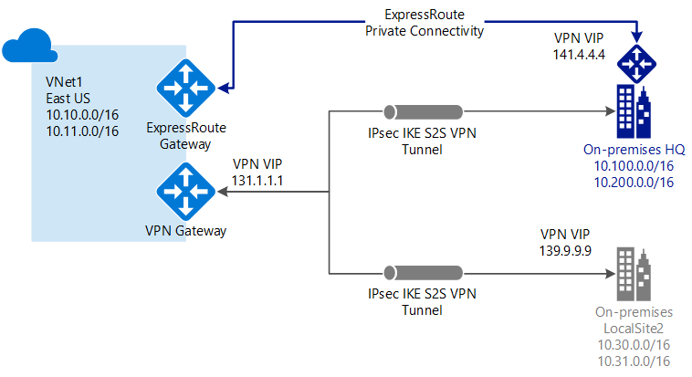

# What is VPN Gateway?

A VPN gateway is a specific type of virtual network gateway that is used to send encrypted traffic between an Azure virtual network and an on-premises location over the public Internet. You can also use a VPN gateway to send encrypted traffic between Azure virtual networks over the Microsoft network. Each virtual network can have only one VPN gateway. However, you can create multiple connections to the same VPN gateway. When you create multiple connections to the same VPN gateway, all VPN tunnels share the available gateway bandwidth.

## What is a virtual network gateway?

A virtual network gateway is composed of two or more VMs that are deployed to a specific subnet you create called the *gateway subnet*. Virtual network gateway VMs contain routing tables and run specific gateway services. These VMs are created when you create the virtual network gateway. You can't directly configure the VMs that are part of the virtual network gateway.

One setting that you configure for a virtual network gateway is the gateway type. Gateway type specifies how the virtual network gateway will be used and the actions that the gateway takes. The gateway type 'Vpn' specifies that the type of virtual network gateway created is a 'VPN gateway', rather than an ExpressRoute gateway. A virtual network can have two virtual network gateways; one VPN gateway and one ExpressRoute gateway - as is the case with [coexisting](#coexisting) connection configurations. For more information, see [Gateway types](vpn-gateway-about-vpn-gateway-settings.md#gwtype).

VPN gateways can be deployed in Azure Availability Zones. This brings resiliency, scalability, and higher availability to virtual network gateways. Deploying gateways in Azure Availability Zones physically and logically separates gateways within a region, while protecting your on-premises network connectivity to Azure from zone-level failures. see [About zone-redundant virtual network gateways in Azure Availability Zones](about-zone-redundant-vnet-gateways.md)

Creating a virtual network gateway can take up to 45 minutes to complete. When you create a virtual network gateway, gateway VMs are deployed to the gateway subnet and configured with the settings that you specify. After you create a VPN gateway, you can create an IPsec/IKE VPN tunnel connection between that VPN gateway and another VPN gateway (VNet-to-VNet), or create a cross-premises IPsec/IKE VPN tunnel connection between the VPN gateway and an on-premises VPN device (Site-to-Site). You can also create a Point-to-Site VPN connection (VPN over OpenVPN, IKEv2, or SSTP), which lets you connect to your virtual network from a remote location, such as from a conference or from home.

## Configuring a VPN Gateway

A VPN gateway connection relies on multiple resources that are configured with specific settings. Most of the resources can be configured separately, although some resources must be configured in a certain order.

### Settings

The settings that you chose for each resource are critical to creating a successful connection. For information about individual resources and settings for VPN Gateway, see [About VPN Gateway settings](vpn-gateway-about-vpn-gateway-settings.md). The article contains information to help you understand gateway types, gateway SKUs, VPN types, connection types, gateway subnets, local network gateways, and various other resource settings that you may want to consider.

### Deployment tools

You can start out creating and configuring resources using one configuration tool, such as the Azure portal. You can later decide to switch to another tool, such as PowerShell, to configure additional resources, or modify existing resources when applicable. Currently, you can't configure every resource and resource setting in the Azure portal. The instructions in the articles for each connection topology specify when a specific configuration tool is needed. 

### Deployment model

There are currently two deployment models for Azure. When you configure a VPN gateway, the steps you take depend on the deployment model that you used to create your virtual network. For example, if you created your VNet using the classic deployment model, you use the guidelines and instructions for the classic deployment model to create and configure your VPN gateway settings. For more information about deployment models, see [Understanding Resource Manager and classic deployment models](../azure-resource-manager/management/deployment-models.md).

### Planning table

The following table can help you decide the best connectivity option for your solution.

[!INCLUDE [cross-premises](../../includes/vpn-gateway-cross-premises-include.md)]

## Gateway SKUs

When you create a virtual network gateway, you specify the gateway SKU that you want to use. Select the SKU that satisfies your requirements based on the types of workloads, throughputs, features, and SLAs.

* For more information about gateway SKUs, including supported features, production and dev-test, and configuration steps, see the [VPN Gateway Settings - Gateway SKUs](vpn-gateway-about-vpn-gateway-settings.md#gwsku) article.
* For Legacy SKU information, see [Working with Legacy SKUs](vpn-gateway-about-skus-legacy.md).

### Gateway SKUs by tunnel, connection, and throughput

[!INCLUDE [Aggregated throughput by SKU](../../includes/vpn-gateway-table-gwtype-aggtput-include.md)]

## Connection topology diagrams

It's important to know that there are different configurations available for VPN gateway connections. You need to determine which configuration best fits your needs. In the sections below, you can view information and topology diagrams about the following VPN gateway connections:
The following sections contain tables which list:

* Available deployment model
* Available configuration tools
* Links that take you directly to an article, if available

Use the diagrams and descriptions to help select the connection topology to match your requirements. The diagrams show the main baseline topologies, but it's possible to build more complex configurations using the diagrams as a guideline.

## Site-to-Site and Multi-Site (IPsec/IKE VPN tunnel)

### Site-to-Site

A Site-to-Site (S2S) VPN gateway connection is a connection over IPsec/IKE (IKEv1 or IKEv2) VPN tunnel. S2S connections can be used for cross-premises and hybrid configurations. A S2S connection requires a VPN device located on-premises that has a public IP address assigned to it. For information about selecting a VPN device, see the [VPN Gateway FAQ - VPN devices](vpn-gateway-vpn-faq.md#s2s).

### Multi-Site

This type of connection is a variation of the Site-to-Site connection. You create more than one VPN connection from your virtual network gateway, typically connecting to multiple on-premises sites. When working with multiple connections, you must use a RouteBased VPN type (known as a dynamic gateway when working with classic VNets). Because each virtual network can only have one VPN gateway, all connections through the gateway share the available bandwidth. This type of connection is often called a "multi-site" connection.

### Deployment models and methods for Site-to-Site and Multi-Site

[!INCLUDE [site-to-site and multi-site table](../../includes/vpn-gateway-table-site-to-site-include.md)]

## Point-to-Site VPN

A Point-to-Site (P2S) VPN gateway connection lets you create a secure connection to your virtual network from an individual client computer. A P2S connection is established by starting it from the client computer. This solution is useful for telecommuters who want to connect to Azure VNets from a remote location, such as from home or a conference. P2S VPN is also a useful solution to use instead of S2S VPN when you have only a few clients that need to connect to a VNet.

Unlike S2S connections, P2S connections do not require an on-premises public-facing IP address or a VPN device. P2S connections can be used with S2S connections through the same VPN gateway, as long as all the configuration requirements for both connections are compatible. For more information about Point-to-Site connections, see [About Point-to-Site VPN](point-to-site-about.md).

### Deployment models and methods for P2S

[!INCLUDE [vpn-gateway-table-site-to-site](../../includes/vpn-gateway-table-point-to-site-include.md)]

## VNet-to-VNet connections (IPsec/IKE VPN tunnel)

Connecting a virtual network to another virtual network (VNet-to-VNet) is similar to connecting a VNet to an on-premises site location. Both connectivity types use a VPN gateway to provide a secure tunnel using IPsec/IKE. You can even combine VNet-to-VNet communication with multi-site connection configurations. This lets you establish network topologies that combine cross-premises connectivity with inter-virtual network connectivity.

The VNets you connect can be:

* in the same or different regions
* in the same or different subscriptions 
* in the same or different deployment models

### Connections between deployment models

Azure currently has two deployment models: classic and Resource Manager. If you have been using Azure for some time, you probably have Azure VMs and instance roles running in a classic VNet. Your newer VMs and role instances may be running in a VNet created in Resource Manager. You can create a connection between the VNets to allow the resources in one VNet to communicate directly with resources in another.

### VNet peering

You may be able to use VNet peering to create your connection, as long as your virtual network meets certain requirements. VNet peering does not use a virtual network gateway. For more information, see [VNet peering](../virtual-network/virtual-network-peering-overview.md).

### Deployment models and methods for VNet-to-VNet

[!INCLUDE [vpn-gateway-table-vnet-to-vnet](../../includes/vpn-gateway-table-vnet-to-vnet-include.md)]

## ExpressRoute (private connection)

ExpressRoute lets you extend your on-premises networks into the Microsoft cloud over a private connection facilitated by a connectivity provider. With ExpressRoute, you can establish connections to Microsoft cloud services, such as Microsoft Azure, Office 365, and CRM Online. Connectivity can be from an any-to-any (IP VPN) network, a point-to-point Ethernet network, or a virtual cross-connection through a connectivity provider at a co-location facility.

ExpressRoute connections do not go over the public Internet. This allows ExpressRoute connections to offer more reliability, faster speeds, lower latencies, and higher security than typical connections over the Internet.

An ExpressRoute connection uses a virtual network gateway as part of its required configuration. In an ExpressRoute connection, the virtual network gateway is configured with the gateway type 'ExpressRoute', rather than 'Vpn'. While traffic that travels over an ExpressRoute circuit is not encrypted by default, it is possible create a solution that allows you to send encrypted traffic over an ExpressRoute circuit. For more information about ExpressRoute, see the [ExpressRoute technical overview](../expressroute/expressroute-introduction.md).

## Site-to-Site and ExpressRoute coexisting connections

ExpressRoute is a direct, private connection from your WAN (not over the public Internet) to Microsoft Services, including Azure. Site-to-Site VPN traffic travels encrypted over the public Internet. Being able to configure Site-to-Site VPN and ExpressRoute connections for the same virtual network has several advantages.

You can configure a Site-to-Site VPN as a secure failover path for ExpressRoute, or use Site-to-Site VPNs to connect to sites that are not part of your network, but that are connected through ExpressRoute. Notice that this configuration requires two virtual network gateways for the same virtual network, one using the gateway type 'Vpn', and the other using the gateway type 'ExpressRoute'.

### Deployment models and methods for S2S and ExpressRoute coexist

[!INCLUDE [vpn-gateway-table-coexist](../../includes/vpn-gateway-table-coexist-include.md)]

## Pricing

[!INCLUDE [vpn-gateway-about-pricing-include](../../includes/vpn-gateway-about-pricing-include.md)]

For more information about gateway SKUs for VPN Gateway, see [Gateway SKUs](vpn-gateway-about-vpn-gateway-settings.md#gwsku).

## FAQ

For frequently asked questions about VPN gateway, see the [VPN Gateway FAQ](vpn-gateway-vpn-faq.md).

## Next steps

- View the [VPN Gateway FAQ](vpn-gateway-vpn-faq.md) for additional information.
- View the [Subscription and service limits](../azure-resource-manager/management/azure-subscription-service-limits.md#networking-limits).
- Learn about some of the other key [networking capabilities](../networking/networking-overview.md) of Azure.
