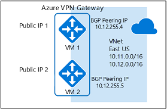

# Configure active-active S2S VPN connections with Azure VPN Gateways

This article walks you through the steps to create active-active cross-premises and VNet-to-VNet connections using the Resource Manager deployment model and PowerShell.


## About highly available cross-premises connections
To achieve high availability for cross-premises and VNet-to-VNet connectivity, you should deploy multiple VPN gateways and establish multiple parallel connections between your networks and Azure. See [Highly Available Cross-Premises and VNet-to-VNet Connectivity](vpn-gateway-highlyavailable.md) for an overview of connectivity options and topology.

This article provides the instructions to set up an active-active cross-premises VPN connection, and active-active connection between two virtual networks.

* [Part 1 - Create and configure your Azure VPN gateway in active-active mode](#aagateway)
* [Part 2 - Establish active-active cross-premises connections](#aacrossprem)
* [Part 3 - Establish active-active VNet-to-VNet connections](#aav2v)

If you already have a VPN gateway, you can:
* [Update an existing VPN gateway from active-standby to active-active, or vice versa](#aaupdate)

You can combine these together to build a more complex, highly available network topology that meets your needs.

> [!IMPORTANT]
> The active-active mode is available for all SKUs except Basic.

## <a name ="aagateway"></a>Part 1 - Create and configure active-active VPN gateways
The following steps will configure your Azure VPN gateway in active-active modes. The key differences between the active-active and active-standby gateways:

* You need to create two Gateway IP configurations with two public IP addresses
* You need set the EnableActiveActiveFeature flag
* The gateway SKU must be VpnGw1, VpnGw2, VpnGw3, or HighPerformance (legacy SKU).

The other properties are the same as the non-active-active gateways. 

### Before you begin
* Verify that you have an Azure subscription. If you don't already have an Azure subscription, you can activate your [MSDN subscriber benefits](https://azure.microsoft.com/pricing/member-offers/msdn-benefits-details/) or sign up for a [free account](https://azure.microsoft.com/pricing/free-trial/).
* You'll need to install the Azure Resource Manager PowerShell cmdlets. See [Overview of Azure PowerShell](/powershell/azure/overview) for more information about installing the PowerShell cmdlets.

### Step 1 - Create and configure VNet1
#### 1. Declare your variables
For this exercise, we'll start by declaring our variables. The example below declares the variables using the values for this exercise. Be sure to replace the values with your own when configuring for production. You can use these variables if you are running through the steps to become familiar with this type of configuration. Modify the variables, and then copy and paste into your PowerShell console.

```powershell
$Sub1 = "Ross"
$RG1 = "TestAARG1"
$Location1 = "West US"
$VNetName1 = "TestVNet1"
$FESubName1 = "FrontEnd"
$BESubName1 = "Backend"
$GWSubName1 = "GatewaySubnet"
$VNetPrefix11 = "10.11.0.0/16"
$VNetPrefix12 = "10.12.0.0/16"
$FESubPrefix1 = "10.11.0.0/24"
$BESubPrefix1 = "10.12.0.0/24"
$GWSubPrefix1 = "10.12.255.0/27"
$VNet1ASN = 65010
$DNS1 = "8.8.8.8"
$GWName1 = "VNet1GW"
$GW1IPName1 = "VNet1GWIP1"
$GW1IPName2 = "VNet1GWIP2"
$GW1IPconf1 = "gw1ipconf1"
$GW1IPconf2 = "gw1ipconf2"
$Connection12 = "VNet1toVNet2"
$Connection151 = "VNet1toSite5_1"
$Connection152 = "VNet1toSite5_2"
```

#### 2. Connect to your subscription and create a new resource group
Make sure you switch to PowerShell mode to use the Resource Manager cmdlets. For more information, see [Using Windows PowerShell with Resource Manager](../powershell-azure-resource-manager.md).

Open your PowerShell console and connect to your account. Use the following sample to help you connect:

```powershell
Connect-AzAccount
Select-AzSubscription -SubscriptionName $Sub1
New-AzResourceGroup -Name $RG1 -Location $Location1
```

#### 3. Create TestVNet1
The sample below creates a virtual network named TestVNet1 and three subnets, one called GatewaySubnet, one called FrontEnd, and one called Backend. When substituting values, it's important that you always name your gateway subnet specifically GatewaySubnet. If you name it something else, your gateway creation fails.

```powershell
$fesub1 = New-AzVirtualNetworkSubnetConfig -Name $FESubName1 -AddressPrefix $FESubPrefix1
$besub1 = New-AzVirtualNetworkSubnetConfig -Name $BESubName1 -AddressPrefix $BESubPrefix1
$gwsub1 = New-AzVirtualNetworkSubnetConfig -Name $GWSubName1 -AddressPrefix $GWSubPrefix1

New-AzVirtualNetwork -Name $VNetName1 -ResourceGroupName $RG1 -Location $Location1 -AddressPrefix $VNetPrefix11,$VNetPrefix12 -Subnet $fesub1,$besub1,$gwsub1
```

### Step 2 - Create the VPN gateway for TestVNet1 with active-active mode
#### 1. Create the public IP addresses and gateway IP configurations
Request two public IP addresses to be allocated to the gateway you will create for your VNet. You'll also define the subnet and IP configurations required.

```powershell
$gw1pip1 = New-AzPublicIpAddress -Name $GW1IPName1 -ResourceGroupName $RG1 -Location $Location1 -AllocationMethod Dynamic
$gw1pip2 = New-AzPublicIpAddress -Name $GW1IPName2 -ResourceGroupName $RG1 -Location $Location1 -AllocationMethod Dynamic

$vnet1 = Get-AzVirtualNetwork -Name $VNetName1 -ResourceGroupName $RG1
$subnet1 = Get-AzVirtualNetworkSubnetConfig -Name "GatewaySubnet" -VirtualNetwork $vnet1
$gw1ipconf1 = New-AzVirtualNetworkGatewayIpConfig -Name $GW1IPconf1 -Subnet $subnet1 -PublicIpAddress $gw1pip1
$gw1ipconf2 = New-AzVirtualNetworkGatewayIpConfig -Name $GW1IPconf2 -Subnet $subnet1 -PublicIpAddress $gw1pip2
```

#### 2. Create the VPN gateway with active-active configuration
Create the virtual network gateway for TestVNet1. Note that there are two GatewayIpConfig entries, and the EnableActiveActiveFeature flag is set. Creating a gateway can take a while (45 minutes or more to complete).

```powershell
New-AzVirtualNetworkGateway -Name $GWName1 -ResourceGroupName $RG1 -Location $Location1 -IpConfigurations $gw1ipconf1,$gw1ipconf2 -GatewayType Vpn -VpnType RouteBased -GatewaySku VpnGw1 -Asn $VNet1ASN -EnableActiveActiveFeature -Debug
```

#### 3. Obtain the gateway public IP addresses and the BGP Peer IP address
Once the gateway is created, you will need to obtain the BGP Peer IP address on the Azure VPN Gateway. This address is needed to configure the Azure VPN Gateway as a BGP Peer for your on-premises VPN devices.

```powershell
$gw1pip1 = Get-AzPublicIpAddress -Name $GW1IPName1 -ResourceGroupName $RG1
$gw1pip2 = Get-AzPublicIpAddress -Name $GW1IPName2 -ResourceGroupName $RG1
$vnet1gw = Get-AzVirtualNetworkGateway -Name $GWName1 -ResourceGroupName $RG1
```

Use the following cmdlets to show the two public IP addresses allocated for your VPN gateway, and their corresponding BGP Peer IP addresses for each gateway instance:

```powershell
PS D:\> $gw1pip1.IpAddress
40.112.190.5

PS D:\> $gw1pip2.IpAddress
138.91.156.129

PS D:\> $vnet1gw.BgpSettingsText
{
  "Asn": 65010,
  "BgpPeeringAddress": "10.12.255.4,10.12.255.5",
  "PeerWeight": 0
}
```

The order of the public IP addresses for the gateway instances and the corresponding BGP Peering Addresses are the same. In this example, the gateway VM with public IP of 40.112.190.5 will use 10.12.255.4 as its BGP Peering Address, and the gateway with 138.91.156.129 will use 10.12.255.5. This information is needed when you set up your on premises VPN devices connecting to the active-active gateway. The gateway is shown in the diagram below with all addresses:



Once the gateway is created, you can use this gateway to establish active-active cross-premises or VNet-to-VNet connection. The following sections walk through the steps to complete the exercise.

## <a name ="aacrossprem"></a>Part 2 - Establish an active-active cross-premises connection
To establish a cross-premises connection, you need to create a Local Network Gateway to represent your on-premises VPN device, and a Connection to connect the Azure VPN gateway with the local network gateway. In this example, the Azure VPN gateway is in active-active mode. As a result, even though there is only one on-premises VPN device (local network gateway) and one connection resource, both Azure VPN gateway instances will establish S2S VPN tunnels with the on-premises device.

Before proceeding, please make sure you have completed [Part 1](#aagateway) of this exercise.

### Step 1 - Create and configure the local network gateway
#### 1. Declare your variables
This exercise will continue to build the configuration shown in the diagram. Be sure to replace the values with the ones that you want to use for your configuration.

```powershell
$RG5 = "TestAARG5"
$Location5 = "West US"
$LNGName51 = "Site5_1"
$LNGPrefix51 = "10.52.255.253/32"
$LNGIP51 = "131.107.72.22"
$LNGASN5 = 65050
$BGPPeerIP51 = "10.52.255.253"
```

A couple of things to note regarding the local network gateway parameters:

* The local network gateway can be in the same or different location and resource group as the VPN gateway. This example shows them in different resource groups but in the same Azure location.
* If there is only one on-premises VPN device as shown above, the active-active connection can work with or without BGP protocol. This example uses BGP for the cross-premises connection.
* If BGP is enabled, the prefix you need to declare for the local network gateway is the host address of your BGP Peer IP address on your VPN device. In this case, it's a /32 prefix of "10.52.255.253/32".
* As a reminder, you must use different BGP ASNs between your on-premises networks and Azure VNet. If they are the same, you need to change your VNet ASN if your on-premises VPN device already uses the ASN to peer with other BGP neighbors.

#### 2. Create the local network gateway for Site5
Before you continue, please make sure you are still connected to Subscription 1. Create the resource group if it is not yet created.

```powershell
New-AzResourceGroup -Name $RG5 -Location $Location5
New-AzLocalNetworkGateway -Name $LNGName51 -ResourceGroupName $RG5 -Location $Location5 -GatewayIpAddress $LNGIP51 -AddressPrefix $LNGPrefix51 -Asn $LNGASN5 -BgpPeeringAddress $BGPPeerIP51
```

### Step 2 - Connect the VNet gateway and local network gateway
#### 1. Get the two gateways

```powershell
$vnet1gw = Get-AzVirtualNetworkGateway -Name $GWName1  -ResourceGroupName $RG1
$lng5gw1 = Get-AzLocalNetworkGateway  -Name $LNGName51 -ResourceGroupName $RG5
```

#### 2. Create the TestVNet1 to Site5 connection
In this step, you create the connection from TestVNet1 to Site5_1 with "EnableBGP" set to $True.

```powershell
New-AzVirtualNetworkGatewayConnection -Name $Connection151 -ResourceGroupName $RG1 -VirtualNetworkGateway1 $vnet1gw -LocalNetworkGateway2 $lng5gw1 -Location $Location1 -ConnectionType IPsec -SharedKey 'AzureA1b2C3' -EnableBGP $True
```

#### 3. VPN and BGP parameters for your on-premises VPN device
The example below lists the parameters you will enter into the BGP configuration section on your on-premises VPN device for this exercise:

```
- Site5 ASN            : 65050
- Site5 BGP IP         : 10.52.255.253
- Prefixes to announce : (for example) 10.51.0.0/16 and 10.52.0.0/16
- Azure VNet ASN       : 65010
- Azure VNet BGP IP 1  : 10.12.255.4 for tunnel to 40.112.190.5
- Azure VNet BGP IP 2  : 10.12.255.5 for tunnel to 138.91.156.129
- Static routes        : Destination 10.12.255.4/32, nexthop the VPN tunnel interface to 40.112.190.5
                         Destination 10.12.255.5/32, nexthop the VPN tunnel interface to 138.91.156.129
- eBGP Multihop        : Ensure the "multihop" option for eBGP is enabled on your device if needed
```

The connection should be established after a few minutes, and the BGP peering session will start once the IPsec connection is established. This example so far has configured only one on-premises VPN device, resulting in the diagram shown below:


### Step 3 - Connect two on-premises VPN devices to the active-active VPN gateway
If you have two VPN devices at the same on-premises network, you can achieve dual redundancy by connecting the Azure VPN gateway to the second VPN device.

#### 1. Create the second local network gateway for Site5
The gateway IP address, address prefix, and BGP peering address for the second local network gateway must not overlap with the previous local network gateway for the same on-premises network.

```powershell
$LNGName52 = "Site5_2"
$LNGPrefix52 = "10.52.255.254/32"
$LNGIP52 = "131.107.72.23"
$BGPPeerIP52 = "10.52.255.254"
```

```powershell
New-AzLocalNetworkGateway -Name $LNGName52 -ResourceGroupName $RG5 -Location $Location5 -GatewayIpAddress $LNGIP52 -AddressPrefix $LNGPrefix52 -Asn $LNGASN5 -BgpPeeringAddress $BGPPeerIP52
```

#### 2. Connect the VNet gateway and the second local network gateway
Create the connection from TestVNet1 to Site5_2 with "EnableBGP" set to $True

```powershell
$lng5gw2 = Get-AzLocalNetworkGateway -Name $LNGName52 -ResourceGroupName $RG5
```

```powershell
New-AzVirtualNetworkGatewayConnection -Name $Connection152 -ResourceGroupName $RG1 -VirtualNetworkGateway1 $vnet1gw -LocalNetworkGateway2 $lng5gw2 -Location $Location1 -ConnectionType IPsec -SharedKey 'AzureA1b2C3' -EnableBGP $True
```

#### 3. VPN and BGP parameters for your second on-premises VPN device
Similarly, below lists the parameters you will enter into the second VPN device:

```
- Site5 ASN            : 65050
- Site5 BGP IP         : 10.52.255.254
- Prefixes to announce : (for example) 10.51.0.0/16 and 10.52.0.0/16
- Azure VNet ASN       : 65010
- Azure VNet BGP IP 1  : 10.12.255.4 for tunnel to 40.112.190.5
- Azure VNet BGP IP 2  : 10.12.255.5 for tunnel to 138.91.156.129
- Static routes        : Destination 10.12.255.4/32, nexthop the VPN tunnel interface to 40.112.190.5
                         Destination 10.12.255.5/32, nexthop the VPN tunnel interface to 138.91.156.129
- eBGP Multihop        : Ensure the "multihop" option for eBGP is enabled on your device if needed
```

Once the connection (tunnels) are established, you will have dual redundant VPN devices and tunnels connecting your on-premises network and Azure:


## <a name ="aav2v"></a>Part 3 - Establish an active-active VNet-to-VNet connection
This section creates an active-active VNet-to-VNet connection with BGP. 

The instructions below continue from the previous steps listed above. You must complete [Part 1](#aagateway) to create and configure TestVNet1 and the VPN Gateway with BGP. 

### Step 1 - Create TestVNet2 and the VPN gateway
It is important to make sure that the IP address space of the new virtual network, TestVNet2, does not overlap with any of your VNet ranges.

In this example, the virtual networks belong to the same subscription. You can set up VNet-to-VNet connections between different subscriptions; please refer to [Configure a VNet-to-VNet connection](vpn-gateway-vnet-vnet-rm-ps.md) to learn more details. Make sure you add the "-EnableBgp $True" when creating the connections to enable BGP.

#### 1. Declare your variables
Be sure to replace the values with the ones that you want to use for your configuration.

```powershell
$RG2 = "TestAARG2"
$Location2 = "East US"
$VNetName2 = "TestVNet2"
$FESubName2 = "FrontEnd"
$BESubName2 = "Backend"
$GWSubName2 = "GatewaySubnet"
$VNetPrefix21 = "10.21.0.0/16"
$VNetPrefix22 = "10.22.0.0/16"
$FESubPrefix2 = "10.21.0.0/24"
$BESubPrefix2 = "10.22.0.0/24"
$GWSubPrefix2 = "10.22.255.0/27"
$VNet2ASN = 65020
$DNS2 = "8.8.8.8"
$GWName2 = "VNet2GW"
$GW2IPName1 = "VNet2GWIP1"
$GW2IPconf1 = "gw2ipconf1"
$GW2IPName2 = "VNet2GWIP2"
$GW2IPconf2 = "gw2ipconf2"
$Connection21 = "VNet2toVNet1"
$Connection12 = "VNet1toVNet2"
```

#### 2. Create TestVNet2 in the new resource group

```powershell
New-AzResourceGroup -Name $RG2 -Location $Location2

$fesub2 = New-AzVirtualNetworkSubnetConfig -Name $FESubName2 -AddressPrefix $FESubPrefix2
$besub2 = New-AzVirtualNetworkSubnetConfig -Name $BESubName2 -AddressPrefix $BESubPrefix2
$gwsub2 = New-AzVirtualNetworkSubnetConfig -Name $GWSubName2 -AddressPrefix $GWSubPrefix2

New-AzVirtualNetwork -Name $VNetName2 -ResourceGroupName $RG2 -Location $Location2 -AddressPrefix $VNetPrefix21,$VNetPrefix22 -Subnet $fesub2,$besub2,$gwsub2
```

#### 3. Create the active-active VPN gateway for TestVNet2
Request two public IP addresses to be allocated to the gateway you will create for your VNet. You'll also define the subnet and IP configurations required.

```powershell
$gw2pip1 = New-AzPublicIpAddress -Name $GW2IPName1 -ResourceGroupName $RG2 -Location $Location2 -AllocationMethod Dynamic
$gw2pip2 = New-AzPublicIpAddress -Name $GW2IPName2 -ResourceGroupName $RG2 -Location $Location2 -AllocationMethod Dynamic

$vnet2 = Get-AzVirtualNetwork -Name $VNetName2 -ResourceGroupName $RG2
$subnet2 = Get-AzVirtualNetworkSubnetConfig -Name "GatewaySubnet" -VirtualNetwork $vnet2
$gw2ipconf1 = New-AzVirtualNetworkGatewayIpConfig -Name $GW2IPconf1 -Subnet $subnet2 -PublicIpAddress $gw2pip1
$gw2ipconf2 = New-AzVirtualNetworkGatewayIpConfig -Name $GW2IPconf2 -Subnet $subnet2 -PublicIpAddress $gw2pip2
```

Create the VPN gateway with the AS number and the "EnableActiveActiveFeature" flag. Note that you must override the default ASN on your Azure VPN gateways. The ASNs for the connected VNets must be different to enable BGP and transit routing.

```powershell
New-AzVirtualNetworkGateway -Name $GWName2 -ResourceGroupName $RG2 -Location $Location2 -IpConfigurations $gw2ipconf1,$gw2ipconf2 -GatewayType Vpn -VpnType RouteBased -GatewaySku VpnGw1 -Asn $VNet2ASN -EnableActiveActiveFeature
```

### Step 2 - Connect the TestVNet1 and TestVNet2 gateways
In this example, both gateways are in the same subscription. You can complete this step in the same PowerShell session.

#### 1. Get both gateways
Make sure you log in and connect to Subscription 1.

```powershell
$vnet1gw = Get-AzVirtualNetworkGateway -Name $GWName1 -ResourceGroupName $RG1
$vnet2gw = Get-AzVirtualNetworkGateway -Name $GWName2 -ResourceGroupName $RG2
```

#### 2. Create both connections
In this step, you will create the connection from TestVNet1 to TestVNet2, and the connection from TestVNet2 to TestVNet1.

```powershell
New-AzVirtualNetworkGatewayConnection -Name $Connection12 -ResourceGroupName $RG1 -VirtualNetworkGateway1 $vnet1gw -VirtualNetworkGateway2 $vnet2gw -Location $Location1 -ConnectionType Vnet2Vnet -SharedKey 'AzureA1b2C3' -EnableBgp $True

New-AzVirtualNetworkGatewayConnection -Name $Connection21 -ResourceGroupName $RG2 -VirtualNetworkGateway1 $vnet2gw -VirtualNetworkGateway2 $vnet1gw -Location $Location2 -ConnectionType Vnet2Vnet -SharedKey 'AzureA1b2C3' -EnableBgp $True
```

> [!IMPORTANT]
> Be sure to enable BGP for BOTH connections.
> 
> 

After completing these steps, the connection will be establish in a few minutes, and the BGP peering session will be up once the VNet-to-VNet connection is completed with dual redundancy:


## <a name ="aaupdate"></a>Update an existing VPN gateway

This section helps you change an existing Azure VPN gateway from active-standby to active-active mode, or vice versa.

### Change an active-standby gateway to an active-active gateway

The following example converts an active-standby gateway into an active-active gateway. When you change an active-standby gateway to active-active, you create another public IP address, then add a second Gateway IP configuration.

#### 1. Declare your variables

Replace the following parameters used for the examples with the settings that you require for your own configuration, then declare these variables.

```powershell
$GWName = "TestVNetAA1GW"
$VNetName = "TestVNetAA1"
$RG = "TestVPNActiveActive01"
$GWIPName2 = "gwpip2"
$GWIPconf2 = "gw1ipconf2"
```

After declaring the variables, you can copy and paste this example to your PowerShell console.

```powershell
$vnet = Get-AzVirtualNetwork -Name $VNetName -ResourceGroupName $RG
$subnet = Get-AzVirtualNetworkSubnetConfig -Name 'GatewaySubnet' -VirtualNetwork $vnet
$gw = Get-AzVirtualNetworkGateway -Name $GWName -ResourceGroupName $RG
$location = $gw.Location
```

#### 2. Create the public IP address, then add the second gateway IP configuration

```powershell
$gwpip2 = New-AzPublicIpAddress -Name $GWIPName2 -ResourceGroupName $RG -Location $location -AllocationMethod Dynamic
Add-AzVirtualNetworkGatewayIpConfig -VirtualNetworkGateway $gw -Name $GWIPconf2 -Subnet $subnet -PublicIpAddress $gwpip2
```

#### 3. Enable active-active mode and update the gateway

In this step, you enable active-active mode and update the gateway. In the example, the VPN gateway is currently using a legacy Standard SKU. However, active-active does not support the Standard SKU. To resize the legacy SKU to one that is supported (in this case, HighPerformance), you simply specify the supported legacy SKU that you want to use.

* You can't change a legacy SKU to one of the new SKUs using this step. You can only resize a legacy SKU to another supported legacy SKU. For example, you can't change the SKU from Standard to VpnGw1 (even though VpnGw1 is supported for active-active) because Standard is a legacy SKU and VpnGw1 is a current SKU. For more information about resizing and migrating SKUs, see [Gateway SKUs](vpn-gateway-about-vpngateways.md#gwsku).

* If you want to resize a current SKU, for example VpnGw1 to VpnGw3, you can do so using this step because the SKUs are in the same SKU family. To do so, you would use the value: ```-GatewaySku VpnGw3```

When you are using this in your environment, if you don't need to resize the gateway, you won't need to specify the -GatewaySku. Notice that in this step, you must set the gateway object in PowerShell to trigger the actual update. This update can take 30 to 45 minutes, even if you are not resizing your gateway.

```powershell
Set-AzVirtualNetworkGateway -VirtualNetworkGateway $gw -EnableActiveActiveFeature -GatewaySku HighPerformance
```

### Change an active-active gateway to an active-standby gateway
#### 1. Declare your variables

Replace the following parameters used for the examples with the settings that you require for your own configuration, then declare these variables.

```powershell
$GWName = "TestVNetAA1GW"
$RG = "TestVPNActiveActive01"
```

After declaring the variables, get the name of the IP configuration you want to remove.

```powershell
$gw = Get-AzVirtualNetworkGateway -Name $GWName -ResourceGroupName $RG
$ipconfname = $gw.IpConfigurations[1].Name
```

#### 2. Remove the gateway IP configuration and disable the active-active mode

Use this example to remove the gateway IP configuration and disable active-active mode. Notice that you  must set the gateway object in PowerShell to trigger the actual update.

```powershell
Remove-AzVirtualNetworkGatewayIpConfig -Name $ipconfname -VirtualNetworkGateway $gw
Set-AzVirtualNetworkGateway -VirtualNetworkGateway $gw -DisableActiveActiveFeature
```

This update can take up to 30 to  45 minutes.

## Next steps
Once your connection is complete, you can add virtual machines to your virtual networks. See [Create a Virtual Machine](../virtual-machines/virtual-machines-windows-hero-tutorial.md?toc=%2fazure%2fvirtual-machines%2fwindows%2ftoc.json) for steps.
