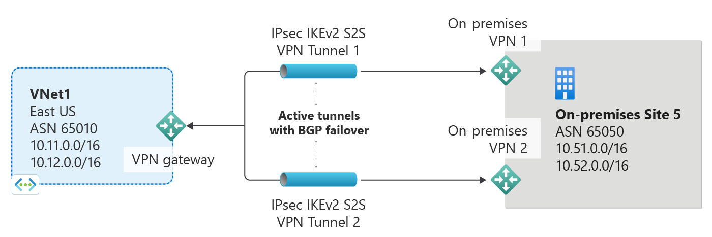
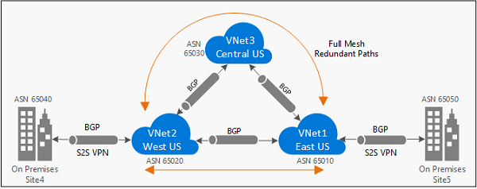

<properties
   pageTitle="Overview of BGP with Azure VPN Gateways | Microsoft Azure"
   description="This article provides an overview of BGP with Azure VPN Gateways."
   services="vpn-gateway"
   documentationCenter="na"
   authors="yushwang"
   manager="rossort"
   editor=""
   tags=""/>

<tags
   ms.service="vpn-gateway"
   ms.devlang="na"
   ms.topic="get-started-article"
   ms.tgt_pltfrm="na"
   ms.workload="infrastructure-services"
   ms.date="06/16/2016"
   ms.author="yushwang"/>

# Overview of BGP with Azure VPN Gateways

This article provides an overview of BGP (Border Gateway Protocol) support in Azure VPN Gateways.

## About BGP

BGP is the standard routing protocol commonly used in the Internet to exchange routing and reachability information between two or more networks. When used in the context of Azure Virtual Networks, BGP enables the Azure VPN Gateways and your on-premises VPN devices, called BGP peers or neighbors, to exchange "routes" that will inform both gateways on the availability and reachability for those prefixes to go through the gateways or routers involved. BGP can also enable transit routing among multiple networks by propagating routes a BGP gateway learns from one BGP peer to all other BGP peers.
 
### Why use BGP?

BGP is an optional feature you can use with Azure Route-Based VPN gateways. You should also make sure your on-premises VPN devices support BGP before you enable the feature. You can continue to use Azure VPN gateways and your on-premises VPN devices without BGP. It is the equivalent of using static routes (without BGP) *vs.* using dynamic routing with BGP between your networks and Azure.

There are several advantages and new capabilities with BGP:

#### Support automatic and flexible prefix updates

With BGP, you only need to declare a minimum prefix to a specific BGP peer over the IPsec S2S VPN tunnel. It can be as small as a host prefix (/32) of the BGP peer IP address of your on-premises VPN device. You can control which on-premises network prefixes you want to advertise to Azure to allow your Azure Virtual Network to access.
	
You can also advertise a larger prefixes that may include some of your VNet address prefixes, such as a large private IP address space (e.g., 10.0.0.0/8). Please note though the prefixes cannot be identical with any one of your VNet prefixes. Those routes identical to your VNet prefixes will be rejected.

>[AZURE.IMPORTANT] Currently, advertising the default route (0.0.0.0/0) to Azure VPN gateways will be blocked. Further update will be provided once this capability is enabled.

#### Support multiple tunnels between a VNet and an on-premises site with automatic failover based on BGP

You can establish multiple connections between your Azure VNet and your on-premises VPN devices in the same location. This capability provides multiple tunnels (paths) between the two networks in an active-active configuration. If one of the tunnels is disconnected, the corresponding routes will be withdrawn via BGP and the traffic will automatically shift to the remaining tunnels.
	
The following diagram shows a simple example of this highly available setup:
	

#### Support transit routing between your on-premises networks and multiple Azure VNets

BGP enables multiple gateways to learn and propagate prefixes from different networks, whether they are directly or indirectly connected. This can enable transit routing with Azure VPN gateways between your on-premises sites or across multiple Azure Virtual Networks.
	
The following diagram shows an example of a multi-hop topology with multiple paths that can transit traffic between the two on-premises networks through Azure VPN gateways within the Microsoft Networks:

## BGP FAQs

[AZURE.INCLUDE [vpn-gateway-bgp-faq-include](../../includes/vpn-gateway-bpg-faq-include.md)] 

## Next steps

See [Getting started with BGP on Azure VPN gateways](./vpn-gateway-bgp-resource-manager-ps.md) for steps to configure BGP for your cross-premises and VNet-to-VNet connections.

