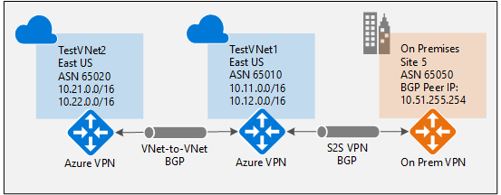
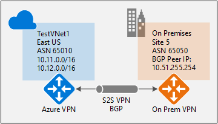
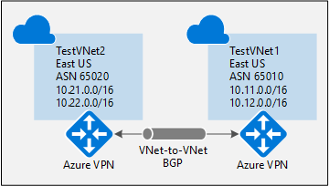

# How to configure BGP on Azure VPN Gateways using PowerShell
This article walks you through the steps to enable BGP on a cross-premises Site-to-Site (S2S) VPN connection and a VNet-to-VNet connection using the Resource Manager deployment model and PowerShell.

[!INCLUDE [updated-for-az](../../includes/updated-for-az.md)]

## About BGP
BGP is the standard routing protocol commonly used in the Internet to exchange routing and reachability information between two or more networks. BGP enables the Azure VPN Gateways and your on-premises VPN devices, called BGP peers or neighbors, to exchange "routes" that will inform both gateways on the availability and reachability for those prefixes to go through the gateways or routers involved. BGP can also enable transit routing among multiple networks by propagating routes a BGP gateway learns from one BGP peer to all other BGP peers.

See [Overview of BGP with Azure VPN Gateways](vpn-gateway-bgp-overview.md) for more discussion on benefits of BGP and to understand the technical requirements and considerations of using BGP.

## Getting started with BGP on Azure VPN gateways

This article walks you through the steps to do the following tasks:

* [Part 1 - Enable BGP on your Azure VPN gateway](#enablebgp)
* Part 2 - Establish a cross-premises connection with BGP
* [Part 3 - Establish a VNet-to-VNet connection with BGP](#v2vbgp)

Each part of the instructions forms a basic building block for enabling BGP in your network connectivity. If you complete all three parts, you build the topology as shown in the following diagram:



You can combine parts together to build a more complex, multi-hop, transit network that meets your needs.

## <a name ="enablebgp"></a>Part 1 - Configure BGP on the Azure VPN Gateway
The configuration steps set up the BGP parameters of the Azure VPN gateway as shown in the following diagram:


### Before you begin
* Verify that you have an Azure subscription. If you don't already have an Azure subscription, you can activate your [MSDN subscriber benefits](https://azure.microsoft.com/pricing/member-offers/msdn-benefits-details/) or sign up for a [free account](https://azure.microsoft.com/pricing/free-trial/).
* Install the Azure Resource Manager PowerShell cmdlets. For more information about installing the PowerShell cmdlets, see [How to install and configure Azure PowerShell](/powershell/azure/overview). 

### Step 1 - Create and configure VNet1
#### 1. Declare your variables
For this exercise, we start by declaring our variables. The following example declares the variables using the values for this exercise. Be sure to replace the values with your own when configuring for production. You can use these variables if you are running through the steps to become familiar with this type of configuration. Modify the variables, and then copy and paste into your PowerShell console.

```powershell
$Sub1 = "Replace_With_Your_Subscription_Name"
$RG1 = "TestBGPRG1"
$Location1 = "East US"
$VNetName1 = "TestVNet1"
$FESubName1 = "FrontEnd"
$BESubName1 = "Backend"
$GWSubName1 = "GatewaySubnet"
$VNetPrefix11 = "10.11.0.0/16"
$VNetPrefix12 = "10.12.0.0/16"
$FESubPrefix1 = "10.11.0.0/24"
$BESubPrefix1 = "10.12.0.0/24"
$GWSubPrefix1 = "10.12.255.0/27"
$VNet1ASN = 65010
$DNS1 = "8.8.8.8"
$GWName1 = "VNet1GW"
$GWIPName1 = "VNet1GWIP"
$GWIPconfName1 = "gwipconf1"
$Connection12 = "VNet1toVNet2"
$Connection15 = "VNet1toSite5"
```

#### 2. Connect to your subscription and create a new resource group
To use the Resource Manager cmdlets, Make sure you switch to PowerShell mode. For more information, see [Using Windows PowerShell with Resource Manager](../powershell-azure-resource-manager.md).

Open your PowerShell console and connect to your account. Use the following sample to help you connect:

```powershell
Connect-AzAccount
Select-AzSubscription -SubscriptionName $Sub1
New-AzResourceGroup -Name $RG1 -Location $Location1
```

#### 3. Create TestVNet1
The following sample creates a virtual network named TestVNet1 and three subnets, one called GatewaySubnet, one called FrontEnd, and one called Backend. When substituting values, it's important that you always name your gateway subnet specifically GatewaySubnet. If you name it something else, your gateway creation fails.

```powershell
$fesub1 = New-AzVirtualNetworkSubnetConfig -Name $FESubName1 -AddressPrefix $FESubPrefix1 $besub1 = New-AzVirtualNetworkSubnetConfig -Name $BESubName1 -AddressPrefix $BESubPrefix1
$gwsub1 = New-AzVirtualNetworkSubnetConfig -Name $GWSubName1 -AddressPrefix $GWSubPrefix1

New-AzVirtualNetwork -Name $VNetName1 -ResourceGroupName $RG1 -Location $Location1 -AddressPrefix $VNetPrefix11,$VNetPrefix12 -Subnet $fesub1,$besub1,$gwsub1
```

### Step 2 - Create the VPN Gateway for TestVNet1 with BGP parameters
#### 1. Create the IP and subnet configurations
Request a public IP address to be allocated to the gateway you will create for your VNet. You'll also define the required subnet and IP configurations.

```powershell
$gwpip1 = New-AzPublicIpAddress -Name $GWIPName1 -ResourceGroupName $RG1 -Location $Location1 -AllocationMethod Dynamic

$vnet1 = Get-AzVirtualNetwork -Name $VNetName1 -ResourceGroupName $RG1
$subnet1 = Get-AzVirtualNetworkSubnetConfig -Name "GatewaySubnet" -VirtualNetwork $vnet1
$gwipconf1 = New-AzVirtualNetworkGatewayIpConfig -Name $GWIPconfName1 -Subnet $subnet1 -PublicIpAddress $gwpip1
```

#### 2. Create the VPN gateway with the AS number
Create the virtual network gateway for TestVNet1. BGP requires a Route-Based VPN gateway, and also the addition parameter, -Asn, to set the ASN (AS Number) for TestVNet1. If you do not set the ASN parameter, ASN 65515 is assigned. Creating a gateway can take a while (30 minutes or more to complete).

```powershell
New-AzVirtualNetworkGateway -Name $GWName1 -ResourceGroupName $RG1 -Location $Location1 -IpConfigurations $gwipconf1 -GatewayType Vpn -VpnType RouteBased -GatewaySku VpnGw1 -Asn $VNet1ASN
```

#### 3. Obtain the Azure BGP Peer IP address
Once the gateway is created, you need to obtain the BGP Peer IP address on the Azure VPN Gateway. This address is needed to configure the Azure VPN Gateway as a BGP Peer for your on-premises VPN devices.

```powershell
$vnet1gw = Get-AzVirtualNetworkGateway -Name $GWName1 -ResourceGroupName $RG1
$vnet1gw.BgpSettingsText
```

The last command shows the corresponding BGP configurations on the Azure VPN Gateway; for example:

```powershell
$vnet1gw.BgpSettingsText
{
    "Asn": 65010,
    "BgpPeeringAddress": "10.12.255.30",
    "PeerWeight": 0
}
```

Once the gateway is created, you can use this gateway to establish cross-premises connection or VNet-to-VNet connection with BGP. The following sections walk through the steps to complete the exercise.

## <a name ="crossprembbgp"></a>Part 2 - Establish a cross-premises connection with BGP

To establish a cross-premises connection, you need to create a Local Network Gateway to represent your on-premises VPN device, and a Connection to connect the VPN gateway with the local network gateway. While there are articles that walk you through these steps, this article contains the additional properties required to specify the BGP configuration parameters.



Before proceeding, make sure you have completed [Part 1](#enablebgp) of this exercise.

### Step 1 - Create and configure the local network gateway

#### 1. Declare your variables

This exercise continues to build the configuration shown in the diagram. Be sure to replace the values with the ones that you want to use for your configuration.

```powershell
$RG5 = "TestBGPRG5"
$Location5 = "East US 2"
$LNGName5 = "Site5"
$LNGPrefix50 = "10.52.255.254/32"
$LNGIP5 = "Your_VPN_Device_IP"
$LNGASN5 = 65050
$BGPPeerIP5 = "10.52.255.254"
```

A couple of things to note regarding the local network gateway parameters:

* The local network gateway can be in the same or different location and resource group as the VPN gateway. This example shows them in different resource groups in different locations.
* The prefix you need to declare for the local network gateway is the host address of your BGP Peer IP address on your VPN device. In this case, it's a /32 prefix of "10.52.255.254/32".
* As a reminder, you must use different BGP ASNs between your on-premises networks and Azure VNet. If they are the same, you need to change your VNet ASN if your on-premises VPN device already uses the ASN to peer with other BGP neighbors.

Before you continue, make sure you are still connected to Subscription 1.

#### 2. Create the local network gateway for Site5

Be sure to create the resource group if it is not created, before you create the local network gateway. Notice the two additional parameters for the local network gateway: Asn and BgpPeerAddress.

```powershell
New-AzResourceGroup -Name $RG5 -Location $Location5

New-AzLocalNetworkGateway -Name $LNGName5 -ResourceGroupName $RG5 -Location $Location5 -GatewayIpAddress $LNGIP5 -AddressPrefix $LNGPrefix50 -Asn $LNGASN5 -BgpPeeringAddress $BGPPeerIP5
```

### Step 2 - Connect the VNet gateway and local network gateway

#### 1. Get the two gateways

```powershell
$vnet1gw = Get-AzVirtualNetworkGateway -Name $GWName1  -ResourceGroupName $RG1
$lng5gw  = Get-AzLocalNetworkGateway -Name $LNGName5 -ResourceGroupName $RG5
```

#### 2. Create the TestVNet1 to Site5 connection

In this step, you create the connection from TestVNet1 to Site5. You must specify "-EnableBGP $True" to enable BGP for this connection. As discussed earlier, it is possible to have both BGP and non-BGP connections for the same Azure VPN Gateway. Unless BGP is enabled in the connection property, Azure will not enable BGP for this connection even though BGP parameters are already configured on both gateways.

```powershell
New-AzVirtualNetworkGatewayConnection -Name $Connection15 -ResourceGroupName $RG1 -VirtualNetworkGateway1 $vnet1gw -LocalNetworkGateway2 $lng5gw -Location $Location1 -ConnectionType IPsec -SharedKey 'AzureA1b2C3' -EnableBGP $True
```

The following example lists the parameters you enter into the BGP configuration section on your on-premises VPN device for this exercise:

```

- Site5 ASN            : 65050
- Site5 BGP IP         : 10.52.255.254
- Prefixes to announce : (for example) 10.51.0.0/16 and 10.52.0.0/16
- Azure VNet ASN       : 65010
- Azure VNet BGP IP    : 10.12.255.30
- Static route         : Add a route for 10.12.255.30/32, with nexthop being the VPN tunnel interface on your device
- eBGP Multihop        : Ensure the "multihop" option for eBGP is enabled on your device if needed
```

The connection is established after a few minutes, and the BGP peering session starts once the IPsec connection is established.

## <a name ="v2vbgp"></a>Part 3 - Establish a VNet-to-VNet connection with BGP

This section adds a VNet-to-VNet connection with BGP, as shown in the following diagram:



The following instructions continue from the previous steps. You must complete [Part I](#enablebgp) to create and configure TestVNet1 and the VPN Gateway with BGP. 

### Step 1 - Create TestVNet2 and the VPN gateway

It is important to make sure that the IP address space of the new virtual network, TestVNet2, does not overlap with any of your VNet ranges.

In this example, the virtual networks belong to the same subscription. You can set up VNet-to-VNet connections between different subscriptions. For more information, see [Configure a VNet-to-VNet connection](vpn-gateway-vnet-vnet-rm-ps.md). Make sure you add the "-EnableBgp $True" when creating the connections to enable BGP.

#### 1. Declare your variables

Be sure to replace the values with the ones that you want to use for your configuration.

```powershell
$RG2 = "TestBGPRG2"
$Location2 = "West US"
$VNetName2 = "TestVNet2"
$FESubName2 = "FrontEnd"
$BESubName2 = "Backend"
$GWSubName2 = "GatewaySubnet"
$VNetPrefix21 = "10.21.0.0/16"
$VNetPrefix22 = "10.22.0.0/16"
$FESubPrefix2 = "10.21.0.0/24"
$BESubPrefix2 = "10.22.0.0/24"
$GWSubPrefix2 = "10.22.255.0/27"
$VNet2ASN = 65020
$DNS2 = "8.8.8.8"
$GWName2 = "VNet2GW"
$GWIPName2 = "VNet2GWIP"
$GWIPconfName2 = "gwipconf2"
$Connection21 = "VNet2toVNet1"
$Connection12 = "VNet1toVNet2"
```

#### 2. Create TestVNet2 in the new resource group

```powershell
New-AzResourceGroup -Name $RG2 -Location $Location2

$fesub2 = New-AzVirtualNetworkSubnetConfig -Name $FESubName2 -AddressPrefix $FESubPrefix2
$besub2 = New-AzVirtualNetworkSubnetConfig -Name $BESubName2 -AddressPrefix $BESubPrefix2
$gwsub2 = New-AzVirtualNetworkSubnetConfig -Name $GWSubName2 -AddressPrefix $GWSubPrefix2

New-AzVirtualNetwork -Name $VNetName2 -ResourceGroupName $RG2 -Location $Location2 -AddressPrefix $VNetPrefix21,$VNetPrefix22 -Subnet $fesub2,$besub2,$gwsub2
```

#### 3. Create the VPN gateway for TestVNet2 with BGP parameters

Request a public IP address to be allocated to the gateway you will create for your VNet and define the required subnet and IP configurations.

```powershell
$gwpip2    = New-AzPublicIpAddress -Name $GWIPName2 -ResourceGroupName $RG2 -Location $Location2 -AllocationMethod Dynamic

$vnet2     = Get-AzVirtualNetwork -Name $VNetName2 -ResourceGroupName $RG2
$subnet2   = Get-AzVirtualNetworkSubnetConfig -Name "GatewaySubnet" -VirtualNetwork $vnet2
$gwipconf2 = New-AzVirtualNetworkGatewayIpConfig -Name $GWIPconfName2 -Subnet $subnet2 -PublicIpAddress $gwpip2
```

Create the VPN gateway with the AS number. You must override the default ASN on your Azure VPN gateways. The ASNs for the connected VNets must be different to enable BGP and transit routing.

```powershell
New-AzVirtualNetworkGateway -Name $GWName2 -ResourceGroupName $RG2 -Location $Location2 -IpConfigurations $gwipconf2 -GatewayType Vpn -VpnType RouteBased -GatewaySku VpnGw1 -Asn $VNet2ASN
```

### Step 2 - Connect the TestVNet1 and TestVNet2 gateways

In this example, both gateways are in the same subscription. You can complete this step in the same PowerShell session.

#### 1. Get both gateways

Make sure you log in and connect to Subscription 1.

```powershell
$vnet1gw = Get-AzVirtualNetworkGateway -Name $GWName1 -ResourceGroupName $RG1
$vnet2gw = Get-AzVirtualNetworkGateway -Name $GWName2 -ResourceGroupName $RG2
```

#### 2. Create both connections

In this step, you create the connection from TestVNet1 to TestVNet2, and the connection from TestVNet2 to TestVNet1.

```powershell
New-AzVirtualNetworkGatewayConnection -Name $Connection12 -ResourceGroupName $RG1 -VirtualNetworkGateway1 $vnet1gw -VirtualNetworkGateway2 $vnet2gw -Location $Location1 -ConnectionType Vnet2Vnet -SharedKey 'AzureA1b2C3' -EnableBgp $True

New-AzVirtualNetworkGatewayConnection -Name $Connection21 -ResourceGroupName $RG2 -VirtualNetworkGateway1 $vnet2gw -VirtualNetworkGateway2 $vnet1gw -Location $Location2 -ConnectionType Vnet2Vnet -SharedKey 'AzureA1b2C3' -EnableBgp $True
```

> [!IMPORTANT]
> Be sure to enable BGP for BOTH connections.
> 
> 

After completing these steps, the connection is established after a few minutes. The BGP peering session is up once the VNet-to-VNet connection is completed.

If you completed all three parts of this exercise, you have established the following network topology:


## Next steps

Once your connection is complete, you can add virtual machines to your virtual networks. See [Create a Virtual Machine](../virtual-machines/virtual-machines-windows-hero-tutorial.md?toc=%2fazure%2fvirtual-machines%2fwindows%2ftoc.json) for steps.
