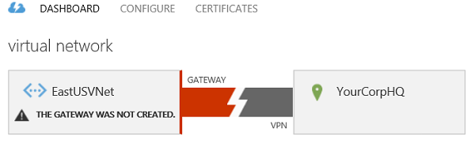
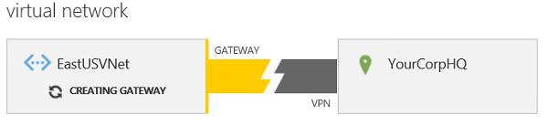
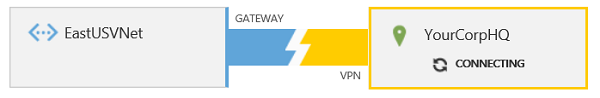

<properties 
   pageTitle="Configure a VPN Gateway in the Azure Classic Portal | Microsoft Azure"
   description="This article walks you through configuring your virtual network VPN gateway and changing a gateway VPN routing type."
   services="vpn-gateway"
   documentationCenter="na"
   authors="cherylmc"
   manager="carmonm"
   editor=""
   tags="azure-service-management"/>

<tags 
   ms.service="vpn-gateway"
   ms.devlang="na"
   ms.topic="article"
   ms.tgt_pltfrm="na"
   ms.workload="infrastructure-services"
   ms.date="08/11/2016"
   ms.author="cherylmc" />

# Configure a VPN gateway for the classic deployment model

If you want to create a secure cross-premises connection between Azure and your on-premises location, you need to configure a VPN gateway connection. In the classic deployment model, a gateway can be one of two VPN routing types: static, or dynamic. The type you choose depends on both your network design plan, and the on-premises VPN device you want to use. 

For example, some connectivity options, such as a point-to-site connection, require a dynamic routing gateway. If you want to configure your gateway to support both point-to-site (P2S) connections and a site-to-site (S2S) connection, you have to configure a dynamic routing gateway even though site-to-site can be configured with either gateway VPN routing type. 

Additionally, must make sure that the device you want to use for your connection will support the VPN routing type that you want to create. See [About VPN Devices](vpn-gateway-about-vpn-devices.md).

**About this article** 

This article was written for the classic deployment model using the [classic portal](https://manage.windowsazure.com) (not the Azure portal). 

**About Azure deployment models**

[AZURE.INCLUDE [vpn-gateway-clasic-rm](../../includes/vpn-gateway-classic-rm-include.md)] 

## Configuration overview

The following steps walk you through configuring your VPN gateway in the Azure classic portal. These steps apply to gateways for virtual networks that were created using the classic deployment model. Currently, not all of the configuration settings for gateways are available in the Azure portal. When they are, we will create a new set of instructions that apply to the Azure portal.

1. [Create a VPN gateway for your VNet](#create-a-vpn-gateway)

1. [Gather information for your VPN device configuration](#gather-information-for-your-vpn-device-configuration)

1. [Configure your VPN device](#configure-your-vpn-device)

1. [Verify your local network ranges and VPN gateway IP address](#verify-your-local-network-ranges-and-vpn-gateway-ip-address)

### Before you begin

Before you configure your gateway, you first need to create your virtual network. For steps to create a virtual network for cross-premises connectivity, see [Configure a virtual network with a site-to-site VPN connection](vpn-gateway-site-to-site-create.md), or [Configure a virtual network with a point-to-site VPN connection](vpn-gateway-point-to-site-create.md). Then, use the following steps to configure the VPN gateway and gather the information you need to configure your VPN device. 

If you already have a VPN gateway and you want to change the VPN routing type, see [How to change the VPN routing type for your gateway](#how-to-change-the-vpn-routing-type-for-your-gateway).

## Create a VPN gateway

1. In the [Azure classic portal](https://manage.windowsazure.com), on the **Networks** page, verify that the status column for your virtual network is **Created**.

1. In the **Name** column, click the name of your virtual network.

1. On the **Dashboard** page, notice that this VNet doesn't have a gateway configured yet. You'll see this status as you go through the steps to configure your gateway.

Next, at the bottom of the page, click **Create Gateway**. You can select either *Static Routing* or *Dynamic Routing*. The VPN routing type you select depends on few factors. For example, what your VPN device supports and whether you need to support point-to-site connections. Check [About VPN Devices for Virtual Network Connectivity](vpn-gateway-about-vpn-devices.md) to verify the VPN routing type that you need. Once the gateway has been created, you can't change between gateway VPN routing types without deleting and re-creating the gateway. When the system prompts you to confirm that you want the gateway created, click **Yes**.

When your gateway is creating, notice the gateway graphic on the page changes to yellow and says *Creating Gateway*. It may take up to 45 minutes for the gateway to create. Wait until the gateway is complete before you can move forward with other configuration settings.

When the gateway changes to *Connecting*, you can gather the information you'll need for your VPN device.

## Gather information for your VPN device configuration

After the gateway has been created, gather information for your VPN device configuration. This information is located on the **Dashboard** page for your virtual network:

1. **Gateway IP address -** The IP address can be found on the **Dashboard** page. You won't be able to see it until after your gateway has finished creating.

1. **Shared key -** Click **Manage Key** at the bottom of the screen. Click the icon next to the key to copy it to your clipboard, and then paste and save the key. This button only works when there is a single S2S VPN tunnel. If you have multiple S2S VPN tunnels, please use the *Get Virtual Network Gateway Shared Key* API or PowerShell cmdlet.

## Configure your VPN device

After completing the previous steps, you or your network administrator will need to configure the VPN device in order to create the connection. See [About VPN Devices for Virtual Network Connectivity](vpn-gateway-about-vpn-devices.md) for more information about VPN devices.

After the VPN device has been configured, you can view your updated connection information on the Dashboard page for your VNet.

You can also run one of the following commands to test your connection:

|                      | Cisco ASA             | Cisco ISR/ASR         | Juniper SSG/ISG | Juniper SRX/J                            |
|----------------------|-----------------------|-----------------------|-----------------|------------------------------------------|
| **Check main mode SAs**  | show crypto isakmp sa | show crypto isakmp sa | get ike cookie  | show security ike security-association   |
| **Check quick mode SAs** | show crypto ipsec sa  | show crypto ipsec sa  | get sa          | show security ipsec security-association |

## Verify your local network ranges and VPN gateway IP address

### Verify your VPN gateway IP address

For gateway to connect properly, the IP address for your VPN device must be correctly configured for the Local Network that you specified for your cross-premises configuration. Typically, this is configured during the site-to-site configuration process. However, if you previously used this local network with a different device, or the IP address has changed for this local network, edit the settings to specify the correct Gateway IP address.

1. To verify your gateway IP address, click **Networks** on the left portal pane and then select **Local Networks** at the top of the page. You'll see the VPN Gateway Address for each local network that you have created. To edit the IP address, select the VNet and click **Edit** at the bottom of the page.

1. On the **Specify your local network details** page, edit the IP address, and then click the next arrow at the bottom of the page.

1. On the **Specify the address space** page, click the checkmark on the lower right to save your settings.

### Verify the address ranges for your local networks

For the correct traffic to flow through the gateway to your on-premises location, you need to verify that each IP address range is specified. Each range must be listed in your Azure **Local Networks** configuration. Depending on the network configuration of your on-premises location, this can be a somewhat large task. Traffic that is bound for an IP address that is contained within the listed ranges will be sent through the virtual network VPN gateway. The ranges that you list don't have to be private ranges, although you will want to verify that your on-premises configuration can receive the inbound traffic.

To add or edit the ranges for a Local Network, use the following steps.

1. To edit the IP address ranges for a local network, click **Networks** on the left portal pane and then select **Local Networks** at the top of the page. In the portal, the easiest way to view the ranges that you've listed is on the **Edit** page. To see your ranges, select the VNet and click **Edit** at the bottom of the page.

1. On the **Specify your local network details** page, don't make any changes. Click the next arrow at the bottom of the page.

1. On the **Specify the address space** page, make your network address space changes. Then click the checkmark to save your configuration.

## How to view gateway traffic

You can view your gateway and gateway traffic from your Virtual Network **Dashboard** page.

On the **Dashboard** page you can view the following:

- The amount of data that is flowing through your gateway, both data in and data out.

- The names of the DNS servers that are specified for your virtual network.

- The connection between your gateway and your VPN device.

- The shared key that is used to configure your gateway connection to your VPN device.

## How to change the VPN routing type for your gateway

Because some connectivity configurations are only available for certain gateway routing types, you may find that you need to change the gateway VPN routing type of an existing VPN gateway. For example, you may want to add point-to-site connectivity to an already existing site-to-site connection that has a static gateway. Point-to-site connections require a dynamic gateway. This means to configure a P2S connection, you have to change your gateway VPN routing type from static to dynamic.

If you need to change a gateway VPN routing type, you'll delete the existing gateway, and then recreate it with the new routing type. You don't need to delete the entire virtual network to change the gateway routing type.

Before changing your gateway VPN routing type, be sure to verify that your VPN device will support the routing type that you want to use. To download new routing configuration samples and check VPN device requirements, see [About VPN Devices for Virtual Network Connectivity](vpn-gateway-about-vpn-devices.md).

>[AZURE.IMPORTANT] When you delete a virtual network VPN gateway, the VIP assigned to the gateway is released. When you recreate the gateway, a new VIP is assigned to it.

1. **Delete the existing VPN gateway.**

	On the **Dashboard** page for your virtual network, navigate to the bottom of the page and click **Delete Gateway**. Wait for the notification that the gateway has been deleted. Once you receive the notification on the screen that your gateway has been deleted, you can create a new gateway.

1. **Create a new VPN gateway.**

	Use the procedure at the top of the page to create a new gateway: [Create a VPN gateway](#create-a-vpn-gateway).

## Next steps

You can add virtual machines to your virtual network. See [How to create a custom virtual machine](../virtual-machines/virtual-machines-windows-classic-createportal.md).

If you want to configure a point-to-site VPN connection, see [Configure a point-to-site VPN connection](vpn-gateway-point-to-site-create.md).

 
