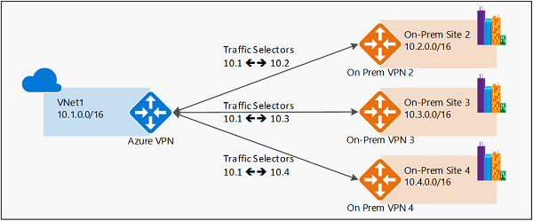
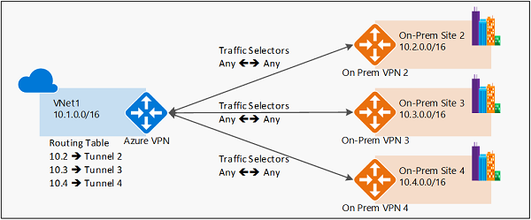
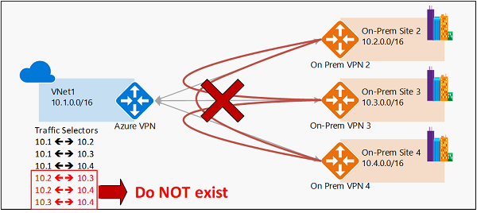
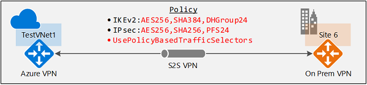

# Connect Azure VPN gateways to multiple on-premises policy-based VPN devices using PowerShell

This article walks you through the steps to configure an Azure route-based VPN gateway to connect to multiple on-premises poilcy-based VPN devices leveraging custom IPsec/IKE policies on S2S VPN connections.

## About policy-based and route-based VPN gateways

Policy- *vs.* route-based VPN devices differ in how the IPsec traffic selectors are set on a connection:

* **Policy-based** VPN devices use the combinations of prefixes from both networks to define how traffic is encrypted/decrypted through IPsec tunnels. It is typically built on firewall devices that perform packet filtering. IPsec tunnel encryption and decryption are added to the packet filtering and processing engine.
* **Route-based** VPN devices use any-to-any (wildcard) traffic selectors, and let routing/forwarding tables direct traffic to different IPsec tunnels. It is typically built on router platforms where each IPsec tunnel is modeled as a network interface or VTI (virtual tunnel interface).

The following diagrams highlight the two models:

### Policy-based VPN example


### Route-based VPN example


### Azure support for policy-based VPN
Currently, Azure supports both modes of VPN gateways: route-based VPN gateways and policy-based VPN gateways. They are built on different internal platforms which result in different specifications:

|                          | **PolicyBased VPN Gateway** | **RouteBased VPN Gateway**               |
| ---                      | ---                         | ---                                      |
| **Azure Gateway SKU**    | Basic                       | Basic, Standard, HighPerformance         |
| **IKE version**          | IKEv1                       | IKEv2                                    |
| **Max. S2S connections** | **1**                       | Basic/Standard:10<br> HighPerformance:30 |
|                          |                             |                                          |

With the custom IPsec/IKE policy, you can now configure Azure route-based VPN gateways to use prefix-based traffic selectors with option "**PolicyBasedTrafficSelectors**", to connect to on-premises policy-based VPN devices. This capability allows you to connect from an Azure virtual network and VPN gateway to multiple on-premises policy-based VPN/firewall devices, removing the single connection limit from the current Azure policy-based VPN gateways.

> [!IMPORTANT]
> 1. To enable this connectivity, your on-premises policy-based VPN devices must support **IKEv2** to connect to the Azure route-based VPN gateways. Please check with your VPN device specifications.
> 2. The on-premises networks connecting through policy-based VPN devices with this mechanism can only connect to the Azure virtual network; **cannot transit to other on-premises networks or virtual networks via the same Azure VPN gateway**.
> 3. The configuration option is part of the custom IPsec/IKE connection policy. You must specify the complete policy (IPsec/IKE encryption and integrity algorithms, key strengths, and SA lifetimes) if you enable the policy-based traffic selector option.

The diagram below shows why transit routing via Azure VPN gateway will not work with the policy-based option.



As shown in the diagram, the Azure VPN gateway will have traffic selectors from the virtual network to each on-premises network prefixes, but not the cross-connection prefixes. E.g., on-premises site 2, site 3, and site 4 can each communicate to VNet1 respectively, but cannot connect via the Azure VPN gateway to each other. The diagram shows the cross-connect traffic selectors that are not available in the Azure VPN gateway under this configuration.

## Configure policy-based traffic selectors on a connection

The instructions in this article follow the same example as described in [Configure IPsec/IKE policy for S2S or VNet-to-VNet connections](vpn-gateway-ipsecikepolicy-rm-powershell.md), to establish a S2S VPN connection as shown in the diagram below:



The workflow to enable this conectivity:
1. Create the virtual network, VPN gateway, and local network gateway for your cross-premises connection
2. Create an IPsec/IKE policy
3. Apply the policy when you create a S2S or VNet-to-VNet connection, and **enable the policy-based traffic selectors** on the connection
4. If the connection is already created, you can apply or update the policy to an existing connection

## Enable policy-based traffic selectors on a connection

Please make sure you have completed [Part 3 of the Configure IPsec/IKE policy article](vpn-gateway-ipsecikepolicy-rm-powershell.md) for this section. The sample below uses the same parameters and steps.

### Step 1 - Create the virtual network, VPN gateway, and local network gateway

#### 1. Declare your variables & connect to your subscription
For this exercise, we'll start by declaring our variables. Be sure to replace the values with your own when configuring for production.

```powershell
$Sub1          = "<YourSubscriptionName>"
$RG1           = "TestPolicyRG1"
$Location1     = "East US 2"
$VNetName1     = "TestVNet1"
$FESubName1    = "FrontEnd"
$BESubName1    = "Backend"
$GWSubName1    = "GatewaySubnet"
$VNetPrefix11  = "10.11.0.0/16"
$VNetPrefix12  = "10.12.0.0/16"
$FESubPrefix1  = "10.11.0.0/24"
$BESubPrefix1  = "10.12.0.0/24"
$GWSubPrefix1  = "10.12.255.0/27"
$DNS1          = "8.8.8.8"
$GWName1       = "VNet1GW"
$GW1IPName1    = "VNet1GWIP1"
$GW1IPconf1    = "gw1ipconf1"
$Connection16  = "VNet1toSite6"

$LNGName6      = "Site6"
$LNGPrefix61   = "10.61.0.0/16"
$LNGPrefix62   = "10.62.0.0/16"
$LNGIP6        = "131.107.72.22"
```
Make sure you switch to PowerShell mode to use the Resource Manager cmdlets. For more information, see [Using Windows PowerShell with Resource Manager](../powershell-azure-resource-manager.md).

Open your PowerShell console and connect to your account. Use the following sample to help you connect:

```powershell
Login-AzureRmAccount
Select-AzureRmSubscription -SubscriptionName $Sub1
New-AzureRmResourceGroup -Name $RG1 -Location $Location1
```

#### 2. Create the virtual network, VPN gateway, and local network gateway
The sample below creates the virtual network, TestVNet1, with three subnets, and the VPN gateway. When substituting values, it's important that you always name your gateway subnet specifically GatewaySubnet. If you name it something else, your gateway creation will fail.

```powershell
$fesub1 = New-AzureRmVirtualNetworkSubnetConfig -Name $FESubName1 -AddressPrefix $FESubPrefix1
$besub1 = New-AzureRmVirtualNetworkSubnetConfig -Name $BESubName1 -AddressPrefix $BESubPrefix1
$gwsub1 = New-AzureRmVirtualNetworkSubnetConfig -Name $GWSubName1 -AddressPrefix $GWSubPrefix1

New-AzureRmVirtualNetwork -Name $VNetName1 -ResourceGroupName $RG1 -Location $Location1 -AddressPrefix $VNetPrefix11,$VNetPrefix12 -Subnet $fesub1,$besub1,$gwsub1

$gw1pip1    = New-AzureRmPublicIpAddress -Name $GW1IPName1 -ResourceGroupName $RG1 -Location $Location1 -AllocationMethod Dynamic
$vnet1      = Get-AzureRmVirtualNetwork -Name $VNetName1 -ResourceGroupName $RG1
$subnet1    = Get-AzureRmVirtualNetworkSubnetConfig -Name "GatewaySubnet" -VirtualNetwork $vnet1
$gw1ipconf1 = New-AzureRmVirtualNetworkGatewayIpConfig -Name $GW1IPconf1 -Subnet $subnet1 -PublicIpAddress $gw1pip1

New-AzureRmVirtualNetworkGateway -Name $GWName1 -ResourceGroupName $RG1 -Location $Location1 -IpConfigurations $gw1ipconf1 -GatewayType Vpn -VpnType RouteBased -GatewaySku HighPerformance

New-AzureRmLocalNetworkGateway -Name $LNGName6 -ResourceGroupName $RG1 -Location $Location1 -GatewayIpAddress $LNGIP6 -AddressPrefix $LNGPrefix61,$LNGPrefix62
```

### Step 2 - Creat a S2S VPN connection with an IPsec/IKE policy

#### 1. Create an IPsec/IKE policy

> [!IMPORTANT]
> You need to create an IPsec/IKE policy in order to enable "UsePolicyBasedTrafficSelectors" option
> on the connection.

The sample script below creates an IPsec/IKE policy with the following algorithms and parameters:
* IKEv2: AES256, SHA384, DHGroup24
* IPsec: AES256, SHA256, PFS24, SA Lifetime 3600 seconds & 2048KB

```powershell
$ipsecpolicy6 = New-AzureRmIpsecPolicy -IkeEncryption AES256 -IkeIntegrity SHA384 -DhGroup DHGroup24 -IpsecEncryption AES256 -IpsecIntegrity SHA256 -PfsGroup PFS24 -SALifeTimeSeconds 3600 -SADataSizeKilobytes 2048
```

#### 2. Create the S2S VPN connection with policy-based traffic selectors and IPsec/IKE policy
Create an S2S VPN connection and apply the IPsec/IKE policy created above. Note the additional parameter "-UsePolicyBasedTrafficSelectors $True" to enable poicy-based traffic selectors on the connection.

```powershell
$vnet1gw = Get-AzureRmVirtualNetworkGateway -Name $GWName1  -ResourceGroupName $RG1
$lng6 = Get-AzureRmLocalNetworkGateway  -Name $LNGName6 -ResourceGroupName $RG1

New-AzureRmVirtualNetworkGatewayConnection -Name $Connection16 -ResourceGroupName $RG1 -VirtualNetworkGateway1 $vnet1gw -LocalNetworkGateway2 $lng6 -Location $Location1 -ConnectionType IPsec -UsePolicyBasedTrafficSelectors $True -IpsecPolicies $ipsecpolicy6 -SharedKey 'AzureA1b2C3'
```

After completing the steps, the S2S VPN connection will use the IPsec/IKE policy defined above, and enable policy-based traffic selectors on the connection. You can repeat the same steps to add more connections to additional on-premises policy-based VPN devices from the same Azure VPN gateway.

## Update policy-based traffic selectors for a connection
The last section will show you how to update the policy-based traffic selectors option for an existing  S2S VPN connection.

### 1. Get the connection
Get the connection resource.

```powershell
$RG1          = "TestPolicyRG1"
$Connection16 = "VNet1toSite6"
$connection6  = Get-AzureRmVirtualNetworkGatewayConnection -Name $Connection16 -ResourceGroupName $RG1
```

### 2. Check the policy-based traffic selectors option
The following line will show whether the policy-based traffic selectors are used for the connection:

```powershell
$connection6.UsePolicyBasedTrafficSelectors
```

If the line returns "**True**", then policy-based traffic selectors are configured on the connection; otherwise it will return "**False**."

### 3. Update the policy-based traffic selectors on a connection
Once you obtain the connection resource, you can enable or disable the option.

#### Disable UsePolicyBasedTrafficSelectors
The example below disables the policy-based traffic selectors option, but leaves the IPsec/IKE policy unchanged:

```powershell
$RG1          = "TestPolicyRG1"
$Connection16 = "VNet1toSite6"
$connection6  = Get-AzureRmVirtualNetworkGatewayConnection -Name $Connection16 -ResourceGroupName $RG1

Set-AzureRmVirtualNetworkGatewayConnection -VirtualNetworkGatewayConnection $connection6 -UsePolicyBasedTrafficSelectors $False
```

#### Enable UsePolicyBasedTrafficSelectors
The example below enables the policy-based traffic selectors option, but leaves the IPsec/IKE policy unchanged:

```powershell
$RG1          = "TestPolicyRG1"
$Connection16 = "VNet1toSite6"
$connection6  = Get-AzureRmVirtualNetworkGatewayConnection -Name $Connection16 -ResourceGroupName $RG1

Set-AzureRmVirtualNetworkGatewayConnection -VirtualNetworkGatewayConnection $connection6 -UsePolicyBasedTrafficSelectors $True
```

## Next steps
Once your connection is complete, you can add virtual machines to your virtual networks. See [Create a Virtual Machine](../virtual-machines/virtual-machines-windows-hero-tutorial.md?toc=%2fazure%2fvirtual-machines%2fwindows%2ftoc.json) for steps.

Also review [Configure IPsec/IKE policy for S2S VPN or VNet-to-VNet connections](vpn-gateway-ipsecikepolicy-rm-powershell.md) for more details on custom IPsec/IKE policies.
