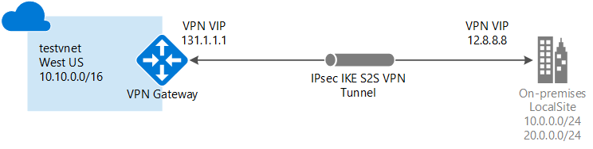

# Create a VNet with a Site-to-Site VPN connection using PowerShell

This article shows you how to use PowerShell to create a Site-to-Site VPN gateway connection from your on-premises network to the VNet. The steps in this article apply to the Resource Manager deployment model. You can also create this configuration using a different deployment tool or deployment model by selecting a different option from the following list:

> [!div class="op_single_selector"]
> * [Azure portal](vpn-gateway-howto-site-to-site-resource-manager-portal.md)
> * [PowerShell](vpn-gateway-create-site-to-site-rm-powershell.md)
> * [CLI](vpn-gateway-howto-site-to-site-resource-manager-cli.md)
> * [Azure portal (classic)](vpn-gateway-howto-site-to-site-classic-portal.md)
> * [Classic portal (classic)](vpn-gateway-site-to-site-create.md)
> 
>


A Site-to-Site VPN gateway connection is used to connect your on-premises network to an Azure virtual network over an IPsec/IKE (IKEv1 or IKEv2) VPN tunnel. This type of connection requires a VPN device located on-premises that has an externally facing public IP address assigned to it. For more information about VPN gateways, see [About VPN gateway](vpn-gateway-about-vpngateways.md).



## Before you begin

Verify that you have met the following criteria before beginning your configuration:

* Verify that you want to work with the Resource Manager deployment model. [!INCLUDE [deployment models](../../includes/vpn-gateway-classic-rm-include.md)]
* A compatible VPN device and someone who is able to configure it. For more information about compatible VPN devices and device configuration, see [About VPN Devices](vpn-gateway-about-vpn-devices.md).
* An externally facing public IPv4 address for your VPN device. This IP address cannot be located behind a NAT.
* If you are unfamiliar with the IP address ranges located in your on-premises network configuration, you need to coordinate with someone who can provide those details for you. When you create this configuration, you must specify the IP address range prefixes that Azure will route to your on-premises location. None of the subnets of your on-premises network can over lap with the virtual network subnets that you want to connect to.
* The latest version of the Azure Resource Manager PowerShell cmdlets. See [How to install and configure Azure PowerShell](/powershell/azure/overview) for more information about installing the PowerShell cmdlets.

### Example values

The examples in this article use the following values. You can use these values to create a test environment, or refer to them to better understand the examples in this article.

```
#Example values

VnetName                = testvnet 
ResourceGroup           = testrg 
Location                = West US 
AddressSpace            = 10.0.0.0/16 
SubnetName              = Subnet1 
Subnet                  = 10.0.1.0/28 
GatewaySubnet           = 10.0.0.0/27
LocalNetworkGatewayName = LocalSite
LNG Public IP           = <VPN device IP address> 
Local Address Prefixes  = 10.0.0.0/24','20.0.0.0/24
Gateway Name            = vnetgw1
PublicIP                = gwpip
Gateway IP Config       = gwipconfig1 
VPNType                 = RouteBased 
GatewayType             = Vpn 
ConnectionName          = myGWConnection

```


## <a name="Login"></a>1. Connect to your subscription

[!INCLUDE [PowerShell login](../../includes/vpn-gateway-ps-login-include.md)]

## <a name="VNet"></a>2. Create a virtual network and a gateway subnet

If you don't already have a virtual network, create one. When creating a virtual network, make sure that the address spaces you specify don't overlap any of the address spaces that you have on your on-premises network.

[!INCLUDE [About gateway subnets](../../includes/vpn-gateway-about-gwsubnet-include.md)]

[!INCLUDE [No NSG warning](../../includes/vpn-gateway-no-nsg-include.md)]

### To create a virtual network and a gateway subnet

This example creates a virtual network and a gateway subnet. If you already have a virtual network that you need to add a gateway subnet to, see [To add a gateway subnet to a virtual network you have already created](#gatewaysubnet).

Create a resource group:

```powershell
New-AzureRmResourceGroup -Name testrg -Location 'West US'
```

Create your virtual network.

1. Set the variables.

  ```powershell
  $subnet1 = New-AzureRmVirtualNetworkSubnetConfig -Name 'GatewaySubnet' -AddressPrefix 10.0.0.0/27
  $subnet2 = New-AzureRmVirtualNetworkSubnetConfig -Name 'Subnet1' -AddressPrefix '10.0.1.0/28'
  ```
2. Create the VNet.

  ```powershell
  New-AzureRmVirtualNetwork -Name testvnet -ResourceGroupName testrg `
  -Location 'West US' -AddressPrefix 10.0.0.0/16 -Subnet $subnet1, $subnet2
  ```

### <a name="gatewaysubnet"></a>To add a gateway subnet to a virtual network you have already created

1. Set the variables.

  ```powershell
  $vnet = Get-AzureRmVirtualNetwork -ResourceGroupName testrg -Name testvnet
  ```
2. Create the gateway subnet.

  ```powershell
  Add-AzureRmVirtualNetworkSubnetConfig -Name 'GatewaySubnet' -AddressPrefix 10.0.0.0/27 -VirtualNetwork $vnet
  ```
3. Set the configuration.

  ```powershell
  Set-AzureRmVirtualNetwork -VirtualNetwork $vnet
  ```

## 3. <a name="localnet"></a>Create the local network gateway

The local network gateway typically refers to your on-premises location. You give the site a name by which Azure can refer to it, then specify the IP address of the on-premises VPN device to which you will create a connection. You also specify the IP address prefixes that will be routed through the VPN gateway to the VPN device. The address prefixes you specify are the prefixes located on your on-premises network. If your on-premises network changes, you can easily update the prefixes.

Use the following values:

* The *GatewayIPAddress* is the IP address of your on-premises VPN device. Your VPN device cannot be located behind a NAT.
* The *AddressPrefix* is your on-premises address space.

To add a local network gateway with a single address prefix:

  ```powershell
  New-AzureRmLocalNetworkGateway -Name LocalSite -ResourceGroupName testrg `
  -Location 'West US' -GatewayIpAddress '23.99.221.164' -AddressPrefix '10.0.0.0/24'
  ```

To add a local network gateway with multiple address prefixes:

  ```powershell
  New-AzureRmLocalNetworkGateway -Name LocalSite -ResourceGroupName testrg `
  -Location 'West US' -GatewayIpAddress '23.99.221.164' -AddressPrefix @('10.0.0.0/24','20.0.0.0/24')
  ```

To modify IP address prefixes for your local network gateway:<br>
Sometimes your local network gateway prefixes change. The steps you take to modify your IP address prefixes depend on whether you have created a VPN gateway connection. See the [Modify IP address prefixes for a local network gateway](#modify) section of this article.

## <a name="PublicIP"></a>4. Request a Public IP address

A VPN gateway must have a Public IP address. You first request the IP address resource, and then refer to it when creating your virtual network gateway. The IP address is dynamically assigned to the resource when the VPN gateway is created. VPN Gateway currently only supports *Dynamic* Public IP address allocation. You cannot request a Static Public IP address assignment. However, this does not mean that the IP address changes after it has been assigned to your VPN gateway. The only time the Public IP address changes is when the gateway is deleted and re-created. It doesn't change across resizing, resetting, or other internal maintenance/upgrades of your VPN gateway.

Request a Public IP address that will be assigned to your virtual network VPN gateway.

```powershell
$gwpip= New-AzureRmPublicIpAddress -Name gwpip -ResourceGroupName testrg -Location 'West US' -AllocationMethod Dynamic
```

## <a name="GatewayIPConfig"></a>5. Create the gateway IP addressing configuration

The gateway configuration defines the subnet and the public IP address to use. Use the following example to create your gateway configuration:

```powershell
$vnet = Get-AzureRmVirtualNetwork -Name testvnet -ResourceGroupName testrg
$subnet = Get-AzureRmVirtualNetworkSubnetConfig -Name 'GatewaySubnet' -VirtualNetwork $vnet
$gwipconfig = New-AzureRmVirtualNetworkGatewayIpConfig -Name gwipconfig1 -SubnetId $subnet.Id -PublicIpAddressId $gwpip.Id
```

## <a name="CreateGateway"></a>6. Create the VPN gateway

Create the virtual network VPN gateway. Creating a VPN gateway can take up to 45 minutes or more to complete.

Use the following values:

* The *-GatewayType* for a Site-to-Site configuration is *Vpn*. The gateway type is always specific to the configuration that you are implementing. For example, other gateway configurations may require -GatewayType ExpressRoute.
* The *-VpnType* can be *RouteBased* (referred to as a Dynamic Gateway in some documentation), or *PolicyBased* (referred to as a Static Gateway in some documentation). For more information about VPN gateway types, see [About VPN Gateway](vpn-gateway-about-vpngateways.md).
* The *-GatewaySku* can be Basic, Standard, or HighPerformance. There are configuration limitations for certain SKUs. For more information, see [Gateway SKUs](vpn-gateway-about-vpn-gateway-settings.md#gwsku).

```powershell
New-AzureRmVirtualNetworkGateway -Name vnetgw1 -ResourceGroupName testrg `
-Location 'West US' -IpConfigurations $gwipconfig -GatewayType Vpn `
-VpnType RouteBased -GatewaySku Standard
```

## <a name="ConfigureVPNDevice"></a>7. Configure your VPN device

Site-to-Site connections to an on-premises network require a VPN device. In this step, you configure your VPN device. When configuring your VPN device, you need the following:

- A shared key. This is the same shared key that you specify when creating your Site-to-Site VPN connection. In our examples, we use a basic shared key. We recommend that you generate a more complex key to use.
- The Public IP address of your virtual network gateway. You can view the public IP address by using the Azure portal, PowerShell, or CLI. To find the Public IP address of your virtual network gateway using PowerShell, use the following example:

  ```powershell
  Get-AzureRmPublicIpAddress -Name GW1PublicIP -ResourceGroupName TestRG
  ```

[!INCLUDE [Configure VPN device](../../includes/vpn-gateway-configure-vpn-device-rm-include.md)]


## <a name="CreateConnection"></a>8. Create the VPN connection

Next, create the Site-to-Site VPN connection between your virtual network gateway and your VPN device. Be sure to replace the values with your own. The shared key must match the value you used for your VPN device configuration. Notice that the '-ConnectionType' for Site-to-Site is *IPsec*.

1. Set the variables.
  ```powershell
  $gateway1 = Get-AzureRmVirtualNetworkGateway -Name vnetgw1 -ResourceGroupName testrg
  $local = Get-AzureRmLocalNetworkGateway -Name LocalSite -ResourceGroupName testrg
  ```

2. Create the connection.
  ```powershell
  New-AzureRmVirtualNetworkGatewayConnection -Name MyGWConnection -ResourceGroupName testrg `
  -Location 'West US' -VirtualNetworkGateway1 $gateway1 -LocalNetworkGateway2 $local `
  -ConnectionType IPsec -RoutingWeight 10 -SharedKey 'abc123'
  ```

After a short while, the connection will be established.

## <a name="toverify"></a>9. Verify the VPN connection

There are a few different ways to verify your VPN connection.

[!INCLUDE [Verify connection](../../includes/vpn-gateway-verify-connection-ps-rm-include.md)]

## <a name="connectVM"></a>To connect to a virtual machine

[!INCLUDE [Connect to a VM](../../includes/vpn-gateway-connect-vm-s2s-include.md)]


## <a name="modify"></a>Modify IP address prefixes for a local network gateway

If the IP address prefixes that you want routed to your on-premises location change, you can modify the local network gateway. Two sets of instructions are provided. The instructions you choose depend on whether you have already created your gateway connection.

[!INCLUDE [Modify prefixes](../../includes/vpn-gateway-modify-ip-prefix-rm-include.md)]

## <a name="modifygwipaddress"></a>Modify the gateway IP address for a local network gateway

[!INCLUDE [Modify gateway IP address](../../includes/vpn-gateway-modify-lng-gateway-ip-rm-include.md)]

## Next steps

*  Once your connection is complete, you can add virtual machines to your virtual networks. For more information, see [Virtual Machines](https://docs.microsoft.com/azure/#pivot=services&panel=Compute).
* For information about BGP, see the [BGP Overview](vpn-gateway-bgp-overview.md) and [How to configure BGP](vpn-gateway-bgp-resource-manager-ps.md).
