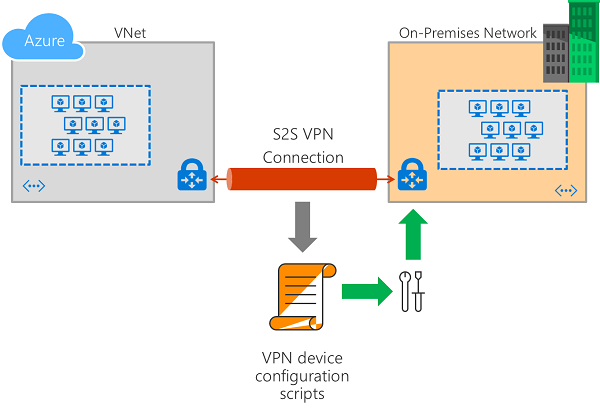
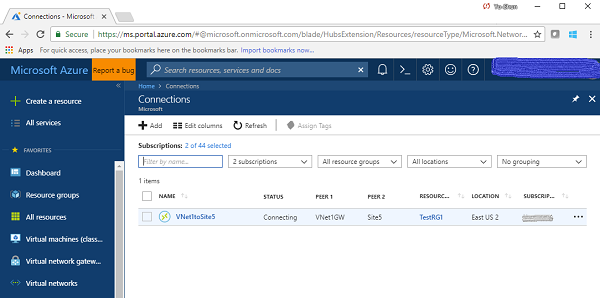
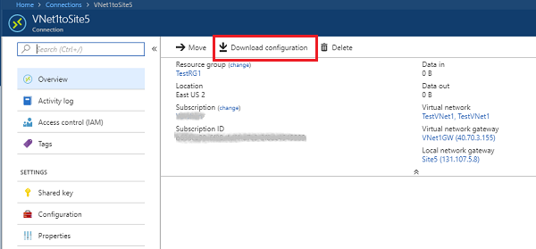
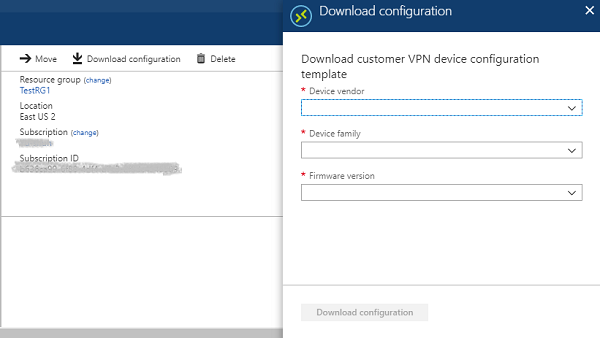
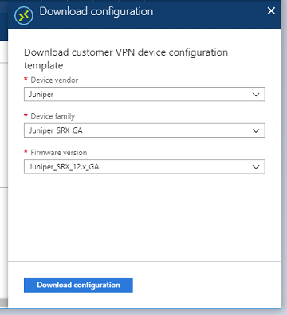
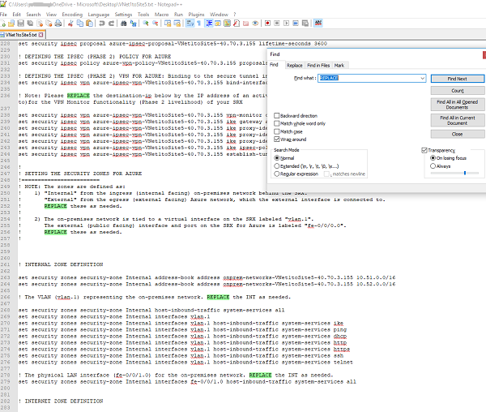

# Download VPN device configuration scripts for S2S VPN connections

This article walks you through downloading VPN device configuration scripts for S2S VPN connections with Azure VPN Gateways using Azure Resource Manager. The following diagram shows the high-level workflow.



The following devices have available scripts:

[!INCLUDE [scripts](../../includes/vpn-gateway-device-configuration-scripts.md)]

## <a name="about"></a>About VPN device configuration scripts

A cross-premises VPN connection consists of an Azure VPN gateway, an on-premises VPN device, and an IPsec S2S VPN tunnel connecting the two. The typical work flow includes the following steps:

1. Create and configure an Azure VPN gateway (virtual network gateway)
2. Create and configure an Azure local network gateway that represents your on-premises network and VPN device
3. Create and configure an Azure VPN connection between the Azure VPN gateway and the local network gateway
4. Configure the on-premises VPN device represented by the local network gateway to establish the actual S2S VPN tunnel with the Azure VPN gateway

You can complete steps 1 through 3 using the Azure [portal](vpn-gateway-howto-site-to-site-resource-manager-portal.md), [PowerShell](vpn-gateway-create-site-to-site-rm-powershell.md), or [CLI](vpn-gateway-howto-site-to-site-resource-manager-cli.md). The last step involves configuring the on-premises VPN devices outside of Azure. This feature allows you to download a configuration script for your VPN device with the corresponding values of your Azure VPN gateway, virtual network, and on-premises network address prefixes, and VPN connection properties, etc. already filled in. You can use the script as a starting point, or apply the script directly to your on-premises VPN devices via the configuration console.

> [!IMPORTANT]
> * The syntax for each VPN device configuration script is different, and heavily dependent on the models and firmware versions. Pay special attention to your device model and version information against the available templates.
> * Some parameter values must be unique on the device, and cannot be determined without accessing the device. The Azure-generated configuration scripts pre-fill these values, but you need to ensure the provided values are valid on your device. For examples:
>    * Interface numbers
>    * Access control list numbers
>    * Policy names or numbers, etc.
> * Look for the keyword, "**REPLACE**", embedded in the script to find the parameters you need to verify before applying the script.
> * Some templates include a "**CLEANUP**" section you can apply to remove the configurations. The cleanup sections are commented out by default.

## Download the configuration script from Azure portal

Create an Azure VPN gateway, local network gateway, and a connection resource connecting the two. The following page guides you through the steps:

* [Create a Site-to-Site connection in the Azure portal](vpn-gateway-howto-site-to-site-resource-manager-portal.md)

Once the connection resource is created, follow the instructions below to download the VPN device configuration scripts:

1. From a browser, navigate to the [Azure portal](https://portal.azure.com) and, if necessary, sign in with your Azure account
2. Go to the connection resource you created. You can find the list of all connection resources by clicking "All services", then "NETWORKING", and "Connections."

    

3. Click on the connection you want to configure.

    

4. Click on the "Download configuration" link as highlighted in red in the Connection overview page; this opens the "Download configuration" page.

    

5. Select the model family and firmware version for your VPN device, then click on the "Download configuration" button.

    

6. You are prompted to save the downloaded script (a text file) from your browser.
7. Once you downloaded the configuration script, open it with a text editor and search for the keyword "REPLACE" to identify and examine the parameters that may need to be replaced.

    

## Download the configuration script using Azure PowerShell

[!INCLUDE [updated-for-az](../../includes/updated-for-az.md)]

You can also download the configuration script using Azure PowerShell, as shown in the following example:

```azurepowershell-interactive
$RG          = "TestRG1"
$GWName      = "VNet1GW"
$Connection  = "VNet1toSite1"

# List the available VPN device models and versions
Get-AzVirtualNetworkGatewaySupportedVpnDevice -Name $GWName -ResourceGroupName $RG

# Download the configuration script for the connection
Get-AzVirtualNetworkGatewayConnectionVpnDeviceConfigScript -Name $Connection -ResourceGroupName $RG -DeviceVendor Juniper -DeviceFamily Juniper_SRX_GA -FirmwareVersion Juniper_SRX_12.x_GA
```

## Apply the configuration script to your VPN device

After you have downloaded and validated the configuration script, the next step is to apply the script to your VPN device. The actual procedure varies based on your VPN device makes and models. Consult the operation manuals or the instruction pages for your VPN devices.

## Next steps

Continue configuring your [Site-to-Site connection](vpn-gateway-howto-site-to-site-resource-manager-portal.md).
