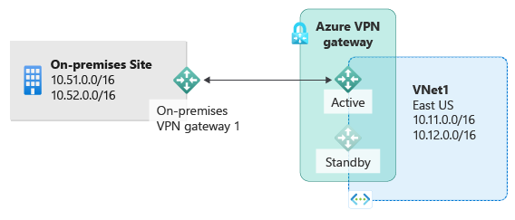
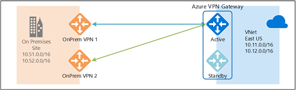
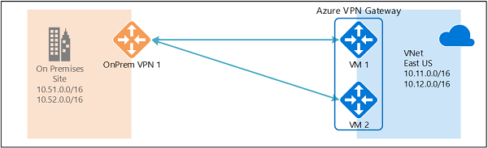
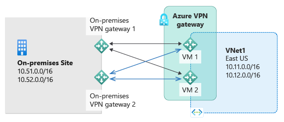
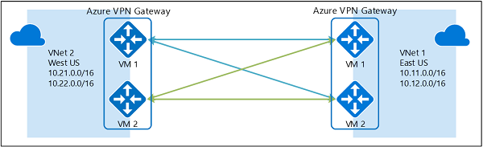

# Highly Available Cross-Premises and VNet-to-VNet Connectivity
This article provides an overview of Highly Available configuration options for your cross-premises and VNet-to-VNet connectivity using Azure VPN gateways.

## About Azure VPN gateway redundancy
Every Azure VPN gateway consists of two instances in an active-standby configuration. For any planned maintenance or unplanned disruption that happens to the active instance, the standby instance would take over (failover) automatically, and resume the S2S VPN or VNet-to-VNet connections. The switch over will cause a brief interruption. For planned maintenance, the connectivity should be restored within 10 to 15 seconds. For unplanned issues, the connection recovery will be longer, about 1 minute to 1 and a half minutes in the worst case. For P2S VPN client connections to the gateway, the P2S connections will be disconnected and the users will need to reconnect from the client machines.

## Highly Available Cross-Premises Connectivity
To provide better availability for your cross premises connections, there are a couple of options available:

* Multiple on-premises VPN devices
* Active-active Azure VPN gateway
* Combination of both

### Multiple on-premises VPN devices
You can use multiple VPN devices from your on-premises network to connect to your Azure VPN gateway, as shown in the following diagram:

This configuration provides multiple active tunnels from the same Azure VPN gateway to your on-premises devices in the same location. There are some requirements and constraints:

1. You need to create multiple S2S VPN connections from your VPN devices to Azure. When you connect multiple VPN devices from the same on-premises network to Azure, you need to create one local network gateway for each VPN device, and one connection from your Azure VPN gateway to each local network gateway.
2. The local network gateways corresponding to your VPN devices must have unique public IP addresses in the "GatewayIpAddress" property.
3. BGP is required for this configuration. Each local network gateway representing a VPN device must have a unique BGP peer IP address specified in the "BgpPeerIpAddress" property.
4. The AddressPrefix property field in each local network gateway must not overlap. You should specify the "BgpPeerIpAddress" in /32 CIDR format in the AddressPrefix field, for example, 10.200.200.254/32.
5. You should use BGP to advertise the same prefixes of the same on-premises network prefixes to your Azure VPN gateway, and the traffic will be forwarded through these tunnels simultaneously.
6. You must use Equal-cost multi-path routing (ECMP).
7. Each connection is counted against the maximum number of tunnels for your Azure VPN gateway, 10 for Basic and Standard SKUs, and 30 for HighPerformance SKU. 

In this configuration, the Azure VPN gateway is still in active-standby mode, so the same failover behavior and brief interruption will still happen as described [above](#activestandby). But this setup guards against failures or interruptions on your on-premises network and VPN devices.

### Active-active Azure VPN gateway
You can now create an Azure VPN gateway in an active-active configuration, where both instances of the gateway VMs will establish S2S VPN tunnels to your on-premises VPN device, as shown the following diagram:

In this configuration, each Azure gateway instance will have a unique public IP address, and each will establish an IPsec/IKE S2S VPN tunnel to your on-premises VPN device specified in your local network gateway and connection. Note that both VPN tunnels are actually part of the same connection. You will still need to configure your on-premises VPN device to accept or establish two S2S VPN tunnels to those two Azure VPN gateway public IP addresses.

Because the Azure gateway instances are in active-active configuration, the traffic from your Azure virtual network to your on-premises network will be routed through both tunnels simultaneously, even if your on-premises VPN device may favor one tunnel over the other. Note though the same TCP or UDP flow will always traverse the same tunnel or path, unless a maintenance event happens on one of the instances.

When a planned maintenance or unplanned event happens to one gateway instance, the IPsec tunnel from that instance to your on-premises VPN device will be disconnected. The corresponding routes on your VPN devices should be removed or withdrawn automatically so that the traffic will be switched over to the other active IPsec tunnel. On the Azure side, the switch over will happen automatically from the affected instance to the active instance.

### Dual-redundancy: active-active VPN gateways for both Azure and on-premises networks
The most reliable option is to combine the active-active gateways on both your network and Azure, as shown in the diagram below.

Here you create and setup the Azure VPN gateway in an active-active configuration, and create two local network gateways and two connections for your two on-premises VPN devices as described above. The result is a full mesh connectivity of 4 IPsec tunnels between your Azure virtual network and your on-premises network.

All gateways and tunnels are active from the Azure side, so the traffic will be spread among all 4 tunnels simultaneously, although each TCP or UDP flow will again follow the same tunnel or path from the Azure side. Even though by spreading the traffic, you may see slightly better throughput over the IPsec tunnels, the primary goal of this configuration is for high availability. And due to the statistical nature of the spreading, it is difficult to provide the measurement on how different application traffic conditions will affect the aggregate throughput.

This topology will require two local network gateways and two connections to support the pair of on-premises VPN devices, and BGP is required to allow the two connections to the same on-premises network. These requirements are the same as the [above](#activeactiveonprem). 

## Highly Available VNet-to-VNet Connectivity through Azure VPN Gateways
The same active-active configuration can also apply to Azure VNet-to-VNet connections. You can create active-active VPN gateways for both virtual networks, and connect them together to form the same full mesh connectivity of 4 tunnels between the two VNets, as shown in the diagram below:

This ensures there are always a pair of tunnels between the two virtual networks for any planned maintenance events, providing even better availability. Even though the same topology for cross-premises connectivity requires two connections, the VNet-to-VNet topology shown above will need only one connection for each gateway. Additionally, BGP is optional unless transit routing over the VNet-to-VNet connection is required.

## Next steps
See [Configuring Active-Active VPN Gateways for Cross-Premises and VNet-to-VNet Connections](vpn-gateway-activeactive-rm-powershell.md) for steps to configure active-active cross-premises and VNet-to-VNet connections.

