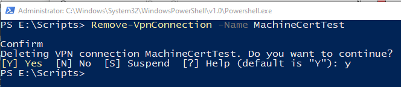

# Configure an Always On VPN device tunnel

[!INCLUDE [intro](../../includes/vpn-gateway-vwan-always-on-intro.md)]

This article helps you configure an Always On VPN device tunnel. For information about configuring a user tunnel, see [Configure an Always On VPN user tunnel](vpn-gateway-howto-always-on-user-tunnel.md).

## Configure the gateway

Configure the VPN gateway to use IKEv2 and certificate-based authentication using the [Configure a Point-to-Site VPN connection](vpn-gateway-howto-point-to-site-resource-manager-portal.md) article.

## Configure the device tunnel

[!INCLUDE [device tunnel](../../includes/vpn-gateway-vwan-always-on-device.md)]

## To remove a profile

To remove the profile, run the following command:

## Next steps

For troubleshooting, see [Azure point-to-site connection problems](vpn-gateway-troubleshoot-vpn-point-to-site-connection-problems.md)
