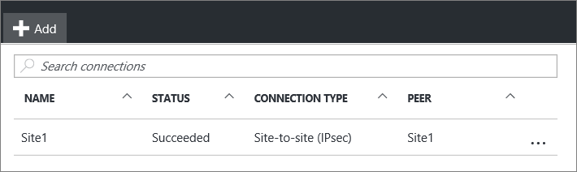

<properties
   pageTitle="How to add multiple VPN gateway Site-to-Site connections to a virtual network for the Resource Manager deployment model using the Azure portal"
   description="Add multiple VPN gateway S2S connections to a VNet"
   services="vpn-gateway"
   documentationCenter="na"
   authors="cherylmc"
   manager="carmonm"
   editor=""
   tags="azure-resource-manager"/>

<tags
   ms.service="vpn-gateway"
   ms.devlang="na"
   ms.topic="article"
   ms.tgt_pltfrm="na"
   ms.workload="infrastructure-services"
   ms.date="10/03/2016"
   ms.author="cherylmc"/>

# How to add multiple VPN gateway Site-to-Site connections to a VNet using the Azure portal

> [AZURE.SELECTOR]
- [Resource Manager - Portal](vpn-gateway-howto-multi-site-to-site-rm-portal.md)
- [Classic - PowerShell](vpn-gateway-multi-site.md)

This article walks you through using the Azure portal to add Site-to-Site connections to a VPN gateway that has an existing connection. This article applies to VNets created using the Resource Manager deployment model that have a RouteBased virtual network gateway. This article does not apply to ExpressRoute and Site-to-Site coexsiting connection configurations.

### Deployment models and methods

[AZURE.INCLUDE [vpn-gateway-clasic-rm](../../includes/vpn-gateway-classic-rm-include.md)] 

We update this table as new articles and additional tools become available for this configuration. When an article is available, we link directly to it from this table.

[AZURE.INCLUDE [vpn-gateway-table-multi-site](../../includes/vpn-gateway-table-multisite-include.md)] 

## Before you begin

This article assumes that you have the following items configured:

- A virtual network created using the Resource Manager deployment model that has an existing connection.
- The virtual network gateway for your VNet must be RouteBased.
- You are not adding a connection to an ExpressRoute/Site-to-Site coexisting connection configuration.
- None of the address ranges overlap for any of the VNets that this VNet is connecting to.
- A compatible VPN device and someone who is able to configure it. See [About VPN Devices](vpn-gateway-about-vpn-devices.md). If you aren't familiar with configuring your VPN device, or are unfamiliar with the IP address ranges located in your on-premises network configuration, you need to coordinate with someone who can provide those details for you.
- An externally facing public IP address for your VPN device. This IP address cannot be located behind a NAT.

## Part 1 - Configure a connection

1. From a browser, navigate to the [Azure portal](http://portal.azure.com) and, if necessary, sign in with your Azure account.
2. Click **All resources** and locate your **virtual network gateway** from the list of resources and click it.
3. On the **Virtual network gateway** blade, click **Connections**.

	 

4. On the **Connections** blade, click **+Add**.

	 

5. On the **Add connection** blade, fill out the following fields:
	- **Name:** The name you want to give to the site you are creating the connection to.
	- **Connection type:** Select **Site-to-site (IPsec)**.

	 

## Part 2 - Add a local network gateway

1. Click **Local network gateway** ***Choose a local network gateway***. This will open the **Choose local network gateway** blade.

	 
2. Click **Create new** to open the **Create local network gateway** blade.

	 

3. On the **Create local network gateway** blade, fill out the following fields:
	- **Name:** The name you want to give to the local network gateway resource.
	- **IP address:** The public IP address of the VPN device on the site that you want to connect to.
	- **Address space:** The address space that you want to be routed to the new local network site.
4. Click **OK** on the **Create local network gateway** blade to save the changes.

## Part 3 - Add the shared key and create the connection

1. On the **Add connection** blade, add the shared key that you want to use to create your connection. You can either get the shared key from your VPN device, or make one up here and then configure your VPN device to use the same shared key. The important thing is that the keys are exactly the same.

	 
2. At the bottom of the blade, click **OK** to create the connection.

## Part 4 - Verify the VPN connection

You can verify your VPN connection either in the portal, or by using PowerShell.

[AZURE.INCLUDE [vpn-gateway-verify-connection-rm](../../includes/vpn-gateway-verify-connection-rm-include.md)]

## Next steps

- Once your connection is complete, you can add virtual machines to your virtual networks. See the virtual machines [learning path](https://azure.microsoft.com/documentation/learning-paths/virtual-machines) for more information.
