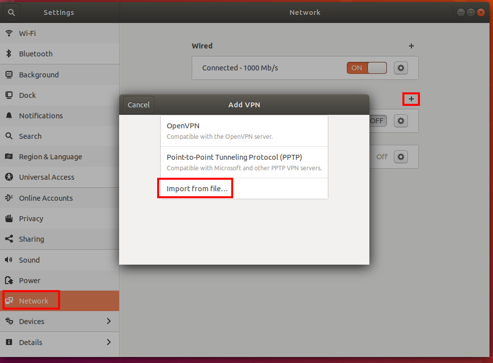

# Configure OpenVPN clients for Azure VPN Gateway (Preview)

This article helps you set up OpenVPN on Azure VPN Gateway. The article assumes that you already have a working point-to-site environment. If you do not, use the instructions in step 1 to create a point-to-site VPN.

> [!IMPORTANT]
> OpenVPN for Azure point-to-site VPN Gateway is a managed Public Preview.
>
> This Public Preview is provided without a service level agreement and should not be used for production workloads. Certain features may not be supported, may have constrained capabilities, or may not be available in all Azure locations. See the [Supplemental Terms of Use for Microsoft Azure Previews](https://azure.microsoft.com/support/legal/preview-supplemental-terms/) for details.

## Before you begin

Complete the steps to [Configure OpenVPN for Azure VPN Gateway](vpn-gateway-howto-openvpn.md).

## Windows clients

1. Download and install the OpenVPN client from the official website.
2. Download the VPN profile for the gateway. This can be done from the Point-to-site configuration tab in Azure Portal, or New-AzureRmVpnClientConfiguration in PowerShell.
3. Unzip the profile. Open the vpnconfig.ovpn configuration file from the OpenVPN folder in notepad.
4. Fill in the P2S client certificate section with the P2S client certificate public key in base64. In a PEM formatted certificate, you can simply open the .cer file and copy over the base64 key between the certificate headers. See here how to export a certificate to get the encoded public key.
5. Fill in the private key section with the P2S client certificate private key in base64. See here how to extract private key.
6. Do not change any other fields. Use the filled in configuration in client input to connect to the VPN.
7. Copy the vpnconfig.ovpn file to C:\Program Files\OpenVPN\config folder.
8. Right-click the OpenVPN icon in the system tray and click connect.

## Mac clients

1. Download and install an OpenVPN client, such as TunnelBlik from https://tunnelblick.net/downloads.html 
2. Download the VPN profile for the gateway. This can be done from the Point-to-site configuration tab in Azure Portal, or New-AzureRmVpnClientConfiguration in PowerShell.
3. Unzip the profile. Open the vpnconfig.ovpn configuration file from the OpenVPN folder in notepad.
4. Fill in the P2S client certificate section with the P2S client certificate public key in base64. In a PEM formatted certificate, you can simply open the .cer file and copy over the base64 key between the certificate headers. See here how to export a certificate to get the encoded public key.
5. Fill in the private key section with the P2S client certificate private key in base64. See here how to extract private key.
6. Do not change any other fields. Use the filled in configuration in client input to connect to the VPN.
7. Double-click the profile file to create the profile in tunnelblik
8. Launch Tunnelblik from the applications folder
9. Click on the Tunneblik icon in the system tray and pick connect

## Linux clients

1. Open a new Terminal session, you can open a new session by pressing Ctrl + Alt + t at the same time
2. Enter the following command to install needed components:
sudo apt-get install openvpn
sudo apt-get -y install network-manager-openvpn
sudo service network-manager restart
3. Download the VPN profile for the gateway. This can be done from the Point-to-site configuration tab in Azure Portal, or by New-AzureRmVpnClientConfiguration in PowerShell.
4. To connect using the command line type the following:
5. Sudo openvpn –config <name and path of your VPN profile file>
6. To connect using the GUI, go to system settings
7. Click on “+” to add a new VPN connection
8. Under “Add VPN” pick “Import from file…”
9. Browse to the profile file and double-click or pick “Open”
10. Click “Add” on the “Add VPN” window.
  
  
11. You can connect by turning the VPN “ON” on the “Network Settings” page or under the network icon in the system tray.

## Next steps