# Configure a Point-to-Site connection to a VNet using the Azure portal (classic)
> [!div class="op_single_selector"]
> * [Resource Manager - Azure Portal](vpn-gateway-howto-point-to-site-resource-manager-portal.md)
> * [Resource Manager - PowerShell](vpn-gateway-howto-point-to-site-rm-ps.md)
> * [Classic - Azure Portal](vpn-gateway-howto-point-to-site-classic-azure-portal.md)
>
>

A Point-to-Site (P2S) configuration lets you create a secure connection from an individual client computer to a virtual network. P2S is a VPN connection over SSTP (Secure Socket Tunneling Protocol). Point-to-Site connections are useful when you want to connect to your VNet from a remote location, such as from home or a conference, or when you only have a few clients that need to connect to a virtual network. P2S connections do not require a VPN device or a public-facing IP address. You establish the VPN connection from the client computer.

This article walks you through creating a VNet with a Point-to-Site connection in the classic deployment model using the Azure portal. For more information about Point-to-Site connections, see the [Point-to-Site FAQ](#faq) at the end of this article.

### Deployment models and methods for P2S connections
[!INCLUDE [deployment models](../../includes/vpn-gateway-deployment-models-include.md)]

The following table shows the two deployment models and available deployment methods for P2S configurations. When an article with configuration steps is available, we link directly to it from this table.

[!INCLUDE [vpn-gateway-clasic-rm](../../includes/vpn-gateway-table-point-to-site-include.md)]

## Basic workflow
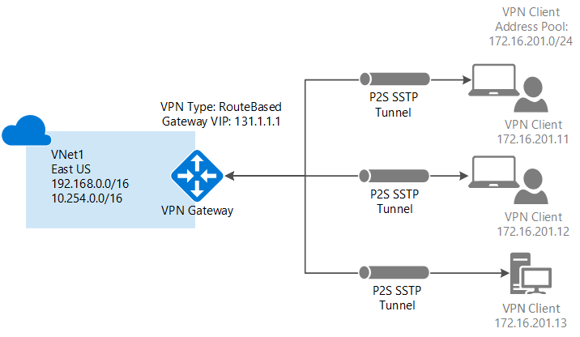

The following sections walk you through the steps to create a secure Point-to-Site connection to a virtual network.

1. Create a virtual network and VPN gateway
2. Generate certificates
3. Upload the .cer file
4. Generate the VPN client configuration package
5. Configure the client computer
6. Connect to Azure

### Example settings
You can use the following example settings:

* **Name: VNet1**
* **Address space: 192.168.0.0/16** For this example, we use only one address space. You can have more than one address space for your VNet.
* **Subnet name: FrontEnd**
* **Subnet address range: 192.168.1.0/24**
* **Subscription:** If you have more than one subscription, verify that you are using the correct one.
* **Resource Group: TestRG**
* **Location: East US**
* **Connection type: Point-to-site**
* **Client Address Space: 172.16.201.0/24**. VPN clients that connect to the VNet using this Point-to-Site connection receive an IP address from the specified pool.
* **GatewaySubnet: 192.168.200.0/24**. The Gateway subnet must use the name 'GatewaySubnet'.
* **Size:** Select the gateway SKU that you want to use.
* **Routing Type: Dynamic**

## Section 1 - Create a virtual network and a VPN gateway

Before beginning, verify that you have an Azure subscription. If you don't already have an Azure subscription, you can activate your [MSDN subscriber benefits](https://azure.microsoft.com/pricing/member-offers/msdn-benefits-details) or sign up for a [free account](https://azure.microsoft.com/pricing/free-trial).
### Part 1: Create a virtual network
If you don't already have a virtual network, create one. Screenshots are provided as examples. Be sure to replace the values with your own. To create a VNet by using the Azure portal, use the following steps:

1. From a browser, navigate to the [Azure portal](http://portal.azure.com) and, if necessary, sign in with your Azure account.
2. Click **New**. In the **Search the marketplace** field, type 'Virtual Network'. Locate **Virtual Network** from the returned list and click to open the **Virtual Network** blade.

    
3. Near the bottom of the Virtual Network blade, from the **Select a deployment model** list, select **Classic**, and then click **Create**.

    
4. On the **Create virtual network** blade, configure the VNet settings. In this blade, you add your first address space and a single subnet address range. After you finish creating the VNet, you can go back and add additional subnets and address spaces.

    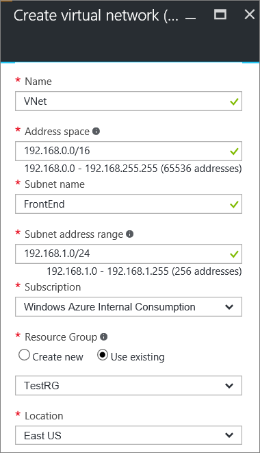
5. Verify that the **Subscription** is the correct one. You can change subscriptions by using the drop-down.
6. Click **Resource group** and either select an existing resource group, or create a new one by typing a name for your new resource group. If you are creating a new resource group, name the resource group according to your planned configuration values. For more information about resource groups, visit [Azure Resource Manager Overview](../azure-resource-manager/resource-group-overview.md#resource-groups).
7. Next, select the **Location** settings for your VNet. The location determines where the resources that you deploy to this VNet will reside.
8. Select **Pin to dashboard** if you want to be able to find your VNet easily on the dashboard, and then click **Create**.

    
9. After clicking Create, a tile appears on your dashboard that will reflect the progress of your VNet. The tile changes as the VNet is being created.

    
10. After you create your virtual network, you can add the IP address of a DNS server to handle name resolution. Open the settings for your virtual network, click DNS servers, and add the IP address of the DNS server that you want to use. This setting does not create a new DNS server. Be sure to add a DNS server that your resources can communicate with.

Once your virtual network has been created, you see **Created** listed under **Status** on the networks page in the Azure classic portal.

### Part 2: Create gateway subnet and a dynamic routing gateway
In this step, you will create a gateway subnet and a Dynamic routing gateway. In the Azure portal for the classic deployment model, creating the gateway subnet and the gateway can be done through the same configuration blades.

1. In the portal, navigate to the virtual network for which you want to create a gateway.
2. On the blade for your virtual network, on the **Overview** blade, in the VPN connections section, click **Gateway**.

    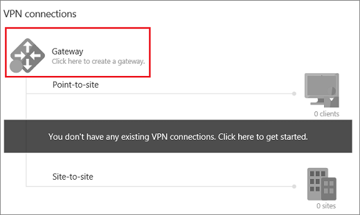
3. On the **New VPN Connection** blade, select **Point-to-site**.

    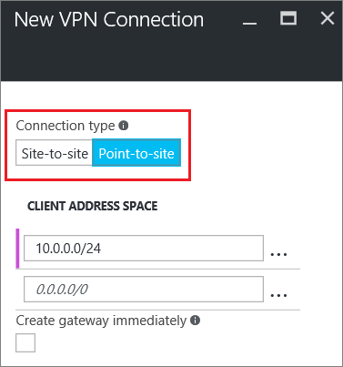
4. For **Client Address Space**, add the IP address range. This is the range from which the VPN clients receive an IP address when connecting. Delete the auto-filled range and add your own.

    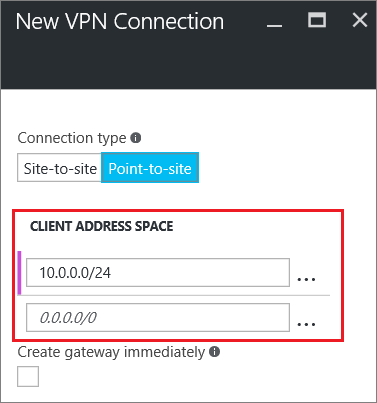
5. Select the **Create gateway immediately** checkbox.

    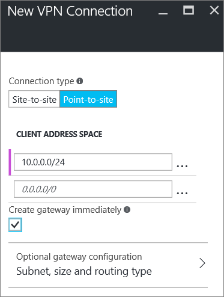
6. Click **Optional gateway configuration** to open the **Gateway configuration** blade.

    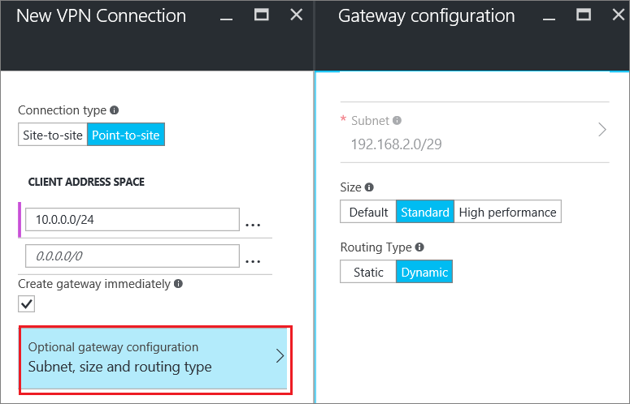
7. Click **Subnet Configure required settings** to add the **gateway subnet**. While it is possible to create a gateway subnet as small as /29, we recommend that you create a larger subnet that includes more addresses by selecting at least /28 or /27. This will allow for enough addresses to accommodate possible additional configurations that you may want in the future.

   > [!IMPORTANT]
   > When working with gateway subnets, avoid associating a network security group (NSG) to the gateway subnet. Associating a network security group to this subnet may cause your VPN gateway to stop functioning as expected. For more information about network security groups, see [What is a network security group?](../virtual-network/virtual-networks-nsg.md)
   >
   >

    
8. Select the gateway **Size**. The size is the gateway SKU for your virtual network gateway. In the portal, the Default SKU is **Basic**. For more information about gateway SKUs, see [About VPN Gateway Settings](vpn-gateway-about-vpn-gateway-settings.md#gwsku).

    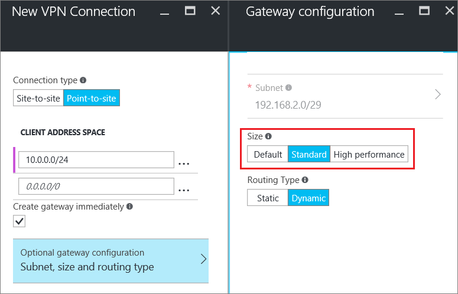
9. Select the **Routing Type** for your gateway. P2S configurations require a **Dynamic** routing type. Click **OK** when you have finished configuring this blade.

    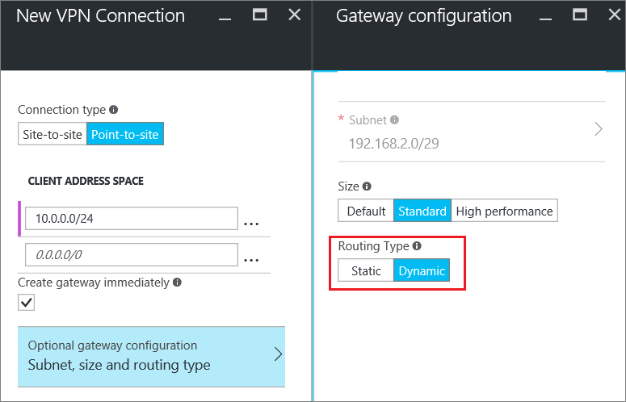
10. On the **New VPN Connection** blade, click **OK** at the bottom of the blade to begin creating your virtual network gateway. A VPN gateway can take up to 45 minutes to complete.

## Section 2 - Create certificates
Certificates are used by Azure to authenticate VPN clients for Point-to-Site VPNs. After creating the root certificate, you export the public certificate data (not the private key) as a Base-64 encoded X.509 .cer file. You then upload the public certificate data from the root certificate to Azure.

Each client computer that connects to a VNet using Point-to-Site must have a client certificate installed. The client certificate is generated from the root certificate and installed on each client computer. If a valid client certificate is not installed and the client tries to connect to the VNet, authentication fails.

### Part 1: Obtain the public key (.cer) for the root certificate

#### Enterprise certificate
 
If you are using an enterprise solution, you can use your existing certificate chain. Obtain the .cer file for the root certificate that you want to use.

#### Self-signed root certificate

If you are not using an enterprise certificate solution, you need to create a self-signed root certificate. To create a self-signed certificate that contains the necessary fields for P2S authentication, you can use PowerShell. [Create a self-signed certificate for Point-to-Site connections using PowerShell](vpn-gateway-certificates-point-to-site.md) walks you through the steps to create a self-signed root certificate.

> [!NOTE]
> Previously, makecert was the recommended method to create self-signed root certificates and generate client certificates for Point-to-Site connections. You can now use PowerShell to create these certificates. One benefit of using PowerShell is the ability to create SHA-2 certificates. See [Create a self-signed certificate for Point-to-Site connections using PowerShell](vpn-gateway-certificates-point-to-site.md) for the required values.
>
>

#### To export the public key for a self-signed root certificate

Point-to-Site connections require the public key (.cer) to be uploaded to Azure. The following steps help you export the .cer file for your self-signed root certificate.

1. To obtain a .cer file from the certificate, open **Manage user certificates**.
2. Locate the 'P2SRootCert' self-signed root certificate in 'Certificates - Current User\Personal\Certificates', and right-click. Click **All Tasks**, and then click **Export** to open the **Certificate Export Wizard**.
3. In the Wizard, click **Next**. Select **No, do not export the private key**, and then click **Next**.
4. On the **Export File Format** page, select **Base-64 encoded X.509 (.CER).**, then click **Next**. 
5. On the **File to Export** page, Browse to 'C:', create a subdirectory called 'cert' and select it. Name the certificate file 'P2SRootCert.cer', then click **Save**. 
6. Click **Next**, then **Finish** to export the certificate. **The export was successful** appears. Click **OK** to close the wizard.

### Part 2: Generate a client certificate

You can either generate a unique certificate for each client, or you can use the same certificate on multiple clients. The advantage to generating unique client certificates is the ability to revoke a single certificate. Otherwise, if everyone is using the same client certificate and you need to revoke it, you have to generate and install new certificates for all the clients that use that certificate to authenticate.

#### Enterprise certificate
- If you are using an enterprise certificate solution, generate a client certificate with the common name value format 'name@yourdomain.com', rather than the 'domain name\username' format.
- Make sure the client certificate is based on the 'User' certificate template that has 'Client Authentication' as the first item in the use list, rather than Smart Card Logon, etc. You can check the certificate by double-clicking the client certificate and viewing **Details > Enhanced Key Usage**.

#### Self-signed root certificate 
If you are using a self-signed root certificate, see [Generate a client certificate using PowerShell](vpn-gateway-certificates-point-to-site.md#clientcert) for steps to generate a client certificate that is compatible with Point-to-Site connections.

### Part 3: Export the client certificate
If you generate a client certificate from a self-signed root certificate using the [PowerShell](vpn-gateway-certificates-point-to-site.md#clientcert) instructions, it's automatically installed on the computer that you used to generate it. If you want to install a client certificate on another client computer, you need to export it.
 
1. To export a client certificate, open **Manage user certificates**. Right-click the client certificate that you want to export, click **all tasks**, and then click **export** to open the **Certificate Export Wizard**.
2. In the Wizard, click **Next**, then select **Yes, export the private key**, and then click **Next**.
3. On the **Export File Format** page, leave the defaults selected. Make sure **Include all certificates in the certification path if possible** is selected to also export the required root certificate information. Then, click **Next**.
4. On the **Security** page, you must protect the private key. If you select to use a password, make sure to record or remember the password that you set for this certificate. Then, click **Next**.
5. On the **File to Export**, **Browse** to the location to which you want to export the certificate. For **File name**, name the certificate file. Then, click **Next**.
6. Click **Finish** to export the certificate.

## Section 3 - Upload the root certificate .cer file
After the gateway has been created, you can upload the .cer file for a trusted root certificate to Azure. You can upload files for up to 20 root certificates. You do not upload the private key for the root certificate to Azure. Once the .cer file is uploaded, Azure uses it to authenticate clients that connect to the virtual network.

1. On the **VPN connections** section of the blade for your VNet, click the **clients** graphic to open the **Point-to-site VPN connection** blade.

    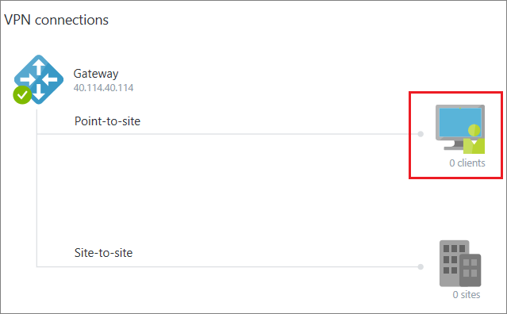
2. On the **Point-to-site connection** blade, click **Manage certificates** to open the **Certificates** blade. 

    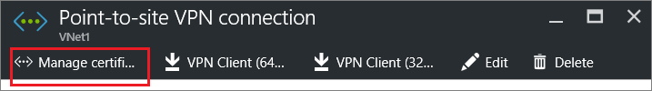  
3. On the **Certificates** blade, click **Upload** to open the **Upload certificate** blade. 

    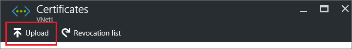 
4. Click the folder graphic to browse for the .cer file. Select the file, then click **OK**. Refresh the page to see the uploaded certificate on the **Certificates** blade.

    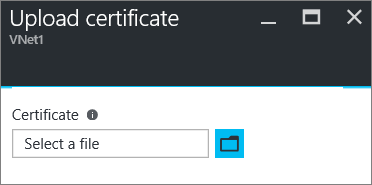 

## Section 4 - Configure the client
To connect to a VNet using a Point-to-Site VPN, each client must install a VPN client configuration package. The package does not install a VPN client. It configures the native Windows VPN client with the settings necessary to connect to the virtual network. For the list of client operating systems that are supported, see the [Point-to-Site connections FAQ](#faq) at the end of this article.

### Part 1: Generate and install the VPN client configuration package
1. In the Azure portal, in the **Overview** blade for your VNet, in **VPN connections**, click the client graphic to open the **Point-to-site VPN connection** blade.
2. At the top of the **Point-to-site VPN connection** blade, click the download package that corresponds to the client operating system on which it will be installed:

   * For 64-bit clients, select **VPN Client (64-bit)**.
   * For 32-bit clients, select **VPN Client (32-bit)**.

     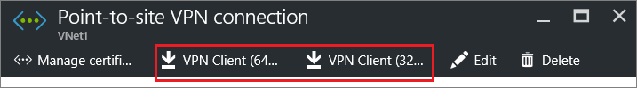 
3. Once the packaged generates, download and install it on your client computer. If you see a SmartScreen popup, click **More info**, then **Run anyway**. You can also save the package to install on other client computers.

### Part 2: Install an exported client certificate

If you want to create a P2S connection from a client computer other than the one you used to generate the client certificates, you need to install a client certificate. When installing a client certificate, you will need the password that was created when the client certificate was exported.

1. Locate and copy the *.pfx* file to the client computer. On the client computer, double-click the *.pfx* file to install. Leave the **Store Location** as **Current User**, then click **Next**.
2. On the **File** to import page, don't make any changes. Click **Next**.
3. On the **Private key protection** page, input the password for the certificate if you used one, or verify that the security principal that is installing the certificate is correct, then click **Next**.
4. On the **Certificate Store** page, leave the default location, and then click **Next**.
5. Click **Finish**. On the **Security Warning** for the certificate installation, click **Yes**. You can feel comfortable clicking 'Yes' because you generated the certificate. The certificate is now successfully imported.

## Section 6 - Connect to Azure
### Connect to your VNet
1. To connect to your VNet, on the client computer, navigate to VPN connections and locate the VPN connection that you created. It is named the same name as your virtual network. Click **Connect**. A pop-up message may appear that refers to using the certificate. If this happens, click **Continue** to use elevated privileges.
2. On the **Connection** status page, click **Connect** to start the connection. If you see a **Select Certificate** screen, verify that the client certificate showing is the one that you want to use to connect. If it is not, use the drop-down arrow to select the correct certificate, and then click **OK**.

    
3. Your connection should now be established.

    

If you are having trouble connecting, check the following things:

- Open **Manage user certificates** and navigate to **Trusted Root Certification Authorities\Certificates**. Verify that the root certificate is listed. The root certificate must be present in order for authentication to work. When you export a client certificate .pfx using the default value 'Include all certificates in the certification path if possible', the root certificate information is also exported. When you install the client certificate, the root certificate is then also installed on the client computer. 

- If you are using a certificate that was issued using an Enterprise CA solution and are having trouble authenticating, check the authentication order on the client certificate. You can check the authentication list order by double-clicking the client certificate, and going to **Details > Enhanced Key Usage**. Make sure the list shows 'Client Authentication' as the first item. If not, you need to issue a client certificate based on the User template that has Client Authentication as the first item in the list. 

### Verify the VPN connection
1. To verify that your VPN connection is active, open an elevated command prompt, and run *ipconfig/all*.
2. View the results. Notice that the IP address you received is one of the addresses within the Point-to-Site connectivity address range that you specified when you created your VNet. The results should be something similar to this:

Example:

    PPP adapter VNet1:
        Connection-specific DNS Suffix .:
        Description.....................: VNet1
        Physical Address................:
        DHCP Enabled....................: No
        Autoconfiguration Enabled.......: Yes
        IPv4 Address....................: 192.168.130.2(Preferred)
        Subnet Mask.....................: 255.255.255.255
        Default Gateway.................:
        NetBIOS over Tcpip..............: Enabled

 
 If you are having trouble connecting to a virtual machine over P2S, use 'ipconfig' to check the IPv4 address assigned to the Ethernet adapter on the computer from which you are connecting. If the IP address is within the address range of the VNet that you are connecting to, or within the address range of your VPNClientAddressPool, this is referred to as an overlapping address space. When your address space overlaps in this way, the network traffic doesn't reach Azure, it stays on the local network. If your network address spaces don't overlap and you still can't connect to your VM, see [Troubleshoot Remote Desktop connections to a VM](../virtual-machines/windows/troubleshoot-rdp-connection.md).

## Add or remove trusted root certificates

You can add and remove trusted root certificates from Azure. When you remove a trusted certificate, the client certificates that were generated from the root certificate will no longer be able to connect to Azure via Point-to-Site. If you want clients to connect, they need to install a new client certificate that is generated from a certificate that is trusted in Azure.

### To add a trusted root certificate

You can add up to 20 trusted root certificate .cer files to Azure. For instructions, see [Section 3 - Upload the root certificate .cer file](#upload).

### To remove a trusted root certificate

1. On the **VPN connections** section of the blade for your VNet, click the **clients** graphic to open the **Point-to-site VPN connection** blade.

    
2. On the **Point-to-site connection** blade, click **Manage certificates** to open the **Certificates** blade. 

      
3. On the **Certificates** blade, click the ellipsis next to the certificate that you want to remove, then click **Delete**.

 	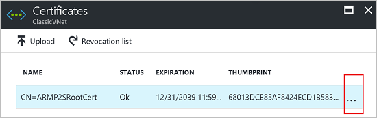 

## Revoke a client certificate
You can revoke client certificates. The certificate revocation list allows you to selectively deny Point-to-Site connectivity based on individual client certificates. This differs from removing a trusted root certificate. If you remove a trusted root certificate .cer from Azure, it revokes the access for all client certificates generated/signed by the revoked root certificate. Revoking a client certificate, rather than the root certificate, allows the other certificates that were generated from the root certificate to continue to be used for authentication for the Point-to-Site connection.

The common practice is to use the root certificate to manage access at team or organization levels, while using revoked client certificates for fine-grained access control on individual users.

### To revoke a client certificate

You can revoke a client certificate by adding the thumbprint to the revocation list.

1. Retrieve the client certificate thumbprint. For more information, see [How to: Retrieve the Thumbprint of a Certificate](https://msdn.microsoft.com/library/ms734695.aspx).
2. Copy the information to a text editor and remove all spaces so that it is a continuous string.
3. Navigate to the **'classic virtual network name' > Point-to-site VPN connection > Certificates** blade and then click **Revocation list** to open the Revocation list blade. 
4. On the **Revocation list** blade, click **+Add certificate** to open the **Add certificate to revocation list** blade.
5. On the **Add certificate to revocation list** blade, paste the certificate thumbprint as one continuous line of text, with no spaces. Click **OK** at the bottom of the blade.
6. After updating has completed, the certificate can no longer be used to connect. Clients that try to connect using this certificate will receive a message saying that the certificate is no longer valid.

## Point-to-Site FAQ

[!INCLUDE [Point-to-Site FAQ](../../includes/vpn-gateway-point-to-site-faq-include.md)]

## Next steps
Once your connection is complete, you can add virtual machines to your virtual networks. For more information, see [Virtual Machines](https://docs.microsoft.com/azure/#pivot=services&panel=Compute). To understand more about networking and virtual machines, see [Azure and Linux VM network overview](../virtual-machines/linux/azure-vm-network-overview.md).
