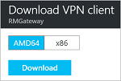

# Configure a Point-to-Site connection to a VNet using the Azure portal
> [!div class="op_single_selector"]
> * [Resource Manager - Azure Portal](vpn-gateway-howto-point-to-site-resource-manager-portal.md)
> * [Resource Manager - PowerShell](vpn-gateway-howto-point-to-site-rm-ps.md)
> * [Classic - Azure Portal](vpn-gateway-howto-point-to-site-classic-azure-portal.md)
> 
> 

A Point-to-Site (P2S) configuration lets you create a secure connection from an individual client computer to a virtual network. A P2S connection is useful when you want to connect to your VNet from a remote location, such as from home or a conference, or when you only have a few clients that need to connect to a virtual network. 

Point-to-Site connections do not require a VPN device or a public-facing IP address to work. A VPN connection is established by starting the connection from the client computer. For more information about Point-to-Site connections, see the [Point-to-Site FAQ](#faq) at the end of this article.

This article walks you through creating a VNet with a Point-to-Site connection using the Azure portal. The steps apply to the Resource Manager deployment model.

### Deployment models and methods for P2S connections
[!INCLUDE [deployment models](../../includes/vpn-gateway-deployment-models-include.md)]

The following table shows the two deployment models and available deployment methods for P2S configurations. When an article with configuration steps is available, we link directly to it from this table.

[!INCLUDE [vpn-gateway-clasic-rm](../../includes/vpn-gateway-table-point-to-site-include.md)]

## Basic workflow

### Example values
* **Name: VNet1**
* **Address space: 192.168.0.0/16** For this example, we use only one address space. You can have more than one address space for your VNet.
* **Subnet name: FrontEnd**
* **Subnet address range: 192.168.1.0/24**
* **Subscription:** If you have more than one subscription, verify that you are using the correct one.
* **Resource Group: TestRG**
* **Location: East US**
* **GatewaySubnet: 192.168.200.0/24**
* **Virtual network gateway name: VNet1GW**
* **Gateway type: VPN**
* **VPN type: Route-based**
* **Public IP address: VNet1GWpip**
* **Connection type: Point-to-site**
* **Client address pool: 172.16.201.0/24** VPN clients that connect to the VNet using this Point-to-Site connection receive an IP address from the client address pool.

## Before beginning
* Verify that you have an Azure subscription. If you don't already have an Azure subscription, you can activate your [MSDN subscriber benefits](https://azure.microsoft.com/pricing/member-offers/msdn-benefits-details) or sign up for a [free account](https://azure.microsoft.com/pricing/free-trial).

## Part 1 - Create a virtual network
If you are creating this configuration as an exercise, you can refer to the [example values](#example).

[!INCLUDE [vpn-gateway-basic-vnet-rm-portal](../../includes/vpn-gateway-basic-vnet-rm-portal-include.md)]

## Part 2 - Specify address space and subnets
You can add additional address space and subnets to your VNet once it has been created.

[!INCLUDE [vpn-gateway-additional-address-space](../../includes/vpn-gateway-additional-address-space-include.md)]

## Part 3 - Add a gateway subnet

Before connecting your virtual network to a gateway, you first need to create the gateway subnet for the virtual network to which you want to connect. The gateway services use the IP addresses specified in the gateway subnet. If possible, create a gateway subnet using a CIDR block of /28 or /27 to provide enough IP addresses to accommodate additional future configuration requirements.

The screenshots in this section are provided as a reference example. Be sure to use the GatewaySubnet address range that corresponds with the required values for your configuration.

###To create a gateway subnet

[!INCLUDE [vpn-gateway-add-gwsubnet-rm-portal](../../includes/vpn-gateway-add-gwsubnet-rm-portal-include.md)]

## Part 4 - Specify a DNS server (optional)
[!INCLUDE [vpn-gateway-add-dns-rm-portal](../../includes/vpn-gateway-add-dns-rm-portal-include.md)]

## Part 5 - Create a virtual network gateway
Point-to-site connections require the following settings:

* Gateway type: VPN
* VPN type: Route-based

### To create a virtual network gateway
[!INCLUDE [vpn-gateway-add-gw-rm-portal](../../includes/vpn-gateway-add-gw-rm-portal-include.md)]

## Part 6 - Generate certificates
Certificates are used by Azure to authenticate VPN clients for Point-to-Site VPNs. You export public certificate data (not the private key) as a Base-64 encoded X.509 .cer file from either a root certificate generated by an enterprise certificate solution, or a self-signed root certificate. You then import the public certificate data from the root certificate to Azure. Additionally, you need to generate a client certificate from the root certificate for clients. Each client that wants to connect to the virtual network using a P2S connection must have a client certificate installed that was generated from the root certificate.

### Step 1 - Obtain the .cer file for the root certificate

If you are using an enterprise solution, you can use your existing certificate chain. Obtain the .cer file for the root certificate that you want to use.

If you are not using an enterprise certificate solution, you need to create a self-signed root certificate. To create a self-signed certificate that contains the necessary fields for P2S authentication, use makecert. [Create a self-signed root certificate for P2S connections](vpn-gateway-certificates-point-to-site.md) will walk you through the steps to create a self-signed root certificate. We are aware that makecert is deprecated, but at this time, it is the supported solution.

>[!NOTE]
>Although it is possible to use PowerShell to create self-signed certificates, the certificate that is generated using PowerShell does not contain the fields necessary for Point-to-Site authentication.
>

#### To obtain the .cer file from a self-signed root certificate

1. To obtain a .cer file from a self-signed root certificate, open **certmgr.msc** and locate the root certificate that you created. The certificate is typically located in 'Certificates-Current User/ Personal/Certificates' and is named whatever you chose to name it when you created it. Right-click the self-signed root certificate, click **all tasks**, and then click **export**. This opens the **Certificate Export Wizard**.
2. In the Wizard, click **Next**, select **No, do not export the private key**, and then click **Next**.
3. On the **Export File Format** page, select **Base-64 encoded X.509 (.CER).** Then, click **Next**.
4. On the **File to Export**, **Browse** to the location to which you want to export the certificate. For **File name**, name the certificate file. Then click **Next**.
5. Click **Finish** to export the certificate.

### Step 2 - Generate a client certificate
You can either generate a unique certificate for each client that will connect to the virtual network, or you can use the same certificate on multiple clients. The advantage to generating unique client certificates is the ability to revoke a single certificate if needed. Otherwise, if everyone is using the same client certificate and you find that you need to revoke the certificate for one client, you will need to generate and install new certificates for all the clients that use that certificate to authenticate.

####Enterprise certificate
- If you are using an enterprise certificate solution, generate a client certificate with the common name value format 'name@yourdomain.com', rather than the 'domain name\username' format.
- Make sure the client certificate that you issue is based on the 'User' certificate template that has 'Client Authentication' as the first item in the use list, rather than Smart Card Logon, etc. You can check the certificate by double-clicking the client certificate and viewing **Details > Enhanced Key Usage**.

####Self-signed certificate 
If you are using a self-signed certificate, see [Working with self-signed root certificates for Point-to-Site configurations](vpn-gateway-certificates-point-to-site.md) to generate a client certificate.

### Step 3 - Export the client certificate
A client certificate is required for authentication. After generating the client certificate, export it. The client certificate you export will be installed later on each client computer.

1. To export a client certificate, you can use *certmgr.msc*. Right-click the client certificate that you want to export, click **all tasks**, and then click **export**.
2. Export the client certificate with the private key. This is a *.pfx* file. Make sure to record or remember the password (key) that you set for this certificate.

## Part 7 - Add the client address pool
1. Once the virtual network gateway has been created, navigate to the **Settings** section of the virtual network gateway blade. In the **Settings** section, click **Point-to-site configuration** to open the **Configuration** blade.
   
    
2. **Address pool** is the pool of IP addresses from which clients that connect will receive an IP address. Add the address pool, and then click **Save**.
   
    

## Part 8 - Upload the root certificate .cer file
After the gateway has been created, you can upload the .cer file for a trusted root certificate to Azure. You can upload files for up to 20 root certificates. You do not upload the private key for the root certificate to Azure. Once the .cer file is uploaded, Azure uses it to authenticate clients that connect to the virtual network.

1. Certificates are added on the **Point-to-site configuration** blade in the **Root certificate** section.  
2. Make sure that you exported the root certificate as a Base-64 encoded X.509 (.cer) file. You need to export it in this format so that you can open the certificate with text editor.
3. Open the certificate with a text editor, such as Notepad. Copy only the following section as one continuous line:
   
    

	> [!NOTE]
	> When copying the certificate data, make sure that you copy the text as one continuous line without carriage returns or line feeds. You may need to modify your view in the text editor to 'Show Symbol/Show all characters' to see the carriage returns and line feeds.                                                                                                                                                                            
	>
	>

4. Paste the certificate data into the **Public Certificate Data** field. **Name** the certificate, and then click **Save**. You can add up to 20 trusted root certificates.
   
    

## Part 9 - Download and install the VPN client configuration package
Clients connecting to Azure using P2S must have both a client certificate, and a VPN client configuration package installed. VPN client configuration packages are available for Windows clients. 

The VPN client package contains information to configure the VPN client software that is built into Windows. The configuration is specific to the VPN that you want to connect to. The package does not install additional software.

You can use the same VPN client configuration package on each client computer, provided that the version matches the architecture for the client.

### Step 1 - Download the client configuration package

1. On the **Point-to-site configuration** blade, click **Download VPN client** to open the **Download VPN client** blade. It takes a minute or two for the package to generate.
   
    
2. Select the correct package for your client, then click **Download**. Save the configuration package file. You will install this on each client computer that will connect to the virtual network.

	

   * For 64-bit clients, select **AMD64**.
   * For 32-bit clients, select **x86**.

### Step 2 - Install the client configuration package

1. Copy the configuration file locally to the computer that you want to connect to your virtual network. 
2. Double-click the .exe file to install the package on the client computer. Because you created the configuration package, it is not signed. This means you may see a warning. If you get a Windows SmartScreen popup, click **More info** (on the left), then **Run anyway** to install the package.
3. On the client computer, navigate to **Network Settings** and click **VPN**. You will see the connection listed. It shows the name of the virtual network that it will connect to and will look similar to this:
3. Install the package on the client computer. If you get a Windows SmartScreen popup, click **More info** (on the left), then **Run anyway** to install the package.
4. On the client computer, navigate to **Network Settings** and click **VPN**. You will see the connection listed. It will show the name of the virtual network that it will connect to and looks similar to this example: 
   
    

## Part 10 - Install the client certificate
Each client computer must have a client certificate to authenticate. When installing the client certificate, you will need the password that was created when the client certificate was exported.

1. Copy the .pfx file to the client computer.
2. Double-click the .pfx file to install it. Do not modify the installation location.

## Part 11 - Connect to Azure
1. To connect to your VNet, on the client computer, navigate to VPN connections and locate the VPN connection that you created. It is named the same name as your virtual network. Click **Connect**. A pop-up message may appear that refers to using the certificate. If this happens, click **Continue** to use elevated privileges. 
2. On the **Connection** status page, click **Connect** to start the connection. If you see a **Select Certificate** screen, verify that the client certificate showing is the one that you want to use to connect. If it is not, use the drop-down arrow to select the correct certificate, and then click **OK**.
   
    

	
3. Your connection should now be established.
   
    
                                                                                                                                                                           

> [!NOTE]
> If you are using a certificate that was issued using an Enterprise CA solution and are having trouble authenticating, check the authentication order on the client certificate. You can check the authentication list order by double-clicking the client certificate, and going to **Details > Enhanced Key Usage**. Make sure the list shows 'Client Authentication' as the first item. If not, you need to issue a client certificate based on the User template that has Client Authentication as the first item in the list. 
>
>

## Part 12 - Verify your connection
1. To verify that your VPN connection is active, open an elevated command prompt, and run *ipconfig/all*.
2. View the results. Notice that the IP address you received is one of the addresses within the Point-to-Site VPN Client Address Pool that you specified in your configuration. The results should be something similar to this:
   
        PPP adapter VNet1:
            Connection-specific DNS Suffix .:
            Description.....................: VNet1
            Physical Address................:
            DHCP Enabled....................: No
            Autoconfiguration Enabled.......: Yes
            IPv4 Address....................: 172.16.201.3(Preferred)
            Subnet Mask.....................: 255.255.255.255
            Default Gateway.................:
            NetBIOS over Tcpip..............: Enabled

## Add or remove trusted root certificates
You can add and remove trusted root certificates from Azure. When you remove a trusted certificate, the client certificates that were generated from the root certificate will no longer be able to connect to Azure via Point-to-Site. If you want clients to connect, they need to install a new client certificate that is generated from a certificate that is trusted in Azure.

### To add a trusted root certificate

You can add up to 20 trusted root certificate .cer files to Azure. For instructions, see the section [Upload a trusted root certificate](#uploadfile) in this article.

### To remove a trusted root certificate

1. To remove a trusted root certificate, navigate to the **Point-to-site configuration** blade for your virtual network gateway.
2. In the **Root certificate** section of the blade, locate the certificate that you want to remove.
3. Click the ellipsis next to the certificate, and then click 'Remove'.

## Revoke a client certificate
You can revoke client certificates. The certificate revocation list allows you to selectively deny Point-to-Site connectivity based on individual client certificates. This differs from removing a trusted root certificate. If you remove a trusted root certificate .cer from Azure, it revokes the access for all client certificates generated/signed by the revoked root certificate. Revoking a client certificate, rather than the root certificate, allows the other certificates that were generated from the root certificate to continue to be used for authentication for the Point-to-Site connection.

The common practice is to use the root certificate to manage access at team or organization levels, while using revoked client certificates for fine-grained access control on individual users.

### To revoke a client certificate

You can revoke a client certificate by adding the thumbprint to the revocation list.

1. Retrieve the client certificate thumbprint. For more information, see [How to retrieve the Thumbprint of a Certificate](https://msdn.microsoft.com/library/ms734695.aspx).
2. Copy the information to a text editor and remove all spaces so that it is a continuous string.
3. Navigate to the virtual network gateway **Point-to-site-configuration** blade. This is the blade that you used to [upload a trusted root certificate](#uploadfile).
4. In the **Revoked certificates** section, input a friendly name for the certificate (it doesn't have to be the certificate CN).
5. Copy and paste the thumbprint string to the **Thumbprint** field.
6. The thumbprint will validate and be automatically added to the revocation list. You will see a message on the screen that the list is updating. 
7. After updating has completed, the certificate can no longer be used to connect. Clients that try to connect using this certificate will receive a message saying that the certificate is no longer valid.

## Point-to-Site FAQ

[!INCLUDE [Point-to-Site FAQ](../../includes/vpn-gateway-point-to-site-faq-include.md)]

## Next steps
Once your connection is complete, you can add virtual machines to your virtual networks. For more information, see [Virtual Machines](https://docs.microsoft.com/azure/#pivot=services&panel=Compute).

