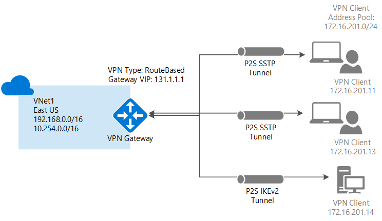
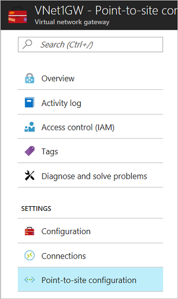
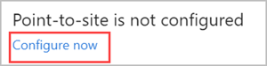
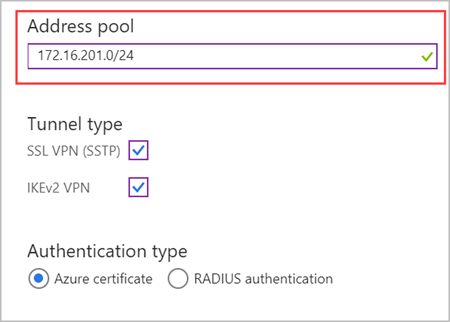
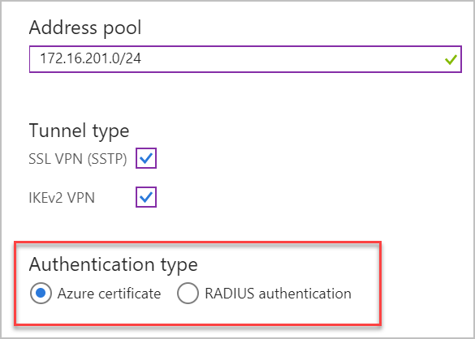
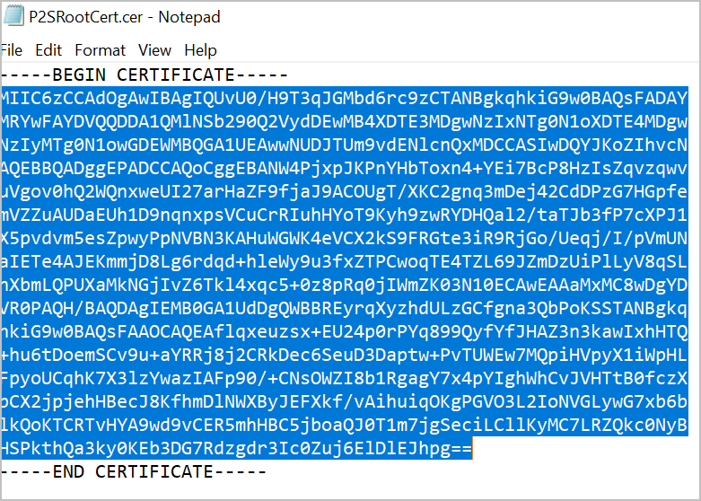
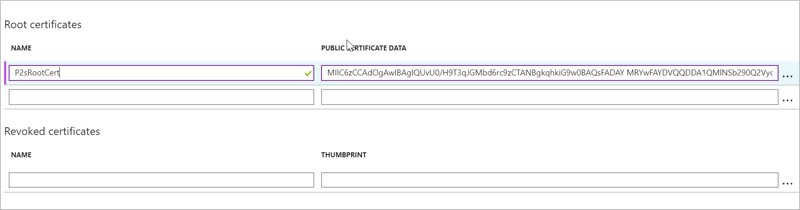
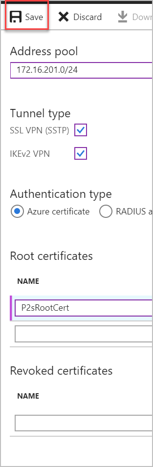
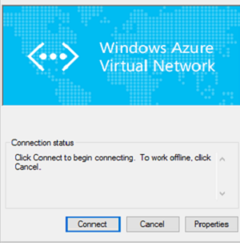

# Configure a Point-to-Site connection to a VNet using native Azure certificate authentication: Azure portal

This article helps you securely connect individual clients running Windows, Linux, or Mac OS X to an Azure VNet. Point-to-Site VPN connections are useful when you want to connect to your VNet from a remote location, such when you are telecommuting from home or a conference. You can also use P2S instead of a Site-to-Site VPN when you have only a few clients that need to connect to a VNet. Point-to-Site connections do not require a VPN device or a public-facing IP address. P2S creates the VPN connection over either SSTP (Secure Socket Tunneling Protocol), or IKEv2. For more information about Point-to-Site VPN, see [About Point-to-Site VPN](point-to-site-about.md).




## Architecture

Point-to-Site native Azure certificate authentication connections use the following items, which you configure in this exercise:

* A RouteBased VPN gateway.
* The public key (.cer file) for a root certificate, which is uploaded to Azure. Once the certificate is uploaded, it is considered a trusted certificate and is used for authentication.
* A client certificate that is generated from the root certificate. The client certificate installed on each client computer that will connect to the VNet. This certificate is used for client authentication.
* A VPN client configuration. The VPN client configuration files contain the necessary information for the client to connect to the VNet. The files configure the existing VPN client that is native to the operating system. Each client that connects must be configured using the settings in the configuration files.

#### <a name="example"></a>Example values

You can use the following values to create a test environment, or refer to these values to better understand the examples in this article:

* **VNet Name:** VNet1
* **Address space:** 192.168.0.0/16<br>For this example, we use only one address space. You can have more than one address space for your VNet.
* **Subnet name:** FrontEnd
* **Subnet address range:** 192.168.1.0/24
* **Subscription:** If you have more than one subscription, verify that you are using the correct one.
* **Resource Group:** TestRG
* **Location:** East US
* **GatewaySubnet:** 192.168.200.0/24<br>
* **DNS Server:** (optional) IP address of the DNS server that you want to use for name resolution.
* **Virtual network gateway name:** VNet1GW
* **Gateway type:** VPN
* **VPN type:** Route-based
* **Public IP address name:** VNet1GWpip
* **Connection type:** Point-to-site
* **Client address pool:** 172.16.201.0/24<br>VPN clients that connect to the VNet using this Point-to-Site connection receive an IP address from the client address pool.

## <a name="createvnet"></a>1. Create a virtual network

Before beginning, verify that you have an Azure subscription. If you don't already have an Azure subscription, you can activate your [MSDN subscriber benefits](https://azure.microsoft.com/pricing/member-offers/msdn-benefits-details) or sign up for a [free account](https://azure.microsoft.com/pricing/free-trial).
[!INCLUDE [Basic Point-to-Site VNet](../../includes/vpn-gateway-basic-p2s-vnet-rm-portal-include.md)]

## <a name="gatewaysubnet"></a>2. Add a gateway subnet

Before connecting your virtual network to a gateway, you first need to create the gateway subnet for the virtual network to which you want to connect. The gateway services use the IP addresses specified in the gateway subnet. If possible, create a gateway subnet using a CIDR block of /28 or /27 to provide enough IP addresses to accommodate additional future configuration requirements.

[!INCLUDE [vpn-gateway-add-gwsubnet-rm-portal](../../includes/vpn-gateway-add-gwsubnet-p2s-rm-portal-include.md)]

## <a name="dns"></a>3. Specify a DNS server (optional)

After you create your virtual network, you can add the IP address of a DNS server to handle name resolution. The DNS server is optional for this configuration, but required if you want name resolution. Specifying a value does not create a new DNS server. The DNS server IP address that you specify should be a DNS server that can resolve the names for the resources you are connecting to. For this example, we used a private IP address, but it is likely that this is not the IP address of your DNS server. Be sure to use your own values. The value you specify is used by the resources that you deploy to the VNet, not by the P2S connection or the VPN client.

[!INCLUDE [vpn-gateway-add-dns-rm-portal](../../includes/vpn-gateway-add-dns-rm-portal-include.md)]

## <a name="creategw"></a>4. Create a virtual network gateway

[!INCLUDE [create-gateway](../../includes/vpn-gateway-add-gw-p2s-rm-portal-include.md)]

>[!NOTE]
>The Basic SKU does not support IKEv2 or RADIUS authentication.
>

## <a name="generatecert"></a>5. Generate certificates

Certificates are used by Azure to authenticate clients connecting to a VNet over a Point-to-Site VPN connection. Once you obtain a root certificate, you [upload](#uploadfile) the public key information to Azure. The root certificate is then considered 'trusted' by Azure for connection over P2S to the virtual network. You also generate client certificates from the trusted root certificate, and then install them on each client computer. The client certificate is used to authenticate the client when it initiates a connection to the VNet. 

### <a name="getcer"></a>1. Obtain the .cer file for the root certificate

[!INCLUDE [root-certificate](../../includes/vpn-gateway-p2s-rootcert-include.md)]

### <a name="generateclientcert"></a>2. Generate a client certificate

[!INCLUDE [generate-client-cert](../../includes/vpn-gateway-p2s-clientcert-include.md)]

## <a name="addresspool"></a>6. Add the client address pool

The client address pool is a range of private IP addresses that you specify. The clients that connect over a Point-to-Site VPN dynamically receive an IP address from this range. Use a private IP address range that does not overlap with the on-premises location that you connect from, or the VNet that you want to connect to.

1. Once the virtual network gateway has been created, navigate to the **Settings** section of the virtual network gateway page. In the **Settings** section, click **Point-to-site configuration**.

   
2. Click **Configure now** to open the configuration page.

  
3. On the **Point-to-site** configuration page, in the **Address pool** box, add the private IP address range that you want to use. VPN clients dynamically receive an IP address from the range that you specify. Click **Save** to validate and save the setting.

  

  >[!NOTE]
  >If you don't see Tunnel type or Authentication type in the portal on this page, your gateway is using the Basic SKU. The Basic SKU does not support IKEv2 or RADIUS authentication.
  >

## <a name="tunneltype"></a>7. Configure tunnel type

You can select the tunnel type. The two tunnel options are SSTP and IKEv2. The strongSwan client on Android and Linux and the native IKEv2 VPN client on iOS and OSX will use only IKEv2 tunnel to connect. Windows clients try IKEv2 first and if that doesn’t connect, they fall back to SSTP. You can choose to enable one of them or both. Select the checkboxes that your solution requires.


## <a name="authenticationtype"></a>8. Configure authentication type

Select **Azure certificate**.

  

## <a name="uploadfile"></a>9. Upload the root certificate public certificate data

You can upload additional trusted root certificates up to a total of 20. Once the public certificate data is uploaded, Azure can use it to authenticate clients that have installed a client certificate generated from the trusted root certificate. Upload the public key information for the root certificate to Azure.

1. Certificates are added on the **Point-to-site configuration** page in the **Root certificate** section.
2. Make sure that you exported the root certificate as a Base-64 encoded X.509 (.cer) file. You need to export the certificate in this format so you can open the certificate with text editor.
3. Open the certificate with a text editor, such as Notepad. When copying the certificate data, make sure that you copy the text as one continuous line without carriage returns or line feeds. You may need to modify your view in the text editor to 'Show Symbol/Show all characters' to see the carriage returns and line feeds. Copy only the following section as one continuous line:

  
4. Paste the certificate data into the **Public Certificate Data** field. **Name** the certificate, and then click **Save**. You can add up to 20 trusted root certificates.

  
5. Click **Save** at the top of the page to save all of the configuration settings.

  

## <a name="installclientcert"></a>10. Install an exported client certificate

If you want to create a P2S connection from a client computer other than the one you used to generate the client certificates, you need to install a client certificate. When installing a client certificate, you need the password that was created when the client certificate was exported.

Make sure the client certificate was exported as a .pfx along with the entire certificate chain (which is the default). Otherwise, the root certificate information isn't present on the client computer and the client won't be able to authenticate properly.

For install steps, see [Install a client certificate](point-to-site-how-to-vpn-client-install-azure-cert.md).

## <a name="clientconfig"></a>11. Generate and install the VPN client configuration package

The VPN client configuration files contain settings to configure devices to connect to a VNet over a P2S connection. For instructions to generate and install VPN client configuration files, see [Create and install VPN client configuration files for native Azure certificate authentication P2S configurations](point-to-site-vpn-client-configuration-azure-cert.md).

## <a name="connect"></a>12. Connect to Azure

### To connect from a Windows VPN client

>[!NOTE]
>You must have Administrator rights on the Windows client computer from which you are connecting.
>
>

1. To connect to your VNet, on the client computer, navigate to VPN connections and locate the VPN connection that you created. It is named the same name as your virtual network. Click **Connect**. A pop-up message may appear that refers to using the certificate. Click **Continue** to use elevated privileges.

2. On the **Connection** status page, click **Connect** to start the connection. If you see a **Select Certificate** screen, verify that the client certificate showing is the one that you want to use to connect. If it is not, use the drop-down arrow to select the correct certificate, and then click **OK**.

  
3. Your connection is established.

  

#### Troubleshoot Windows P2S connections

[!INCLUDE [verifies client certificates](../../includes/vpn-gateway-certificates-verify-client-cert-include.md)]

### To connect from a Mac VPN client

From the Network dialog box, locate the client profile that you want to use, specify the settings from the [VpnSettings.xml](point-to-site-vpn-client-configuration-azure-cert.md#installmac), and then click **Connect**.

Please check [Install - Mac (OS X)](https://docs.microsoft.com/en-us/azure/vpn-gateway/point-to-site-vpn-client-configuration-azure-cert#installmac) for detailed instrcutions.

  

## <a name="verify"></a>To verify your connection

These instructions apply to Windows clients.

1. To verify that your VPN connection is active, open an elevated command prompt, and run *ipconfig/all*.
2. View the results. Notice that the IP address you received is one of the addresses within the Point-to-Site VPN Client Address Pool that you specified in your configuration. The results are similar to this example:

  ```
  PPP adapter VNet1:
      Connection-specific DNS Suffix .:
      Description.....................: VNet1
      Physical Address................:
      DHCP Enabled....................: No
      Autoconfiguration Enabled.......: Yes
      IPv4 Address....................: 172.16.201.3(Preferred)
      Subnet Mask.....................: 255.255.255.255
      Default Gateway.................:
      NetBIOS over Tcpip..............: Enabled
  ```

## <a name="connectVM"></a>To connect to a virtual machine

These instructions apply to Windows clients.

[!INCLUDE [Connect to a VM](../../includes/vpn-gateway-connect-vm-p2s-include.md)]

## <a name="add"></a>To add or remove trusted root certificates

You can add and remove trusted root certificates from Azure. When you remove a root certificate, clients that have a certificate generated from that root won't be able to authenticate, and thus will not be able to connect. If you want a client to authenticate and connect, you need to install a new client certificate generated from a root certificate that is trusted (uploaded) to Azure.

### To add a trusted root certificate

You can add up to 20 trusted root certificate .cer files to Azure. For instructions, see the section [Upload a trusted root certificate](#uploadfile) in this article.

### To remove a trusted root certificate

1. To remove a trusted root certificate, navigate to the **Point-to-site configuration** page for your virtual network gateway.
2. In the **Root certificate** section of the page, locate the certificate that you want to remove.
3. Click the ellipsis next to the certificate, and then click 'Remove'.

## <a name="revokeclient"></a>To revoke a client certificate

You can revoke client certificates. The certificate revocation list allows you to selectively deny Point-to-Site connectivity based on individual client certificates. This is different than removing a trusted root certificate. If you remove a trusted root certificate .cer from Azure, it revokes the access for all client certificates generated/signed by the revoked root certificate. Revoking a client certificate, rather than the root certificate, allows the other certificates that were generated from the root certificate to continue to be used for authentication.

The common practice is to use the root certificate to manage access at team or organization levels, while using revoked client certificates for fine-grained access control on individual users.

### Revoke a client certificate

You can revoke a client certificate by adding the thumbprint to the revocation list.

1. Retrieve the client certificate thumbprint. For more information, see [How to retrieve the Thumbprint of a Certificate](https://msdn.microsoft.com/library/ms734695.aspx).
2. Copy the information to a text editor and remove all spaces so that it is a continuous string.
3. Navigate to the virtual network gateway **Point-to-site-configuration** page. This is the same page that you used to [upload a trusted root certificate](#uploadfile).
4. In the **Revoked certificates** section, input a friendly name for the certificate (it doesn't have to be the certificate CN).
5. Copy and paste the thumbprint string to the **Thumbprint** field.
6. The thumbprint validates and is automatically added to the revocation list. A message appears on the screen that the list is updating. 
7. After updating has completed, the certificate can no longer be used to connect. Clients that try to connect using this certificate receive a message saying that the certificate is no longer valid.

## <a name="faq"></a>Point-to-Site FAQ

[!INCLUDE [Point-to-Site FAQ](../../includes/vpn-gateway-faq-p2s-azurecert-include.md)]

## Next steps
Once your connection is complete, you can add virtual machines to your virtual networks. For more information, see [Virtual Machines](https://docs.microsoft.com/azure/#pivot=services&panel=Compute). To understand more about networking and virtual machines, see [Azure and Linux VM network overview](../virtual-machines/linux/azure-vm-network-overview.md).

For P2S troubleshooting information, [Troubleshooting Azure point-to-site connections](vpn-gateway-troubleshoot-vpn-point-to-site-connection-problems.md).
