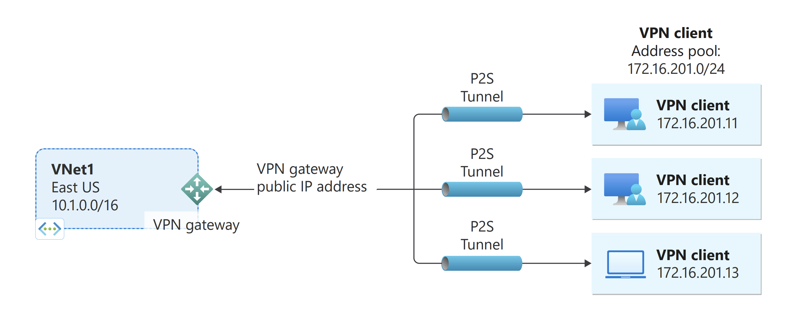
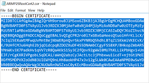

# Configure a Point-to-Site connection to a VNet using PowerShell


This article shows you how to create a VNet with a Point-to-Site connection in the Resource Manager deployment model using PowerShell. You can also create this configuration using a different deployment tool or deployment model by selecting a different option from the following list:

> [!div class="op_single_selector"]
> * [Azure portal](vpn-gateway-howto-point-to-site-resource-manager-portal.md)
> * [PowerShell](vpn-gateway-howto-point-to-site-rm-ps.md)
> * [Azure portal (classic)](vpn-gateway-howto-point-to-site-classic-azure-portal.md)
>
>

A Point-to-Site (P2S) configuration lets you create a secure connection from an individual client computer to a virtual network. Point-to-Site connections are useful when you want to connect to your VNet from a remote location, such as from home or a conference, or when you only have a few clients that need to connect to a virtual network. The P2S VPN connection is initiated from the client computer using the native Windows VPN client. Connecting clients use certificates to authenticate. 



Point-to-Site connections do not require a VPN device or a public-facing IP address. P2S creates the VPN connection over SSTP (Secure Socket Tunneling Protocol). On the server side, we support SSTP versions 1.0, 1.1, and 1.2. The client decides which version to use. For Windows 8.1 and above, SSTP uses 1.2 by default. For more information about Point-to-Site connections, see the [Point-to-Site FAQ](#faq) at the end of this article.

P2S connections require the following:

* A RouteBased VPN gateway.
* The public key (.cer file) for a root certificate, uploaded to Azure. This is considered a trusted certificate and is used for authentication.
* A client certificate generated from the root certificate, and installed on each client computer that will connect. This certificate is used for client authentication.
* A VPN client configuration package must be generated and installed on every client computer that connects. The client configuration package configures the native VPN client that is already on the operating system with the necessary information to connect to the VNet.


## Before beginning

* Verify that you have an Azure subscription. If you don't already have an Azure subscription, you can activate your [MSDN subscriber benefits](https://azure.microsoft.com/pricing/member-offers/msdn-benefits-details) or sign up for a [free account](https://azure.microsoft.com/pricing/free-trial).
* Install the latest version of the Azure Resource Manager PowerShell cmdlets. For more information about installing PowerShell cmdlets, see [How to install and configure Azure PowerShell](/powershell/azure/overview).

### <a name="example"></a>Example values

You can use the example values to create a test environment, or refer to these values to better understand the examples in this article. We set the variables in section [1](#declare) of the article. You can either use the steps as a walk-through and use the values without changing them, or change them to reflect your environment. 

* **Name: VNet1**
* **Address space: 192.168.0.0/16** and **10.254.0.0/16**<br>For this example, we use more than one address space to illustrate that this configuration works with multiple address spaces. However, multiple address spaces are not required for this configuration.
* **Subnet name: FrontEnd**
  * **Subnet address range: 192.168.1.0/24**
* **Subnet name: BackEnd**
  * **Subnet address range: 10.254.1.0/24**
* **Subnet name: GatewaySubnet**<br>The Subnet name *GatewaySubnet* is mandatory for the VPN gateway to work.
  * **GatewaySubnet address range: 192.168.200.0/24** 
* **VPN client address pool: 172.16.201.0/24**<br>VPN clients that connect to the VNet using this Point-to-Site connection receive an IP address from the VPN client address pool.
* **Subscription:** If you have more than one subscription, verify that you are using the correct one.
* **Resource Group: TestRG**
* **Location: East US**
* **DNS Server: IP address** of the DNS server that you want to use for name resolution.
* **GW Name: Vnet1GW**
* **Public IP name: VNet1GWPIP**
* **VpnType: RouteBased** 

## <a name="declare"></a>1 - Log in and set variables

In this section, you log in and declare the values used for this configuration. The declared values are used in the sample scripts. Change the values to reflect your own environment. Or, you can use the declared values and go through the steps as an exercise.

1. Open your PowerShell console with elevated privileges, and log in to your Azure account. This cmdlet prompts you for the login credentials. After logging in, it downloads your account settings so that they are available to Azure PowerShell.

  ```powershell
  Login-AzureRmAccount
  ```
2. Get a list of your Azure subscriptions.

  ```powershell
  Get-AzureRmSubscription
  ```
3. Specify the subscription that you want to use.

  ```powershell
  Select-AzureRmSubscription -SubscriptionName "Name of subscription"
  ```
4. Declare the variables that you want to use. Use the following sample, substituting the values for your own when necessary.

  ```powershell
  $VNetName  = "VNet1"
  $FESubName = "FrontEnd"
  $BESubName = "Backend"
  $GWSubName = "GatewaySubnet"
  $VNetPrefix1 = "192.168.0.0/16"
  $VNetPrefix2 = "10.254.0.0/16"
  $FESubPrefix = "192.168.1.0/24"
  $BESubPrefix = "10.254.1.0/24"
  $GWSubPrefix = "192.168.200.0/26"
  $VPNClientAddressPool = "172.16.201.0/24"
  $RG = "TestRG"
  $Location = "East US"
  $DNS = "8.8.8.8"
  $GWName = "VNet1GW"
  $GWIPName = "VNet1GWPIP"
  $GWIPconfName = "gwipconf"
  ```

## <a name="ConfigureVNet"></a>2 - Configure a VNet

1. Create a resource group.

  ```powershell
  New-AzureRmResourceGroup -Name $RG -Location $Location
  ```
2. Create the subnet configurations for the virtual network, naming them *FrontEnd*, *BackEnd*, and *GatewaySubnet*. These prefixes must be part of the VNet address space that you declared.

  ```powershell
  $fesub = New-AzureRmVirtualNetworkSubnetConfig -Name $FESubName -AddressPrefix $FESubPrefix
  $besub = New-AzureRmVirtualNetworkSubnetConfig -Name $BESubName -AddressPrefix $BESubPrefix
  $gwsub = New-AzureRmVirtualNetworkSubnetConfig -Name $GWSubName -AddressPrefix $GWSubPrefix
  ```
3. Create the virtual network. <br>The DNS server is optional. Specifying this value does not create a new DNS server. The client configuration package that you generate in a later step will contain the IP address of the DNS server that you specify in this setting. If you need to update the list of DNS servers in the future, you can generate and install new VPN client configuration packages that reflect the new list. The DNS server specified should be a DNS server that can resolve the names for the resources you are connecting to. For this example, we used a public IP address. Be sure to use your own values.

  ```powershell
  New-AzureRmVirtualNetwork -Name $VNetName -ResourceGroupName $RG -Location $Location -AddressPrefix $VNetPrefix1,$VNetPrefix2 -Subnet $fesub, $besub, $gwsub -DnsServer $DNS
  ```
4. Specify the variables for the virtual network you created.

  ```powershell
  $vnet = Get-AzureRmVirtualNetwork -Name $VNetName -ResourceGroupName $RG
  $subnet = Get-AzureRmVirtualNetworkSubnetConfig -Name "GatewaySubnet" -VirtualNetwork $vnet
  ```
5. A VPN gateway must have a Public IP address. You first request the IP address resource, and then refer to it when creating your virtual network gateway. The IP address is dynamically assigned to the resource when the VPN gateway is created. VPN Gateway currently only supports *Dynamic* Public IP address allocation. You cannot request a Static Public IP address assignment. However, this does not mean that the IP address changes after it has been assigned to your VPN gateway. The only time the Public IP address changes is when the gateway is deleted and re-created. It doesn't change across resizing, resetting, or other internal maintenance/upgrades of your VPN gateway.

  Request a dynamically assigned public IP address.

  ```powershell
  $pip = New-AzureRmPublicIpAddress -Name $GWIPName -ResourceGroupName $RG -Location $Location -AllocationMethod Dynamic
  $ipconf = New-AzureRmVirtualNetworkGatewayIpConfig -Name $GWIPconfName -Subnet $subnet -PublicIpAddress $pip
  ```

## <a name="Certificates"></a>3 - Generate certificates

Certificates are used by Azure to authenticate VPN clients for Point-to-Site VPNs. You upload the public key information of the root certificate to Azure. The public key is then considered 'trusted'. Client certificates must be generated from the trusted root certificate, and then installed on each client computer in the Certificates-Current User/Personal certificate store. The certificate is used to authenticate the client when it initiates a connection to the VNet. 

If you use self-signed certificates, they must be created using specific parameters. You can create a self-signed certificate using the instructions for [PowerShell and Windows 10](vpn-gateway-certificates-point-to-site.md), or, if you don't have Windows 10, you can use [MakeCert](vpn-gateway-certificates-point-to-site-makecert.md). It's important that you follow the steps in the instructions when generating self-signed root certificates and client certificates. Otherwise, the certificates you generate will not be compatible with P2S connections and you will receive a connection error.

### <a name="cer"></a>Step 1 - Obtain the .cer file for the root certificate

[!INCLUDE [vpn-gateway-basic-vnet-rm-portal](../../includes/vpn-gateway-p2s-rootcert-include.md)]


### <a name="generate"></a>Step 2 - Generate a client certificate

[!INCLUDE [vpn-gateway-basic-vnet-rm-portal](../../includes/vpn-gateway-p2s-clientcert-include.md)]

## <a name="upload"></a>4 - Prepare the root certificate .cer file for upload

Prepare to upload the .cer file (which contains the public key information) for a trusted root certificate to Azure. You do not upload the private key for the root certificate to Azure. Once a.cer file is uploaded, Azure can use it to authenticate clients that have installed a client certificate generated from the trusted root certificate. You can upload additional trusted root certificate files - up to a total of 20 - later, if needed. In this section, you declare the root certificate .cer file, which will be associated with your VPN gateway when you create it in the next section.

1. Declare the variable for your certificate name, replacing the value with your own.

  ```powershell
  $P2SRootCertName = "P2SRootCert.cer"
  ```
2. Replace the file path with your own, and then run the cmdlets.

  ```powershell
  $filePathForCert = "C:\cert\P2SRootCert.cer"
  $cert = new-object System.Security.Cryptography.X509Certificates.X509Certificate2($filePathForCert)
  $CertBase64 = [system.convert]::ToBase64String($cert.RawData)
  $p2srootcert = New-AzureRmVpnClientRootCertificate -Name $P2SRootCertName -PublicCertData $CertBase64
  ```

## <a name="creategateway"></a>5 - Create the VPN gateway

Configure and create the virtual network gateway for your VNet.

* The *-GatewayType* must be **Vpn** and the *-VpnType* must be **RouteBased**.
* In this example, the public key for the root certificate gets associated with the VPN gateway using the variable '$p2srootcert', specified in the previous section.
* In this example, the VPN client address pool is declared as a [variable](#declare) in Step 1. The VPN client address pool is the range from which the VPN clients receive an IP address when connecting. Use a private IP address range that does not overlap with the on-premises location that you will connect from, or with the VNet that you want to connect to.
* A VPN gateway can take up to 45 minutes to complete, depending on the [gateway sku](vpn-gateway-about-vpn-gateway-settings.md) you select.

```powershell
New-AzureRmVirtualNetworkGateway -Name $GWName -ResourceGroupName $RG `
-Location $Location -IpConfigurations $ipconf -GatewayType Vpn `
-VpnType RouteBased -EnableBgp $false -GatewaySku VpnGw1 `
-VpnClientAddressPool $VPNClientAddressPool -VpnClientRootCertificates $p2srootcert
```

## <a name="clientconfig"></a>6 - Download the VPN client configuration package

To connect to a VNet using a Point-to-Site VPN, each client must install a package to configure the native Windows VPN client. The configuration package configures the native Windows VPN client with the settings necessary to connect to the virtual network and, if you specified a DNS server for your VNet, it contains the DNS server IP address the client will use for name resolution. If you change the specified DNS server later, after generating the client configuration package, be sure to generate a new client configuration package to install on your client computers.

You can use the same VPN client configuration package on each client computer, as long as the version matches the architecture for the client. For the list of client operating systems that are supported, see the [Point-to-Site connections FAQ](#faq) at the end of this article.

1. After the gateway has been created, you can generate and download the client configuration package. This example downloads the package for 64-bit clients. If you want to download the 32-bit client, replace 'Amd64' with 'x86'. You can also download the VPN client by using the Azure portal.

  ```powershell
  Get-AzureRmVpnClientPackage -ResourceGroupName $RG `
  -VirtualNetworkGatewayName $GWName -ProcessorArchitecture Amd64
  ```
2. Copy and paste the link that is returned to a web browser to download the package, taking care to remove the quotes surrounding the link. 
3. Download and install the package on the client computer. If you see a SmartScreen popup, click **More info**, then **Run anyway**. You can also save the package to install on other client computers.
4. On the client computer, navigate to **Network Settings** and click **VPN**. The VPN connection shows the name of the virtual network that it connects to.

## <a name="clientcertificate"></a>7 - Install an exported client certificate

If you want to create a P2S connection from a client computer other than the one you used to generate the client certificates, you need to install a client certificate. When installing a client certificate, you need the password that was created when the client certificate was exported. Typically, this is just a matter of double-clicking the certificate and installing it. For more information see, [Install an exported client certificate](vpn-gateway-certificates-point-to-site.md#install).

## <a name="connect"></a>8 - Connect to Azure
1. To connect to your VNet, on the client computer, navigate to VPN connections and locate the VPN connection that you created. It is named the same name as your virtual network. Click **Connect**. A pop-up message may appear that refers to using the certificate. Click **Continue** to use elevated privileges. 
2. On the **Connection** status page, click **Connect** to start the connection. If you see a **Select Certificate** screen, verify that the client certificate showing is the one that you want to use to connect. If it is not, use the drop-down arrow to select the correct certificate, and then click **OK**.

  
3. Your connection is established.

  

If you are having trouble connecting, check the following things:

- Open **Manage user certificates** and navigate to **Trusted Root Certification Authorities\Certificates**. Verify that the root certificate is listed. The root certificate must be present in order for authentication to work. When you export a client certificate .pfx using the default value 'Include all certificates in the certification path if possible', the root certificate information is also exported. When you install the client certificate, the root certificate is then also installed on the client computer. 

- If you are using a certificate that was issued using an Enterprise CA solution and are having trouble authenticating, check the authentication order on the client certificate. You can check the authentication list order by double-clicking the client certificate, and going to **Details > Enhanced Key Usage**. Make sure the list shows 'Client Authentication' as the first item. If not, you need to issue a client certificate based on the User template that has Client Authentication as the first item in the list.  

## <a name="verify"></a>9 - Verify your connection

1. To verify that your VPN connection is active, open an elevated command prompt, and run *ipconfig/all*.
2. View the results. Notice that the IP address you received is one of the addresses within the Point-to-Site VPN Client Address Pool that you specified in your configuration. The results are similar to this example:

  ```
  PPP adapter VNet1:
      Connection-specific DNS Suffix .:
      Description.....................: VNet1
      Physical Address................:
      DHCP Enabled....................: No
      Autoconfiguration Enabled.......: Yes
      IPv4 Address....................: 172.16.201.3(Preferred)
      Subnet Mask.....................: 255.255.255.255
      Default Gateway.................:
      NetBIOS over Tcpip..............: Enabled
  ```


## <a name="connectVM"></a>Connect to a virtual machine

[!INCLUDE [Connect to a VM](../../includes/vpn-gateway-connect-vm-p2s-include.md)]

## <a name="addremovecert"></a>Add or remove a root certificate

You can add and remove trusted root certificates from Azure. When you remove a root certificate, clients that have a certificate generated from that root won't be able to authenticate, and thus will not be able to connect. If you want a client to authenticate and connect, you need to install a new client certificate generated from a root certificate that is trusted (uploaded) to Azure.

### To add a trusted root certificate

You can add up to 20 root certificate .cer files to Azure. The following steps help you add a root certificate:

1. Create and prepare the new root certificate to add to Azure. Export the public key as a Base-64 encoded X.509 (.CER) and open it with a text editor. Copy the values, as shown in the following example:

  

  > [!NOTE]
  > When copying the certificate data, make sure that you copy the text as one continuous line without carriage returns or line feeds. You may need to modify your view in the text editor to 'Show Symbol/Show all characters' to see the carriage returns and line feeds.
  >
  >

2. Specify the certificate name and key information as a variable. Replace the information with your own, as shown in the following example:

  ```powershell
  $P2SRootCertName2 = "ARMP2SRootCert2.cer"
  $MyP2SCertPubKeyBase64_2 = "MIIC/zCCAeugAwIBAgIQKazxzFjMkp9JRiX+tkTfSzAJBgUrDgMCHQUAMBgxFjAUBgNVBAMTDU15UDJTUm9vdENlcnQwHhcNMTUxMjE5MDI1MTIxWhcNMzkxMjMxMjM1OTU5WjAYMRYwFAYDVQQDEw1NeVAyU1Jvb3RDZXJ0MIIBIjANBgkqhkiG9w0BAQEFAAOCAQ8AMIIBCgKCAQEAyjIXoWy8xE/GF1OSIvUaA0bxBjZ1PJfcXkMWsHPzvhWc2esOKrVQtgFgDz4ggAnOUFEkFaszjiHdnXv3mjzE2SpmAVIZPf2/yPWqkoHwkmrp6BpOvNVOpKxaGPOuK8+dql1xcL0eCkt69g4lxy0FGRFkBcSIgVTViS9wjuuS7LPo5+OXgyFkAY3pSDiMzQCkRGNFgw5WGMHRDAiruDQF1ciLNojAQCsDdLnI3pDYsvRW73HZEhmOqRRnJQe6VekvBYKLvnKaxUTKhFIYwuymHBB96nMFdRUKCZIiWRIy8Hc8+sQEsAML2EItAjQv4+fqgYiFdSWqnQCPf/7IZbotgQIDAQABo00wSzBJBgNVHQEEQjBAgBAkuVrWvFsCJAdK5pb/eoCNoRowGDEWMBQGA1UEAxMNTXlQMlNSb290Q2VydIIQKazxzFjMkp9JRiX+tkTfSzAJBgUrDgMCHQUAA4IBAQA223veAZEIar9N12ubNH2+HwZASNzDVNqspkPKD97TXfKHlPlIcS43TaYkTz38eVrwI6E0yDk4jAuPaKnPuPYFRj9w540SvY6PdOUwDoEqpIcAVp+b4VYwxPL6oyEQ8wnOYuoAK1hhh20lCbo8h9mMy9ofU+RP6HJ7lTqupLfXdID/XevI8tW6Dm+C/wCeV3EmIlO9KUoblD/e24zlo3YzOtbyXwTIh34T0fO/zQvUuBqZMcIPfM1cDvqcqiEFLWvWKoAnxbzckye2uk1gHO52d8AVL3mGiX8wBJkjc/pMdxrEvvCzJkltBmqxTM6XjDJALuVh16qFlqgTWCIcb7ju"
  ```
3. Add the new root certificate. You can only add one certificate at a time.

  ```powershell
  Add-AzureRmVpnClientRootCertificate -VpnClientRootCertificateName $P2SRootCertName2 -VirtualNetworkGatewayname "VNet1GW" -ResourceGroupName "TestRG" -PublicCertData $MyP2SCertPubKeyBase64_2
  ```
4. You can verify that the new certificate was added correctly by using the following example:

  ```powershell
  Get-AzureRmVpnClientRootCertificate -ResourceGroupName "TestRG" `
  -VirtualNetworkGatewayName "VNet1GW"
  ```

### To remove a root certificate

1. Declare the variables.

  ```powershell
  $GWName = "Name_of_virtual_network_gateway"
  $RG = "Name_of_resource_group"
  $P2SRootCertName2 = "ARMP2SRootCert2.cer"
  $MyP2SCertPubKeyBase64_2 = "MIIC/zCCAeugAwIBAgIQKazxzFjMkp9JRiX+tkTfSzAJBgUrDgMCHQUAMBgxFjAUBgNVBAMTDU15UDJTUm9vdENlcnQwHhcNMTUxMjE5MDI1MTIxWhcNMzkxMjMxMjM1OTU5WjAYMRYwFAYDVQQDEw1NeVAyU1Jvb3RDZXJ0MIIBIjANBgkqhkiG9w0BAQEFAAOCAQ8AMIIBCgKCAQEAyjIXoWy8xE/GF1OSIvUaA0bxBjZ1PJfcXkMWsHPzvhWc2esOKrVQtgFgDz4ggAnOUFEkFaszjiHdnXv3mjzE2SpmAVIZPf2/yPWqkoHwkmrp6BpOvNVOpKxaGPOuK8+dql1xcL0eCkt69g4lxy0FGRFkBcSIgVTViS9wjuuS7LPo5+OXgyFkAY3pSDiMzQCkRGNFgw5WGMHRDAiruDQF1ciLNojAQCsDdLnI3pDYsvRW73HZEhmOqRRnJQe6VekvBYKLvnKaxUTKhFIYwuymHBB96nMFdRUKCZIiWRIy8Hc8+sQEsAML2EItAjQv4+fqgYiFdSWqnQCPf/7IZbotgQIDAQABo00wSzBJBgNVHQEEQjBAgBAkuVrWvFsCJAdK5pb/eoCNoRowGDEWMBQGA1UEAxMNTXlQMlNSb290Q2VydIIQKazxzFjMkp9JRiX+tkTfSzAJBgUrDgMCHQUAA4IBAQA223veAZEIar9N12ubNH2+HwZASNzDVNqspkPKD97TXfKHlPlIcS43TaYkTz38eVrwI6E0yDk4jAuPaKnPuPYFRj9w540SvY6PdOUwDoEqpIcAVp+b4VYwxPL6oyEQ8wnOYuoAK1hhh20lCbo8h9mMy9ofU+RP6HJ7lTqupLfXdID/XevI8tW6Dm+C/wCeV3EmIlO9KUoblD/e24zlo3YzOtbyXwTIh34T0fO/zQvUuBqZMcIPfM1cDvqcqiEFLWvWKoAnxbzckye2uk1gHO52d8AVL3mGiX8wBJkjc/pMdxrEvvCzJkltBmqxTM6XjDJALuVh16qFlqgTWCIcb7ju"
  ```
2. Remove the certificate.

  ```powershell
  Remove-AzureRmVpnClientRootCertificate -VpnClientRootCertificateName $P2SRootCertName2 -VirtualNetworkGatewayName $GWName -ResourceGroupName $RG -PublicCertData $MyP2SCertPubKeyBase64_2
  ```
3. Use the following example to verify that the certificate was removed successfully.

  ```powershell
  Get-AzureRmVpnClientRootCertificate -ResourceGroupName "TestRG" `
  -VirtualNetworkGatewayName "VNet1GW"
  ```

## <a name="revoke"></a>Revoke a client certificate

You can revoke client certificates. The certificate revocation list allows you to selectively deny Point-to-Site connectivity based on individual client certificates. This differs from removing a trusted root certificate. If you remove a trusted root certificate .cer from Azure, it revokes the access for all client certificates generated/signed by the revoked root certificate. Revoking a client certificate, rather than the root certificate, allows the other certificates that were generated from the root certificate to continue to be used for authentication.

The common practice is to use the root certificate to manage access at team or organization levels, while using revoked client certificates for fine-grained access control on individual users.

### To revoke a client certificate

1. Retrieve the client certificate thumbprint. For more information, see [How to retrieve the Thumbprint of a Certificate](https://msdn.microsoft.com/library/ms734695.aspx).
2. Copy the information to a text editor and remove all spaces so that it is a continuous string. This is declared as a variable in the next step.
3. Declare the variables. Make sure to declare the thumbprint you retrieved in the previous step.

  ```powershell
  $RevokedClientCert1 = "NameofCertificate"
  $RevokedThumbprint1 = "‎51ab1edd8da4cfed77e20061c5eb6d2ef2f778c7"
  $GWName = "Name_of_virtual_network_gateway"
  $RG = "Name_of_resource_group"
  ```
4. Add the thumbprint to the list of revoked certificates. You see "Succeeded" when the thumbprint has been added.

  ```powershell
  Add-AzureRmVpnClientRevokedCertificate -VpnClientRevokedCertificateName $RevokedClientCert1 `
  -VirtualNetworkGatewayName $GWName -ResourceGroupName $RG `
  -Thumbprint $RevokedThumbprint1
  ```
5. Verify that the thumbprint was added to the certificate revocation list.

  ```powershell
  Get-AzureRmVpnClientRevokedCertificate -VirtualNetworkGatewayName $GWName -ResourceGroupName $RG
  ```
6. After the thumbprint has been added, the certificate can no longer be used to connect. Clients that try to connect using this certificate receive a message saying that the certificate is no longer valid.

### To reinstate a client certificate

You can reinstate a client certificate by removing the thumbprint from the list of revoked client certificates.

1. Declare the variables. Make sure you declare the correct thumbprint for the certificate that you want to reinstate.

  ```powershell
  $RevokedClientCert1 = "NameofCertificate"
  $RevokedThumbprint1 = "‎51ab1edd8da4cfed77e20061c5eb6d2ef2f778c7"
  $GWName = "Name_of_virtual_network_gateway"
  $RG = "Name_of_resource_group"
  ```
2. Remove the certificate thumbprint from the certificate revocation list.

  ```powershell
  Remove-AzureRmVpnClientRevokedCertificate -VpnClientRevokedCertificateName $RevokedClientCert1 `
  -VirtualNetworkGatewayName $GWName -ResourceGroupName $RG -Thumbprint $RevokedThumbprint1
  ```
3. Check if the thumbprint is removed from the revoked list.

  ```powershell
  Get-AzureRmVpnClientRevokedCertificate -VirtualNetworkGatewayName $GWName -ResourceGroupName $RG
  ```

## <a name="faq"></a>Point-to-Site FAQ

[!INCLUDE [Point-to-Site FAQ](../../includes/vpn-gateway-point-to-site-faq-include.md)]

## Next steps
Once your connection is complete, you can add virtual machines to your virtual networks. For more information, see [Virtual Machines](https://docs.microsoft.com/azure/#pivot=services&panel=Compute). To understand more about networking and virtual machines, see [Azure and Linux VM network overview](../virtual-machines/linux/azure-vm-network-overview.md).
