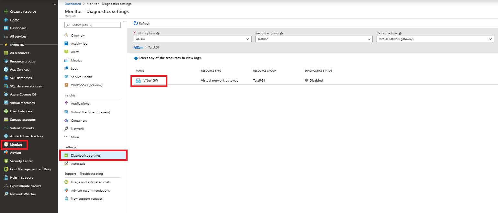
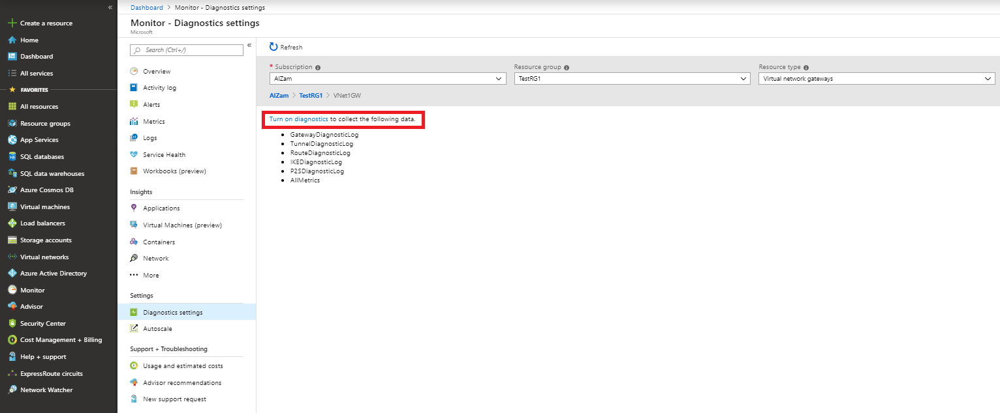
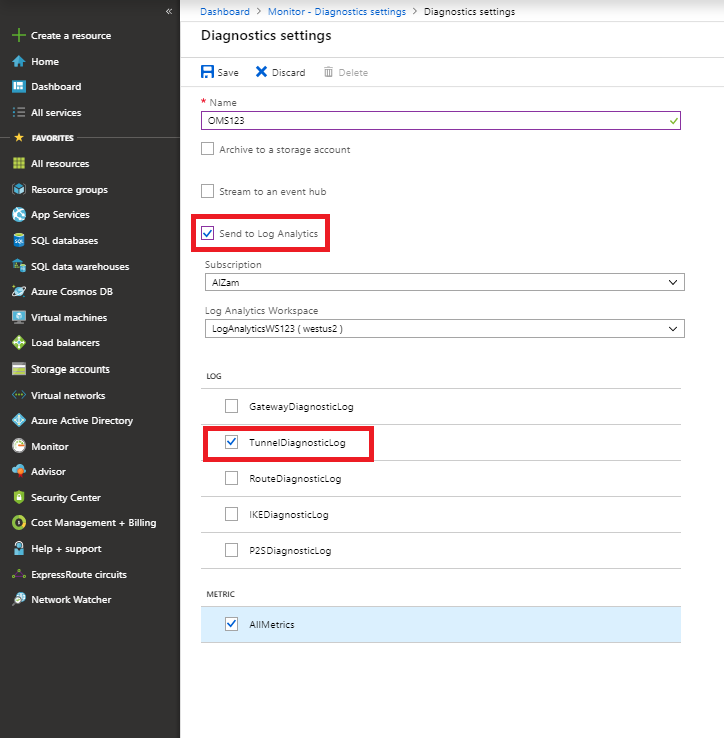
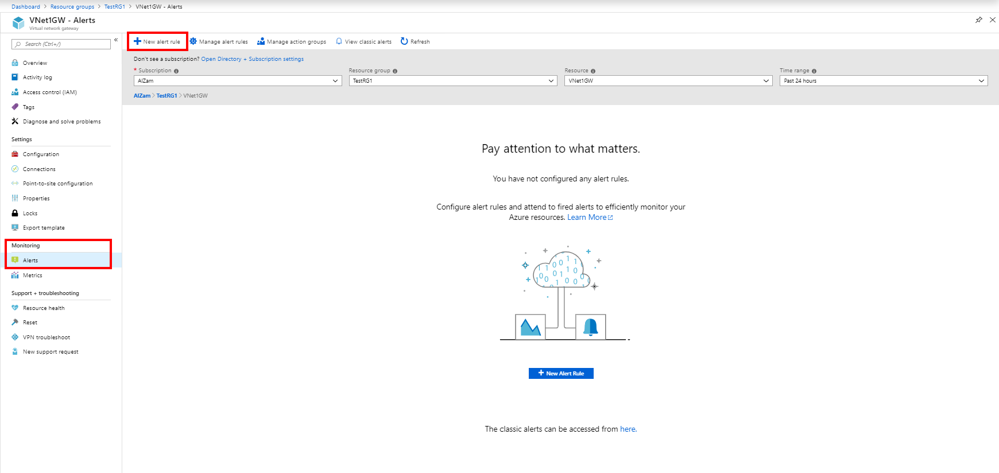
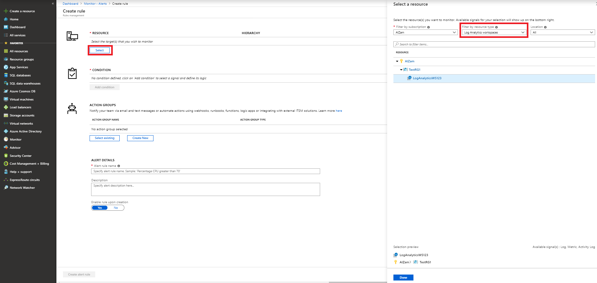
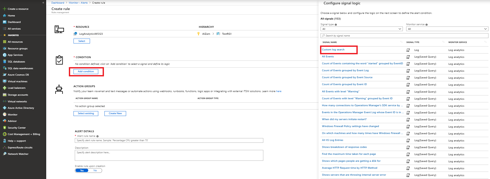
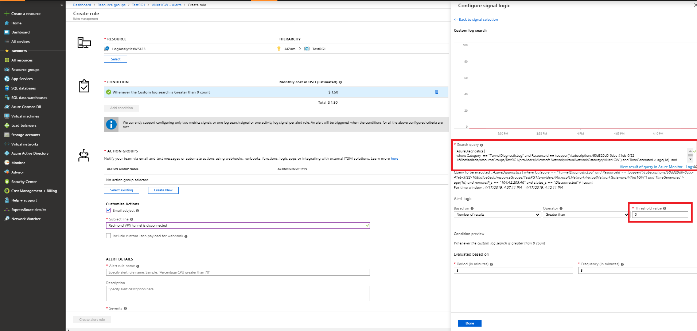
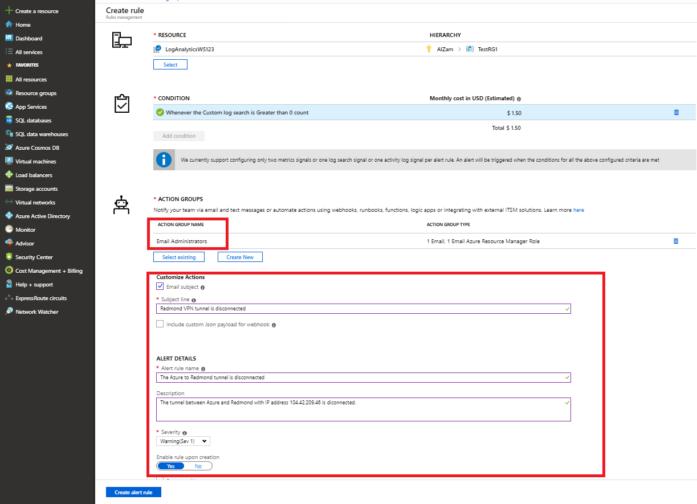

# Setting up alerts on VPN Gateway diagnostic log events

This article helps you set up alerts based on VPN Gateway diagnostic log events.

## Setup Azure Monitor alerts based on diagnostic log events using the portal

The example steps below will create an alert for a site-to-site VPN tunnel disconnection event

1. Search for "Log Analytics" under All services and pick "Log Analytics workspaces"

2. Click "Create" in the Log Analytics page.

3. Check "Create New" workspace and fill in the details.

4. Find your VPN gateway under the "Monitor" > "Diagnostics settings" blade

5. To turn on diagnostics, double-click on the gateway and then click on "Turn on diagnostics"

6. Fill in the details and ensure that "Send to Log Analytics" and "TunnelDiagnosticLog" are checked. Pick the Log Analytics Workspace that was created in step 3.

7. Navigate to the virtual network gateway resource overview and select "Alerts" from the Monitoring tab, then create a new alert rule or edit an existing alert rule.

8. Select the Log Analytics workspace and the resource.

9. Select "Custom log search" as the signal logic under "Add condition"

10. Enter the following query in the "Search query" text box replacing the values in <> as appropriate.

	AzureDiagnostics |
	where Category  == "TunnelDiagnosticLog" and ResourceId == toupper("<RESOURCEID OF GATEWAY>") and TimeGenerated > ago(5m) and
    remoteIP_s == "<REMOTE IP OF TUNNEL>" and status_s == "Disconnected"

    Set the threshold value to 0 and click "Done"

    

11. On the "Create rule" page, click "Create New" under the ACTION GROUPS section. Fill in the details and click OK

12. On the "Create rule" page, fill in the details for "Customize Action" and make sure that the correct Action group name appears in the "Action Group Name" section. Click "Create alert rule" to create the rule.

## Next steps

To configure alerts on tunnel metrics, see [How to setup alerts on VPN Gateway metrics](vpn-gateway-howto-setup-alerts-for-virtual-network-gateway-metric.md).