# Set up alerts on diagnostic log events from VPN Gateway

This article helps you set up alerts based on diagnostic log events from Azure VPN Gateway using Azure Log Analytics. 

The following logs are available in Azure:

|***Name*** | ***Description*** |
|---		| ---				|
|GatewayDiagnosticLog | Contains diagnostic logs for gateway configuration events, primary changes and maintenance events |
|TunnelDiagnosticLog | Contains tunnel state change events. Tunnel connect/disconnect events have a summarized reason for the state change if applicable |
|RouteDiagnosticLog | Logs changes to static routes and BGP events that occur on the gateway |
|IKEDiagnosticLog | Logs IKE control messages and events on the gateway |
|P2SDiagnosticLog | Logs point-to-site control messages and events on the gateway |

## <a name="setup"></a>Set up alerts

The following example steps will create an alert for a disconnection event that involves a site-to-site VPN tunnel:


1. In the Azure portal, search for **Log Analytics** under **All services** and select **Log Analytics workspaces**.

   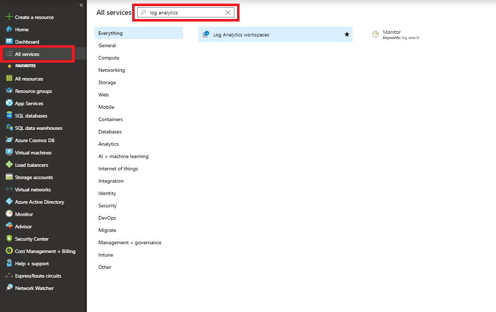

2. Select **Create** on the **Log Analytics** page.

   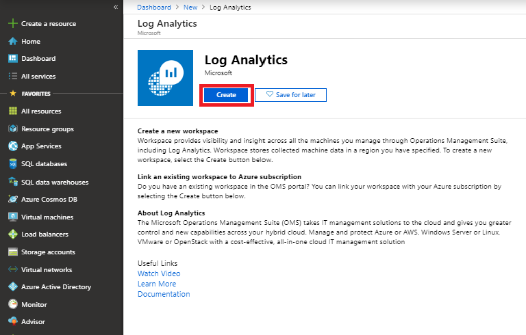

3. Select **Create New** and fill in the details.

   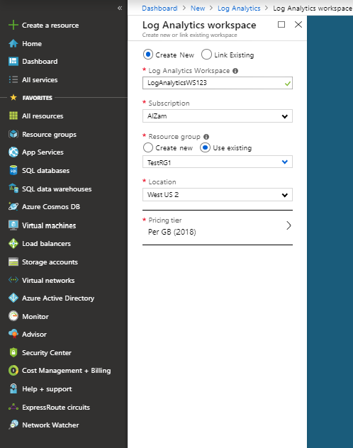

4. Find your VPN gateway on the **Monitor** > **Diagnostics settings** blade.

   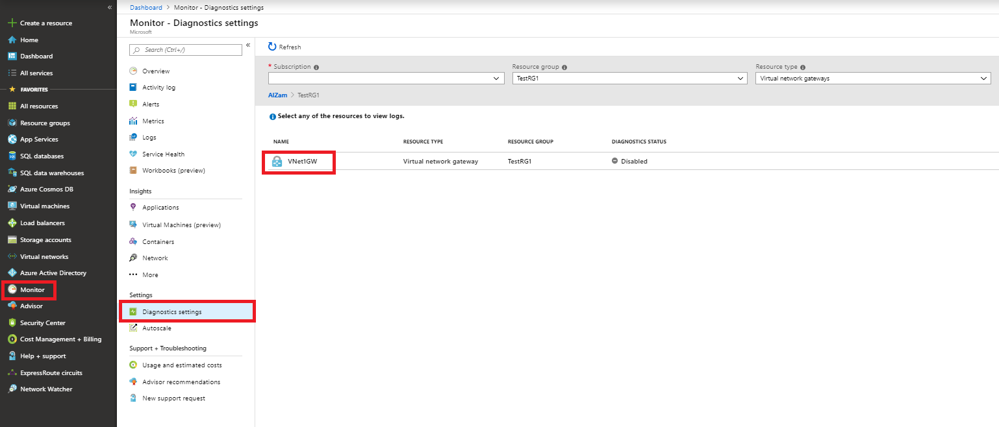

5. To turn on diagnostics, double-click the gateway and then select **Turn on diagnostics**.

   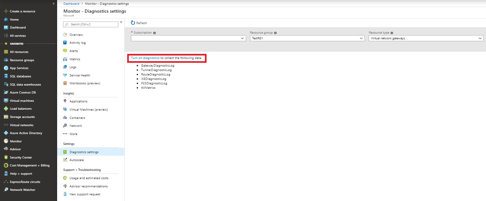

6. Fill in the details, and ensure that **Send to Log Analytics** and **TunnelDiagnosticLog** are selected. Choose the Log Analytics Workspace that you created in step 3.

   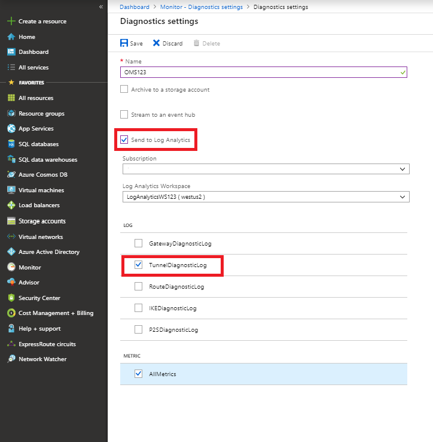
   
> [!NOTE]
> It may take a few hours for the data to show up initially.
>

7. Go to the overview for the virtual network gateway resource and select **Alerts** from the **Monitoring** tab. Then create a new alert rule or edit an existing alert rule.

   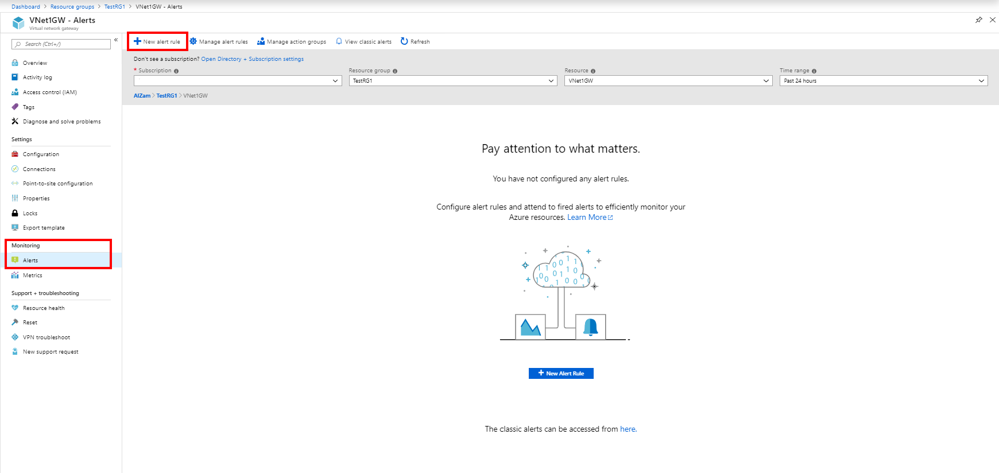

   
8. Select the Log Analytics workspace and the resource.

   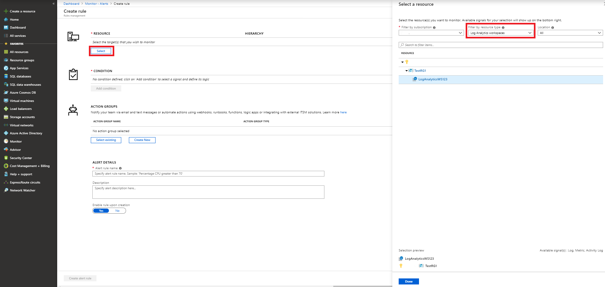

9. Select **Custom log search** as the signal logic under **Add condition**.

   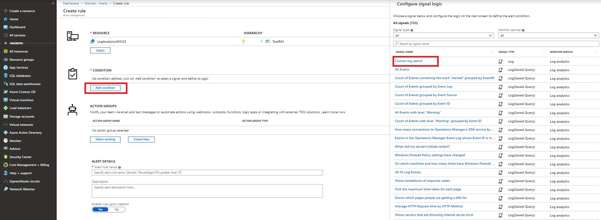

10. Enter the following query in the **Search query** text box. Replace the values in <> and TimeGenerated as appropriate.

    ```
    AzureDiagnostics
    | where Category == "TunnelDiagnosticLog"
    | where _ResourceId == tolower("<RESOURCEID OF GATEWAY>")
    | where TimeGenerated > ago(5m) 
    | where remoteIP_s == "<REMOTE IP OF TUNNEL>"
    | where status_s == "Disconnected"
    | project TimeGenerated, OperationName, instance_s, Resource, ResourceGroup, _ResourceId 
    | sort by TimeGenerated asc
    ```

    Set the threshold value to 0 and select **Done**.

    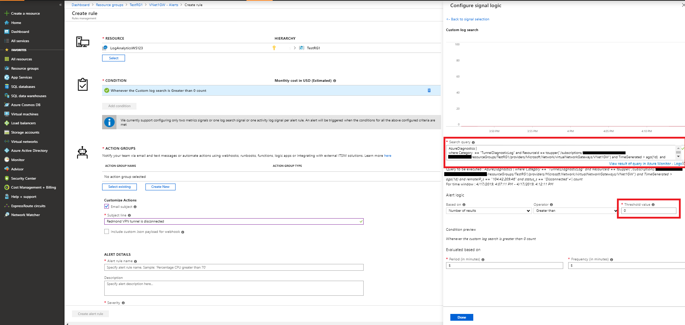

11. On the **Create rule** page, select **Create New** under the **ACTION GROUPS** section. Fill in the details and select **OK**.

    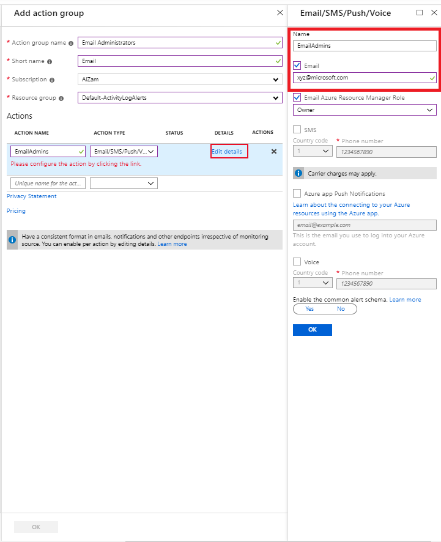

12. On the **Create rule** page, fill in the details for **Customize Actions** and make sure that the correct name appears in the **ACTION GROUP NAME** section. Select **Create alert rule** to create the rule.

    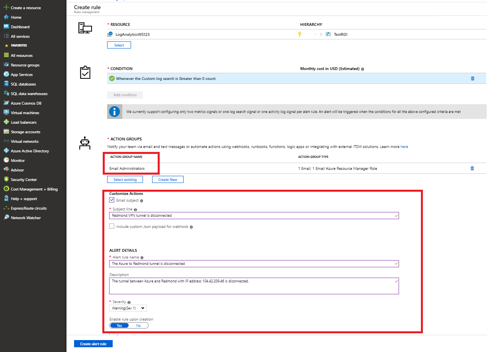

## Next steps

To configure alerts on tunnel metrics, see [Set up alerts on VPN Gateway metrics](vpn-gateway-howto-setup-alerts-virtual-network-gateway-metric.md).
