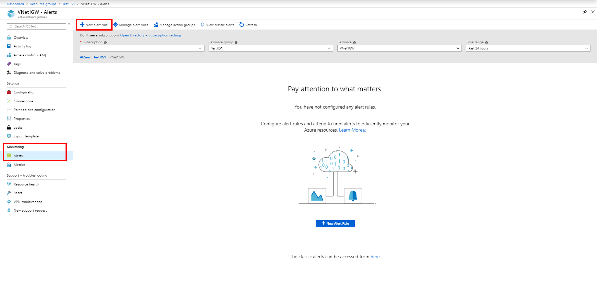
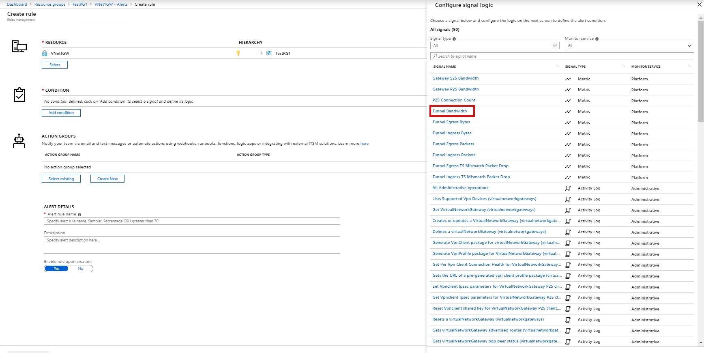
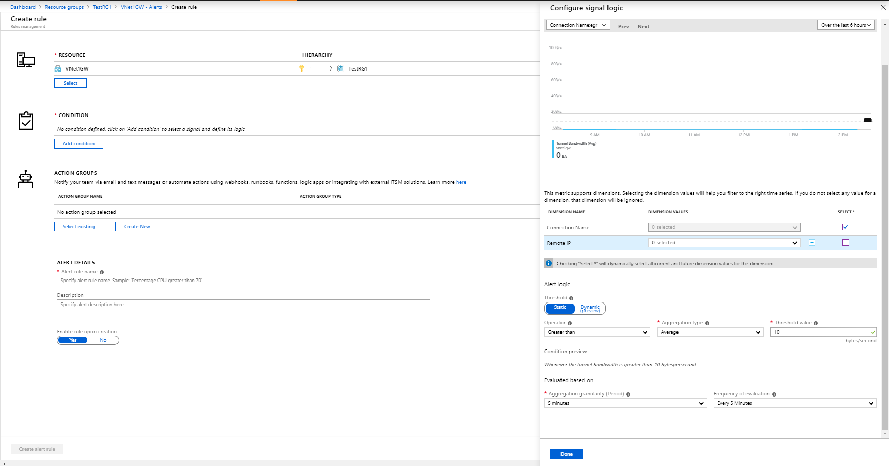
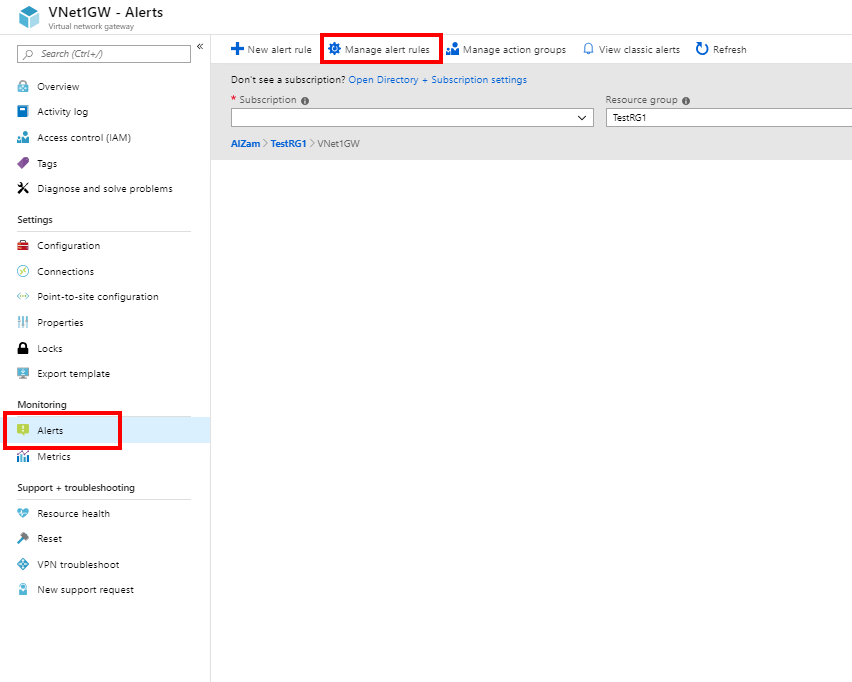

# Set up alerts on VPN Gateway metrics

This article helps you set up alerts on Azure VPN Gateway metrics. Azure Monitor provides the ability to set up alerts for Azure resources. You can set up alerts for virtual network gateways of the "VPN" type.

|**Metric**   | **Unit** | **Granularity** | **Description** | 
|---       | ---        | ---       | ---            | ---       |
|**AverageBandwidth**| Bytes/s  | 5 minutes| Average combined bandwidth utilization of all site-to-site connections on the gateway.     |
|**P2SBandwidth**| Bytes/s  | 1 minute  | Average combined bandwidth utilization of all point-to-site connections on the gateway.    |
|**P2SConnectionCount**| Count  | 1 minute  | Count of point-to-site connections on the gateway.   |
|**TunnelAverageBandwidth** | Bytes/s    | 5 minutes  | Average bandwidth utilization of tunnels created on the gateway. |
|**TunnelEgressBytes** | Bytes | 5 minutes | Outgoing traffic on tunnels created on the gateway.   |
|**TunnelEgressPackets** | Count | 5 minutes | Count of outgoing packets on tunnels created on the gateway.   |
|**TunnelEgressPacketDropTSMismatch** | Count | 5 minutes | Count of outgoing packets dropped on tunnels caused by traffic-selector mismatch. |
|**TunnelIngressBytes** | Bytes | 5 minutes | Incoming traffic on tunnels created on the gateway.   |
|**TunnelIngressPackets** | Count | 5 minutes | Count of incoming packets on tunnels created on the gateway.   |
|**TunnelIngressPacketDropTSMismatch** | Count | 5 minutes | Count of incoming packets dropped on tunnels caused by traffic-selector mismatch. |

## Set up Azure Monitor alerts based on metrics by using the Azure portal

The following example steps will create an alert on a gateway for:

- **Metric:** TunnelAverageBandwidth
- **Condition:** Bandwidth > 10 bytes/second
- **Window:** 5 minutes
- **Alert action:** Email

1. Go to the virtual network gateway resource and select **Alerts** from the **Monitoring** tab. Then create a new alert rule or edit an existing alert rule.

   

2. Select your VPN gateway as the resource.

   

3. Select a metric to configure for the alert.

   
4. Configure the signal logic. There are three components to it:

    a. **Dimensions**: If the metric has dimensions, you can select specific dimension values so that the alert evaluates only data of that dimension. These are optional.

    b. **Condition**: This is the operation to evaluate the metric value.

    c. **Time**: Specify the granularity of metric data, and the period of time to evaluate the alert.

   

5. To view the configured rules, select **Manage alert rules**.

   

## Next steps

To configure alerts on tunnel resource logs, see [Set up alerts on VPN Gateway resource logs](vpn-gateway-howto-setup-alerts-virtual-network-gateway-log.md).
