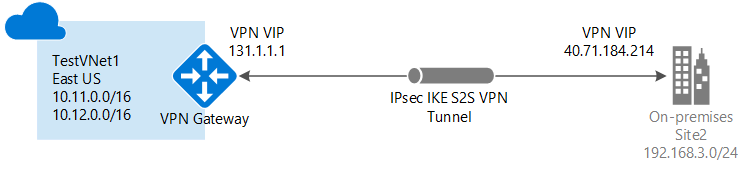
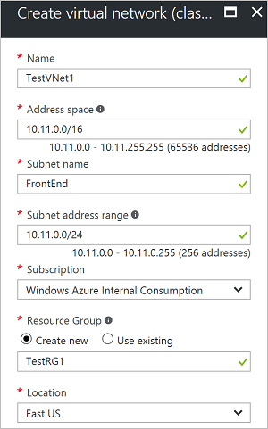
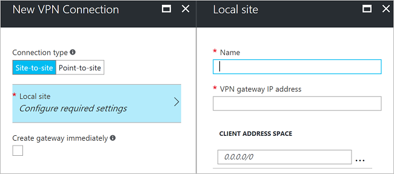
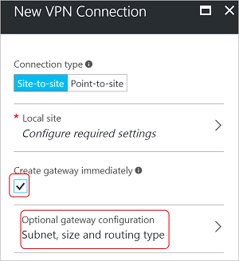
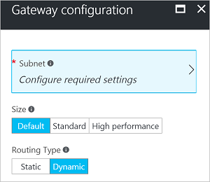

# Create a Site-to-Site connection using the Azure portal (classic)


This article shows you how to use the Azure portal to create a Site-to-Site VPN gateway connection from your on-premises network to the VNet. The steps in this article apply to the classic deployment model and do not apply to the current deployment model, Resource Manager. You can also create this configuration using a different deployment tool or deployment model by selecting a different option from the following list:

> [!div class="op_single_selector"]
> * [Azure portal](vpn-gateway-howto-site-to-site-resource-manager-portal.md)
> * [PowerShell](vpn-gateway-create-site-to-site-rm-powershell.md)
> * [CLI](vpn-gateway-howto-site-to-site-resource-manager-cli.md)
> * [Azure portal (classic)](vpn-gateway-howto-site-to-site-classic-portal.md)
> 
>

A Site-to-Site VPN gateway connection is used to connect your on-premises network to an Azure virtual network over an IPsec/IKE (IKEv1 or IKEv2) VPN tunnel. This type of connection requires a VPN device located on-premises that has an externally facing public IP address assigned to it. For more information about VPN gateways, see [About VPN gateway](vpn-gateway-about-vpngateways.md).



## <a name="before"></a>Before you begin

Verify that you have met the following criteria before beginning configuration:

* Verify that you want to work in the classic deployment model. If you want to work in the Resource Manager deployment model, see [Create a Site-to-Site connection (Resource Manager)](vpn-gateway-howto-site-to-site-resource-manager-portal.md). When possible, we recommend that you use the Resource Manager deployment model.
* Make sure you have a compatible VPN device and someone who is able to configure it. For more information about compatible VPN devices and device configuration, see [About VPN Devices](vpn-gateway-about-vpn-devices.md).
* Verify that you have an externally facing public IPv4 address for your VPN device.
* If you are unfamiliar with the IP address ranges located in your on-premises network configuration, you need to coordinate with someone who can provide those details for you. When you create this configuration, you must specify the IP address range prefixes that Azure will route to your on-premises location. None of the subnets of your on-premises network can over lap with the virtual network subnets that you want to connect to.
* PowerShell is required in order to specify the shared key and create the VPN gateway connection. [!INCLUDE [vpn-gateway-classic-powershell](../../includes/vpn-gateway-powershell-classic-locally.md)]

### <a name="values"></a>Sample configuration values for this exercise

The examples in this article use the following values. You can use these values to create a test environment, or refer to them to better understand the examples in this article.

* **VNet Name:** TestVNet1
* **Address Space:** 
  * 10.11.0.0/16
  * 10.12.0.0/16 (optional for this exercise)
* **Subnets:**
  * FrontEnd: 10.11.0.0/24
  * BackEnd: 10.12.0.0/24 (optional for this exercise)
* **GatewaySubnet:** 10.11.255.0/27
* **Resource Group:** TestRG1
* **Location:** East US
* **DNS Server:** 10.11.0.3 (optional for this exercise)
* **Local site name:** Site2
* **Client address space:** The address space that is located on your on-premises site.

## <a name="CreatVNet"></a>1. Create a virtual network

When you create a virtual network to use for a S2S connection, you need to make sure that the address spaces that you specify do not overlap with any of the client address spaces for the local sites that you want to connect to. If you have overlapping subnets, your connection won't work properly.

* If you already have a VNet, verify that the settings are compatible with your VPN gateway design. Pay particular attention to any subnets that may overlap with other networks. 

* If you don't already have a virtual network, create one. Screenshots are provided as examples. Be sure to replace the values with your own.

### To create a virtual network

1. From a browser, navigate to the [Azure portal](https://portal.azure.com) and, if necessary, sign in with your Azure account.
2. Click **+Create a resource*. In the **Search the marketplace** field, type 'Virtual Network'. Locate **Virtual Network** from the returned list and click to open the **Virtual Network** page.
3. click **(change to Classic)**, and then click **Create**.
4. On the **Create virtual network(classic)** page, configure the VNet settings. On this page, you add your first address space and a single subnet address range. After you create the VNet, you can go back and add additional subnets and address spaces.

   
5. Verify that the **Subscription** is the correct one. You can change subscriptions by using the drop-down.
6. Click **Resource group** and either select an existing resource group, or create a new one by typing a name. For more information about resource groups, visit [Azure Resource Manager Overview](../azure-resource-manager/management/overview.md#resource-groups).
7. Next, select the **Location** settings for your VNet. The location determines where the resources that you deploy to this VNet will reside.
8. Click **Create** to create your VNet.
9. After clicking 'Create', a tile appears on the dashboard that reflects the progress of your VNet. The tile changes as the VNet is being created.

## <a name="additionaladdress"></a>2. Add additional address space

After you create your virtual network, you can add additional address space. Adding additional address space is not a required part of a S2S configuration, but if you require multiple address spaces, use the following steps:

1. Locate the virtual network in the portal.
2. On the page for your virtual network, under the **Settings** section, click **Address space**.
3. On the Address space page, click **+Add** and enter additional address space.

## <a name="dns"></a>3. Specify a DNS server

DNS settings are not a required part of a S2S configuration, but DNS is necessary if you want name resolution. Specifying a value does not create a new DNS server. The DNS server IP address that you specify should be a DNS server that can resolve the names for the resources you are connecting to. For the example settings, we used a private IP address. The IP address we use is probably not the IP address of your DNS server. Be sure to use your own values.

After you create your virtual network, you can add the IP address of a DNS server to handle name resolution. Open the settings for your virtual network, click DNS servers, and add the IP address of the DNS server that you want to use for name resolution.

1. Locate the virtual network in the portal.
2. On the page for your virtual network, under the **Settings** section, click **DNS servers**.
3. Add a DNS server.
4. To save your settings, click **Save** at the top of the page.

## <a name="localsite"></a>4. Configure the local site

The local site typically refers to your on-premises location. It contains the IP address of the VPN device to which you will create a connection, and the IP address ranges that will be routed through the VPN gateway to the VPN device.

1. On the page for your VNet, under **Settings**, click **Diagram**.
1. On the **VPN connections** page, click **You don't have any existing VPN connections. Click here to get started**.
1. For **Connection type**, leave **Site-to-site** selected.
4. Click **Local site - Configure required settings** to open the **Local site** page. Configure the settings, and then click **OK** to save the settings.
   - **Name:** Create a name for your local site to make it easy for you to identify.
   - **VPN gateway IP address:** This is the public IP address of the VPN device for your on-premises network. The VPN device requires an IPv4 public IP address. Specify a valid public IP address for the VPN device to which you want to connect. It must be reachable by Azure. If you don't know the IP address of your VPN device, you can always put in a placeholder value (as long as it is in the format of a valid public IP address) and then change it later.
   - **Client Address space:** List the IP address ranges that you want routed to the local on-premises network through this gateway. You can add multiple address space ranges. Make sure that the ranges you specify here do not overlap with ranges of other networks your virtual network connects to, or with the address ranges of the virtual network itself.

   

Click **OK** to close the Local site page. **Do not click OK to close the New VPN Connection page**.

## <a name="gatewaysubnet"></a>5. Configure the gateway subnet

You must create a gateway subnet for your VPN gateway. The gateway subnet contains the IP addresses that the VPN gateway services use.


1. On the **New VPN Connection** page, select the checkbox **Create gateway immediately**. The 'Optional gateway configuration' page appears. If you don't select the checkbox, you won't see the page to configure the gateway subnet.

   
2. To open the **Gateway configuration** page, click **Optional gateway configuration - Subnet, size, and routing type**.
3. On the **Gateway Configuration** page, click **Subnet - Configure required settings** to open the **Add subnet** page. When you are finished configuring these settings, click **OK**.

   
4. On the **Add subnet** page, add the gateway subnet. The size of the gateway subnet that you specify depends on the VPN gateway configuration that you want to create. While it is possible to create a gateway subnet as small as /29, we recommend that you use /27 or /28. This creates a larger subnet that includes more addresses. Using a larger gateway subnet allows for enough IP addresses to accommodate possible future configurations.

   

## <a name="sku"></a>6. Specify the SKU and VPN type

1. Select the gateway **Size**. This is the gateway SKU that you use to create your virtual network gateway. Classic VPN gateways use the old (legacy) gateway SKUs. For more information about the legacy gateway SKUs, see [Working with virtual network gateway SKUs (old SKUs)](vpn-gateway-about-skus-legacy.md).

   
2. Select the **Routing Type** for your gateway. This is also known as the VPN type. It's important to select the correct type because you cannot convert the gateway from one type to another. Your VPN device must be compatible with the routing type you select. For more information about Routing Type, see [About VPN Gateway Settings](vpn-gateway-about-vpn-gateway-settings.md#vpntype). You may see articles referring to 'RouteBased' and 'PolicyBased' VPN types. 'Dynamic' corresponds to 'RouteBased', and 'Static' corresponds to' PolicyBased'.
3. Click **OK** to save the settings.
4. On the **New VPN Connection** page, click **OK** at the bottom of the page to begin deploying your virtual network gateway. Depending on the SKU you select, it can take up to 45 minutes to create a virtual network gateway.

## <a name="vpndevice"></a>7. Configure your VPN device

Site-to-Site connections to an on-premises network require a VPN device. In this step, you configure your VPN device. When configuring your VPN device, you need the following:

- A shared key. This is the same shared key that you specify when creating your Site-to-Site VPN connection. In our examples, we use a basic shared key. We recommend that you generate a more complex key to use.
- The Public IP address of your virtual network gateway. You can view the public IP address by using the Azure portal, PowerShell, or CLI.

[!INCLUDE [vpn-gateway-configure-vpn-device-rm](../../includes/vpn-gateway-configure-vpn-device-rm-include.md)]

## <a name="CreateConnection"></a>8. Create the connection
In this step, you set the shared key and create the connection. The key you set is must be the same key that was used in your VPN device configuration.

> [!NOTE]
> Currently, this step is not available in the Azure portal. You must use the Service Management (SM) version of the Azure PowerShell cmdlets. See [Before you Begin](#before) for information about installing these cmdlets.
>

### Step 1. Connect to your Azure account

You must run these commands locally using the PowerShell service management module. 

1. Open your PowerShell console with elevated rights. To switch to service management, use this command:

   ```powershell
   azure config mode asm
   ```
2. Connect to your account. Use the following example to help you connect:

   ```powershell
   Add-AzureAccount
   ```
3. Check the subscriptions for the account.

   ```powershell
   Get-AzureSubscription
   ```
4. If you have more than one subscription, select the subscription that you want to use.

   ```powershell
   Select-AzureSubscription -SubscriptionId "Replace_with_your_subscription_ID"
   ```

### Step 2. Set the shared key and create the connection

When you create a classic VNet in the portal (not using PowerShell), Azure adds the resource group name to the short name. For example, according to Azure, the name of the VNet that you created for this exercise is "Group TestRG1 TestVNet1", not "TestVNet1". PowerShell requires the full name of the virtual network, not the short name that appears in the portal. The long name is not visible in the portal. The following steps help you export the network configuration file to obtain the exact values for the virtual network name. 

1. Create a directory on your computer and then export the network configuration file to the directory. In this example, the network configuration file is exported to C:\AzureNet.

   ```powershell
   Get-AzureVNetConfig -ExportToFile C:\AzureNet\NetworkConfig.xml
   ```
2. Open the network configuration file with an xml editor and check the values for 'LocalNetworkSite name' and 'VirtualNetworkSite name'. Modify the example for this exercise to reflect the values in the xml. When specifying a name that contains spaces, use single quotation marks around the value.

3. Set the shared key and create the connection. The '-SharedKey' is a value that you generate and specify. In the example, we used 'abc123', but you can generate (and should) use something more complex. The important thing is that the value you specify here must be the same value that you specified when configuring your VPN device.

   ```powershell
   Set-AzureVNetGatewayKey -VNetName 'Group TestRG1 TestVNet1' `
   -LocalNetworkSiteName 'D1BFC9CB_Site2' -SharedKey abc123
   ```
   When the connection is created, the result is: **Status: Successful**.

## <a name="verify"></a>9. Verify your connection

[!INCLUDE [vpn-gateway-verify-connection-azureportal-classic](../../includes/vpn-gateway-verify-connection-azureportal-classic-include.md)]

If you are having trouble connecting, see the **Troubleshoot** section of the table of contents in the left pane.

## <a name="reset"></a>How to reset a VPN gateway

Resetting an Azure VPN gateway is helpful if you lose cross-premises VPN connectivity on one or more Site-to-Site VPN tunnels. In this situation, your on-premises VPN devices are all working correctly, but are not able to establish IPsec tunnels with the Azure VPN gateways. For steps, see [Reset a VPN gateway](vpn-gateway-resetgw-classic.md#resetclassic).

## <a name="changesku"></a>How to change a gateway SKU

For the steps to change a gateway SKU, see [Resize a gateway SKU](vpn-gateway-about-SKUS-legacy.md#classicresize).

## Next steps

* Once your connection is complete, you can add virtual machines to your virtual networks. For more information, see [Virtual Machines](https://docs.microsoft.com/azure/).
* For information about Forced Tunneling, see [About Forced Tunneling](vpn-gateway-about-forced-tunneling.md).
