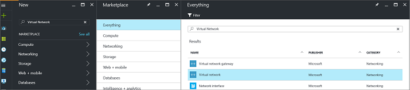
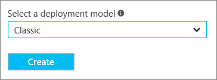
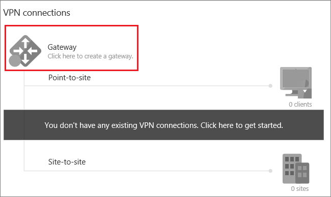
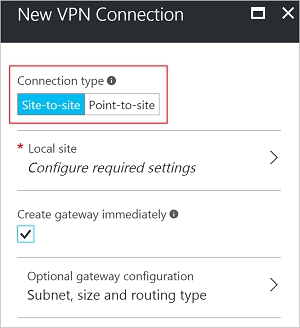

# Create a Site-to-Site connection using the Azure portal (classic)
> [!div class="op_single_selector"]
> * [Resource Manager - Azure Portal](vpn-gateway-howto-site-to-site-resource-manager-portal.md)
> * [Resource Manager - PowerShell](vpn-gateway-create-site-to-site-rm-powershell.md)
> * [Classic - Azure Portal](vpn-gateway-howto-site-to-site-classic-portal.md)
> * [Classic - Classic Portal](vpn-gateway-site-to-site-create.md)
>
>

A Site-to-Site (S2S) VPN gateway connection is a connection over IPsec/IKE (IKEv1 or IKEv2) VPN tunnel. This type of connection requires a VPN device located on-premises that has a public IP address assigned to it and is not located behind a NAT. Site-to-Site connections can be used for cross-premises and hybrid configurations.

This article walks you through creating a virtual network and a Site-to-Site VPN gateway connection to your on-premises network using the classic deployment model and the Azure portal. 

### Deployment models and methods for Site-to-Site connections
[!INCLUDE [deployment models](../../includes/vpn-gateway-deployment-models-include.md)]

The following table shows the currently available deployment models and methods for Site-to-Site configurations. When an article with configuration steps is available, we link directly to it from this table.

[!INCLUDE [site-to-site table](../../includes/vpn-gateway-table-site-to-site-include.md)]

#### Additional configurations
If you want to connect VNets together, but are not creating a connection to an on-premises location, see [Configure a VNet-to-VNet connection](virtual-networks-configure-vnet-to-vnet-connection.md). If you want to add a Site-to-Site connection to a VNet that already has a connection, see [Add a S2S connection to a VNet with an existing VPN gateway connection](vpn-gateway-multi-site.md).

## Before you begin
Verify that you have the following items before beginning your configuration:

* A compatible VPN device and someone who is able to configure it. See [About VPN Devices](vpn-gateway-about-vpn-devices.md). If you aren't familiar with configuring your VPN device, or are unfamiliar with the IP address ranges located in your on-premises network configuration, you need to coordinate with someone who can provide those details for you.
* An externally facing public IPv4 IP address for your VPN device. This IP address cannot be located behind a NAT.
* An Azure subscription. If you don't already have an Azure subscription, you can activate your [MSDN subscriber benefits](http://azure.microsoft.com/pricing/member-offers/msdn-benefits-details) or sign up for a [free account](http://azure.microsoft.com/pricing/free-trial).
* Currently, PowerShell is required to specify the shared key and create the VPN gateway connection. Install the latest version of the Azure Service Management (SM) PowerShell cmdlets. For more information, see [How to install and configure Azure PowerShell](/powershell/azureps-cmdlets-docs). When working with PowerShell for this configuration, make sure that you are running as administrator. 

> [!NOTE]
> When configuring a Site-to-Site connection, a public-facing IPv4 IP address is required for your VPN device.                                                                                                                                                                               
>
>

### Sample configuration values for this exercise
When using these steps as an exercise, you can use the sample configuration values:

* **VNet Name:** TestVNet1
* **Address Space:** 
	* 10.11.0.0/16
	* 10.12.0.0/16 (optional for this exercise)
* **Subnets:**
  * FrontEnd: 10.11.0.0/24
  * BackEnd: 10.12.0.0/24 (optional for this exercise)
* **GatewaySubnet:** 10.11.255.0/27
* **Resource Group:** TestRG1
* **Location:** East US
* **DNS Server:** 8.8.8.8 (optional for this exercise)
* **Local site name:** Site2

## 1. Create a virtual network

When you create a virtual network to use for a S2S connection, you need to make sure that the address spaces that you specify do not overlap with any of the client address spaces for the local sites that you want to connect to. If you have overlapping subnets, your connection won't work properly.

* If you already have a VNet, verify that the settings are compatible with your VPN gateway design. Pay particular attention to any subnets that may overlap with other networks. 

* If you don't already have a virtual network, create one. Screenshots are provided as examples. Be sure to replace the values with your own.

### To create a virtual network

1. From a browser, navigate to the [Azure portal](http://portal.azure.com) and, if necessary, sign in with your Azure account.
2. Click **New**. In the **Search the marketplace** field, type 'Virtual Network'. Locate **Virtual Network** from the returned list and click to open the **Virtual Network** blade.

    
3. Near the bottom of the Virtual Network blade, from the **Select a deployment model** list, select **Classic**, and then click **Create**.

    
4. On the **Create virtual network** blade, configure the VNet settings. In this blade, you add your first address space and a single subnet address range. After you finish creating the VNet, you can go back and add additional subnets and address spaces.

    
5. Verify that the **Subscription** is the correct one. You can change subscriptions by using the drop-down.
6. Click **Resource group** and either select an existing resource group, or create a new one by typing a name for your new resource group. For more information about resource groups, visit [Azure Resource Manager Overview](../azure-resource-manager/resource-group-overview.md#resource-groups).
7. Next, select the **Location** settings for your VNet. The location determines where the resources that you deploy to this VNet will reside.
8. Select **Pin to dashboard** if you want to be able to find your VNet easily on the dashboard, and then click **Create**.

    
9. After clicking 'Create', a tile appears on the dashboard that reflects the progress of your VNet. The tile changes as the VNet is being created.

    

Once your virtual network has been created, you will see **Created** listed under **Status** on the networks page in the Azure classic portal.

## 2. Add additional address space

After you create your virtual network, you can add additional address space. Adding additional address space is not a required part of a S2S configuration, but if you require multiple address spaces, use the following steps:

1. Locate the virtual networks in the portal.
2. On the blade for your virtual network, under the **Settings** section, click **Address space**.
3. On the Address space blade, click **+Add** and enter additional address space.
 
## 3. Specify a DNS server
DNS settings are not a required part of a S2S configuration, but DNS is necessary if you want name resolution.

After you create your virtual network, you can add the IP address of a DNS server to handle name resolution. Open the settings for your virtual network, click DNS servers, and add the IP address of the DNS server that you want to use for name resolution. This setting does not create a DNS server. In the example settings, we use a public DNS server. Typically you'd want to use a private DNS server. Be sure to add a DNS server that your resources can communicate with.

1. Locate the virtual networks in the portal.
2. On the blade for your virtual network, under the **Settings** section, click **DNS servers**.
3. Add a DNS server.
4. To save your settings, click **Save** at the top of the page.
 
## 4. Configure the local site

The local site typically refers to your on-premises location. It contains the IP address of the VPN device to which you will create a connection, and the IP address ranges that will be routed through the VPN gateway to the VPN device.

1. In the portal, navigate to the virtual network for which you want to create a gateway.
2. On the blade for your virtual network, on the **Overview** blade, in the VPN connections section, click **Gateway** to open the **New VPN Connection** blade.

    
3. On the **New VPN Connection** blade, select **Site-to-site**.

    
4. Click **Local site - Configure required settings** to open the **Local site** blade. Configure the settings, and then click **OK** to save the settings.
	- **Name:** Create a name for your local site to make it easy for you to identify.
	- **VPN gateway IP address:** This is the public IP address of the VPN device for your on-premises network. The VPN device requires an IPv4 public IP address. Specify a valid public IP address for the VPN device to which you want to connect. It cannot be behind NAT and has to be reachable by Azure.
	- **Client Address space:** List the IP address ranges that you want routed to the local on-premises network through this gateway. You can add multiple address space ranges. Make sure that the ranges you specify here do not overlap with ranges of other networks your virtual network connects to, or with the address ranges of the virtual network itself.

    

## 5. Configure the gateway subnet

You must create a gateway subnet for your VPN gateway. The gateway subnet contains the IP addresses that the VPN gateway services use.

1. On the **New VPN Connection** blade, select the checkbox **Create gateway immediately**. The 'Optional gateway configuration' blade will appear. If you don't select the checkbox, you won't see the blade to configure the gateway subnet.

    
2. Click **Optional gateway configuration - Subnet, size, and routing type** to open the **Gateway configuration** blade.
3. On the **Gateway Configuration** blade, click **Subnet - Configure required settings** to open the **Add subnet** blade.

	
4. On the **Add subnet** blade, add the gateway subnet. When adding the gateway subnet, if possible, it's best to create a gateway subnet using a CIDR block of /28 or /27. This will ensure that you have enough IP addresses to accommodate additional future configuration requirements.  Click **OK** to save the settings.

	

## 6. Specify the SKU and VPN type
1. Select the gateway **Size**. This is the gateway SKU that you use to create your virtual network gateway. In the portal, the 'Default SKU' = **Basic**. For more information about gateway SKUs, see [About VPN Gateway Settings](vpn-gateway-about-vpn-gateway-settings.md#gwsku).

    
2. Select the **Routing Type** for your gateway. This is also known as the VPN type. It's important to select the correct gateway type because you cannot convert the gateway from one type to another. Your VPN device must be compatible with the routing type you select. For more information about VPN type, see [About VPN Gateway Settings](vpn-gateway-about-vpn-gateway-settings.md#vpntype). You may see articles referring to 'RouteBased' and 'PolicyBased' VPN types. 'Dynamic' corresponds to 'RouteBased', and 'Static' corresponds to' PolicyBased'.
3. Click **OK** to save the settings.
4. On the **New VPN Connection** blade, click **OK** at the bottom of the blade to begin creating your virtual network gateway. This can take up to 45 minutes to complete.

## 7. Configure your VPN device

Site-to-Site connections to an on-premises network require a VPN device. While we don't provide configuration steps for all VPN devices, you may find the information in the following links helpful:

- For information about compatible VPN devices, see [VPN Devices](vpn-gateway-about-vpn-devices.md). 
- For links to device configuration settings, see [Validated VPN Devices](vpn-gateway-about-vpn-devices.md#devicetable). These links are provided on a best-effort basis. It's always best to check with your device manufacturer for the latest configuration information.
- For information about editing device configuration samples, see [Editing samples](vpn-gateway-about-vpn-devices.md#editing).
- For IPsec/IKE parameters, see [Parameters](vpn-gateway-about-vpn-devices.md#ipsec).
- Before configuring your VPN device, check for any [Known device compatibility issues](vpn-gateway-about-vpn-devices.md#known) for the VPN device that you want to use.

When configuring your VPN device, you will need the following items:

- The Public IP address of your virtual network gateway. You can locate this by going to the **Overview** blade for your virtual network.
- A shared key. This is the same shared key that you specify when creating your Site-to-Site VPN connection. In our examples, we use a very basic shared key. You should generate a more complex key to use.

## 8. Create the connection
In this step, you set the shared key and create the connection. The key you set is must be the same key that was used in your VPN device configuration.

> [!NOTE]
> Currently, this step is not available in the Azure portal. You must use the Service Management (SM) version of the Azure PowerShell cmdlets.                                                                                                                                                                             
>
>

### Step 1. Connect to your Azure account

1. Open your PowerShell console with elevated rights and connect to your account. Use the following example to help you connect:

    	Login-AzureRmAccount
2. Check the subscriptions for the account.

    	Get-AzureRmSubscription
3. If you have more than one subscription, select the subscription that you want to use.

    	Select-AzureRmSubscription -SubscriptionName "Replace_with_your_subscription_name"
4. Add the SM version of the PowerShell cmdlets.

		Add-AzureAccount

### Step 2. Set the shared key and create the connection

When working with PowerShell and the classic deployment model, sometimes the names of resources in the portal are not the names the Azure expects to see when using PowerShell. The following steps help you export the network configuration file to obtain the exact values for the names.

1. Create a directory on your computer and then export the network configuration file to the directory. In this example, the network configuration file is exported to C:\AzureNet.

	 	Get-AzureVNetConfig -ExportToFile C:\AzureNet\NetworkConfig.xml
2. Open the network configuration file with an xml editor and check the values for 'LocalNetworkSite name' and 'VirtualNetworkSite name'. Modify the example to reflect the values. When specifying a name that contains spaces, use single quotation marks around the value.

3. Set the shared key and create the connection. The '-SharedKey' is a value that you generate and specify. In the example, we used 'abc123', but you can generate (and should) use something more complex. The important thing is that the value you specify here must be the same value that you specified when configuring your VPN device.

		Set-AzureVNetGatewayKey -VNetName 'Group TestRG1 TestVNet1' `
		-LocalNetworkSiteName 'D1BFC9CB_Site2' -SharedKey abc123
When the connection is created, the result is: **Status: Successful**.

## 9. Verify your connection

[!INCLUDE [vpn-gateway-verify-connection-azureportal-classic](../../includes/vpn-gateway-verify-connection-azureportal-classic-include.md)]

## Next steps
Once your connection is complete, you can add virtual machines to your virtual networks. For more information, see [Virtual Machines](https://docs.microsoft.com/azure/#pivot=services&panel=Compute).

