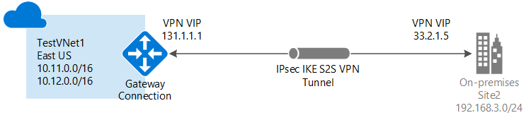

# Create a VNet with a Site-to-Site connection using the Azure portal
> [!div class="op_single_selector"]
> * [Resource Manager - Azure Portal](vpn-gateway-howto-site-to-site-resource-manager-portal.md)
> * [Resource Manager - PowerShell](vpn-gateway-create-site-to-site-rm-powershell.md)
> * [Classic - Classic Portal](vpn-gateway-site-to-site-create.md)
> 
> 

This article walks you through creating a virtual network and a Site-to-Site VPN gateway connection to your on-premises network using the Azure Resource Manager deployment model and the Azure portal. Site-to-Site connections can be used for cross-premises and hybrid configurations.

### Deployment models and methods for Site-to-Site connections
[!INCLUDE [deployment models](../../includes/vpn-gateway-deployment-models-include.md)]

The following table shows the currently available deployment models and methods for Site-to-Site configurations. When an article with configuration steps is available, we link directly to it from this table.

[!INCLUDE [site-to-site table](../../includes/vpn-gateway-table-site-to-site-include.md)]

#### Additional configurations
If you want to connect VNets together, but are not creating a connection to an on-premises location, see [Configure a VNet-to-VNet connection](vpn-gateway-vnet-vnet-rm-ps.md). If you want to add a Site-to-Site connection to a VNet that already has a connection, see [Add a S2S connection to a VNet with an existing VPN gateway connection](vpn-gateway-howto-multi-site-to-site-resource-manager-portal.md).

## Before you begin
Verify that you have the following items before beginning your configuration:

* A compatible VPN device and someone who is able to configure it. See [About VPN Devices](vpn-gateway-about-vpn-devices.md). If you aren't familiar with configuring your VPN device, or are unfamiliar with the IP address ranges located in your on-premises network configuration, you need to coordinate with someone who can provide those details for you.
* An externally facing public IP address for your VPN device. This IP address cannot be located behind a NAT.
* An Azure subscription. If you don't already have an Azure subscription, you can activate your [MSDN subscriber benefits](http://azure.microsoft.com/pricing/member-offers/msdn-benefits-details/) or sign up for a [free account](http://azure.microsoft.com/pricing/free-trial/).

### Sample configuration values for this exercise
When using these steps as an exercise, you can use the sample configuration values:

* **VNet Name:** TestVNet1
* **Address Space:** 10.11.0.0/16 and 10.12.0.0/16
* **Subnets:**
  * FrontEnd: 10.11.0.0/24
  * BackEnd: 10.12.0.0/24
  * GatewaySubnet: 10.12.255.0/27
* **Resource Group:** TestRG1
* **Location:** East US
* **DNS Server:** 8.8.8.8
* **Gateway Name:** VNet1GW
* **Public IP:** VNet1GWIP
* **VPN Type:** Route-based
* **Connection Type:** Site-to-site (IPsec)
* **Gateway Type:** VPN
* **Local Network Gateway Name:** Site2
* **Connection Name:** VNet1toSite2

## 1. Create a virtual network
If you already have a VNet, verify that the settings are compatible with your VPN gateway design. Pay particular attention to any subnets that may overlap with other networks. If you have overlapping subnets, your connection won't work properly. If your VNet is configured with the correct settings, you can begin the steps in the [Specify a DNS server](#dns) section.

### To create a virtual network
[!INCLUDE [vpn-gateway-basic-vnet-rm-portal](../../includes/vpn-gateway-basic-vnet-rm-portal-include.md)]

## 2. Add additional address space and subnets
You can add additional address space and subnets to your VNet once it has been created.

[!INCLUDE [vpn-gateway-additional-address-space](../../includes/vpn-gateway-additional-address-space-include.md)]

## 3. Specify a DNS server
### To specify a DNS server
[!INCLUDE [vpn-gateway-add-dns-rm-portal](../../includes/vpn-gateway-add-dns-rm-portal-include.md)]

## 4. Create a gateway subnet
Before connecting your virtual network to a gateway, you first need to create the gateway subnet for the virtual network to which you want to connect. If possible, it's best to create a gateway subnet using a CIDR block of /28 or /27 in order to provide enough IP addresses to accommodate additional future configuration requirements.

If you are creating this configuration as an exercise, refer to these [values](#values) when creating your gateway subnet.

### To create a gateway subnet
[!INCLUDE [vpn-gateway-add-gwsubnet-rm-portal](../../includes/vpn-gateway-add-gwsubnet-rm-portal-include.md)]

## 5. Create a virtual network gateway
If you are creating this configuration as an exercise, you can refer to the [sample configuration values](#values).

### To create a virtual network gateway
[!INCLUDE [vpn-gateway-add-gw-rm-portal](../../includes/vpn-gateway-add-gw-rm-portal-include.md)]

## 6. Create a local network gateway
The 'local network gateway' refers to your on-premises location. Give the local network gateway a name by which Azure can refer to it. 

If you are creating this configuration as an exercise, you can refer to the [sample configuration values](#values).

### To create a local network gateway
[!INCLUDE [vpn-gateway-add-lng-rm-portal](../../includes/vpn-gateway-add-lng-rm-portal-include.md)]

## 7. Configure your VPN device
[!INCLUDE [vpn-gateway-configure-vpn-device-rm](../../includes/vpn-gateway-configure-vpn-device-rm-include.md)]

## 8. Create a Site-to-Site VPN connection
Create the Site-to-Site VPN connection between your virtual network gateway and your VPN device. Be sure to replace the values with your own. The shared key must match the value you used for your VPN device configuration. 

Before beginning this section, verify that your virtual network gateway and local network gateways have finished creating. If you are creating this configuration as an exercise, refer to these [values](#values) when creating your connection.

### To create the VPN connection
[!INCLUDE [vpn-gateway-add-site-to-site-connection-rm-portal](../../includes/vpn-gateway-add-site-to-site-connection-rm-portal-include.md)]

## 9. Verify the VPN connection
You can verify your VPN connection either in the portal, or by using PowerShell.

[!INCLUDE [vpn-gateway-verify-connection-rm](../../includes/vpn-gateway-verify-connection-rm-include.md)]

## Next steps
* Once your connection is complete, you can add virtual machines to your virtual networks. See the virtual machines [learning path](https://azure.microsoft.com/documentation/learning-paths/virtual-machines) for more information.
* For information about BGP, see the [BGP Overview](vpn-gateway-bgp-overview.md) and [How to configure BGP](vpn-gateway-bgp-resource-manager-ps.md).

