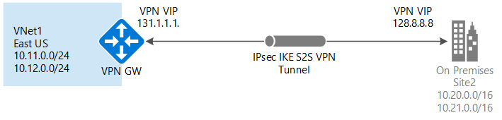

<properties
   pageTitle="Create a virtual network with a Site-to-Site VPN connection using Azure Resource Manager and the Azure Portal | Microsoft Azure"
   description="This article walks you through creating a VNet using the Resource Manager model and connecting it to your local on-premises network using a S2S VPN gateway connection."
   services="vpn-gateway"
   documentationCenter="na"
   authors="cherylmc"
   manager="carmonm"
   editor=""
   tags="azure-resource-manager"/>

<tags
   ms.service="vpn-gateway"
   ms.devlang="na"
   ms.topic="hero-article"
   ms.tgt_pltfrm="na"
   ms.workload="infrastructure-services"
   ms.date="05/13/2016"
   ms.author="cherylmc"/>

# Create a VNet with a Site-to-Site VPN connection using the Azure Portal and Azure Resource Manager

> [AZURE.SELECTOR]
- [Azure Portal](vpn-gateway-howto-site-to-site-resource-manager-portal.md)
- [Azure Classic Portal](vpn-gateway-site-to-site-create.md)
- [PowerShell - Resource Manager](vpn-gateway-create-site-to-site-rm-powershell.md)

This article will walk you through creating a virtual network and a Site-to-Site VPN connection to your on-premises network using the Azure Resource Manager deployment model and the Azure portal. In the steps below, you will create a VNet, add a gateway subnet, a gateway, a local site, and a connection. Additionally, you will also need to configure your VPN device. 

**About Azure deployment models**

[AZURE.INCLUDE [vpn-gateway-clasic-rm](../../includes/vpn-gateway-classic-rm-include.md)] 

## Connection diagram

**Deployment models and tools for Site-to-Site connections**

[AZURE.INCLUDE [vpn-gateway-table-site-to-site-table](../../includes/vpn-gateway-table-site-to-site-include.md)] 

If you want to connect VNets together, but are not creating a connection to an on-premises location, see [Configure a VNet-to-VNet connection](vpn-gateway-vnet-vnet-rm-ps.md). If you are looking for a different type of connection configuration, see the [VPN Gateway connection topologies](vpn-gateway-topology.md) article.

## Before you begin

Verify that you have the following items before beginning your configuration:

- A compatible VPN device and someone who can configure it. See [About VPN Devices](vpn-gateway-about-vpn-devices.md). If you aren't familiar with configuring your VPN device, or are unfamiliar with the IP address ranges located in your on-premises network configuration, you'll need to coordinate with someone who can provide those details for you.

- An externally-facing public IP address for your VPN device. This IP address cannot be located behind a NAT.
	
- An Azure subscription. If you don't already have an Azure subscription, you can activate your [MSDN subscriber benefits](http://azure.microsoft.com/pricing/member-offers/msdn-benefits-details/) or sign up for a [free account](http://azure.microsoft.com/pricing/free-trial/).

### Sample configuration values for this exercise

When using these steps as an exercise, you can use the sample configuration values:

- VNet Name: TestVNet1
- Address Space: 10.11.0.0/16 and 10.12.0.0/16
- Subnets: 
	- FrontEnd: 10.11.0.0/24
	- BackEnd: 10.12.0.0/24
	- GatewaySubnet: 10.12.255.0/27
- Resource Group: TestRG1
- Location: East US
- DNS Server: 8.8.8.8
- Gateway Name: VNet1GW
- Public IP: VNet1GWIP
- VPN Type: Route-based
- Connection Type: Site-to-site (IPsec)
- Gateway Type: VPN
- Local Network Gateway Name: Site2
- Connection Name: VNet1toSite2

## 1. Create a virtual network 

If you already have created a virtual network, verify that the settings are compatible with your VPN gateway design, paying particular attention to any subnets that may overlap with other networks. If you have overlapping subnets, your connection will not work properly. If you've verified your VNet is configured with the correct settings, you can begin the steps in the [Specify a DNS server](#dns) section.

### To create a virtual network

[AZURE.INCLUDE [vpn-gateway-basic-vnet-rm-portal](../../includes/vpn-gateway-basic-vnet-rm-portal-include.md)]  

## 2. Add additional address space and subnets

You can add additional address space and subnets to your VNet once it has been created.

[AZURE.INCLUDE [vpn-gateway-additional-address-space](../../includes/vpn-gateway-additional-address-space-include.md)] 

## 3. Specify a DNS server

If you are creating this configuration as an exercise, refer to these [values](#values) when specifying your DNS server.

### To specify a DNS server

[AZURE.INCLUDE [vpn-gateway-add-dns-rm-portal](../../includes/vpn-gateway-add-dns-rm-portal-include.md)]

## 4. Create a gateway subnet

Before connecting your virtual network to a gateway, you'll first need to create the gateway subnet for the virtual network to which you want to connect. The gateway subnet you create must be named *GatewaySubnet* or it will not work properly. 

The gateway subnet prefix for some configurations requires a subnet of /28 or larger to accommodate the number of IP addresses needed in the pool. This means the gateway subnet prefix needs to be /28, /27, /26 etc. You may want to create a larger subnet here in order to accommodate possible future configuration additions.

If you are creating this configuration as an exercise, refer to these [values](#values) when creating your gateway subnet.

### To create a gateway subnet

[AZURE.INCLUDE [vpn-gateway-no-nsg](../../includes/vpn-gateway-no-nsg-include.md)] 

[AZURE.INCLUDE [vpn-gateway-add-gwsubnet-rm-portal](../../includes/vpn-gateway-add-gwsubnet-rm-portal-include.md)]

## 5. Create a virtual network gateway

If you are creating this configuration as an exercise, refer to these [values](#values) when creating your gateway.

### To create a virtual network gateway

[AZURE.INCLUDE [vpn-gateway-add-gw-rm-portal](../../includes/vpn-gateway-add-gw-rm-portal-include.md)]

## 6. Create a local network gateway

The *local network gateway* refers to your on-premises location. You'll give the local network gateway a name by which Azure can refer to it. 

If you are creating this configuration as an exercise, refer to these [values](#values) when adding your local site.

### To create a local network gateway

[AZURE.INCLUDE [vpn-gateway-add-lng-rm-portal](../../includes/vpn-gateway-add-lng-rm-portal-include.md)]

## 7. Configure your VPN device

[AZURE.INCLUDE [vpn-gateway-configure-vpn-device-rm](../../includes/vpn-gateway-configure-vpn-device-rm-include.md)]

## 8. Create a Site-to-Site VPN connection

Next, you'll create the Site-to-Site VPN connection between your virtual network gateway and your VPN device. Be sure to replace the values with your own. The shared key must match the value you used for your VPN device configuration. 

Before beginning this section, verify that your virtual network gateway and local network gateways have finished creating. If you are creating this configuration as an exercise, refer to these [values](#values) when creating your connection.

### To create the VPN connection

[AZURE.INCLUDE [vpn-gateway-add-site-to-site-connection-rm-portal](../../includes/vpn-gateway-add-site-to-site-connection-rm-portal-include.md)]

## 9. Verify the VPN connection

You can verify your VPN connection either in the portal, or by using PowerShell.

[AZURE.INCLUDE [vpn-gateway-verify-connection-rm](../../includes/vpn-gateway-verify-connection-rm-include.md)]

## Next steps

- Once your connection is complete, you can add virtual machines to your virtual networks. See the virtual machines [learning path](https://azure.microsoft.com/documentation/learning-paths/virtual-machines) for more information.

- For information about BGP, see the [BGP Overview](vpn-gateway-bgp-overview.md) and [How to configure BGP](vpn-gateway-bgp-resource-manager-ps.md).
