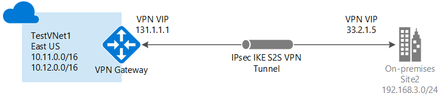

# Create a Site-to-Site connection in the Azure portal

This article shows you how to use the Azure portal to create a Site-to-Site VPN gateway connection from your on-premises network to the VNet. The steps in this article apply to the Resource Manager deployment model. You can also create this configuration using a different deployment tool or deployment model by selecting a different option from the following list:

> [!div class="op_single_selector"]
> * [Azure portal](vpn-gateway-howto-site-to-site-resource-manager-portal.md)
> * [PowerShell](vpn-gateway-create-site-to-site-rm-powershell.md)
> * [CLI](vpn-gateway-howto-site-to-site-resource-manager-cli.md)
> * [Azure portal (classic)](vpn-gateway-howto-site-to-site-classic-portal.md)
> 
>

A Site-to-Site VPN gateway connection is used to connect your on-premises network to an Azure virtual network over an IPsec/IKE (IKEv1 or IKEv2) VPN tunnel. This type of connection requires a VPN device located on-premises that has an externally facing public IP address assigned to it. For more information about VPN gateways, see [About VPN gateway](vpn-gateway-about-vpngateways.md).

## Before you begin

Verify that you have met the following criteria before beginning your configuration:

* Make sure you have a compatible VPN device and someone who is able to configure it. For more information about compatible VPN devices and device configuration, see [About VPN Devices](vpn-gateway-about-vpn-devices.md).
* Verify that you have an externally facing public IPv4 address for your VPN device.
* If you are unfamiliar with the IP address ranges located in your on-premises network configuration, you need to coordinate with someone who can provide those details for you. When you create this configuration, you must specify the IP address range prefixes that Azure will route to your on-premises location. None of the subnets of your on-premises network can over lap with the virtual network subnets that you want to connect to. 

### Example values

The examples in this article use the following values. You can use these values to create a test environment, or refer to them to better understand the examples in this article. For more information about VPN Gateway settings in general, see [About VPN Gateway Settings](vpn-gateway-about-vpn-gateway-settings.md).

* **Virtual network name:** VNet1
* **Address Space:** 10.1.0.0/16
* **Subscription:** The subscription you want to use
* **Resource Group:** TestRG1
* **Region:** East US
* **Subnet:** FrontEnd: 10.1.0.0/24, BackEnd: 10.1.1.0/24 (optional for this exercise)
* **Gateway subnet address range:** 10.1.255.0/27
* **Virtual network gateway name:** VNet1GW
* **Public IP address name:** VNet1GWpip
* **VPN type:** Route-based
* **Connection type:** Site-to-site (IPsec)
* **Gateway type:** VPN
* **Local network gateway name:** Site1
* **Connection name:** VNet1toSite1
* **Shared key:** For this example, we use abc123. But, you can use whatever is compatible with your VPN hardware. The important thing is that the values match on both sides of the connection.

## 1. Create a virtual network

[!INCLUDE [Create a virtual network](../../includes/vpn-gateway-basic-vnet-rm-portal-include.md)]

## 2. Create the VPN gateway

In this step, you create the virtual network gateway for your VNet. Creating a gateway can often take 45 minutes or more, depending on the selected gateway SKU.

[!INCLUDE [About gateway subnets](../../includes/vpn-gateway-about-gwsubnet-portal-include.md)]

### Example settings

* **Instance details > Region:** East US
* **Virtual Network > Virtual network:** VNet1
* **Instance details > Name:** VNet1GW
* **Instance details > Gateway type:** VPN
* **Instance details > VPN type:** Route-based
* **Virtual Network > Gateway subnet address range:** 10.1.255.0/27
* **Public IP address > Public IP address name:** VNet1GWpip

[!INCLUDE [Create a vpn gateway](../../includes/vpn-gateway-add-gw-rm-portal-include.md)]

[!INCLUDE [NSG warning](../../includes/vpn-gateway-no-nsg-include.md)]

## 3. Create the local network gateway

The local network gateway typically refers to your on-premises location. You give the site a name by which Azure can refer to it, then specify the IP address of the on-premises VPN device to which you will create a connection. You also specify the IP address prefixes that will be routed through the VPN gateway to the VPN device. The address prefixes you specify are the prefixes located on your on-premises network. If your on-premises network changes or you need to change the public IP address for the VPN device, you can easily update the values later.

**Example values**

* **Name:** Site1
* **Resource Group:** TestRG1
* **Location:** East US

[!INCLUDE [Add a local network gateway](../../includes/vpn-gateway-add-local-network-gateway-portal-include.md)]

## 4. Configure your VPN device

Site-to-Site connections to an on-premises network require a VPN device. In this step, you configure your VPN device. When configuring your VPN device, you need the following:

- A shared key. This is the same shared key that you specify when creating your Site-to-Site VPN connection. In our examples, we use a basic shared key. We recommend that you generate a more complex key to use.
- The Public IP address of your virtual network gateway. You can view the public IP address by using the Azure portal, PowerShell, or CLI. To find the Public IP address of your VPN gateway using the Azure portal, navigate to **Virtual network gateways**, then click the name of your gateway.

[!INCLUDE [Configure a VPN device](../../includes/vpn-gateway-configure-vpn-device-include.md)]

## 5. Create the VPN connection

Create the Site-to-Site VPN connection between your virtual network gateway and your on-premises VPN device.

[!INCLUDE [Add a site-to-site connection](../../includes/vpn-gateway-add-site-to-site-connection-portal-include.md)]

## 6. Verify the VPN connection

[!INCLUDE [Verify the connection](../../includes/vpn-gateway-verify-connection-portal-include.md)]

## To connect to a virtual machine

[!INCLUDE [Connect to a VM](../../includes/vpn-gateway-connect-vm-s2s-include.md)]

## How to reset a VPN gateway

Resetting an Azure VPN gateway is helpful if you lose cross-premises VPN connectivity on one or more Site-to-Site VPN tunnels. In this situation, your on-premises VPN devices are all working correctly, but are not able to establish IPsec tunnels with the Azure VPN gateways. For steps, see [Reset a VPN gateway](vpn-gateway-resetgw-classic.md).

## How to change a gateway SKU (resize a gateway)

For the steps to change a gateway SKU, see [Gateway SKUs](vpn-gateway-about-vpn-gateway-settings.md#gwsku).

## How to add an additional connection to a VPN gateway

You can add additional connections, provided that none of the address spaces overlap between connections.

1. To add an additional connection, navigate to the VPN gateway, then click **Connections** to open the Connections page.
2. Click **+Add** to add your connection. Adjust the connection type to reflect either VNet-to-VNet (if connecting to another VNet gateway), or Site-to-site.
3. If you are connecting using Site-to-site and you have not already created a local network gateway for the site you want to connect to, you can create a new one.
4. Specify the shared key that you want to use, then click **OK** to create the connection.

## Next steps

* For information about BGP, see the [BGP Overview](vpn-gateway-bgp-overview.md) and [How to configure BGP](vpn-gateway-bgp-resource-manager-ps.md).
* For information about forced tunneling, see [About forced tunneling](vpn-gateway-forced-tunneling-rm.md).
* For information about Highly Available Active-Active connections, see [Highly Available cross-premises and VNet-to-VNet connectivity](vpn-gateway-highlyavailable.md).
* For information about how to limit network traffic to resources in a virtual network, see [Network Security](../virtual-network/security-overview.md).
* For information about how Azure routes traffic between Azure, on-premises, and Internet resources, see [Virtual network traffic routing](../virtual-network/virtual-networks-udr-overview.md).
* For information about creating a Site-to-Site VPN connection using Azure Resource Manager template, see [Create a Site-to-Site VPN Connection](https://azure.microsoft.com/resources/templates/101-site-to-site-vpn-create/).
* For information about creating a Vnet-to-Vnet VPN connection using Azure Resource Manager template, see [Deploy HBase geo replication](https://azure.microsoft.com/resources/templates/101-hdinsight-hbase-replication-geo/).
